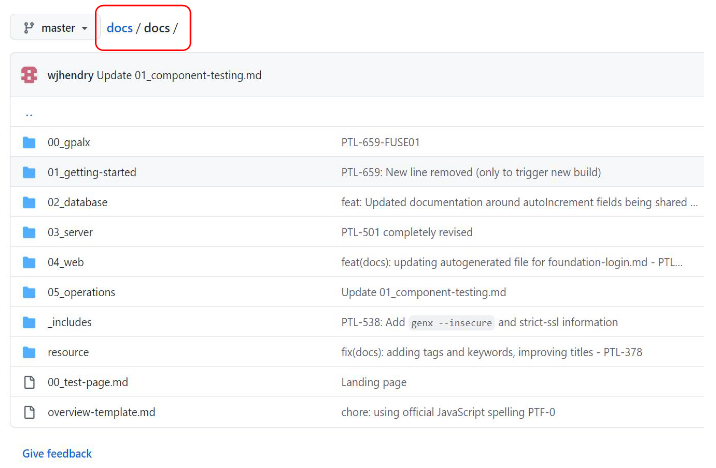

# Genesis contribution guidelines

Documentation is written using [Markdown format](markdown-syntax.md).

Thank you very much for your interest in contribution to the Docs. We encourage you to contribute to docs by creating PRs on your own. To enable the community to contribute to a better documentation, we have listed below some types of contribution we are currently accepting from the community. Take a look below.

## What you can contribute

The contributions below will be accepted by the community team as a PR

### Misspelled words
If you come across with any misspelled words, wrong sentences or any grammar issue, please consider contributing.

### Broken links 
Our documentation contains plenty of links. if you see any broken links, feel free to contribute.

### Simple updates
If you see anything that you believe needs a simple update such as dates, names, etc, feel free to submit a PR for review.

## What is not expected

The below list will not be accepted by the community team as a PR. In this case, please contact us.

- Image changes
- New pages
- Menu changes
- Change more than one paragraph

For any more complex changes, please contact [John Hendry](mailto:john.hendry@genesis.global)

## Docs structure

It is important to follow the Docs structure (folders, files, etc.) otherwise you will encounter unexpected errors and be unable to contribute. Here is a list of tips before you get started:

- The `docs` is the next version of the documentation and will be published at the end of the current release.
- In `docs` folder, you can see that the individual markdown pages are stored according to the menus shown at the top of the `docs site` (**Learning**, **Database**, etc.). It is important to follow this structure.

- Once your changes are accepted, approved and merged, you will be able to see the changes within 15 minutes.