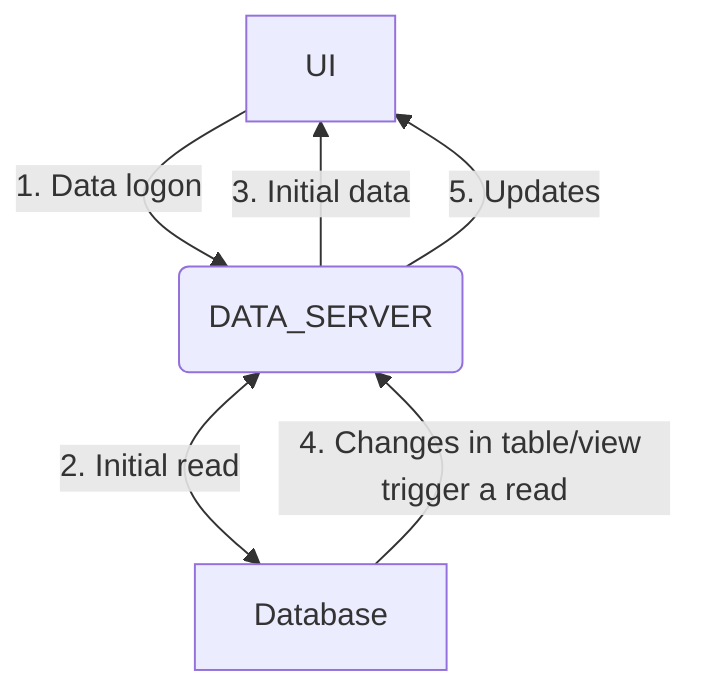

import Tabs from '@theme/Tabs';
import TabItem from '@theme/TabItem';
import Log from '/snippet/_LOG.md'
import CommonPermissions from '/snippet/_common-permissions.md'
import CommonPermissionsQuery from '/snippet/_common-permissions-query.md'
import CommonFieldOverrides from '/snippet/_common-field-overrides.md'
import CommonQueryFields from '/snippet/_common-query-fields.md'
import CommonProcesses from '/snippet/_common-see-processes.md'
import CommonAuthenticateFirst from '/snippet/_common-authenticate-first.md'

## Overview

A Data Server supplies real-time (streaming) data to the front end of your application.

Data Servers preload and monitor specific tables or views in the database. When a change in data occurs, the Data Server sends the changed data to all users who have subscribed to the table or view.

The first time the user subscribes, all the data for the table or view is sent. The connection between the user and the Data Server remains open; so from then on, the Data Server automatically sends changes.

The Data Server uses the push mechanism of web sockets to send clients real-time updates for the data they have subscribed to, and which they are filtering on. There is also a REST API that enables clients to subscribe and receive these updates.



When the client first requests to subscribe to a query in a Data Server, the initial data is returned, and the subscription between the client and the query remains active. The data server will continue to push data updates to the client, for example newer entries or modifications to data rows already sent to the client. The client can also make changes for example to request more rows.

Genesis Data Servers are defined in the `*-dataserver.kts` files.

All Data Server queries are available via REST automatically too.

## Example configuration

Here is an example Data Server configuration that matches the [data model examples](/develop/server-capabilities/data-model/#example-configuration).

```kotlin
dataServer {

  query(INSTRUMENT)

  query("ALL_COUNTERPARTYS", COUNTERPARTY) {
    permissioning {
      permissionCodes = listOf("CounterpartyView")
    }
  }

  query("ALL_TRADES", TRADE_VIEW) {
    permissioning {
      permissionCodes = listOf("TradeView")
      auth(mapName = "COUNTERPARTY"){
        rowLevelPermissions = true
        authKey {
            key(data.counterpartyId)
        }
      }
    }
    fields {
      TRADE_ID
      TRADE_PRICE
      DIRECTION
      QUANTITY
      DATE
      COUNTERPARTY_ID
      COUNTERPARTY_CODE
      COUNTERPARTY_NAME
      INSTRUMENT_NAME
      NOTIONAL
    }

    filter {
      data.date > DateTime.now().minusDays(30)
    }
  }
}
```

###### INSTRUMENT
This query enables the client app to view the data in the INSTRUMENT table. No name is specified for the query, so the default name ALL_INSTRUMENTS is applied automatically. There are no access controls, so any authenticated user can access this query and see data.

###### COUNTERPARTY
This query enables the client app to view the data in the INSTRUMENT table. A query name is specified. [Access control](/develop/server-capabilities/access-control/) permissions are set; only users with `CounterpartyView` permission are able to access this query and see data.

###### TRADE_VIEW
This query is for a view, whereas the previous two were onto tables. This query brings in all the fields defined in the view, which span multiple tables.

This query specifies the fields that we want to show. if there are fields in a view or table, which you don't need wto include, you can leave them out of this configuration using the `fields` block. If you don't specify any fields in this way all are implicitly included.

The `auth` block in `permissioning` applies [access control](/develop/server-capabilities/access-control/) for row level permissioning. Only users with access to the COUNTERPARTY_ID will see the row.

The `filter` clause is a server-side filter. Subscribing clients can also specify criteria to filter data. However, this filter is applied on the back end, and client apps cannot cannot circumvent this.

### Summary

A Data Server file consists of a number of queries onto a tables or views. All the details of the table or view are inherited from the definition, so you don’t need to supply any further details should you not need filter, apply [access control](/develop/server-capabilities/access-control/), else limit or extend the set of fields on the view or query.

## Configuration options

### `query`

`query` defines a new data server query. It takes a `name` (optional) and an `entity` (table or view)

`name` is optional. Left unspecified, it is defaulted `ALL_\{table/view name\}S`.

So, in the example below:

- The first query is called `INSTRUMENT_DETAILS`, as this name has been specified.
- The second query is called `ALL_COUNTERPARTYS`, because it has not had a name specified. The allocated name is based on the COUNTERPARTY table, which it queries.

```kotlin
dataserver {
  // Name of the data server: ALL_INSTRUMENTS
  query(INSTRUMENT)

  // Name of the data server: ALL_COUNTERPARTYS
  query("ALL_COUNTERPARTYS", COUNTERPARTY) {
}
```

#### `config`
The following settings can be applied at query-level, and they override any [global settings](#global-config) that you make for the file.

Example:
```kotlin
dataServer {
  query("ALL_TRADES", TRADE_VIEW) {
    config {
      defaultCriteria = "TRADE_PRICE > 0"
      backwardsJoins = false
      disableAuthUpdates = false
    }
  }
}
```

| Config item | Description | Default |
|-------------|-------------|---------|
|`defaultCriteria`|This represents the default criteria for the query||
|`disableAuthUpdates`|Disables real-time auth updates in order to improve the overall data responsiveness and performance of the server|`false`|
|`backwardsJoins`|Enables backwards joins on a view query. Read [backwards joins](#backwards-joins) for more details|`true`|
|`backJoins`|(Deprecated) Replaced by `backwardsJoins`. Functionally the same.||

#### `fields`

This block is optional. Where not specified all table or view fields in a query definition will be exposed. If you don't want them all to be available, you must define the fields that are required. In the example below, we specify eight fields:

```kotlin
dataServer {
  query("ALL_TRADES", TRADE_VIEW) {
    fields {
      TRADE_ID
      TRADE_PRICE
      DIRECTION
      QUANTITY
      DATE
      COUNTERPARTY_ID
      COUNTERPARTY_CODE
      COUNTERPARTY_NAME
      INSTRUMENT_NAME
      NOTIONAL
    }
  }
}
```

<CommonFieldOverrides />

`withSize <NUMBER OF CHARACTERS>` can also be specified at a field level on the rare occasion you are seeing issues with LMDB truncating a String value you can specify the maximum number of characters by specifying this.

<CommonQueryFields />

#### `indices`

A query can optionally include an `indices` block to define additional indexing at the query level. When an index is specified in the query, all rows returned by the query are ordered by the fields specified, in ascending order.

:::info
A Data Server always uses the internal RECORD_ID value of the database records to create the default index. This is equivalent to indexing records by their creation date. Data Servers do not use table/view indices automatically. To query records efficiently, you need to recreate indices at the Data Server level or use the [`importEntityIndices`](#global-config) configuration option.
:::

The definition and the behavior of an index in a query are exactly the same as when you [define an index in a table](/develop/server-capabilities/data-model/#indices).

Example:

```kotlin
dataServer {
    query("SIMPLE_QUERY", SIMPLE_TABLE) {
        indices {
            unique("SIMPLE_QUERY_BY_QUANTITY") {
                QUANTITY
                SIMPLE_ID
            }
            nonUnique("SIMPLE_QUERY_BY_INSTRUMENT"){
                INSTRUMENT_ID
            }
        }
    }
}
```

There are two scenarios where an index is useful:

* **Optimizing query criteria search**. in the example above, if the front-end request specifies criteria such as `QUANTITY > 1000 && QUANTITY < 5000`, then the Data Server will automatically select the best matching index. In our example, it would be `SIMPLE_QUERY_BY_QUANTITY`. This means that the platform doesn't need to scan all the query rows stored in the Data Server memory-mapped file cache; instead, it performs a very efficient indexed search.
* **Where the front-end request specifies an index**. You can specify one or more indices in your Data Server query. And the front end can specify which index to use by supplying `ORDER_BY` as part of the `DATA_LOGON` process. The Data Server will use that index to query the data. The data will be returned to the client in ascending order, based on the index field definition.

*Important*: Unique indices should be defined carefully, as they need to reflect column uniqueness within the table or view. As quantity does not have a unique constraint in the example definition shown above, we need to add `SIMPLE_ID` to the index definition to ensure we maintain uniqueness.

Note that table indices are NOT available in dataserver queries by default as previously mentioned. Table/view indices can be automatically imported when using the [`importEntityIndices`](#global-config) configuration option or using the `fromEntity` method as shown in the example below:

```kotlin
dataServer {
    query("SIMPLE_QUERY", SIMPLE_TABLE) {
        indices {
            fromEntity(SIMPLE_TABLE.BY_QUANTITY)
            fromEntity(SIMPLE_TABLE.BY_INSTRUMENT)
        }
    }
}
```

<CommonPermissions />

<CommonPermissionsQuery />

In most cases, a single auth entity id is associated to one or more rows in a Data Server query, but in some rare scenarios there might be a one-to-one relationship. In the latter case, there is a configuration option named `rowLevelPermissions` which can be set to `true` to optimize the internal data structure that holds the cache information.

```kotlin {4}
query("ALL_COUNTERPARTYS", COUNTERPARTY) {
    permissioning {
        auth("COUNTERPARTY"){
            rowLevelPermissions = true
            authKey {
                key(data.counterpartyId)
            }
        }
    }
}
```

#### `enrich`

In some scenarios, you might want to associate the results of Data Server queries with the user who initiated the queries. This data cannot be cached, as it is derived from the subscribing client's input. You can achieve this using the ```enrich``` feature, which enables an additional table or view join (including backwards joins). With this feature, you can provide user-specific values for each row, or even perform cell-level permissioning (for example, to hide cell values), depending on entitlements.

The `join` operation receives two parameters:
- `userName` is the current user name subscribed to the query
- `row` is the pre-built query row

`hideFields` enables you to define a list of fields that will be hidden if certain conditions apply. Three parameters are provided:
- `userName` the current user name subscribed to the query
- `row` the pre-built query `row`
- `userData` the table or view lookup result; this will be null if the lookup fails to find a record

The `fields` section defines what fields should be visible as part of the query. Use this if you want to use a subset of fields from the enriched table or view, or if you want to declare your own derived fields.

The example below should help you to understand the functionality. Comments are included in the code to ease understanding.

```kotlin
// Example using "hideFields" and creating derived fields based on user counterparty association
query("ALL_BUYER_SELLER_TRADES", BUYER_SELLER_TRADE_VIEW){
    permissioning {
        permissionCodes = listOf("ViewTrades")
        auth("ENTITY_VISIBILITY"){
            authKey {
                key(data.buyerCounterpartyId)
            }
        } or
        auth("ENTITY_VISIBILITY"){
            authKey {
                key(data.sellerCounterpartyId)
            }
        }
    }
    enrich(USER_COUNTERPARTY_MAP) {
        join { userName, row ->
            UserCounterpartyMap.ByUserName(userName)
        }
        // Hide buyer counterparty id to users associated to counterparty seller if "isHiddenToSeller" is true.
        hideFields { userName, row, userData ->
            if(userData?.counterpartyId == queryRow.sellerCounterPartyId && queryRow.isHiddenToSeller == true){
                listOf(BUYER_SELLER_TRADE_VIEW.BUYER_COUNTERPARTY_ID)
            } else{
                emptyList()
            }
        }
        fields {
            // If a user belongs to the buyer counterparty, "COUNTERPARTY" value will be the seller name
            // in the reverse scenario it will be the buyer name
            derivedField("COUNTERPARTY", STRING) {
                when {
                    enriched?.counterpartyId == data.buyerId -> data.sellerName
                    enriched?.counterpartyId == data.sellerId -> data.buyerName
                    else -> ""
                }
            }
            // If a user belongs to the buyer counterparty, "DIRECTION" will be "BUY"
            // in the reverse scenario it will be "SELL"
            derivedField("DIRECTION", STRING) {
                when {
                    enriched?.counterpartyId == data.buyerId -> "BUY"
                    enriched?.counterpartyId == data.sellerId -> "SELL"
                    else -> ""
                }
            }
        }
    }
}

// Example: selecting fields from enriched view
query("ALL_COUNTERPARTIES" , COUNTERPARTY_VIEW) {
    // Lookup user counterparty favourite view and provide user enrich field to display if a counterparty has been marked as favourite by the user.
    enrich(USER_COUNTERPARTY_FAVOURITE) {
        join { userName, row ->
            UserCounterpartyFavourite.ByUserNameCounterparty(username, row.counterpartyId)
        }
        // We only care about selecting the IS_FAVOURITE field from the USER_COUNTERPARTY_FAVOURITE view
        fields {
            USER_COUNTERPARTY_FAVOURITE.IS_FAVOURITE
        }
    }
}

// Example: filtering rows based on whether the enrichment was successful or not
query("ALL_ONLY_FAVOURITE_COUNTERPARTIES" , COUNTERPARTY_VIEW) {
    // Lookup user counterparty favourite view
    enrich(USER_COUNTERPARTY_FAVOURITE) {
        join { userName, row ->
            UserCounterpartyFavourite.ByUserNameCounterparty(userName, row.counterpartyId)
        }
        // The query should only display rows that have been enriched successfully
        filter {
            enriched != null
        }
    }
}

// Example: using "enrichedAuth" to combine fields from enrichment with authorization mechanism
query("ALL_FAVOURITE_COUNTERPARTIES", COUNTERPARTY_VIEW) {
    permissioning {
        enrichedAuth("COUNTERPARTY_FAVOURITE_VISIBILITY", USER_COUNTERPARTY_FAVOURITE) {
            authKey {
                key(data.counterpartyId, enriched?.isFavourite)
            }
        }
    }
    enrich(USER_COUNTERPARTY_FAVOURITE) {
        join { userName, row ->
            UserCounterpartyFavourite.ByUserNameCounterparty(username, row.counterpartyId)
        }
    }
}

```

Enriching data using the calling user's context is a great way to build rich experiences. In the example below, we have the positions table and the favourite trades table. We are able to derive a field on our query by bringing the user's favourite trades into the context.

Note the casing of `FAVOURITE_TRADE` and `FavouriteTrade`. The all-caps version denotes the table definition, whereas the camel-case version denotes the generated data access object (DAO).

```kotlin
query(POSITION) {
    enrich(FAVOURITE_TRADE) {
        join { userName, row -> FavouriteTrade.byUserName(userName) }
        fields {
            derivedField("IS_FAVOURITE", BOOLEAN) { row, favourite ->
                data.code == enriched?.code
            }
        }
    }
}
```

To be able to use the `byUserName` function over the FavouriteTrade DAO, you must add an index over the `USER_NAME` (a platform-level field).

```kotlin {14,19-23}
table(name = "POSITION", id = 1600) {
    sequence(POSITION_ID, "PS")
    CODE
    CREATED_AT
    PRICE

    primaryKey {
        POSITION_ID
    }
}
table(name = "FAVOURITE_TRADE", id = 1601) {
    sequence(FAVOURITE_ID, "FA")
    CODE
    USER_NAME

    primaryKey {
        FAVOURITE_ID
    }
    indices {
        unique {
            USER_NAME
        }
    }
}
```

#### Index driven

You can specify "index-based" Data Server queries which will only read a defined range within a table or view, and only this data is monitored for updates (not the whole table or view). This makes the Data Server more responsive and reduces resource requirements. It uses the database range search operation [getRange](/develop/server-capabilities/data-access-apis/#getrange).

You can use the following options when you create index-based queries:

##### `where`

This provides a set of data equal to specified index.
Advanced `where` accepts index and the provided index is used to get similar records from database. The Data Server query returns all the trade data whose quantity is equal to 42. You can optionally refresh keys using the `refresh` keyword, which sets a periodic refresh of keys, as shown in examples below:

```kotlin
query("TRADE_RANGE_BY_QUANTITY", TRADE) {
    where(Trade.ByQuantity(42), 1)
}

query("TRADE_RANGE_USD_REFRESH", TRADE) {
    where(Trade.ByCurrencyId("USD"), 1) {
        refresh {
            every(15.minutes)
        }
    }
}
```

The example below shows how advanced `where` queries differ from basic `filter` queries.

The scenario is this: you want to get trade records where the `currencyId` is `USD`. You can write a Data Server query in two ways, which affects how much data is cached:

- Method 1 uses basic `filter`. It initially reads all the table/view data (which could be very large) and then applies the `filter` clause to confine the range to USD, so it can take a long time to get the Data Server query up and running.
- Method 2 uses advanced `where`. It uses a database range search operation [getRange](/develop/server-capabilities/data-access-apis/#getrange), so it is able to read just the data we need from database using indices. This means the data that we need to process is much smaller - much more efficient.
  The `where` clause is applied at database level, the data returned by the database operation already contains the correct rows.

```kotlin
// Method 1:
query("TRADE_USD", TRADE) {
    filter {
        data.currencyId == "USD"
    }
}

// Method 2:
query("TRADE_RANGED_USD", TRADE) {
    where(Trade.ByCurrencyId("USD"), 1)
}
```

##### `ranged`

Use the `ranged` keyword to create a query that provides a range of data. You need to provide the index and the number of key fields:

- Use the `numKeyFields` property to specify the number of fields to use from an index. The fields are always selected in the order they are specified in the index.
- Use `from` to specify the start of the data range. This is mandatory.
- Use `to` to specify the end of the data range. This is optional, but highly recommended. When `to` is not specified, the `from` clause works in a same way as advanced `where`, specified above. For these cases, we recommend using advanced `where` for better readability.
- Optionally, you can use the `refresh` keyword to refresh the keys. This sets a periodic refresh of keys, as shown in examples below, (which include comments to ease understanding):

```kotlin
query("TRADE_RANGED_LAST_2_HOURS", TRADE) {
    // the ranged key word makes this a ranged query
    //    the index and the number of key fields needs to be specified
    ranged(index = Trade.ByTradeDateTimeAndType, numKeyFields = 1) {
        // optionally refresh keys periodically, for example, when we are doing a
        // range on dates
        refresh {
            // either every
            every(2.hours)
            // or at specific time
            at(8.pm)
        }
        // required, starting key
        from {
            Trade.ByTradeDateTime(now().minusHours(2), "")
        }
        to {
            Trade.ByTradeDateTime(now().plusHours(1), "")
        }
    }
}
```

Examples:

```kotlin
// all dollar trades:
query("TRADE_RANGED_TRADE_RANGE_USD", TRADE) {
    where(Trade.ByCurrencyId("USD"), 1)
}

// all trades with quantity between 100 and 1,000
query("TRADE_RANGED_TRADE_RANGE_QTY", TRADE) {
    ranged(Trade.ByQuantity, 1) {
        from {
            Trade.ByQuantity(100)
        }
        to {
            Trade.ByQuantity(1000)
        }
    }
}

query("TRADE_RANGED_LAST_2_HOURS", TRADE) {
    ranged(index = Trade.ByTradeDateTimeAndType, numKeyFields = 1) {
        refresh {
            every(15.minutes)
        }
        from {
            Trade.ByTradeDateTime(now().minusHours(2), "")
        }
        to {
            Trade.ByTradeDateTime(now().plusHours(1), "")
        }
    }
}
```

With refresh queries, rows that move out of the filter range will be removed from the cache, while rows that move into the filter will be added.

Examples when: `numKeyFields > 1`

The range configuration returns a set of sorted records based on the index definition and the number of fields involved (specified by `numKeyFields`)
Let's see a couple of examples of ranged queries with their respective results in CSV format. The table definition with associated data sorted by its primary key fields is shown below:

```kotlin
table(name = "GENESIS_PROCESS_MONITOR", id = 20) {
    MONITOR_NAME
    PROCESS_HOSTNAME
    PROCESS_NAME

    primaryKey(name = "GENESIS_PROCESS_MONITOR_BY_HOSTNAME", id = 1) {
        PROCESS_HOSTNAME
        PROCESS_NAME
        MONITOR_NAME
    }
}
```

```csv
PROCESS_HOSTNAME,PROCESS_NAME,MONITOR_NAME
localhost,process_a,monitor_a
localhost,process_a,monitor_b
localhost,process_b,monitor_a
localhost,process_b,monitor_b
remote_host,process_a,monitor_a
remote_host,process_a,monitor_b
remote_host,process_b,monitor_a
remote_host,process_b,monitor_b
```

Example 1:
Ranged query:
```kotlin
query("GENESIS_PROCESS_MONITOR_NUM_KEY_FIELDS_2", GENESIS_PROCESS_MONITOR) {
   ranged(GenesisProcessMonitor.ByHostname, 2) {
      from {
         GenesisProcessMonitor.ByHostname(
            processHostname = "localhost",
            processName = "process_a",
            monitorName = "monitor_a" // monitorName values are ignored since numKeyFields is 2
         )
      }
      to {
         GenesisProcessMonitor.ByHostname(
            processHostname = "localhost",
            processName = "process_b",
            monitorName = "monitor_a" // monitorName values are ignored since numKeyFields is 2
         )
      }
   }
}
```
Result:
```csv
PROCESS_HOSTNAME,PROCESS_NAME,MONITOR_NAME
localhost,process_a,monitor_a
localhost,process_a,monitor_b
localhost,process_b,monitor_a
localhost,process_b,monitor_b
```

Example 2:
Ranged query:
```kotlin
    query("GENESIS_PROCESS_MONITOR_NUM_KEY_FIELDS_3", GENESIS_PROCESS_MONITOR) {
        ranged(GenesisProcessMonitor.ByHostname, 3) {
            from {
                GenesisProcessMonitor.ByHostname(
                    processHostname = "localhost",
                    processName = "process_a",
                    monitorName = "monitor_a"
                )
            }
            to {
                GenesisProcessMonitor.ByHostname(
                    processHostname = "remote_host",
                    processName = "process_a",
                    monitorName = "monitor_a"
                )
            }
        }
    }
```
Result:
```csv
PROCESS_HOSTNAME,PROCESS_NAME,MONITOR_NAME
localhost,process_a,monitor_a
localhost,process_a,monitor_b
localhost,process_b,monitor_a
localhost,process_b,monitor_b
remote_host,process_a,monitor_a
```

### Global `config`

Outside the `query` blocks, you can specify a `config` block to make configuration settings that apply to all queries defined. These control the overall behaviour of the Data Server. Some of the global settings can be overridden at the query level (as indicated in the table below).

Here is an example of some global configuration settings:

```kotlin
dataServer {
    config {
        lmdbAllocateSize = 512.MEGA_BYTE() // top level only setting
        // Items below can be overridden in individual query definitions
        compression = true
        chunkLargeMessages = true
        defaultStringSize = 40
        maxBytesPerCharacter = 1
        batchingPeriod = 500
        linearScan = true
        excludedEmitters = listOf("PurgeTables")
        enableTypeAwareCriteriaEvaluator = true
        serializationType = SerializationType.KRYO // Available from version 7.0.0 onwards
        serializationBufferMode = SerializationBufferMode.ON_HEAP // Available from version 7.0.0 onwards
        directBufferSize = 8096 // Available from version 7.0.0 onwards
        importEntityIndices = false
    }
    query("SIMPLE_QUERY", SIMPLE_TABLE) {
        config {
            // Items below only available in query level config
            defaultCriteria = "SIMPLE_PRICE > 0"
            backwardsJoins = false
            disableAuthUpdates = false
        }
    }
}
```

| Config item | Description | Default | Overridable in `query` |
|-------------|-------------|---------|------------------------|
|`lmdbAllocateSize`|This sets the size of the memory-mapped file where the in-memory cache stores the Data Server query rows. Value must be defined in `MEGA_BYTE` (`512.MEGA_BYTE()`) or `GIGA_BYTE` (`2.GIGA_BYTE()`)|`2.GIGA_BYTE()`|No|
|`serializationType`| Serialization approach for converting query rows into bytes and vice versa. There are two options: `SerializationType.KRYO` and `SerializationType.FURY`. See the [Serialization](#serialization-considerations) topic for details. |KRYO|No|
|`serializationBufferMode`| This option changes the buffer type used to read from and write to LMDB. There are two options: `SerializationBufferMode.ON_HEAP` and `SerializationBufferMode.OFF_HEAP`. See the [Serialization](#serialization-considerations) topic for details. |`ON_HEAP`|No|
|`directBufferSize`|Sets the buffer size in bytes used by the `serializationBufferMode` option when using `SerializationBufferMode.OFF_HEAP`|8096 bytes|No|
|`compression`|When `true`, this compresses the query row data before writing it to the in-memory cache|`false`|Yes|
|`chunkLargeMessages`|When `true`, it will split large updates into smaller ones.|`false`|Yes|
| `defaultStringSize`                | Defines the byte array size (in UTF-8 encoding) for storing `String` values in the Data Server LMDB indices. Larger values increase index key sizes, while smaller values reduce them but may cause string overflow. See the [String overflows](#handling-string-overflows) topic for details. | `40`            | Yes                    |
| `maxBytesPerCharacter`             | Specifies the maximum number of bytes allocated per character when determining the index `String` byte array size. Since some UTF-8 characters require multiple bytes, this setting offers the required flexibility to ensure sufficient space is reserved.                                    | 1               | Yes                    |
|`batchingPeriod`|Delay in milliseconds to wait before sending new data to Data Server clients|`500ms`|Yes|
|`linearScan`|Enables/disables linear scan behaviour in the query definition. If false, it will reject criteria expressions that don't hit defined indexes|`true`|Yes|
|`excludedEmitters`|Enables/Disables update filtering for a list of process names. Any database updates that originate from one of these processes will be ignored.|Empty list|Yes|
|`onStringOverflow`|Controls how the system responds to a string overflow. There are two options: `IGNORE_ROW` and `TRUNCATE_FIELD`. See the [String overflows](#handling-string-overflows) topic for details. |TRUNCATE_FIELD |Yes|
|`enableTypeAwareCriteriaEvaluator`|This enables the type-aware criteria evaluator. See the [type-aware criteria evaluator](#using-the-type-aware-criteria-evaluator) topic for details. |`false`|Yes|
|`importEntityIndices`| Enables/disables the automatic definition of dataserver indices based on the source table/view indices. |`false`|Yes|

###### Serialization considerations

With `serializationType`, there are two options for configuring the type of serialization to be used in response to data requests:
- `SerializationType.KRYO` uses the [Kryo library](https://github.com/EsotericSoftware/kryo).
- `SerializationType.FURY` uses the [Fury library](https://github.com/alipay/fury).

In our current Data Server implementation, internal tests show that Fury can serialize and deserialize row objects 13-15 times faster than Kryo; this leads to faster LMDB read/write operations (up to twice as quick in some cases). This performance improvement has a great impact on the latency incurred when requesting rows from a Data Server query, whether it happens as part of the first subscription message (DATA_LOGON messages) or subsequent row request messages (MORE_ROWS messages).

However, the serialized byte array size of a Fury object can be between 10 and 15 percent larger than a Kryo object, so there is a small penalty to pay for using this option.

With `SerializationBufferMode`, you can change the buffer type used to read and write information from and to LMDB.

There are two options: `SerializationBufferMode.ON_HEAP` and `SerializationBufferMode.OFF_HEAP`.
- `SerializationBufferMode.ON_HEAP uses a custom cache of Java `HeapByteBuffer` objects that exist within the JVM addressable space.
- `SerializationBufferMode.OFF_HEAP` uses `DirectByteBuffer` objects, so memory can be addressed directly to access LMDB buffers natively in order to write and read data. <br></br>
OFF_HEAP buffers permit zero-copy serialization/deserialization to LMDB; buffers of this type are generally more efficient as they allow Java to exchange bytes directly with the operating system for I/O operations. To use OFF_HEAP, you **must** specify the buffer size in advance (see `directBufferSize` setting). Consider this carefully if you do not know the size of the serialized query row object in advance.

###### Handling string overflows

A string overflow happens when the value of a String field in an index is larger than `defaultStringSize`, or the size set on the field. You can use `onStringOverflow` to control how the system responds to a string overflow.

There are two options:

- `onStringOverflow.IGNORE_ROW` means that rows with string overflows will be ignored. This can lead to data missing from the Data Server.
- `onStringOverflow.TRUNCATE_FIELD` causes indices with string overflows to be truncated. The data with the overflow will still be returned in full, and will be searchable. However, if multiple rows are truncated to the same value, any subsequent rows will lead to duplicate index exceptions during the insert, so these rows will not be available to the Data Server.

###### Using the type-aware criteria evaluator

You can use `enableTypeAwareCriteriaEvaluator` to use the type-aware criteria evaluator. This automatically converts criteria comparisons that don't match the original type of the Data Server field; these can still be useful to end users.

For example, you might want a front-end client to perform a criteria search on a `TRADE_DATE` field like this: `TRADE_DATE > '2015-03-01' && TRADE_DATE < '2015-03-02'`. This search can be translated automatically to the correct field types internally (even though `TRADE_DATE` is a field of type `DateTime`).

The Genesis index search mechanism can also identify the appropriate search intervals in order to provide an optimized experience. The type-aware evaluator can transform strings to integers, and any other sensible and possible conversion (e.g `TRADE_ID == '1'`).

Note that the type-aware evaluator is also available in [`DbMon`](/build-deploy-operate/operate/commands/dbmon/) for operations such as `search` and `qsearch`.

If you do not use the use the type-aware criteria evaluator, the traditional criteria evaluator needs the field types to match the query fields in the Data Server.

So the same comparison using the default criteria evaluator for `TRADE_DATE` would be something like:
`TRADE_DATE > new DateTime(1425168000000) && TRADE_DATE < new DateTime(1425254400000)`

This approach is less intuitive and won't work with our automatic index selection mechanism. In this case, you should use our [common date expressions](/develop/client-capabilities/server-communications/criteria-matching/#date-operations) to handle date searches.

### Backwards joins

Each query in a Data Server creates what is effectively an open connection between each requesting user and the Data Server. After the initial send of all the data, the Data Server sends only modifications, deletions and insertions in real time. Unchanged fields are not sent, which avoids unnecessary traffic.

By default, only updates to the root table are sent. So if you need to see updates to fields from a joined table, then you must specifically declare a backwards join. For queries with backwards joins enabled, the primary table and all joined tables and views are actively monitored. Any changes to these tables and views are sent automatically.

Monitoring of backwards joins can come at a cost, as it can cause significant extra processing. Do not use backwards joins unless there is a need for the data in question to be updated in real time. For example, counterparty data, if changed, can wait until overnight. The rule of thumb is that you should only use backwards joins where the underlying data is being updated intra-day.

The backwards join flag is true by default. You must explicitly set `backwardsJoins = false` if you wish to turn backwards joins off for your query.

### Logging

<Log />

## Optimistic concurrency

Find details around [how data servers work with optimistic concurrency](/develop/server-capabilities/data-access-apis/#data-server)

## Client API

Clients can connect and query via Websocket or REST HTTP calls. Websockets are required for real-time updates to be pushed.

<CommonAuthenticateFirst />

### `DATA_LOGON`

To initiate a stream from a Data Server, the client sends a `DATA_LOGON` message.

To control the flow of data and allow for filtering  and ordering, the following options can be included in the `DATA_LOGON` message within the `DETAILS` block.

| Option           | Default | Description                                                                                                                                                                                                                                                                                                                                           |
|------------------|---------|-------------------------------------------------------------------------------------------------------------------------------------------------------------------------------------------------------------------------------------------------------------------------------------------------------------------------------------------------------|
| `MAX_ROWS`       | 250     | Maximum number of rows to be returned as part of the initial message, and as part of any additional; [read more below](#rows--view-concepts)                                                                                                                                                                                                          |
| `MAX_VIEW`       | 1000    | Maximum number of rows to track as part of a front-end view; see below for more; [read more below](#rows--view-concepts)                                                                                                                                                                                                                              |
| `MOVING_VIEW`    | `true`  | Defines the behaviour of the front-end view when it receives new rows in real time. If `MOVING_VIEW` is set to `true`, and `MAX_VIEW` is reached, any new rows arriving from the query will start replacing the oldest rows in the view. This guarantees that only the most recent rows are shown by default; [read more below](#rows--view-concepts) |
| `VIEW_NUMBER`    | 0       | If set to a number different than 0, enables pagination mode and forces `MAX_VIEW` to have the same size as `MAX_ROWS` (i.e. `MAX_ROWS` becomes the page size) and sets `MOVING_VIEW` to `false` (i.e. rows in a page won't be replaced); [read more below](#rows--view-concepts)                                                                     |
| `CRITERIA_MATCH` |         | The front end can send an expression or a Groovy expression to perform filtering on the query server; these remain active for the life of the subscription. For example: `Expr.dateIsBefore(TRADE_DATE,'20150518')` or `QUANTITY > 10000`; [read more below](#criteria_match)                                                                         |
| `FIELDS`         |         | This parameter enables the front end to select a subset of fields from the query. Example: `TRADE_ID QUANTITY PRICE INSTRUMENT_ID`. If this option is not specified, all fields are returned                                                                                                                                                          |
| `ORDER_BY`       |         | This option can be used to select an [index](#indices) in the Data Server query that is being queried for sorting. By default, Data Server rows will be returned in the order they were created (from oldest database record to newest)                                                                                                               |
| `REVERSE`        | `false` | Reverses the order of data served by the the `ORDER_BY` index. For example, if you are using the default index, the query will return rows from newest database records to oldest                                                                                                                                                                     |

Example `DATA_LOGON`

<Tabs defaultValue="websocket" values={[{ label: 'Websocket API', value: 'websocket', }, { label: 'REST API', value: 'rest', }]}>
<TabItem value="websocket">
Request
```
{
    "MESSAGE_TYPE" : "DATA_LOGON",
    "SESSION_AUTH_TOKEN" : "SIlvjfUpkfXtGxfiQk1DDvVRlojKtNIM",
    "SOURCE_REF" : "123",
    "USER_NAME": "admin",
    "DETAILS" : {
        "DATASOURCE_NAME": "ALL_TRADES",
        "CRITERIA_MATCH": "QUANTITY > 200",
        "MOVING_VIEW": true,
        "FIELDS": "TRADE_ID DIRECTION QUANTITY PRICE INSTRUMENT_NAME DATE",
        "MAX_ROWS": 10
    }
}

```
Response
```
{
  MESSAGE_TYPE : "LOGON_ACK",
  SEQUENCE_ID : 0
  SOURCE_REF : "123"
}
```
Initial Response
```
{
  "MESSAGE_TYPE": "QUERY_UPDATE",
  "ROWS_COUNT": 2,
  "ROW": [
    {
      "TRADE_ID": 1,
      "DIRECTION": "BUY",
      "QUANTITY": 500,
      "PRICE": 226.12,
      "INSTRUMENT_NAME": "Apple",
      "DATE": 1730937600000,
      "DETAILS": {
        "OPERATION": "INSERT",
        "ROW_REF": "7169357821048261343"
      }
    },
      "TRADE_ID": 2,
      "DIRECTION": "SELL",
      "QUANTITY": 1000,
      "PRICE": 589.34,
      "INSTRUMENT_NAME": "Meta",
      "DATE": 1730937600000,
      "DETAILS": {
        "OPERATION": "INSERT",
        "ROW_REF": "7169357821048261344"
      }
    }
  ],
  "MORE_ROWS": true,
  "SOURCE_REF": "123",
  "SEQUENCE_ID": 1
}
```

Subsequent responses are pushed as data is updated

New row update
```
{
  "MESSAGE_TYPE": "QUERY_UPDATE",
  "ROW": [
    {
      "TRADE_ID": 3,
      "DIRECTION": "BUY",
      "QUANTITY": 1000,
      "PRICE": 795.04,
      "INSTRUMENT_NAME": "Netflix",
      "DATE": 1730937600000,
      "DETAILS": {
        "OPERATION": "INSERT",
        "ROW_REF": "7169357821048261345"
      }
    },
  ],
  "SOURCE_REF": "123",
  "SEQUENCE_ID": 2
}
```
Row modification update (price change for TRADE_ID 3)
```
{
  "MESSAGE_TYPE": "QUERY_UPDATE",
  "ROW": [
    {
      "PRICE": 227.01,
      "DETAILS": {
        "OPERATION": "MODIFY",
        "ROW_REF": "7169357821048261343"
      }
    },
  ],
  "SOURCE_REF": "123",
  "SEQUENCE_ID": 3
}
```
</TabItem>
<TabItem value="rest">

Request
```
POST http://localhost:9064/all-trades
Content-Type: application/json
SOURCE_REF: 123
SESSION_AUTH_TOKEN: SIlvjfUpkfXtGxfiQk1DDvVRlojKtNIM
USER_NAME: admin
{
    "DETAILS" : {
        "DATASOURCE_NAME": "ALL_TRADES",
        "CRITERIA_MATCH": "QUANTITY > 200",
        "MOVING_VIEW": true,
        "FIELDS": "TRADE_ID DIRECTION QUANTITY PRICE INSTRUMENT_NAME DATE",
        "MAX_ROWS": 10
    }
}
```
Response
```
HTTP/1.1 200 OK
content-type: application/json
content-length: 350
connection: keep-alive
{
  "MESSAGE_TYPE": "QUERY_UPDATE",
  "ROWS_COUNT": 2,
  "ROW": [
    {
      "TRADE_ID": 1,
      "DIRECTION": "BUY",
      "QUANTITY": 500,
      "PRICE": 226.12,
      "INSTRUMENT_NAME": "Apple",
      "DATE": 1730937600000
      "DETAILS": {
        "OPERATION": "INSERT",
        "ROW_REF": "7169357821048261343"
      }
    },
    {
      "TRADE_ID": 2,
      "DIRECTION": "SELL",
      "QUANTITY": 1000,
      "PRICE": 589.34,
      "INSTRUMENT_NAME": "Meta",
      "DATE": 1730937600000
      "DETAILS": {
        "OPERATION": "INSERT",
        "ROW_REF": "7169357821048261344"
      }
    }
  ],
  "MORE_ROWS": true,
  "SOURCE_REF": "123",
  "SEQUENCE_ID": 1
}
```
Use the `GET` method to retrieve real-time updates from the subscription. No payload is necessary in the `GET` request body, only the URL and the relevant HTTP headers.

The Data Server subscription will be destroyed if it is not queried within the configured polling timeout period.

The `SOURCE_REF` should match that used in the original DATA_LOGON (subscription).

```
GET http://localhost:9064/all-trades
Content-Type: application/json
SOURCE_REF: 123
SESSION_AUTH_TOKEN: SIlvjfUpkfXtGxfiQk1DDvVRlojKtNIM
USER_NAME: admin
```

The response contains the update of data (new/modified/deleted rows since the last update). The `ROW_REF` value is used to reference the given row previously returned. An empty `QUERY_UPDATE` response means there was no change to the underlying data since the last request.

In this example response, we receive a new row and a modify to the initial row (note that on the websocket example we receive in real-time as separate messages)
```
HTTP/1.1 200 OK
content-type: application/json
content-length: 362
connection: keep-alive
{
  "MESSAGE_TYPE": "QUERY_UPDATE",
  "ROW": [
    {
      "TRADE_ID": 3,
      "DIRECTION": "BUY",
      "QUANTITY": 1000,
      "PRICE": 795.04,
      "INSTRUMENT_NAME": "Netflix",
      "DATE": 1730937600000,
      "DETAILS": {
        "OPERATION": "INSERT",
        "ROW_REF": "7169357821048261345"
      }
    },
    {
      "PRICE": 227.01,
      "DETAILS": {
        "OPERATION": "MODIFY",
        "ROW_REF": "7169357821048261343"
      }
    },
  ],
  "SOURCE_REF": "123",
  "SEQUENCE_ID": 2
}
```
</TabItem>
</Tabs>

#### Rows & view concepts
###### MAX_ROWS
MAX_ROWS determines how many rows will be sent when the front end requests data. It also determines how many rows are sent when the front end makes a [MORE_ROWS request](#more_rows).

The rows are queried based on the REVERSE setting (which only applies to non-real-time updates). So it is important to note the following behaviour.

For example, when a DATA_LOGON is received with MAX_ROWS set to 500, and REVERSE set to false:

- **If no real-time updates occur on the server** the initial DATA_LOGON returns all 500 rows in reverse order. If the front end makes another request for MAX_ROWS, it receives another 500 rows in reverse order. From here, the front end can make further MORE_ROWS requests until the MAX_VIEW setting is reached.

- **If real-time updates occur on the server** these are sent to the front end regardless of order, and they will count towards the MAX_VIEW.

###### MAX_VIEW and MOVING_VIEW
What happens when you reach MAX_VIEW depends on the MOVING_VIEW setting.

- If MOVING_VIEW is set to true, the Data Server will start discarding the oldest rows (in terms of timestamp) and sending newer rows. So if you already have 2000 rows in your view and a new row is inserted, the oldest row in your view will be deleted (the Data Server sends a delete message) and the new row will be sent (the Data Server sends an insert message for that row).

- If MOVING_VIEW is set to false, the Data Server will not send any updates for any new rows whatsoever. Only the rows that are currently in your view will receive updates. In either case, you can only have a total of MAX_VIEW rows in your grid.

This allows for easier implementation of infinite scrolling, whilst providing latest and greatest database updates. The front end must send a **DATA_LOGON** and then continue calling MORE_ROWS to fill the grid as the user scrolls.

###### Limiting the number of rows
Where the front end wants to limit the number of rows returned by the query, and only wants updates for those specific rows, there are two options.

For both options that we describe below, we assume that the front end wants to receive only five lines:

- The DATA_LOGON will have MAX_ROWS = 5, MAX_VIEW = 5, and MOVING_VIEW = false. This ensures that the server only returns those those rows and only sends updates for those rows - updates to other rows are ignored.
- If you want to use pagination, the front end requests a limited number of lines; for this, the DATA_LOGON will have MAX_ROWS = 5 and VIEW_NUMBER = 1. The first five rows are sent in a pagination mode. A subsequent MORE_ROWS update with VIEW_NUMBER = 2 will delete all the current five rows in the grid and return the next page of rows (i.e. another 5). The server only sends updates for the rows on display, and will respect REVERSE settings.
On successful DATA_LOGON and on any subsequent MORE_ROWS messages, the server sends a field called ROWS_COUNT, which contains an estimated number of rows in the server. You can divide this number by your MAX_ROWS setting to know how many pages can be queried on the server.

:::info
Let's summarize all that.
- Where the front end only wants to receive a subset of rows, or is using pagination, **DATA_LOGON** has MAX_ROWS = MAX_VIEW and MOVING_VIEW = false.
- If you always want to send new updates to the front end automatically once they occur in the server,  the DATA_LOGONs from the front end do not have MAX_ROWS = MAX_VIEW or MOVING_VIEW set to false. The value of REVERSE is ignored.
:::

#### `CRITERIA_MATCH`

Client filtering is specified in the `CRITERIA_MATCH` option.

The filters can be specified using common expressions, Groovy expressions, or even a mix of the two. See more detail in [Client capabilities - server communications](/develop/client-capabilities/server-communications/criteria-matching/).

### `MORE_ROWS`

Used to request more rows on an active subscription.

The `MORE_ROWS` message can optionally provide a `VIEW_NUMBER` value to change the current page when used under pagination mode. More information on row and view concepts can be found [here](#rows--view-concepts).
- If `VIEW_NUMBER` is not provided it will default to 0 (i.e. pagination disabled).
- If `VIEW_NUMBER` is provided (i.e. 1 or higher), it will trigger a page change. When a page change happens, all previously sent rows are discarded by the dataserver via `DELETE` updates and the new page rows are sent as `INSERT` updates.

<Tabs defaultValue="websocket" values={[{ label: 'Websocket API', value: 'websocket', }, { label: 'REST API', value: 'rest', }]}>
<TabItem value="websocket">

The websocket request for `MORE_ROWS` can optionally provide a `SOURCE_REF` value within the `DETAILS` block to trigger a `MORE_ROWS_ACK` response.
For clarity:
- `SOURCE_REF` at the root level should be the same as the one used to create the subscription with the `DATA_LOGON` message.
- `DETAILS.SOURCE_REF` is optional, and if used, it will be part of the `MORE_ROWS_ACK` message.

Basic Request
```
{
  "MESSAGE_TYPE": "MORE_ROWS",
  "SOURCE_REF": "123",
  "SESSION_AUTH_TOKEN": "SIlvjfUpkfXtGxfiQk1DDvVRlojKtNIM",
  "USER_NAME": "admin",
  "DETAILS": {
    "SOURCE_REF": "124"
  }
}
```

`MORE_ROWS_ACK` Response (if `DETAILS.SOURCE_REF` was provided)
```
{
  "MESSAGE_TYPE": "MORE_ROWS_ACK",
  "SOURCE_REF": "124"
}
```

Sample response with the new row data (if available)
```
{
  "MESSAGE_TYPE": "QUERY_UPDATE",
  "ROW": [
    {
      "TRADE_ID": 4,
      "DIRECTION": "BUY",
      "QUANTITY": 25,
      "PRICE": 950.14,
      "INSTRUMENT_NAME": "Microsoft",
      "DATE": 1730937600000,
      "DETAILS": {
        "OPERATION": "INSERT",
        "ROW_REF": "7169357821848261348"
      }
    }
  ],
  "SOURCE_REF": "123",
  "SEQUENCE_ID": 3,
  "MORE_ROWS": false
}
```

If the `DATA_LOGON` subscription started in pagination mode, you must provide the VIEW_NUMBER payload as part of the `MORE_ROWS` body.
When `MORE_ROWS` is called in pagination mode the next `QUERY_UPDATE` response will provide DELETE updates for all the rows removed from the previous page and INSERT updates for the new rows in the page.

So, in the case of a `DATA_LOGON` subscription using pagination and MAX_ROWS=2, 2 rows will be DELETED and 2 ROWS will be added for each `MORE_ROWS` call selecting a new page.

Pagination request for page 2 (assuming `DATA_LOGON` used MAX_ROWS=2)
```
{
  "MESSAGE_TYPE": "MORE_ROWS",
  "SOURCE_REF": "123",
  "SESSION_AUTH_TOKEN": "SIlvjfUpkfXtGxfiQk1DDvVRlojKtNIM",
  "USER_NAME": "admin",
  "DETAILS": {
    "SOURCE_REF": "124"
    "VIEW_NUMBER": 2
  }
}
```

`MORE_ROWS_ACK` Response
```
{
  "MESSAGE_TYPE": "MORE_ROWS_ACK",
  "SOURCE_REF": "124"
}
```

Sample response deleting the old page (page 1) and adding page 2
```
{
  "MESSAGE_TYPE": "QUERY_UPDATE",
  "ROW": [
    {
      "DETAILS": {
        "OPERATION": "DELETE",
        "ROW_REF": "7169357821048261343"
      }
    },
    {
      "DETAILS": {
        "OPERATION": "DELETE",
        "ROW_REF": "7169357821048261344"
      }
    },
    {
      "TRADE_ID": 3,
      "DIRECTION": "BUY",
      "QUANTITY": 1000,
      "PRICE": 795.04,
      "INSTRUMENT_NAME": "Netflix",
      "DATE": 1730937600000,
      "DETAILS": {
        "OPERATION": "INSERT",
        "ROW_REF": "7169357821048261345"
      }
    },
    {
      "TRADE_ID": 4,
      "DIRECTION": "BUY",
      "QUANTITY": 25,
      "PRICE": 950.14,
      "INSTRUMENT_NAME": "Microsoft",
      "DATE": 1730937600000,
      "DETAILS": {
        "OPERATION": "INSERT",
        "ROW_REF": "7169357821848261348"
      }
    }
  ],
  "SOURCE_REF": "123",
  "SEQUENCE_ID": 3,
  "MORE_ROWS": false
}
```

</TabItem>
<TabItem value="rest">
The HTTP request for `MORE_ROWS` *requires* a `SUBSCRIPTION_REF` value within the HTTP headers to reference the original dataserver subscription.
For clarity:
- The `SUBSCRIPTION_REF` header should be the same value as the one inside the `DATA_LOGON` message  used to create the target dataserver subscription.
- `SOURCE_REF` should be unique and will be part of the `MORE_ROWS_ACK` message received as a response to the `MORE_ROWS` request.

Request
```
PUT http://localhost:9064/all-trades
Content-Type: application/json
SOURCE_REF: 124
SESSION_AUTH_TOKEN: SIlvjfUpkfXtGxfiQk1DDvVRlojKtNIM
USER_NAME: admin
SUBSCRIPTION_REF: 123
```

`MORE_ROWS_ACK` Response
```
HTTP/1.1 200 OK
content-type: application/json
content-length: 60
connection: keep-alive

{
  "MESSAGE_TYPE": "MORE_ROWS_ACK",
  "SOURCE_REF": "124"
}
```

`GET` Request to retrieve new rows:
```
GET http://localhost:9064/all-trades
Content-Type: application/json
SOURCE_REF: 123
SESSION_AUTH_TOKEN: SIlvjfUpkfXtGxfiQk1DDvVRlojKtNIM
USER_NAME: admin
```

Response with updated data:
```
HTTP/1.1 200 OK
content-type: application/json
content-length: 387
connection: keep-alive
{
  "MESSAGE_TYPE": "QUERY_UPDATE",
  "ROW": [
    {
      "TRADE_ID": 4,
      "DIRECTION": "BUY",
      "QUANTITY": 25,
      "PRICE": 950.14,
      "INSTRUMENT_NAME": "Microsoft",
      "DATE": 1730937600000,
      "DETAILS": {
        "OPERATION": "INSERT",
        "ROW_REF": "7169357821848261348"
      }
    }
  ],
  "SOURCE_REF": "123",
  "SEQUENCE_ID": 3,
  "MORE_ROWS": false
}
```

If the `DATA_LOGON` subscription started in pagination mode, you must provide the VIEW_NUMBER payload as part of the `MORE_ROWS` body.
When `MORE_ROWS` is called in pagination mode, the next `GET` request after a successful `MORE_ROWS_ACK` message response will provide the next `QUERY_UPDATE` message containing DELETE updates for all the rows removed from the previous
page and INSERT updates for the new rows in the page.

So, in the case of a previous `DATA_LOGON` subscription using pagination and MAX_ROWS=2, 2 rows will be DELETED and 2 ROWS will be added for each `MORE_ROWS` call selecting a new page.

Pagination request for page 2 (assuming `DATA_LOGON` used MAX_ROWS=2)

```
PUT http://localhost:9064/all-trades
Content-Type: application/json
SOURCE_REF: 124
SESSION_AUTH_TOKEN: SIlvjfUpkfXtGxfiQk1DDvVRlojKtNIM
USER_NAME: admin
SUBSCRIPTION_REF: 123
{
  "DETAILS": {
    "VIEW_NUMBER": 2
  }
}
```

`MORE_ROWS_ACK` Response
```
HTTP/1.1 200 OK
content-type: application/json
content-length: 60
connection: keep-alive

{
  "MESSAGE_TYPE": "MORE_ROWS_ACK",
  "SOURCE_REF": "124"
}
```

`GET` Request to retrieve new rows:
```
GET http://localhost:9064/all-trades
Content-Type: application/json
SOURCE_REF: 123
SESSION_AUTH_TOKEN: SIlvjfUpkfXtGxfiQk1DDvVRlojKtNIM
USER_NAME: admin
```

Sample response deleting the old page (page 1) and adding page 2

```
HTTP/1.1 200 OK
content-type: application/json
content-length: 888
connection: keep-alive
{
  "MESSAGE_TYPE": "QUERY_UPDATE",
  "ROW": [
    {
      "DETAILS": {
        "OPERATION": "DELETE",
        "ROW_REF": "7169357821048261343"
      }
    },
    {
      "DETAILS": {
        "OPERATION": "DELETE",
        "ROW_REF": "7169357821048261344"
      }
    },
    {
      "TRADE_ID": 3,
      "DIRECTION": "BUY",
      "QUANTITY": 1000,
      "PRICE": 795.04,
      "INSTRUMENT_NAME": "Netflix",
      "DATE": 1730937600000,
      "DETAILS": {
        "OPERATION": "INSERT",
        "ROW_REF": "7169357821048261345"
      }
    },
    {
      "TRADE_ID": 4,
      "DIRECTION": "BUY",
      "QUANTITY": 25,
      "PRICE": 950.14,
      "INSTRUMENT_NAME": "Microsoft",
      "DATE": 1730937600000,
      "DETAILS": {
        "OPERATION": "INSERT",
        "ROW_REF": "7169357821848261348"
      }
    }
  ],
  "SOURCE_REF": "123",
  "SEQUENCE_ID": 3,
  "MORE_ROWS": false
}
```


</TabItem>
</Tabs>

### `MORE_COLUMNS`

Used to request more columns on an active subscription.

<Tabs defaultValue="websocket" values={[{ label: 'Websocket API', value: 'websocket', }, { label: 'REST API', value: 'rest', }]}>
<TabItem value="websocket">
The websocket request for `MORE_COLUMNS` can optionally provide a `SOURCE_REF` value within the `DETAILS` block to trigger a `MORE_COLUMNS_ACK` response.
For clarity:
- `SOURCE_REF` at the root level should be the same as the one used to create the subscription with the `DATA_LOGON` message.
- `DETAILS.SOURCE_REF` is optional, and if used, it will be part of the `MORE_COLUMNS_ACK` message.
```
{
    "MESSAGE_TYPE": "MORE_COLUMNS",
    "SOURCE_REF": "123",
    "SESSION_AUTH_TOKEN": "SIlvjfUpkfXtGxfiQk1DDvVRlojKtNIM",
    "USER_NAME": "admin",
    "DETAILS": {
        "ADD_COLUMNS": "CTPTY_NAME"
        "SOURCE_REF": "124"
    }
}
```
`MORE_COLUMNS_ACK` Response (if `DETAILS.SOURCE_REF` was provided)
```
{
  "MESSAGE_TYPE": "MORE_COLUMNS_ACK",
  "SOURCE_REF": "124"
}
```
Response with the new column data
```
{
  "MESSAGE_TYPE": "QUERY_UPDATE",
  "ROW": [
    {
      "COUNTERPARTY_NAME": "Genesis",
      "DETAILS": {
        "OPERATION": "MODIFY",
        "ROW_REF": "7169357821048261343"
      }
    },
    {
      "COUNTERPARTY_NAME": "Genesis",
      "DETAILS": {
        "OPERATION": "MODIFY",
        "ROW_REF": "7169357821048261344"
      }
    },
    {
      "COUNTERPARTY_NAME": "Genesis",
      "DETAILS": {
        "OPERATION": "MODIFY",
        "ROW_REF": "7169357821048261345"
      }
    },
  ],
  "SOURCE_REF": "123",
  "SEQUENCE_ID": 5
}

```
</TabItem>
<TabItem value="rest">
The HTTP request for `MORE_COLUMNS` *requires* a `SUBSCRIPTION_REF` value within the HTTP headers to reference the original dataserver subscription.
For clarity:
- The `SUBSCRIPTION_REF` header should be the same value as the one inside the `DATA_LOGON` message  used to create the target dataserver subscription.
- `SOURCE_REF` should be unique and will be part of the `MORE_COLUMNS_ACK` message received as a response to the `MORE_COLUMNS` request.
```
PUT http://localhost:9064/all-trades
Content-Type: application/json
SOURCE_REF: 124
SESSION_AUTH_TOKEN: SIlvjfUpkfXtGxfiQk1DDvVRlojKtNIM
USER_NAME: admin
SUBSCRIPTION_REF: 123
{
  "DETAILS": {
    "ADD_COLUMNS": "COUNTERPARTY_NAME"
  }
}
```
`MORE_COLUMNS_ACK` Response
```
HTTP/1.1 200 OK
content-type: application/json
content-length: 64
connection: keep-alive

{
  "MESSAGE_TYPE": "MORE_COLUMNS_ACK",
  "SOURCE_REF": "124"
}
```
`GET` Request to retrieve updated data:
```
GET http://localhost:9064/all-trades
Content-Type: application/json
SOURCE_REF: 123
SESSION_AUTH_TOKEN: SIlvjfUpkfXtGxfiQk1DDvVRlojKtNIM
USER_NAME: admin
```
Response with updated data, including `COUNTERPARTY_NAME` column:
```
HTTP/1.1 200 OK
content-type: application/json
content-length: 436
connection: keep-alive

{
  "MESSAGE_TYPE": "QUERY_UPDATE",
  "ROW": [
    {
      "COUNTERPARTY_NAME": "Genesis",
      "DETAILS": {
        "OPERATION": "MODIFY",
        "ROW_REF": "7169357821048261343"
      }
    },
    {
      "COUNTERPARTY_NAME": "Genesis",
      "DETAILS": {
        "OPERATION": "MODIFY",
        "ROW_REF": "7169357821048261344"
      }
    },
    {
      "COUNTERPARTY_NAME": "Genesis",
      "DETAILS": {
        "OPERATION": "MODIFY",
        "ROW_REF": "7169357821048261345"
      }
    },
  ],
  "SOURCE_REF": "123",
}
```
</TabItem>
</Tabs>

### `DATA_LOGOFF`

This will end a dataserver subscription.

<Tabs defaultValue="websocket" values={[{ label: 'Websocket API', value: 'websocket', }, { label: 'REST API', value: 'rest', }]}>
<TabItem value="websocket">
Request
```
{
    "MESSAGE_TYPE": "DATA_LOGOFF",
    "SOURCE_REF": "123",
    "USER_NAME": "admin"
}
```
Response
```
{
    "MESSAGE_TYPE": "LOGOFF_ACK",
    "SOURCE_REF": "123"
}
```
</TabItem>
<TabItem value="rest">
Request
```
DELETE http://localhost:9064/all-trades
Content-Type: application/json
SOURCE_REF: 123
SESSION_AUTH_TOKEN: SIlvjfUpkfXtGxfiQk1DDvVRlojKtNIM
USER_NAME: admin
```
Response
```
HTTP/1.1 200 OK
content-type: application/json
content-length: 58
connection: keep-alive
{
  "MESSAGE_TYPE": "LOGOFF_ACK",
  "SOURCE_REF": "123"
}
```
</TabItem>
</Tabs>


## Metrics

:::info
Ensure you have [enabled metrics](/build-deploy-operate/operate/metrics/#enabling-metrics) in your environment to view them.
:::

The data server metrics expose a number of metrics to help monitor the service.
These metrics expose the number of users connected, and various latency statistics.

Data Servers provide real-time views to users, so each connection to a query has a resource cost. This is not a problem under normal usage, where connections are managed by the Genesis framework. The Genesis client automatically releases these connections when they are no longer required. However, if a bespoke client is used, then these connections might not be closed properly.

A high user or connection count can indicate a problem here.

The latency metrics track how well a Data Server is handling requests.

| Metric                        | Explanation                                   |
|:------------------------------|:----------------------------------------------|
| user_count                    | The number of users connected to a query      |
| connection_count              | The number of connections to a query          |
| data_logon.processing_latency | The latency for processing DATA_LOGON request |
| enriched_lookup_latency       | The latency for enriching data                |
| lookup_latency                | The latency for a look-up                      |
| message_publication_latency   | The latency for publishing an update          |


## Runtime configuration

To include your `*-dataserver.kts` file definitions in a runtime process, you will need to ensure the process definition:

1. Ensure `genesis-pal-dataserver` is included in `module`
1. Ensure `global.genesis.dataserver.pal` is included in `package`
1. Ensure your dataserver.kts file(s) are defined in `script`
1. Ensure `pal` is set in `language`

If you wish to run a dedicated process as a dataserver, the following gives an example full process definition:

```xml
  <process name="POSITION_DATASERVER">
    <groupId>POSITION</groupId>
    <start>true</start>
    <options>-Xmx1024m -DXSD_VALIDATE=false</options>
    <module>genesis-pal-dataserver</module>
    <package>global.genesis.dataserver.pal</package>
    <script>position-dataserver.kts</script>
    <description>Displays real-time details</description>
    <language>pal</language>
  </process>
```

<CommonProcesses/>

## Testing

:::info

**GenesisJunit** is only available from version 8 of the Genesis Server Framework (GSF).

If you are testing against an earlier version of the framework, go to [legacy testing](/develop/server-capabilities/testing-api/legacy-testing-api).

:::

### Integration testing

This document looks at the basics of testing Data Servers.

We shall use a very simple example and work through the communication between our tests and the Data Server we are testing. This example relies on [**GenesisJunit**](/develop/server-capabilities/testing-api/#genesisjunit), which is designed to make testing easy.

#### Preparation
There are some simple steps to follow in order to set up your test.

###### 1. Create the test class

Create the test class using the code provided below:
<Tabs defaultValue="kotlin" values={[{ label: 'Kotlin', value: 'kotlin', }, { label: 'Java', value: 'java', }]}>
<TabItem value="kotlin">

```kotlin
@ExtendWith(GenesisJunit::class)
@TestScriptFile("positions-app-tutorial-dataserver.kts")
@CsvData("seed-data.csv")
class DataServerTest {

    // our tests go here ...
}
```

</TabItem>
<TabItem value="java">

```java
@ExtendWith(GenesisJunit.class)
@TestScriptFile("positions-app-tutorial-dataserver.kts")
@CsvData("seed-data.csv")
public class DataServerTest {

    // our tests go here ...
}
```
</TabItem>
</Tabs>

This test class does three things:

* It enables **GenesisJunit**.
* It identifies the Data Server script that we want to test, using the `TestScriptFile` annotation.
* It identifies the source data for our test, using the `CsvData` annotation.

There is more information about `GenesisJunit` and the various annotations in the section on [Integration testing](/develop/server-capabilities/testing-api/#integration-testing).

###### 2. Load test data

Create a CSV file called **seed-data.csv** in the root of the resources folder for your tests. Add the data below, which contains three records, to this file.

```text
#POSITION
POSITION_ID,INSTRUMENT_ID,QUANTITY,NOTIONAL,VALUE,PNL
000000000000001PSLO1,INSTRUMENT_TEST1,1,1111.11,1111.11,1111.11
000000000000001PSLO2,INSTRUMENT_TEST2,1,2222.22,2222.22,2222.22
000000000000001PSLO3,INSTRUMENT_TEST3,1,3333.33,3333.33,3333.33
```

###### 3. Inject references
Before we can begin writing tests for our Data Server, we need to inject references to the database and the Data Server client:

<Tabs defaultValue="kotlin" values={[{ label: 'Kotlin', value: 'kotlin', }, { label: 'Java', value: 'java', }]}>
<TabItem value="kotlin">

```kotlin
@ExtendWith(GenesisJunit::class)
@TestScriptFile("positions-app-tutorial-dataserver.kts")
@CsvData("seed-data.csv")
class DataServerTest {

    @Inject
    private lateinit var db: SyncEntityDb

    @Inject
    private lateinit var dataServerClient: DataServerQueryViewClient

    // our test will go here ...
}
```

</TabItem>
<TabItem value="java">

```java
@ExtendWith(GenesisJunit.class)
@TestScriptFile("positions-app-tutorial-dataserver.kts")
@CsvData("seed-data.csv")
public class DataServerTest {

    @Inject
    private SyncEntityDb db = null;

    @Inject
    private DataServerQueryViewClient dataServerClient = null;

    // our test will go here ...
}
```
</TabItem>
</Tabs>

#### A first test

The test below is designed to make sure that a Data Server returns the right number of records.

<Tabs defaultValue="kotlin" values={[{ label: 'Kotlin', value: 'kotlin', }, { label: 'Java', value: 'java', }]}>
<TabItem value="kotlin">

```kotlin
@Test
fun testViewHas3Records() {
    val view = dataServerClient.queryView<Position>(
        datasourceName = "ALL_POSITIONS"
    )

    await untilCallTo { view } has { size == 3 }
}
```

</TabItem>
<TabItem value="java">

```java
@Test
void testViewHas3Records() {
    var view = dataServerClient.queryViewBuilder()
        .withDatasourceName("ALL_POSITIONS")
        .withClass(Position.class).connect();

    await().until(() -> view, (it) -> it.getSize() == 3);
}
```
</TabItem>
</Tabs>

As you can see here, to connect to our Data Server, you need to provide the datasource name. We have also provided the type or class that the query returns. This is optional; if no type is provided, the view will be of type `GenesisSet`.

For Java developers, we provide a fluent interface. In Kotlin, you can use named parameters.
The test is the same regardless.

Once you connect, the client will provide a `QueryView`, which connects to the resource in the Data Server and receives updates.

At this point, we are just making sure we have received 3 records.

#### Create collections from QueryView

In addition to the `size`/`getSize()` property, there are also utility methods to represent the view as a collection.
These methods take a snapshot, and are not updated.

<Tabs defaultValue="kotlin" values={[{ label: 'Kotlin', value: 'kotlin', }, { label: 'Java', value: 'java', }]}>
<TabItem value="kotlin">

```kotlin
@Test
fun buildCollections() {
    val view = dataServerClient.queryView<Position>(
        datasourceName = "ALL_POSITIONS"
    )

    val list = view.toList();
    val byId = view.associateBy { it.positionId };
    val byCurrency = view.groupBy { it.currency };
}
```

</TabItem>
<TabItem value="java">

```java
@Test
public void buildCollections() {
    var view = dataServerClient.queryViewBuilder()
        .withClass(Position.class)
        .withDatasourceName("ALL_POSITIONS").connect();

    var list = view.toList();
    var byId = view.associateBy(Position::getPositionId);
    var byCurrency = view.groupBy(Position::getCurrency);
}
```

</TabItem>
</Tabs>

#### Dynamic authorization

For this test, we have amended our Data Server to enable authorization:

```kotlin
dataServer {
    query("ALL_TRADES_AUTH", TRADE) {
        permissioning {
            auth("TRADE_VISIBILITY") {
                authKey {
                    key(data.tradeId)
                }
            }
        }
    }
}
```

Once you add the `auth` block to the code, you need to amend the test.

To test dynamic authorization, add `@EnableInMemoryTestAuthCache` to your class or method. This makes `InMemoryTestAuthCache` available for injection in your test class.

<Tabs defaultValue="kotlin" values={[{ label: 'Kotlin', value: 'kotlin', }, { label: 'Java', value: 'java', }]}>
<TabItem value="kotlin">

```kotlin
@ExtendWith(GenesisJunit::class)
@EnableInMemoryTestAuthCache
@TestScriptFile("hello-world-dataserver.kts")
@CsvData("SystemTest/simple-data-load.csv")
class DataServerTest {

    @Inject
    lateinit var client: DataServerQueryViewClient

    @Inject
    lateinit var authCache: InMemoryTestAuthCache

    @Test
    fun testGetTradesDynamicAuth() {
        val view = client.queryView<Trade>(
            datasourceName = "ALL_TRADES_AUTH",
            userName = "JohnDoe"
        )


        authCache.authorise(
            authMap = "TRADE_VISIBILITY",
            entityCode = "00000000001TRSP0",
            userName = "JohnDoe"
        )

        await untilCallTo { view } has { size == 1 }

        authCache.authorise(
            authMap = "TRADE_VISIBILITY",
            entityCode = "00000000002TRSP0",
            userName = "JohnDoe"
        )

        await untilCallTo { view } has { size == 2 }

        authCache.revoke(
            authMap = "TRADE_VISIBILITY",
            entityCode = "00000000001TRSP0",
            userName = "JohnDoe"
        )

        authCache.revoke(
            authMap = "TRADE_VISIBILITY",
            entityCode = "00000000002TRSP0",
            userName = "JohnDoe"
        )

        await untilCallTo { view } has { size == 0 }
    }
}
```

</TabItem>
<TabItem value="java">

```java
@ExtendWith(GenesisJunit.class)
@EnableInMemoryTestAuthCache
@TestScriptFile("hello-world-dataserver.kts")
@CsvData("SystemTest/simple-data-load.csv")
public class DataServerTest {

    @Inject
    private DataServerQueryViewClient client = null;

    @Inject
    private InMemoryTestAuthCache authCache = null;

    @Test
    void testGetTradesDynamicAuth() {
        var view = client.queryViewBuilder()
                .withDatasourceName("ALL_TRADES_AUTH")
                .withClass(Trade.class)
                .withUserName("JohnDoe")
                .connect();

        authCache.builder()
                .withAuthMap("TRADE_VISIBILITY")
                .withEntityCode("00000000001TRSP0")
                .withUserName("JohnDoe")
                .authorise();

        await().until(() -> view, (v) -> v.getSize() == 1);

        authCache.builder()
                .withAuthMap("TRADE_VISIBILITY")
                .withEntityCode("00000000002TRSP0")
                .withUserName("JohnDoe")
                .authorise();

        await().until(() -> view, (v) -> v.getSize() == 2);

        authCache.builder()
                .withAuthMap("TRADE_VISIBILITY")
                .withEntityCode("00000000001TRSP0")
                .withUserName("JohnDoe")
                .revoke();

        authCache.builder()
                .withAuthMap("TRADE_VISIBILITY")
                .withEntityCode("00000000002TRSP0")
                .withUserName("JohnDoe")
                .revoke();

        await().until(() -> view, (v) -> v.getSize() == 0);
    }
}
```

</TabItem>
</Tabs>

#### Await methods

**QueryView** has some methods to help with making assertions on the data.
With the view itself being updated in the background, these methods will have a timeout.

<Tabs defaultValue="kotlin" values={[{ label: 'Kotlin', value: 'kotlin', }, { label: 'Java', value: 'java', }]}>
<TabItem value="kotlin">

```kotlin
@Test
fun testUsdPositions()  {
    val view = dataServerClient.queryView<Position>(
        datasourceName = "USD_POSITIONS"
    )

    val list = db.getRange(Position.byCurrencyId("USD"))

    view.awaitUntilEqual(list)
    view.awaitUntilContains(list.first())
}
```

</TabItem>
<TabItem value="java">

```java
@Test
void testUsdPositions() {
    var view = dataServerClient.queryViewBuilder()
        .withClass(Position.class)
        .withDatasourceName("ALL_POSITIONS").connect();

    var list = db.getRange(Position.byCurrencyId("USD"));

    view.awaitUntilEqual(list);
    view.awaitUntilContains(list.get(0));
}
```

</TabItem>
</Tabs>

#### Controlling and analysing message flow

Finally, **QueryView** also exposes properties and methods that enable you to control and analyse the dataserver subscription message flow.

##### Properties

| Kotlin Syntax | Java Syntax | Description | Default Value |
|--------------|-------------|-------------|---------------|
| `val queryUpdateMessagesReceived: Int` | `int getQueryUpdateMessagesReceived()` | The number of QUERY_UPDATE messages received so far. | `0` (initially no messages received). |
| `val latestMoreRowsValueReceived: Boolean?` | `Boolean getLatestMoreRowsValueReceived()` | The last MORE_ROWS boolean value received in a QUERY_UPDATE message. | `null` (no value received yet). |
| `val subscribed: Boolean` | `boolean getSubscribed()` | Indicates if the query subscription is active (`true`) or not (`false`). | `false` (subscription not active by default). |
| `val allRawQueryUpdatesReceived: List<GenesisSet>` | `List<GenesisSet> getAllRawQueryUpdatesReceived` | Contains all raw QUERY_UPDATE messages in the order they were received. | Empty list (`[]`) (no updates received yet). |
| `val latestRawQueryUpdate: GenesisSet?` | `GenesisSet getLatestRawQueryUpdate()` | Provides the raw content of the latest QUERY_UPDATE message for detailed inspection. | `null` (no updates received yet). |
| `val rowsCount: Int?` | `Integer getRowsCount()` | Provides the ROWS_COUNT value received in the first QUERY_UPDATE message. | `null` (no count received yet). |

##### Methods

The methods below enable you to create tests that deal with `MORE_ROWS` and `MORE_COLUMNS` message flows (see more in the [client API](#client-api) section).

The majority of these methods enable you to send messages to control the message flow. The last two in the table (`retrieveRawQueryUpdateRowsFrom` and `checkExpectedRowsNumberFrom`) are utility methods that enable you to query the total number and content of ROW updates received since a specified QUERY_UPDATE message.

| Kotlin Syntax | Java Syntax | Description |
|--------------|-------------|-------------|
| `fun moreRows(viewNumber: Int, timeout: Long, unit: TimeUnit): Boolean` | `boolean moreRows(int viewNumber, long timeout, TimeUnit unit)` | Sends a MORE_ROWS message specifying the view number and timeout settings. |
| `fun moreRows(viewNumber: Int): Boolean` | `boolean moreRows(int viewNumber)` | Sends a MORE_ROWS message specifying the view number. It automatically includes a default timeout (10 seconds). |
| `fun moreRows(): Boolean` | `boolean moreRows()` | Sends a MORE_ROWS message using default view and timeout (10 seconds). |
| `fun moreColumns(addColumns: List<String>, dropColumns: List<String>, timeout: Long, unit: TimeUnit): Boolean` | `boolean moreColumns(List<String> addColumns, List<String> dropColumns, long timeout, TimeUnit unit)` | Sends a MORE_COLUMNS message with payload, which you can use to *add* and *remove* columns, along with timeout settings. |
| `fun moreColumns(addColumns: List<String>, dropColumns: List<String>): Boolean` | `boolean moreColumns(List<String> addColumns, List<String> dropColumns)` | Sends a MORE_COLUMNS message with payload to add and remove columns using default timeout. |
| `fun addColumns(addColumns: List<String>): Boolean` | `boolean addColumns(List<String> addColumns)` | Sends a MORE_COLUMNS message requesting columns to be added. It automatically includes a default timeout (10 seconds). |
| `fun dropColumns(dropColumns: List<String>): Boolean` | `boolean dropColumns(List<String> dropColumns)` | Sends a MORE_COLUMNS message requesting columns to be removed. It automatically includes a default timeout (10 seconds). |
| `fun retrieveRawQueryUpdateRowsFrom(fromQueryUpdateNumber: Int): List<GenesisSet>` | `List<GenesisSet> retrieveRawQueryUpdateRowsFrom(int fromQueryUpdateNumber)` | Returns all ROW GenesisSet values received since a specific QUERY_UPDATE message number, starting inclusively from the given number. |
| `fun checkExpectedRowsNumberFrom(fromQueryUpdateNumber: Int, expectedRows: Int): Boolean` | `boolean checkExpectedRowsNumberFrom(int fromQueryUpdateNumber, int expectedRows)` | Checks if the total number of ROW updates received since a specified QUERY_UPDATE message number matches the expected number of rows, starting inclusively from the specified number. |

### Integration testing (legacy)

:::info
This section covers testing your Data Server if you are using any version of the Genesis Server Framework before GSF v8.
:::

The Genesis Application Platform provides the `AbstractGenesisTestSupport` abstract class, which enables end-to-end testing of specific areas of your application.

In this case, we want to ensure that we have a database seeded with information. And we want to check that our Data Server configuration is used to create our Data Server. We also need to add the required packages and genesis home.

```kotlin
class DataServerTests : AbstractGenesisTestSupport<Reply<*>>(
    GenesisTestConfig {
        addPackageName("global.genesis.dataserver.pal")
        genesisHome = "/GenesisHome/"
        scriptFileName = "positions-app-tutorial-dataserver.kts"
        initialDataFile = "seed-data.csv"
    }
) {

    private var ackReceived = false
    private var initialData: GenesisSet = GenesisSet()
    private var updateData: GenesisSet = GenesisSet()

    @Before
    fun before() {
        ackReceived = false
        initialData = GenesisSet()
        updateData = GenesisSet()

        messageClient.handler.addListener { set, _ ->
            println(set)
            if ("LOGON_ACK" == set.getString(MessageType.MESSAGE_TYPE)) {
                ackReceived = true
            }
            if ("QUERY_UPDATE" == set.getString(MessageType.MESSAGE_TYPE)) {
                if (initialData.isEmpty) {
                    initialData = set
                } else {
                    updateData = set
                }
            }
        }
    }
```

For more information about `AbstractGenesisTestSupport`, see the [Testing pages](/develop/server-capabilities/testing-api/legacy-testing-api/#abstractgenesistestsupport).

Let's load some test data into the `seed-data.csv` in the root of the resources folder for your tests.

```text
#POSITION
POSITION_ID,INSTRUMENT_ID,QUANTITY,NOTIONAL,VALUE,PNL
000000000000001PSLO1,INSTRUMENT_TEST1,1,1111.11,1111.11,1111.11
000000000000001PSLO2,INSTRUMENT_TEST2,1,2222.22,2222.22,2222.22
000000000000001PSLO3,INSTRUMENT_TEST3,1,3333.33,3333.33,3333.33
```

We are now ready to begin writing tests for our Data Server.

First, we send a DATA_LOGON message to our Data Server; our Data Server should then respond with the current snapshot of data. Any changes will then be automatically sent to us as a consumer.

We then need to trigger a change on the database. Our Data Server will see this change and send the update to us.

```kotlin
@Test
fun `data server passes update`(): Unit = runBlocking {
        messageClient.sendMessage(
            GenesisSet.genesisSet {
                MessageType.MESSAGE_TYPE with "DATA_LOGON"
                MessageType.DETAILS with GenesisSet.genesisSet {
                    MessageType.DATASOURCE_NAME with "ALL_POSITIONS"
                }
            }
        )
        Awaitility.waitAtMost(30, TimeUnit.SECONDS).until(ackAndDataReceived())

        // We pull out the initial data
        val rows = initialData.getArray<GenesisSet>("ROW")!!.sortedBy { it?.getString("POSITION_ID") }
        val firstRow = rows.first() ?: fail("Missing first row in initial data")
        val firstRowRef = firstRow.getGenesisSet("DETAILS")!!.getString("ROW_REF")!!
        assertEquals(3, rows.size)
        assertEquals("000000000000001PSLO1", firstRow.getString("POSITION_ID")!!)
        assertEquals(1111.11, firstRow.getDouble("VALUE")!!)

        // We update the database to trigger our Data Server into action
        entityDb.updateBy(Position.byId("000000000000001PSLO1")) {
            value = 1234.56
        }
        Awaitility.await().until(ackDataAndUpdateReceived())

        // We consume the update
        val updateRows = updateData.getArray<GenesisSet>("ROW")!!
        val updateRow = updateRows.first()!!

        assertEquals(1, updateRows.size)
        val updateRowRef = firstRow.getGenesisSet("DETAILS")?.getString("ROW_REF")!!
        assertEquals(firstRowRef, updateRowRef)
        assertEquals(1234.56, updateRow.getDouble("VALUE")!!)
    }

/**
 * Check ack and initial data received.
 *
 * @return true if ack and initial data received
 */
private fun ackAndDataReceived(): Callable<Boolean>? {
    return Callable { ackReceived && !initialData.isEmpty }
}
private fun ackDataAndUpdateReceived(): Callable<Boolean> {
    return Callable { ackReceived && !initialData.isEmpty && !updateData.isEmpty }
}


```
