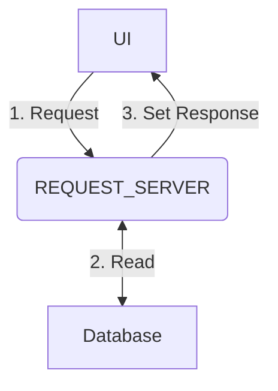

import Tabs from '@theme/Tabs';
import TabItem from '@theme/TabItem';
import Log from '/snippet/_LOG.md'
import CommonPermissions from '/snippet/_common-permissions.md'
import CommonPermissionsQuery from '/snippet/_common-permissions-query.md'
import CommonFieldOverrides from '/snippet/_common-field-overrides.md'
import CommonQueryFields from '/snippet/_common-query-fields.md'
import CommonProcesses from '/snippet/_common-see-processes.md'
import CommonAuthenticateFirst from '/snippet/_common-authenticate-first.md'
import CommonOpenAPI from '/snippet/_common-open-api.md'

## Overview

The Request Server is a microservice responsible for providing APIs to request snapshots of an application's data. Developers configure specific data sets as named requests, which can be queried by clients via APIs. Request Servers may sometimes be referred to as a "Request Reply" or "ReqRep" for short.



Genesis Request Servers are defined in the `*-reqrep.kts` files.

All Request Server queries are available via REST automatically, including Open API conforming spec.

## Example configuration

Keeping with the [data model examples](/develop/server-capabilities/data-model/#example-configuration) the following shows example request configurations.


```kotlin
requestReplies {

  requestReply(INSTRUMENT)

  requestReply(COUNTERPARTY) {
    permissioning {
      permissionCodes = listOf("CounterpartyView")
    }
    request {
      COUNTERPARTY_ID
      COUNTERPARTY_NAME
    }
  }

  requestReply("TRADE", TRADE_VIEW) {
    permissioning {
      permissionCodes = listOf("TradeView")
      auth(mapName = "COUNTERPARTY"){
        rowLevelPermissions = true
        authKey {
            key(data.counterpartyId)
        }
      }
    }
    request {
      TRADE_ID
    }
    reply {
      TRADE_ID
      TRADE_PRICE
      DIRECTION
      QUANTITY
      DATE
      COUNTERPARTY_ID
      COUNTERPARTY_CODE
      COUNTERPARTY_NAME
      INSTRUMENT_NAME
      NOTIONAL
    }

    filter {
      data.date > DateTime.now().minusDays(30)
    }
  }
}
```

###### INSTRUMENT 
The request server name is defaulted as no name is specified.

###### COUNTERPARTY   
[Access control](/develop/server-capabilities/access-control/) permissions are set, only users with `CounterpartyView` permission are able to access this query and see data. With the INSTRUMENT query above, any user who can authenticate with this app are able to access this query and see data.

###### TRADE_VIEW
A request server name is specified.

This query is for a view, whereas the previous two were onto tables. This query brings in all the fields defined in the view, which span multiple tables.  

We have specified the fields of the view we want to show explicitly, if there are fields in a view/table we don't need we can leave them out of this configuration. Where `fields` block is not specified all are implicitly included.  

The `auth` block in `permissioning` utilizes [access control](/develop/server-capabilities/access-control/) for row level permissioning. Only users with access to the COUNTERPARTY_ID will see the row.

`filter` clause is a server side filter. Subscribing clients may specify criteria to filter data, however this filter applies on the back end and clients may not circumvent.

### Summary

A Request Server file consists of a number of queries onto a table or view. All the details of the table or view are inherited from the definition, so you don’t need to supply any further details should you not need filter, apply [access control](/develop/server-capabilities/access-control/), else limit or extend the set of fields on the view or query.


## Configuration options

All `requestReply` blocks should be added under the parent block `requestReplies`

```kotlin
requestReplies {

  requestReply(...
  
}

### `requestReply`

`requestReply` defines a new request server query. It takes a `name` (optional) and an `entity` (table or view)

`name` is optional. Left unspecified, it is defaulted `REQ_\{table/view name\}`.

```kotlin
  // Name of the request server: REQ_INSTRUMENT
  requestReply(INSTRUMENT)

  // Name of the request server: REQ_TRADE
  requestReply("TRADE", TRADE_VIEW)
```

#### `request`

`request` lists the fields that a client can request data using.

`request` is optional. Left unspecified the request fields will be those which make up the primary key of the table (primary key of the root table if the entity is a view)

```kotlin
  requestReply("TRADE", TRADE_VIEW) {
    request {
      TRADE_ID
    }
  }
```

You can also use an index as the request input, this will ensure all the fields which make up the index are available on the request:

```kotlin
  requestReplies {
    requestReply("TRADE", TRADE_VIEW) {
      request(TRADE.TRADE_BY_COUNTERPARTY_ID_DATE)
    }
  }
```

In this example, with reference to [data model examples](/develop/server-capabilities/data-model/#example-configuration), we would have the following `REQUEST` inputs available to the client:
- `COUNTERPARTY_ID`
- `DATE`

Requests would be looked up using that table index.

###### Picking an index

Request servers will attempt to use the most efficient mechanism to retrieve data from the database. Given the `REQUEST` fields which are input, and not wild carded, it will cycle through the indices of the table or view used and score accordingly. If it is a full match we give max score to that index, any partial matches are scored and that with the highest score is used.

###### Audit table recommendations

Audit table request servers are very helpful for requesting all the audit records for a given record, or set of records. Audits can get very large, so having a real-time data server can come with a large overhead due to its caching nature. It is encouraged to instead use request servers for requesting audit rows for of a particular record ID.

All audit tables come with a key `*_BY_UNDERLYING_ID` which utilizes the primary key of the parent table. It is recommended to use this as the `request` configuration option for all audit tables. For example:

```kotlin
  requestReply(TRADE_AUDIT) {
    request(TRADE_AUDIT.BY_UNDERLYING_ID)
  }
```

##### `withTransformation`

Request Server scripts can optionally transform a request parameter’s value using `withTransformation`. This takes two inputs:
* the request parameter’s value (which is nullable)
* the full request message

In the example below, `withTransformation` is used twice.

* If the `ALTERNATE_TYPE` parameter value is null, then the Request Server will use `"UNKNOWN"` by default.
* If the `ALTERNATE_TYPE` parameter has the value "RIC", then the transformation block will use the value of `INSTRUMENT_CODE` from the request. Otherwise, it will assign it the value "NOT_RIC" before making the database lookup. 

```kotlin{5-16}
requestReplies {
    requestReply("INSTRUMENT_DETAILS", INSTRUMENT_DETAILS) {

        request {
            ALTERNATE_TYPE withTransformation { type, _ ->
                type?.toUpperCase() ?: "UNKNOWN"
            }
            INSTRUMENT_CODE withTransformation { type, set ->
                val value = if (set.fields["ALTERNATE_TYPE"].toString().toUpperCase() == "RIC") {
                    type
                } else {
                    "NOT_RIC"
                }
                value
            } withAlias "ALTERNATE_CODE"
        }

        reply {
            INSTRUMENT_CODE
            INSTRUMENT_ID
            INSTRUMENT_NAME
            ALTERNATE_TYPE
        }
    }
}
```

#### `reply`

`reply` lists the fields which will be returned.

`reply` is optional. Left unspecified all fields which make up the entity will be returned.

```kotlin
  requestReply("TRADE", TRADE_VIEW) {
    reply {
      TRADE_ID
      TRADE_PRICE
      DIRECTION
      QUANTITY
      DATE
    }
  }
```

<CommonFieldOverrides />

<CommonQueryFields />

#### `filterWithParameters`

This is the same as `filter` but adding a `genesisSet` context property that holds the parameters that are passed on the request; the parameters can be accessed by using GenesisSet getters.

In the example below, we will filter out rows where the COUNTERPARTY_NAME is equal to the instrument's name.

```kotlin
  filterWithParameters {                 
    genesisSet.getString("COUNTERPARTY_NAME") != data.instrumentName
  }
```

#### `filterWithRequest`

Similar to `filterWithParameters` but the `genesisSet` context property contains the whole request payload and not just the parameters.

```kotlin
  filterWithParameters {                 
    genesisSet.getString("REQUEST.COUNTERPARTY_NAME") != data.instrumentName && data.assignedTo == genesisSet.getString("userName")
  }
```


<CommonPermissions />

<CommonPermissionsQuery />

#### `rowReturnLimit`

You can limit the maximum number of rows returned using the property `rowReturnLimit`. In this example, we limit it to 10 rows that will be returned.

```kotlin
    requestReply("TRADE", TRADE_VIEW) {
        rowReturnLimit = 10
    }
```

#### `timeout`

`timeout` specifies the amount of time, in seconds, that a request server will spend generating a response to a client query before giving up. The setting is useful if a request server is on a large data set and a client has the possibility of setting criteria that takes a long time to process and generate a response for.

In this example, we set a timeout of 15 seconds.

```kotlin
  requestReply("TRADE", TRADE_VIEW) {
    timeout = 15
  }
```

If `timeout` of a request reply uses the following precedence:

1. the `timeout` value of the `requestReply`
1. the value of the `ReqRepTimeout` system definition item
1. else 60 seconds

Where a timeout occurs the server will response with a `MSG_NACK` with an `ERROR[0].CODE` value of `OPERATION_TIMEOUT`

```
MESSAGE_TYPE = MSG_NACK
SOURCE_REF = "source-ref"
  ERROR[0].@type = StandardError
   ERROR[0].CODE = OPERATION_TIMEOUT
   ERROR[0].TEXT = Server timed out
   ERROR[0].STATUS_CODE = 408 Request Timeout
```

### Custom Request Servers

By defining your own Request Servers, you have maximum flexibility. 

* You can specify any class for the input and output, similar to Event Handlers.
* For the request, optional fields should have a default value in the primary constructor.
* You cannot use native Kotlin classes. You should wrap these in custom input and output classes.

It is recommended that you locate your classes within the main/kotlin messages folder of your project structure. Ensure that the `*-reqrep.kts` file you are writing a custom request server within has a dependency on the _app-name_**-app** ScriptModule near the top

```kotlin
  @file:ScriptModules("{app-name}-app")

  requestReplies {
    ...
  }
```

The `requestReply` code block can be as simple or complex as your requirements. They are useful, for example, if you want to request data from a number of different tables and views that are not related. By nesting and joining all the relevant data in your `requestReply` statement, you create your own metadata for the Request Server, so it can then be used anywhere in the module.

Example syntax:

```kotlin
// the name is optional, if none is provided, then request will be based on the output class, e.g. REQ_OUTPUT_CLASS
requestReply<[InputClass], [OutputClass]> ("{optional name}") {
  // permissioning is optional
  permissioning {
    // multiple auth blocks can be combined with the and operator and the or operator
    auth("{map name}") {
        // use a single field of output_class
        authKey {
            key(data.fieldName)
        }
        // or use multiple fields of output_class
        authKey {
            key(data.fieldNameA, data.fieldNameB)
        }
        // or use multiple fields of output_class as well as the username
        authKeyWithUserName {
            key(data.fieldNameA, data.fieldNameB, userName)
        }
        
        // hide fields are supported
        hideFields { userName ->
            listOf("FIELD_NAME_A")
        }
        
        // predicates are supported
        filter {
        }
    }
  }
  
  // a reply tag is required; there are three types.
  // the reply tag will have a single parameter, the request, which will be of type 
  // [input class]
  // all three have these fields available:
  // 1. db          - readonly entity database 
  // 2. userName    - the name of the user who made the request
  // 3. LOG         - logger with name: global.genesis.requestreply.pal.{request name}
  
  // either:
  reply { request -> 
  }
  
  // or: 
  replySingle { request -> 
  }
  
  // or:
  replyList { request ->
  }
}
```

#### Types of reply

There are three types of reply that you can use with custom request servers:

- **reply** expects a type of `Flow<OutputClass>` to be returned.
- **replySingle** expects a return of the `<OutputClass>` type that you defined in your `requestReply`. 
- **replyList** expects a return of the type `List<OutputClass>`. 

For all of these, you can use the parameter `request`. In our previous example, the `request` is of the type `InputClass`.

### Examples
In this example, we define two data classes; Hello and World. We use these to create a Hello World request:

```kotlin
data class Hello(val name: String)
data class World(val message: String)

requestReply<Hello, World>("HELLO_WORLD") {
    replySingle { hello: Hello ->
        World("Hello ${hello.name}")
    }
}
```

We can also check who made the request by accessing the `userName` property:

```kotlin
requestReply<Hello, World>("HELLO_WORLD_CHECK") {
    replySingle { hello: Hello ->
        when (userName) {
            hello.name -> World("Hello ${hello.name}")
            else -> World("You're not ${hello.name}!")
        }
    }
}
```

In this next example, we use generated dao classes to get a single record from the `INSTRUMENT_DETAILS` table using the `ByInstrumentId` index. We use the `db` property to access the entity db.

```kotlin
requestReply<InstrumentDetails.ByInstrumentId, InstrumentDetails> {
    replySingle { byId->
        db.get(byId)
    }
}
```

Next is a more complex example. 

- The first block checks that the user is authorized to view the instrument.
- The second block uses the ALT_INSTRUMENT_ID table. The index is used as the input, but we return either a `getBulk`, a `getRange` or a `get`, depending on the input.

```kotlin
requestReply<AltInstrumentId.ByAlternateTypeAlternateCode, AltInstrumentId> {
    permissioning {
        auth("INSTRUMENT") {
            authKey {
                key(data.instrumentId)
            }
        }
    }
    
    reply { byAlternateTypeAlternateCode ->
        when {
            byAlternateTypeAlternateCode.alternateType == "*" ->
                db.getBulk(ALT_INSTRUMENT_ID)
            byAlternateTypeAlternateCode.alternateCode == "*" ->
                db.getRange(byAlternateTypeAlternateCode, 1)
            else -> db.get(byAlternateTypeAlternateCode).flow()
        }
    }
}
```

In the example below, we have defined a more complicated auth logic:

```kotlin
requestReply<AltInstrumentId.ByAlternateTypeAlternateCode, AltInstrumentId>("FANCY_INSTRUMENT") {
    permissioning {
        auth("INSTRUMENT") {
            authKey {
                key(data.instrumentId)
            }
            filter {
                data.alternateType == "FOO"
            }
        } or auth("ALTERNATE_CODE") {
            authKey {
                key(data.alternateCode)
            }
            filter {
                data.alternateType == "BAR"
            }
        }
    }
    reply { byAlternateTypeAlternateCode ->
        db.getRange(byAlternateTypeAlternateCode, 1)
    }
}
```

Helpers assist you to interact with the Kotlin Flow type, which is the return type within the reply block. These helpers are:
* T.flow() - Converts to the Flow type
* T.distinct() - Returns a Flow of all distinct values
* T.distinctBy(selector: (T) -> K?) - Returns a Flow of all distinct values given a selector
* T.sorted() - Returns a Flow of all sorted values
* T.sortedBy(selector: (T) -> K?) - Returns a Flow of all sorted values given a selector


### Logging

<Log />

## Optimistic concurrency

Find details around [how request servers work with optimistic concurrency](/develop/server-capabilities/data-access-apis/#request-server)

## Client API

<CommonAuthenticateFirst />

<CommonOpenAPI />

### `REQ_<REQUEST_SERVER_NAME>`

To query a Request Server, the client sends a `MESSAGE_TYPE` of `REQ_<request server name>`.

There are several options that can be optionally specified in the message header:

| Option         | Default                                                  | Description                                                         |
| -------------- |----------------------------------------------------------|---------------------------------------------------------------------|
| `MAX_ROWS`       | `rowReturnLimit` defined for the target Request Server | Maximum number of rows to be returned as part of the reply message  |
| `CRITERIA_MATCH` | | The front end can send an expression or a Groovy expression to perform filtering on the query server; these remain active for the life of the subscription. For example: `Expr.dateIsBefore(TRADE_DATE,'20150518')` or `QUANTITY > 10000`; [read more below](#criteria_match) |

<Tabs defaultValue="websocket" values={[{ label: 'Websocket API', value: 'websocket', }, { label: 'REST API', value: 'rest', }]}>
<TabItem value="websocket">
Request
```
{
    "MESSAGE_TYPE" : "REQ_TRADE"
    "SESSION_AUTH_TOKEN" : "SIlvjfUpkfXtGxfiQk1DDvVRlojKtNIM"
    "SOURCE_REF" : "234"
    "USER_NAME": admin
    "REQUEST" : {
          "COUNTERPARTY_ID" : 1
          "DATE_FROM" : 1731369600000
          "DATE_TO" : 1730419200000
    }
    "DETAILS" : {
      "MAX_ROWS" : 5
      "CRITERIA_MATCH": "DIRECTION == 'BUY'"
    }
}
```
Response
```
{
  "MESSAGE_TYPE": "REP_TRADE",
  "SOURCE_REF": "234",
  "REPLY": [
    {
      "TRADE_ID" : 1
      "TRADE_PRICE" : 224.34
      "DIRECTION" : "BUY"
      "QUANTITY" : 1000
      "DATE" : 1730678400000
      "COUNTERPARTY_ID" : 1
      "COUNTERPARTY_CODE" : "GEN"
      "COUNTERPARTY_NAME" : "Genesis"
      "INSTRUMENT_NAME" : "AAPL"
      "NOTIONAL" : 224340
    },
    {
      "TRADE_ID" : 2
      "TRADE_PRICE" : 225.12
      "DIRECTION" : "BUY"
      "QUANTITY" : 1000
      "DATE" : 1730764800000
      "COUNTERPARTY_ID" : 1
      "COUNTERPARTY_CODE" : "GEN"
      "COUNTERPARTY_NAME" : "Genesis"
      "INSTRUMENT_NAME" : "AAPL"
      "NOTIONAL" : 225120
    },
    {
      "TRADE_ID" : 3
      "TRADE_PRICE" : 583.17
      "DIRECTION" : "BUY"
      "QUANTITY" : 500
      "DATE" : 1730851200000
      "COUNTERPARTY_ID" : 1
      "COUNTERPARTY_CODE" : "GEN"
      "COUNTERPARTY_NAME" : "Genesis"
      "INSTRUMENT_NAME" : "META"
      "NOTIONAL" : 291585
    },
  ]
}
```
</TabItem>
<TabItem value="rest">
Request

Input parameters are encoded into the URL per REST and GET convention
```
GET /req-trade?REQUEST.COUNTERPARTY_ID=1&REQUEST.DATE_FROM=1731369600000&DATE_TO=1730419200000&DETAILS.MAX_ROWS=5&DETAILS.CRITERIA_MATCH=DIRECTION%20%3D%3D%20%27BUY%27 HTTP/1.1
Host: localhost:9064
Content-Type: application/json
SESSION_AUTH_TOKEN: 83eLYBnlqjIWt1tqtJhKwTXJj2IL2WA0
SOURCE_REF: 123
```
Response
```
HTTP/1.1 200 OK
content-type: application/json
content-length: 556
connection: keep-alive
{
  "MESSAGE_TYPE": "REP_TRADE",
  "SOURCE_REF": "234",
  "REPLY": [
    {
      "TRADE_ID" : 1
      "TRADE_PRICE" : 224.34
      "DIRECTION" : "BUY"
      "QUANTITY" : 1000
      "DATE" : 1730678400000
      "COUNTERPARTY_ID" : 1
      "COUNTERPARTY_CODE" : "GEN"
      "COUNTERPARTY_NAME" : "Genesis"
      "INSTRUMENT_NAME" : "AAPL"
      "NOTIONAL" : 224340
    },
    {
      "TRADE_ID" : 2
      "TRADE_PRICE" : 225.12
      "DIRECTION" : "BUY"
      "QUANTITY" : 1000
      "DATE" : 1730764800000
      "COUNTERPARTY_ID" : 1
      "COUNTERPARTY_CODE" : "GEN"
      "COUNTERPARTY_NAME" : "Genesis"
      "INSTRUMENT_NAME" : "AAPL"
      "NOTIONAL" : 225120
    },
    {
      "TRADE_ID" : 3
      "TRADE_PRICE" : 583.17
      "DIRECTION" : "BUY"
      "QUANTITY" : 500
      "DATE" : 1730851200000
      "COUNTERPARTY_ID" : 1
      "COUNTERPARTY_CODE" : "GEN"
      "COUNTERPARTY_NAME" : "Genesis"
      "INSTRUMENT_NAME" : "META"
      "NOTIONAL" : 291585
    },
  ]
}
```
</TabItem>
</Tabs>

In the examples above we request all trades for counterparty with ID 1 with a DATE between 1st October 2024 (1731369600000 milliseconds) and 1st November 2024 (1730419200000 milliseconds). We then filter to only return those which are BUY trades, and will limit the response to 5 trades returned maximum. It returns 3 rows.

#### `CRITERIA_MATCH`

The client filtering can also be specified in the `CRITERIA_MATCH` option. This criteria filtering is performed AFTER data has been fetched from the database.

The filters can be specified using common expressions, Groovy expressions, or even a mix of the two. See more detail in [Client capabilities - server communications](/develop/client-capabilities/server-communications/criteria-matching/).

#### Ranges

A client can specify ranges of data from a Request Server by post-fixing the request parameter names with `_FROM` and `_TO`.  
The example below shows a client building a GenesisSet request based upon the requestReplies defined from previous example. This example stipulates a price range between 1,000 and 10,000. 
Ranges can be used with numeric, `DATE` and `DATETIME` field types.
You must specify both `_FROM` and `_TO` to get a result. Specifying only one end will result in an error.

```json
  "DETAILS" : {
    "LAST_TRADED_PRICE_FROM": 1_000
    "LAST_TRADED_PRICE_TO": 10_000
  }
```

:::note
1. Ranges must be based on indexes. Post-fixing the request parameter targeting records without an index, will process the request ignoring the range.
2. It is not possible to get a range using unix timestamps when targeting a GenesisFlake field. The epoch time (milliseconds) is in the most significant bits of the raw GenesisFlake value, so you need to shift once right to decode into epoch milliseconds (GenesisFlake to Timestamp) and once left to do the same thing for encoding (Timestamp to GenesisFlake). This is described in detail [here](/develop/server-capabilities/data-access-apis/#timestamps). 
:::

## Metrics

:::info
Ensure you have [enabled metrics](/build-deploy-operate/operate/metrics/#enabling-metrics) in your environment to view them.
:::

The Request Server latency metrics show how long it takes for a specific `requestReply` in the Request Server to process a message.

| Metric                     | Explanation                         |
|:---------------------------|:------------------------------------|
| message_processing_latency | The latency for processing requests |


## Runtime configuration

To include your `*-reqrep.kts` file definitions in a runtime process, you will need to ensure the process definition:

1. Ensure `genesis-pal-requestserver` is included in `module`
1. Ensure `global.genesis.requestreply.pal` is included in `package`
1. Ensure your reqrep.kts file(s) are defined in `script`
1. Ensure `pal` is set in `language`

If you wish to run a dedicated process for a request server, the following gives an example full process definition:

```xml
  <process name="POSITION_REQUEST_SERVER">
    <groupId>POSITION</groupId>
    <start>true</start>
    <options>-Xmx256m -DXSD_VALIDATE=false</options>
    <module>genesis-pal-requestserver</module>
    <package>global.genesis.requestreply.pal</package>
    <script>position-reqrep.kts</script>
    <description>Server one-shot requests for details</description>
    <language>pal</language>
  </process>
```

<CommonProcesses/>

## Testing

:::info

**GenesisJunit** is only available from version 8 of the Genesis Server Framework (GSF).

If you are testing against a previous version of the framework, go to the [legacy](/develop/server-capabilities/testing/#integration-testing) section.

:::

### Integration testing

This document looks at the basics of testing Request Servers.

We shall use a very simple example and work through the communication between our tests and the Request Server we are testing. This example relies on GenesisJunit, which is designed to make testing easy.

In this example, we shall test the following Request Server:

```kotlin 
data class Hello(
    val name: String,
)

data class World(
    val message: String,
)

requestReplies {
    requestReply<Hello, World>("HELLO_WORLD") {
        replySingle { hello: Hello ->
            World("Hello ${hello.name}")
        }
    }
}
```

#### Preparation
There are some simple steps to follow in order to set up yor test.

###### 1. Create the test class
Create the test class using the code provided below:

<Tabs defaultValue="kotlin" values={[{ label: 'Kotlin', value: 'kotlin', }, { label: 'Java', value: 'java', }]}>
<TabItem value="kotlin">

```kotlin
@ExtendWith(GenesisJunit::class)
@ScriptFile("hello-world-reqrep.kts")
class RequestServerTest {

    // our tests go here ...
}
```

</TabItem>
<TabItem value="java">

```java
@ExtendWith(GenesisJunit.class)
@ScriptFile("hello-world-reqrep.kts")
public class RequestServerTest {

    // our tests go here ...
}
```
</TabItem>
</Tabs>

This test class does three things: 

* It enables **GenesisJunit**.
* It identifies the Request Server script that we want to test, using the `ScriptFile` annotation.

There is more information about `GenesisJunit` and the various annotations in the section on [Integration testing](/develop/server-capabilities/testing/#integration-testing).

###### 3. Inject references

Here, you need to set up two things:

- inject a Request Server client so that it can communicate with the Request Server you are testing
- define your workflow, so that the client knows both the request and the reply type

Use the code below:

<Tabs defaultValue="kotlin" values={[{ label: 'Kotlin', value: 'kotlin', }, { label: 'Java', value: 'java', }]}>
<TabItem value="kotlin">

```kotlin
@ExtendWith(GenesisJunit::class)
@ScriptFile("hello-world-reqrep.kts")
class RequestServerTest {

    @Inject
    private lateinit var client: RequestClientSync

    private val helloWorldFlow = requestReplyWorkflowBuilder<Hello, World>("HELLO_WORLD")

    // our tests go here ...
}
```

</TabItem>
<TabItem value="java">

```java
@ExtendWith(GenesisJunit.class)
@ScriptFile("hello-world-reqrep.kts")
public class RequestServerTest {

    @Inject
    private RequestClientSync client = null;

    private RequestReplyWorkflow<Hello, World> helloWorldFlow = new AbstractRequestReplyWorkflow<>("HELLO_WORLD") { };

    // our tests go here ...
}
```
</TabItem>
</Tabs>

### Define the workflow

The syntax for defining the request-reply workflow depends on whether you use Kotlin or Java. However, in both instances you need to provide the input type, the output type and the request name.

In Kotlin, you can build the flow in a method call:

```kotlin 
private val helloWorldFlow = requestReplyWorkflowBuilder<Hello, World>("HELLO_WORLD")
```

In Java, you need to construct an abstract class:

```java
private RequestReplyWorkflow<Hello, World> helloWorldFlow = new AbstractRequestReplyWorkflow<>("HELLO_WORLD") { };
```

### A first test
Here is a very simple first test. 

<Tabs defaultValue="kotlin" values={[{ label: 'Kotlin', value: 'kotlin', }, { label: 'Java', value: 'java', }]}>
<TabItem value="kotlin">

```kotlin
@Test
fun testHelloWorldRequestServer() {
    val hello = Hello("John")
    val result = client.sendRequest(helloWorldFlow, hello)
    assertEquals(1, result.size)
    val world = result[0]
    assertEquals("Hello, John!", world.message)
}
```

</TabItem>
<TabItem value="java">

```java
@Test
public void testHelloWorldRequestServer() {
    var hello = new Hello("John");
    var result = client.sendRequest(helloWorldFlow, hello);
    assertEquals(1, result.size());
    var world = result.get(0);
    assertEquals("Hello, John!", world.getMessage());
}
```
</TabItem>
</Tabs>

### Providing a user name

As you can see, to send a request, you need to provide both the workflow and the content. 
You can optionally provide a username as well:

<Tabs defaultValue="kotlin" values={[{ label: 'Kotlin', value: 'kotlin', }, { label: 'Java', value: 'java', }]}>
<TabItem value="kotlin">

```kotlin
@Test
fun testHelloWorldRequestServerWithUser() {
    val hello = Hello("John")
    val result = client.sendRequest(helloWorldFlow, hello, "JohnDoe")
    assertEquals(1, result.size)
    val world = result[0]
    assertEquals("Hello, John!", world.message)
}
```

</TabItem>
<TabItem value="java">

```java
@Test
public void testHelloWorldRequestServerWithUser() {
    var hello = new Hello("John");
    var result = client.sendRequest(helloWorldFlow, hello, "JohnDoe");
    assertEquals(1, result.size());
    var world = result.get(0);
    assertEquals("Hello, John!", world.getMessage());
}
```
</TabItem>
</Tabs>

### Dynamic authorization

To test dynamic authorization, you need to amend your Request Server definition:

```kotlin
data class Hello(
    val name: String,
)

data class World(
    val message: String,
    val name: String,
)

requestReplies {
    requestReply<Hello, World>("HELLO_WORLD") {
        replySingle { hello: Hello ->
            World("Hello, ${hello.name}!", hello.name)
        }
    }

    requestReply<Hello, World>("HELLO_WORLD_AUTH") {
        permissioning {
            auth("NAMES") {
                authKey {
                    key(data.name)
                }
            }
        }

        replySingle { hello: Hello ->
            World("Hello, ${hello.name}!", hello.name)
        }
    }
}
```

You then need to create your new test cases. Note that the authorization for Request Servers is on the outgoing message. The Request Server filters out values to which the requesting user has no access. 

In the code below, there are two tests, which both check the result of the authorization process:

- In the first test, if the result is 1 (authorized), then the Hello message is sent (as in the earlier example).
- In the second test, if the result is 0 (unauthorized), then an empty message is returned.


<Tabs defaultValue="kotlin" values={[{ label: 'Kotlin', value: 'kotlin', }, { label: 'Java', value: 'java', }]}>
<TabItem value="kotlin">

```kotlin
@ExtendWith(GenesisJunit::class)
@ScriptFile("hello-world-reqrep.kts")
@EnableInMemoryTestAuthCache
class HelloWorldRequestServerTest {
    @Inject
    private lateinit var client: RequestClientSync

    @Inject
    private lateinit var authCache: InMemoryTestAuthCache

    private val helloWorldFlow = requestReplyWorkflowBuilder<Hello, World>("HELLO_WORLD")

    @Test
    fun testHelloWorldAuthorised() {
        authCache.authorise(
            authMap = "NAMES",
            entityCode = "John",
            userName = "JohnDoe"
        )

        val hello = Hello("John")
        val result = client.sendRequest(helloWorldAuthorisedFlow, hello, "JohnDoe")
        assertEquals(1, result.size)
        val world = result[0]
        assertEquals("Hello, John!", world.message)
    }

    @Test
    fun testHelloWorldNotAuthorised() {
        authCache.revoke(
            authMap = "NAMES",
            entityCode = "John",
            userName = "JohnDoe"
        )

        val hello = Hello("John")
        val result = client.sendRequest(helloWorldAuthorisedFlow, hello, "JohnDoe")

        assertEquals(0, result.size)
    }
}
```

</TabItem>
<TabItem value="java">

```java
@ExtendWith(GenesisJunit.class)
@ScriptFile("hello-world-reqrep.kts")
@EnableInMemoryTestAuthCache
public class HelloWorldRequestServerJavaTest {

    @Inject
    private RequestClientSync client = null;

    @Inject
    private InMemoryTestAuthCache authCache = null;

    private RequestReplyWorkflow<Hello, World> helloWorldAuthorisedFlow = new AbstractRequestReplyWorkflow<>("HELLO_WORLD_AUTH") { };

    @Test
    public void testHelloWorldAuthorised() {
        authCache.builder()
                .withAuthMap("NAMES")
                .withEntityCode("John")
                .withUserName("JohnDoe")
                .authorise();

        var hello = new Hello("John");
        var result = client.sendRequest(helloWorldFlow, hello);
        assertEquals(1, result.size());
        var world = result.get(0);
        assertEquals("Hello, John!", world.getMessage());
    }

    @Test
    public void testHelloWorldNotAuthorised() {
        authCache.builder()
                .withAuthMap("NAMES")
                .withEntityCode("John")
                .withUserName("JohnDoe")
                .revoke();

        var hello = new Hello("John");
        var result = client.sendRequest(helloWorldFlow, hello, "JohnDoe");
        assertEquals(0, result.size());
    }
}
```
</TabItem>
</Tabs>

### Different clients

There are three request clients available:

* RequestClientSync - blocking implementation
* RequestClientAsync - supports coroutines
* RequestClientRx - supports rx java

In most cases, the **RequestClientSync** client will suffice.

### Conclusion

At this point we have tested our very simple Request Server. We haven't even had to use the database! However, we have covered the basics of communication between tests and Request Servers.

We have covered:
* defining request flows
* sending our request and receiving the response
* setting the username on the request
* handling dynamic authorization

## Integration testing (legacy)

:::info
This section covers testing your Request Server if you are using any version of the Genesis Server Framework before GSF v8.
:::

It is good practice to test your Request Servers. This is the best way to prevent any unexpected side effects of changes to your application over time.

The Genesis platform provides the `AbstractGenesisTestSupport` abstract class that enables end-to-end testing of specific areas of your application. In this case, we want to ensure that we have a database, seeded with information, and that our Request Server configuration is used to create our Request Server. We also need to add the required packages and genesis home. 

```kotlin
class ReqRepTests : AbstractGenesisTestSupport<Reply<*>>(
    GenesisTestConfig {
        addPackageName("global.genesis.requestreply.pal")
        genesisHome = "/GenesisHome/"
        scriptFileName = "your-application-reqrep.kts"
        initialDataFile = "seed-data.csv"
    }
) {
    ...
}
```

For more information about `AbstractGenesisTestSupport`, see the [Testing pages](/develop/server-capabilities/testing/#abstractgenesistestsupport).

Once you have set up your configuration, we can start writing tests against our Request Server. Your tests will look a little different, depending on if you are using the standard approach to Request Servers or using [custom Request Servers](#custom-request-servers).

### Standard Request Servers

Let's run a very simple example.
Copy the following into a csv file and save as `seed-data.csv` in the test Resources folder.

```text
#COUNTERPARTY
COUNTERPARTY_ID,COUNTERPARTY_NAME
testID 1,TestName 1
testID 2,TestName 2
```
We shall send a message to our Genesis application, pointing at the correct Request Server (making sure to add the *REQ_* prefix) and wait for the response.
The Genesis platform uses Kotlin coroutines which gives us a degree of non-blocking asynchronous computation. For this reason, we must wrap our tests in a `runBlocking` coroutine scope as seen below.


```kotlin
class ReqrepTest : AbstractGenesisTestSupport<GenesisSet>(
    GenesisTestConfig {
        addPackageName("global.genesis.requestreply.pal")
        genesisHome = "/GenesisHome/"
        scriptFileName = "positions-app-tutorial-reqrep.kts"
        initialDataFile = "seed-data.csv"
        parser = { it }
    }
) {

    @Test
    fun `can get all counterparty`() = runBlocking {
        val request = GenesisSet.genesisSet {
            MessageType.MESSAGE_TYPE with "REQ_COUNTERPARTY"
        }
        val counterparties = sendMessageAsync(request).getArray<GenesisSet>("REPLY")
        assertNotNull(counterparties)
        assertEquals(2, counterparties.size)
    }
}

```

In the above example, we are asserting that there are two rows within the response from our Request Server. This is based on the two rows of data that we have in `seed-data.csv` declared earlier.

### Custom Request Servers

For custom Request Servers, we must declare a workflow object that matches the custom Request Server that we have declared. This should match the same input and output types for the custom Request Server.

Given a custom Request Server that takes an input of type `Hello` and returns type `World`, we pass the same types into the requestReplyWorkflow. We can optionally pass the name of the Request Server to the builder.

```kotlin
object HelloWorldFlow : RequestReplyWorkflow<Hello, World> by requestReplyWorkflowBuilder("HELLO_WORLD")

@Test
fun `can get hello world`() = runBlocking {
    val reply = sendRequest(HelloWorldFlow, Hello("Peter")).first()

    assert(reply.message == "Hello Peter")
}
```

If you want to reuse a workflow with the same input and output types, you can use the unary plus overload to change the name of the Request Server being pointed to. In the  example below, we reuse `HelloWorldFlow` and change the Request Server to "HELLO_WORLD_CAPS", a variant of the same Request Server which returns a string in all caps.

```kotlin
@Test
fun `can get hello world`() = runBlocking {
    val reply = sendRequest(HelloWorldFlow + "HELLO_WORLD_CAPS", Hello("Peter")).first()

    assert(reply.message == "HELLO PETER")
}
```