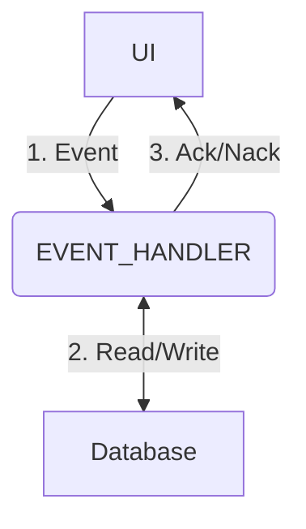

import Tabs from '@theme/Tabs';
import TabItem from '@theme/TabItem';
import Log from '/snippet/_LOG.md'
import CommonProcesses from '/snippet/_common-see-processes.md'

## Overview

The Genesis application platform has a real-time event-driven architecture. The Event Handler is a microservice responsible for providing these events, which can apply business logic and affect the application's data set. Developers configure events, including optional and mandatory input fields, which client can trigger via APIs. 



Many of the tables in an app will need **Insert**, **Modify** and **Delete** events, so that you can specify the processing that these events require. You can create any events as needed by the application's business logic. For example, most applications built on the platform include typical **business entities** for the financial market, such as orders, trades, bids, allocations and positions. These business entities have a lifecycle where they go through various **states**. The transition from one state to another is an event that needs to be handled. The paths through those states are workflows, and to assist the workflows, we use [state machines](/develop/server-capabilities/workflow-state-machine/).

Genesis Event handlers are defined in the `*-eventhandler.kts` files.

All Event Handler events are available via REST automatically, including Open API conforming spec.

## Example configuration

TODO

## Configuration options

TODO

### Logging

<Log />

## Client API

:::tip
Event handlers are also accessible via [Open API](/develop/server-capabilities/integrations-open-api/)
:::

TODO

## Metrics

:::info
Ensure you have [enabled metrics](/build-deploy-operate/operate/metrics/#enabling-metrics) in your environment to view them.
:::

The event handler latency metrics show how long it takes for a specific `eventHandler` in the Event Handler to process a message.

| Metric             | Explanation                                                  |
|:-------------------|:-------------------------------------------------------------|
| processing_latency | The latency for processing events (kts event handler)        |
| latency            | The latency for processing events (kotlin/java event handler |

## Runtime configuration

To include your `*-eventhandler.kts` file definitions in a runtime process, you will need to ensure the process definition:

1. Ensure `genesis-pal-eventhandler` is included in `module`
1. Ensure `global.genesis.eventhandler.pal` is included in `package`
1. Ensure your eventhandler.kts file(s) are defined in `script`
1. Ensure `pal` is set in `language`

If you wish to run a dedicated process for a request server, the following gives an example full process definition:

```xml
  <process name="POSITION_EVENT_HANDLER">
    <groupId>POSITION</groupId>
    <start>true</start>
    <options>-Xmx256m -DRedirectStreamsToLog=true -DXSD_VALIDATE=false</options>
    <module>genesis-pal-eventhandler</module>
    <package>global.genesis.eventhandler.pal</package>
    <script>position-eventhandler.kts</script>
    <description>Handles events</description>
    <classpath>position-messages*,position-eventhandler*</classpath>
    <language>pal</language>
  </process>
```

<CommonProcesses/>

## Testing

:::info

**GenesisJunit** is only available from version 8 of the Genesis Server Framework (GSF).

If you are testing against a previous version of the framework, go to the [legacy](/develop/server-capabilities/testing/#integration-testing) section.

:::

### Integration testing

This section covers the basics of testing Event Handlers. We shall use a very simple example, and work through the communication between our test and the Event Handler. 

This includes how to test dynamic authorisation. 

This testing relies on [**GenesisJunit**](/develop/server-capabilities/testing/#integration-testing), which is designed to make testing easy.

In this example, we shall test the following Event Handler: 

```kotlin
data class Hello(
    val name: String,
)

eventHandler {
    eventHandler<Hello>("HELLO_WORLD") {
        onCommit {
            ack()
        }
    }
}
```

#### Creating the test class

First, use the code below to create the test class:

<Tabs defaultValue="kotlin" values={[{ label: 'Kotlin', value: 'kotlin', }, { label: 'Java', value: 'java', }]}>
<TabItem value="kotlin">

```kotlin
@ExtendWith(GenesisJunit::class)
@ScriptFile("hello-world-eventhandler.kts")
class EventHandlerTest {

    // our tests go here ...
}
```

</TabItem>
<TabItem value="java">

```java
@ExtendWith(GenesisJunit.class)
@ScriptFile("hello-world-eventhandler.kts")
public class EventHandlerTest {

    // our tests go here ...
}
```
</TabItem>
</Tabs>

The code above does two things: 

* It enables **GenesisJunit**.
* It specifies the Event Handler script that we want to test, using the `ScriptFile` annotation.

There is more information about `GenesisJunit` and the various annotations in the section on [Integration testing](/develop/server-capabilities/testing/#integration-testing).

#### Injecting an Event Handler client
Use the code below to inject an Event Handler client:

<Tabs defaultValue="kotlin" values={[{ label: 'Kotlin', value: 'kotlin', }, { label: 'Java', value: 'java', }]}>
<TabItem value="kotlin">

```kotlin
@ExtendWith(GenesisJunit::class)
@ScriptFile("hello-world-eventhandler.kts")
class EventHandlerTest {

    @Inject
    lateinit var client: EventClientSync

    // our test will go here ...
}
```

</TabItem>
<TabItem value="java">

```java
@ExtendWith(GenesisJunit.class)
@ScriptFile("hello-world-eventhandler.kts")
public class EventHandlerTest {

    @Inject
    private EventClientSync client = null;

    // our test will go here ...
}
```
</TabItem>
</Tabs>

#### A first test

This test makes sure that the Event Handler returns an ack.

<Tabs defaultValue="kotlin" values={[{ label: 'Kotlin', value: 'kotlin', }, { label: 'Java', value: 'java', }]}>
<TabItem value="kotlin">

```kotlin
@Test
fun testHelloWorld() {
    val reply = client.sendEvent(
        details = Hello("PETER"),
        messageType = "EVENT_HELLO_WORLD"
    )
    
    assert(reply is EventReply.EventAck) 
}
```

</TabItem>
<TabItem value="java">

```java
@Test
void testHelloWorld() {
    var reply = client.builder()
            .withDetails(new Hello("PETER"))
            .withMessageType("EVENT_HELLO_WORLD")
            .send();

    assertInstanceOf(EventReply.EventAck.class, reply);
}
```
</TabItem>
</Tabs>

As you can see here, to send an event to our event handler, we need to provide the details class. 
The message type is optional, but we have to set it here, as we set a custom message name on our Event Handler.

We can also provide the user name:

<Tabs defaultValue="kotlin" values={[{ label: 'Kotlin', value: 'kotlin', }, { label: 'Java', value: 'java', }]}>
<TabItem value="kotlin">

```kotlin
@Test
fun testHelloWorldWithUser() {
    val reply = client.sendEvent(
        details = Hello("PETER"),
        messageType = "EVENT_HELLO_WORLD",
        userName = "PETER"
    )

    assert(reply is EventReply.EventAck)
}
```

</TabItem>
<TabItem value="java">

```java
@Test
void testHelloWorldWithUser() {
    var reply = client.builder()
            .withDetails(new Hello("PETER"))
            .withMessageType("EVENT_HELLO_WORLD")
            .withUserName("PETER")
            .send();

    assertInstanceOf(EventReply.EventAck.class, reply);
}
```
</TabItem>
</Tabs>

#### Different clients

There are three versions of the Event Handler client available during testing:

* EventClientSync - this is the synchronous client, all calls are blocking
* EventClientAsync - this is the coroutine client, where calls suspend
* EventClientRx - this is the RxJava client, which wraps responses in a `Single`

In most instances, **EventClientSync** will suffice. 
Use the other clients if your tests use other asynchronous operations.

#### Dynamic authorisation

To test dynamic authorisation, add the `@EnableInMemoryTestAuthCache` to your class or method. 
This makes `InMemoryTestAuthCache` available for injection into your test class. 

Amend the Event Handler to enable authorisation:

```kotlin 
data class Hello(
    val name: String,
)

eventHandler {
    eventHandler<Hello>("HELLO_WORLD_AUTH") {

        permissioning {
            auth("NAMES") {
                authKey {
                    key(data.name)
                }
            }
        }

        onCommit {
            ack()
        }
    }
}
```

The first thing we need to do, is to enable the in-memory test auth cache using the `@EnableInMemoryTestAuthCache` annotation.

We also need to inject `InMemoryTestAuthCache` into our test class. 

<Tabs defaultValue="kotlin" values={[{ label: 'Kotlin', value: 'kotlin', }, { label: 'Java', value: 'java', }]}>
<TabItem value="kotlin">

```kotlin
@ExtendWith(GenesisJunit::class)
@ScriptFile("hello-world-eventhandler.kts")
class EventHandlerTest {

    @Inject
    lateinit var client: EventClientSync
    
    @Inject
    lateinit var authCache: InMemoryTestAuthCache

    @Test
    fun testIsAuthorised() {
        authCache.authorise(
            authMap = "NAMES",
            entityCode = "PETER",
            userName = "PETER"
        )

        val reply = client.sendEvent(
            details = Hello(name = "PETER"),
            userName = "PETER",
            messageType = "EVENT_HELLO_WORLD_AUTH"
        )

        assert(reply is EventReply.EventAck) { reply }
    }

    @Test
    fun testIsNotAuthorised() {
        authCache.revoke(
            authMap = "NAMES",
            entityCode = "PETER",
            userName = "PETER"
        )

        val reply = client.sendEvent(
            details = Hello(name = "PETER"),
            userName = "PETER",
            messageType = "EVENT_HELLO_WORLD_AUTH"
        )

        assert(reply is EventReply.EventNack)
    }
}
```

</TabItem>
<TabItem value="java">

```java
@ExtendWith(GenesisJunit.class)
@ScriptFile("hello-world-eventhandler.kts")
public class EventHandlerJavaTest {

    @Inject
    private EventClientSync client = null;

    @Inject
    private InMemoryTestAuthCache authCache = null;

    @Test
    void testIsAuthorised() {
        authCache.builder()
                .withAuthMap("NAMES")
                .withEntityCode("PETER")
                .withUserName("PETER")
                .authorise();
        
        var reply = client.builder()
                .withDetails(new Hello("PETER"))
                .withMessageType("EVENT_HELLO_WORLD_AUTH")
                .withUserName("PETER")
                .send();

        assertInstanceOf(EventReply.EventAck.class, reply);
    }

    @Test
    void testIsNotAuthorised() {
        authCache.builder()
            .withAuthMap("NAMES")
            .withEntityCode("PETER")
            .withUserName("PETER")
            .revoke();

        var reply = client.builder()
                .withDetails(new Hello("PETER"))
                .withMessageType("EVENT_HELLO_WORLD_AUTH")
                .withUserName("PETER")
                .send();

        assertInstanceOf(EventReply.EventNack.class, reply);
    }
}
```
</TabItem>
</Tabs>

The revoke calls are not needed in this case; they have been included here to show the syntax. 
These calls can be used to revoke previous authorisations in your tests.

#### Conclusion

At this point we have tested a very simple Event Handler. We haven't even had to use the database!
However, we have covered the basics of communication between tests and Event Handlers.

We have covered: 
* sending details to our event
* overwriting the default message type
* setting the user on the event
* handling dynamic authorisation

For more details about testing with Genesis, take a look at our [integration test documentation](/develop/server-capabilities/testing/#integration-testing).


### Integration testing (legacy)

:::info
This section covers testing your Event Handler if you are using any version of the Genesis Server Framework before GSF v8.
:::

The Genesis Platform provides the `AbstractGenesisTestSupport` abstract class that enables end-to-end testing of specific areas of your application. In this case, we want to ensure that we have a database, seeded with information, and that our Event Handler configuration is used to create our Event Handler. We also need to add the required packages, genesis home and separately set the "IS_SCRIPT" System Definition property to true (This is required as part of the Event Handler initialisation).

```kotlin
class EventHandlerTest : AbstractGenesisTestSupport<GenesisSet>(
    GenesisTestConfig {
        addPackageName("global.genesis.eventhandler.pal")
        genesisHome = "<genesis-home>"
        parser = { it }
        scriptFileName = "<app-name>-eventhandler.kts"
        initialDataFile = "seed-data.csv"
    }
) {
    override fun systemDefinition(): Map<String, Any> = mapOf("IS_SCRIPT" to "true")
}
```

For more information about `AbstractGenesisTestSupport`, see the [Testing pages](/develop/server-capabilities/testing/#abstractgenesistestsupport).

Once you have added your config above, you can start writing tests against our Event Handler.

###### Writing tests

Let's write some tests for this simple Event Handler, defined below

```kotlin
    eventHandler<Trade>(name = "TRADE_INSERT") {
        onCommit { event ->
            val trade = event.details
            val result = entityDb.insert(trade)
            ack(listOf(mapOf("TRADE_ID" to result.record.tradeId)))
        }
    }
```

###### Simple test

Below is an example of a simple test.

```kotlin
    @Test
    fun `test insert trade`(): Unit = runBlocking {
        val message = Event(
            details = Trade {
              tradeId = "1"
              counterpartyId = "CP1"
              instrumentId = "I2"
              side = "BUY"
              price = 1.123
              quantity = 1000
            },
            messageType = "EVENT_TRADE_INSERT"
        )

        val result: EventReply? = messageClient.suspendRequest(message)
        result.assertedCast<EventReply.EventAck>()

        val trade = entityDb.get(Trade.ById("1"))
        assertNotNull(trade)
    }
```

First, create your `Event` object, setting the event details and specifying the intended Event Handler for the message "EVENT_TRADE_INSERT".

We then send a message to our Event Handler using `messageClient.suspendRequest(message)`. The result is first verified to be an `EventAck`. Then  check that the inserted trade can be retrieved from the database.

Remember to add the `runBlocking` coroutine scope to the test, as the Genesis platform uses Kotlin coroutines.

###### Error response test

You may also want to test a negative case, where you expect to receive an error as a response.

You need to modify the previous example Event Handler and add an `onValidate` block:

```kotlin
eventHandler<Trade>(name = "TRADE_INSERT") {
    onCommit { event ->
        val trade = event.details
        val result = entityDb.insert(trade)
        ack(listOf(mapOf("TRADE_ID" to result.record.tradeId)))
    }
    onValidate { event ->
        val message = event.details
        verify {
            entityDb hasEntry Counterparty.ById(message.counterpartyId)
            entityDb hasEntry Instrument.ById(message.instrumentId)
        }
        ack()
    }
}
```
In the example below, we expect the response to be of type `EventNack`, which has a property `error` containing a list of errors.

```kotlin
    @Test
    fun `test invalid instrument`(): Unit = runBlocking {
        val message = Event(
            details = Trade {
                tradeId = "1"
                counterpartyId = "CP1"
                instrumentId = "DOESNOTEXIST"
                side = "BUY"
                price = 1.213
                quantity = 100
            },
            messageType = "EVENT_TRADE_INSERT"
        )

        val result: EventReply? = messageClient.suspendRequest(message)
        val eventNack: EventReply.EventNack = result.assertedCast()

        assertThat(eventNack.error).containsExactly(
            StandardError(
                "INTERNAL_ERROR",
                "INSTRUMENT ById(instrumentId=DOESNOTEXIST) not found in database"
            )
        )
    }
```

###### Testing with authorisation

To test that the Event Handler authorisation works correctly, you need to do some setting up.

First, make sure that your authorisation set-up is designed to behave as follows:
- A user who enters a trade must have an entry in the "ENTITY_VISIBILITY" auth map; the entity code for this user must match the `counterpartyId` of the trade.
- The user must have an entry in the "RIGHT_SUMMARY" table with "RIGHT_CODE" as "TRADER".

Second, you need to modify the previous example Event Handler so that only authorised users can insert trades.

```kotlin
eventHandler<Trade>(name = "TRADE_INSERT") {
    permissioning {
        permissionCodes = listOf("TRADER")
        auth(mapName = "ENTITY_VISIBILITY") {
            authKey {
                key(data.counterpartyId)
            }
        }
    }
    onValidate { event ->
        val message = event.details
        verify {
            entityDb hasEntry Counterparty.ById(message.counterpartyId)
            entityDb hasEntry Instrument.ById(message.instrumentId)
        }
        ack()
    }
    onCommit { event ->
        val trade = event.details
        val result = entityDb.insert(trade)
        ack(listOf(mapOf("TRADE_ID" to result.record.tradeId)))
    }
}
```

Third, you need to specify the auth cache override in the `GenesisTestConfig`:

```kotlin
class EventHandlerTest : AbstractGenesisTestSupport<GenesisSet>(
    GenesisTestConfig {
        addPackageName("global.genesis.eventhandler.pal")
        genesisHome = "/GenesisHome/"
        parser = { it }
        scriptFileName = "your-application-eventhandler.kts"
        initialDataFile = "seed-data.csv"
        addAuthCacheOverride("ENTITY_VISIBILITY")
    }
) {
...
}
```

Fourth, in your test set-up, let's authorise one user to be able to insert trades and another who is not.

```kotlin
    @Before
    fun setUp() {
        authorise("ENTITY_VISIBILITY", "CP1", "TraderUser")

        val trader = DbRecord.dbRecord("RIGHT_SUMMARY") {
            "USER_NAME" with "TraderUser"
            "RIGHT_CODE" with "TRADER"
        }
        val support = DbRecord.dbRecord("RIGHT_SUMMARY") {
            "USER_NAME" with "SupportUser"
            "RIGHT_CODE" with "SUPPORT"
        }
        rxDb.insert(trader).blockingGet()
        rxDb.insert(support).blockingGet()
    }
```

For more information on authorization, see the [authorization docs](/develop/server-capabilities/access-control/authorization/).

Below is a test that verifies only Traders can enter trades:

```kotlin
    @Test
    fun `test trade inserted by trader`(): Unit = runBlocking {
        val message = Event(
            details = Trade {
                tradeId = "1"
                counterpartyId = "CP1"
                instrumentId = "I2"
                side = "BUY"
                price = 5.0
                quantity = 1
            },
            messageType = "EVENT_TRADE_INSERT",
            userName = "TraderUser"
        )

        val result: EventReply? = messageClient.suspendRequest(message)
        result.assertedCast<EventReply.EventAck>()

        val trade = entityDb.get(Trade.ById("1"))
        assertNotNull(trade)
    }
```

Following that, we have a test to verify that a trade cannot be entered if the user is _not_ a Trader:

```kotlin
    @Test
    fun `test trade cannot be inserted if not trader`(): Unit = runBlocking {
        val message = Event(
                details = Trade {
                tradeId = "1"
                counterpartyId = "CP1"
                instrumentId = "I2"
                side = "BUY"
                price = 5.0
                quantity = 1
            },
            messageType = "EVENT_TRADE_INSERT",
            userName = "SupportUser"
        )

        val result: EventReply? = messageClient.suspendRequest(message)
        val eventNack = result.assertedCast<EventReply.EventNack>()

        assertThat(eventNack.error).containsExactly(
            StandardError(
                "NOT_AUTHORISED",
                "User SupportUser lacks sufficient permissions"
            )
        )
    }
```

### Manual testing

An API client, such as [Postman](https://www.postman.com/) or [Insomnia](https://insomnia.rest/product/automated-testing) is useful way of testing components. As a client, it is effectively a front end seeking information from the server.

The API client enables you to create calls to the resources in your server - Data Servers, Request Servers and Event Handlers. Then you can just click to run a call and see what response you get.

Before you can make any calls on these resources, you will have to permission yourself by obtaining a SESSION_AUTH_TOKEN. The details of how to do this are on our separate [Testing](/develop/server-capabilities/testing/#using-an-api-client) page.

Once you have the SESSION_AUTH_TOKEN, keep a copy that you can paste into each request as you make your test call.

In the example below, we are using Insomnia as the client API. We are going to test the EVENT_COUNTERPARTY_INSERT Event Handler by adding a new counterparty.

###### url and Body
In front of the url, set the call to **POST**.

The url consists of:

- the address or hostname of the server
- if necessary, some extra routing; in this case **sm** uses a proxy to access the server
- the name of the Event Handler


Set the body to **JSON**. In the body, you need to insert the details of the fields for the new counterparty, as seen below:


###### Header
In the header, you need to supply:

- a SOURCE_REF (always), which identifies you; you can use any string value that suits you
- the SESSION_AUTH_TOKEN that permissions you to access the server

When you have all these elements in place, click on **Send** to make the call. If the event is a success, you will receive an **ACK** message.


###### Checking the insertion
Now you can check that the new counterparty you inserted is in the correct table of the database. The resource you need to check is the Request Server called ALL_COUNTERPARTYS.

In front of the url, set the call to **POST**.

The url consists of:

- the address or hostname of the server
- if necessary, some extra routing; in this case **sm** uses a proxy to access the server
- the name of the Request Server

Set the body to **JSON**. There is no need for any information in the body. Simply insert a pair of curly brackets **{}**. 


In the header, you need to supply:

- a SOURCE_REF (always), which identifies you; you can use any string value that suits you
- the SESSION_AUTH_TOKEN that permissions you to access the server

When you have this in place, click on **Send** to make the call. You can see that the fields for the instruments have been returned on the right of the screen.


### Java event handlers

The Genesis application platform provides the `AbstractGenesisTestSupport` abstract class that enables end-to-end testing of specific areas of your application.

In this case, build `GenesisTestConfig` with the following information:

- Set packages: `global.genesis.eventhandler` this is the standard package name from the framework, which is needed for all Java events/custom events. Make sure you
name the package where you defined the events. In the example below, it is `global.genesis.position.samples.events.rxjava`
- Set genesis home
- Set initial data: we want to ensure that we have a database, seeded with information

```java
public class TradingEventHandlerTest extends AbstractGenesisTestSupport<EventResponse> {
        public TradingEventHandlerTest() {
            super(GenesisTestConfig.builder()
                .setPackageNames(List.of("global.genesis.eventhandler","global.genesis.position.samples.events.rxjava"))
                .setGenesisHome("/GenesisHome/")
                .setInitialDataFiles("seed-data.csv")
                .setParser(EventResponse.Companion)
                .build()
        );
    }
}
```

For more information about `AbstractGenesisTestSupport`, see the [Testing pages](/develop/server-capabilities/testing/#abstractgenesistestsupport).

Once you have set up your configuration, you can start writing tests against your Event Handler.

#### Writing tests

Let's write some tests for the simple Event Handler defined below:

```java
        @Module
        public class EventTrade implements Rx3ValidatingEventHandler<Trade, EventReply> {

            private final RxEntityDb entityDb;

            @Inject
            public EventTrade(RxEntityDb entityDb) {
                this.entityDb = entityDb;
            }

            @Nullable
            @Override
            public String messageType() {
                return "TRADE_INSERT";
            }

            @NotNull
            @Override
            public Single<EventReply> onCommit(@NotNull Event<Trade> tradeEvent) {
                    Trade trade = tradeEvent.getDetails();
                    return entityDb.writeTransaction(txn -> {
                    Trade result = txn.insert(trade).blockingGet().getRecord();
                    return ack(this, List.of(Map.of("TRADE_ID", result.getTradeId())));
                }).map(result -> result.getFirst());
            }

            @NotNull
            @Override
            public Single<EventReply> onValidate(@NotNull Event<Trade> event) {
                Trade trade = event.getDetails();
                if (entityDb.get(Counterparty.byId(trade.getCounterpartyId())).blockingGet() == null) {
                    return Single.just(new StandardError("INTERNAL_ERROR", "COUNTERPARTY ById(counterpartyId=" + trade.getCounterpartyId() +") not found in database").toEventNackError());
                } else if (entityDb.get(Instrument.byId(trade.getInstrumentId())).blockingGet() == null) {
                    return Single.just(new StandardError("INTERNAL_ERROR", "INSTRUMENT ById(instrumentId=" + trade.getInstrumentId() +") not found in database").toEventNackError());
                }
                return ack(this);
            }
        }
```

##### Simple test

Below is an example of a simple test.

First, this creates an `Event` object, setting the event details and specifying the intended Event Handler for the message "EVENT_TRADE_INSERT" and username.

Second, it sends a message to the Event Handler using `getMessageClient().request(event, EventReply.class)`. The result is first verified to be an `EventAck`. 

Finally, it checks that the inserted trade can be retrieved from the database.:

```java
    @Test
    public void testTradeInsert() throws InterruptedException {
        Trade trade = Trade.builder()
            .setTradeId("1")
            .setCounterpartyId("CP1")
            .setInstrumentId("I2")
            .setSide("BUY")
            .setPrice(1.123)
            .setQuantity(1000)
            .build();
        Event event = new Event(trade, "EVENT_TRADE_INSERT", "JohnDoe");
        EventReply reply = getMessageClient().request(event, EventReply.class).blockingGet();
        assertEquals(reply, new EventReply.EventAck(List.of(Map.of("TRADE_ID", trade.getTradeId()))));
        Trade result = getRxDb().entityDb().get(Trade.byId("1")).blockingGet();
        assertNotNull(result);
    }
```


##### Error response test

You may also want to test a negative case, where you expect to receive an error as a response.

In the example below, we expect the response to be of type `EventNack` when we try to insert a wrong instrument ID. As in the Event Handler above, there is a check to see if the instrument exists in the database.

```java
    @Test
    public void testTradeInsertWrongInstrumentId() throws InterruptedException {
        Trade trade = Trade.builder()
            .setTradeId("1")
            .setCounterpartyId("CP1")
            .setInstrumentId("DOESNOTEXIST")
            .setSide("BUY")
            .setPrice(1.213)
            .setQuantity(100)
            .build();
        Event event = new Event(trade, "EVENT_TRADE_INSERT_JAVA", "JohnDoe");
        EventReply reply = getMessageClient().request(event, EventReply.class).blockingGet();
        GenesisError genesisError = new StandardError("INTERNAL_ERROR", "INSTRUMENT ById(instrumentId=DOESNOTEXIST) not found in database");
        assertEquals(reply, new EventReply.EventNack(List.of(), List.of(genesisError)));
    }
```

##### Testing with authorisation

##### Set-up

To test that the Event Handler authorisation works correctly, you need to do some setting up.

First, make sure that your authorisation set-up is designed to behave as follows:

- A user who enters a trade must have an entry in the "ENTITY_VISIBILITY" auth map; the entity code for this user must match the `counterpartyId` of the trade.
- The user must have an entry in the "RIGHT_SUMMARY" table with "RIGHT_CODE" as "TRADER".

Second, you need to modify the previous example Event Handler so that only authorised users can insert trades.

```java
    @Module
    public class EventTrade implements Rx3EventHandler<Trade, EventReply> {

        private final RxEntityDb entityDb;
        private final RxDb rxDb;
        private final RightSummaryCache rightSummaryCache;

        private Authority authCache;

        @Inject
        public EventTrade(RxEntityDb entityDb, RxDb rxDb, RightSummaryCache rightSummaryCache) {
            this.entityDb = entityDb;
            this.rightSummaryCache = rightSummaryCache;
            this.rxDb = rxDb;
        }

        @Inject
        public void init() {
            this.authCache = AuthCache.newReader("ENTITY_VISIBILITY", rxDb.getUpdateQueue());
        }

        @Nullable
        @Override
        public String messageType() {
            return "TRADE_INSERT_JAVA";
        }

        @Override
        public Single<EventReply> process(Event<Trade> tradeEvent) {
            String userName = tradeEvent.getUserName();

            if(rightSummaryCache.userHasRight(userName, "TRADER")){
                Trade trade = tradeEvent.getDetails();
                return entityDb.writeTransaction(txn -> {
                    Trade result = txn.insert(trade).blockingGet().getRecord();
                    return ack(this, List.of(Map.of("TRADE_ID", result.getTradeId())));
                }).map(result -> result.getFirst());
            }
            return Single.just(new StandardError("NOT_AUTHORISED", "User " + userName + " lacks sufficient permissions").toEventNackError());
        }
    }
```

Third, you need to specify the auth cache override in the `GenesisTestConfig`:

```java
    public class TradingEventHandlerTest extends AbstractGenesisTestSupport<EventResponse> {
        public TradingEventHandlerTest() {
            super(GenesisTestConfig.builder()
                .setPackageNames(List.of("global.genesis.eventhandler","global.genesis.rxjava"))
                .setGenesisHome("/GenesisHome/")
                .setInitialDataFiles("TEST_DATA.csv")
                .setAuthCacheOverride(List.of("ENTITY_VISIBILITY"))
                .setParser(EventResponse.Companion)
                .build()
            );
        }
    }
```

Fourth, in your test set-up, let's authorise one user to be able to insert trades and another who is not.

```java
    @Before
    public void setUp() {
        authorise("ENTITY_VISIBILITY", "CP1", "TraderUser");
        getRxDb().insert(RightSummary.builder().setRightCode("TRADER").setUserName("TraderUser").build().toDbRecord()).blockingGet();
        getRxDb().insert(RightSummary.builder().setRightCode("SUPPORT").setUserName("SupportUser").build().toDbRecord()).blockingGet();
    }
```

For more information on authorisation, see the [authorization docs](/develop/server-capabilities/access-control/authorization/).

##### Tests

After you have set things up. Now you can create the tests themselves.

Below is a test that verifies that only Traders can enter trades:

```java
    @Test
    public void testTradeInsertedByTrader() {
        Trade trade = Trade.builder()
            .setTradeId("1")
            .setCounterpartyId("CP1")
            .setInstrumentId("I2")
            .setSide("BUY")
            .setPrice(5.0)
            .setQuantity(1)
            .build();
        Event event = new Event(trade, "EVENT_TRADE_INSERT", "TraderUser");
        EventReply reply = getMessageClient().request(event, EventReply.class).blockingGet();
        assertEquals(reply, new EventReply.EventAck(List.of(Map.of("TRADE_ID", trade.getTradeId()))));

        Trade insertedUser = getRxDb().entityDb().get(Trade.byId("1")).blockingGet();
        assertNotNull(insertedUser);
    }
```

Following that, we have a test to verify that a trade cannot be entered if the user is _not_ a Trader:

```java
    @Test
    public void testTradeCannotBeInsertedIfNotTrader() {
        Trade trade = Trade.builder()
            .setTradeId("1")
            .setCounterpartyId("CP1")
            .setInstrumentId("I2")
            .setSide("BUY")
            .setPrice(5.0)
            .setQuantity(1)
            .build();
        Event event = new Event(trade, "EVENT_TRADE_INSERT_JAVA", "SupportUser");
        EventReply reply = getMessageClient().request(event, EventReply.class).blockingGet();

        GenesisError genesisError = new StandardError("NOT_AUTHORISED", "User SupportUser lacks sufficient permissions");
        assertEquals(reply, new EventReply.EventNack(List.of(), List.of(genesisError)));
    }
```
