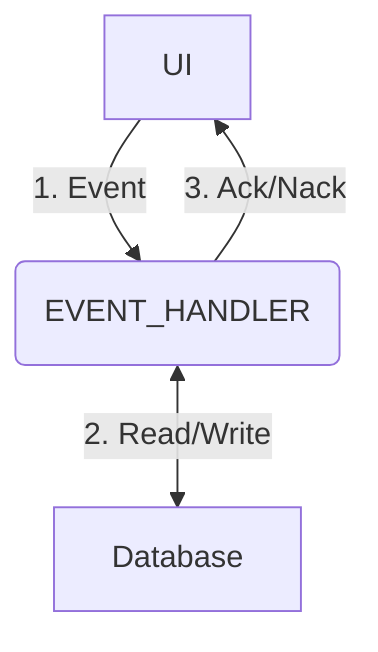

import Tabs from '@theme/Tabs';
import TabItem from '@theme/TabItem';
import Log from '/snippet/_LOG.md'
import CommonPermissions from '/snippet/_common-permissions.md'
import CommonProcesses from '/snippet/_common-see-processes.md'


## Overview

The Genesis application platform has a real-time event-driven architecture. The Event Handler is a microservice responsible for providing these events, which can apply business logic and affect the application's data set. Developers configure events, including optional and mandatory input fields, which client can trigger via APIs. 



Many of the tables in an app will need **Insert**, **Modify** and **Delete** events, so that you can specify the processing that these events require. You can create any events as needed by the application's business logic. For example, most applications built on the platform include typical **business entities** for the financial market, such as orders, trades, bids, allocations and positions. These business entities have a lifecycle where they go through various **states**. The transition from one state to another is an event that needs to be handled. The paths through those states are workflows, and to assist the workflows, we use [state machines](/develop/server-capabilities/workflow-state-machine/).

Genesis Event handlers are defined in the `*-eventhandler.kts` files.

All Event Handler events are available via REST automatically, including Open API conforming spec.

## Example configuration


```kotlin

eventHandler {

  // You can inject other kotlin or java libraries for use in event handlers
  val pricingLibrary = inject<PricingLibrary>()

  eventHandler<Counterparty>("COUNTERPARTY_INSERT", transactional = true) {
    permissioning {
      permissionCodes = listOf("CounterpartyUpdate")
    }
    onCommit { event ->
      val details = event.details
      val insertedRow = entityDb.insert(details)
      ack(listOf(mapOf(
        "COUNTERPARTY_ID" to insertedRow.record.counterpartyId,
      )))
    }
  }
  eventHandler<Counterparty>("COUNTERPARTY_MODIFY", transactional = true) {
    permissioning {
      permissionCodes = listOf("CounterpartyUpdate")
    }
    onCommit { event ->
      val details = event.details
      entityDb.modify(details)
      ack()
    }
  }
  eventHandler<Counterparty.ById>("COUNTERPARTY_DELETE", transactional = true) {
    permissioning {
      permissionCodes = listOf("CounterpartyUpdate")
    }
    onCommit { event ->
      val details = event.details
      entityDb.delete(details)
      ack()
    }
  }

  eventHandler<Trade>("TRADE_INSERT", transactional = true) {
    permissioning {
      permissionCodes = listOf("TradeInsert")
      //Check user has permission to trade the submitted counterparty
      auth(mapName = "ENTITY_VISIBILITY") {
        authKey {
          key(data.counterpartyId)
        }
      }
    }
    
    onValidate {
      //Where the eventHandler type is a DAO object, details map to a conforming trade dao object
      val trade = event.details

      //Verify related entities on this trade exist in the DB
      verify {
        entityDb hasEntry Instrument.ById(trade.instrumentId)
        entityDb hasEntry Counterparty.ById(trade.counterpartyId)
      }
      val price = trade.price
      //Validate the price is not negative
      require(price >= 0.0) { "Price cannot be negative" }
      
      //Warn if the price is far from market price utilizing pricing library function
      if(pricingLibrary.priceFarFromCurrentMarketPrice(trade.price, trade.direction)) {
        return@onValidate warningNack("Price out of bounds from market price")
      }
      
      ack()
    }

    onCommit { event ->
      val trade = event.details
      val result = entityDb.insert(trade)
      ack(listOf(mapOf(
        "TRADE_ID" to result.record.tradeId,
      )))
    }
  }
}
```

## Configuration options

It is important to understand the concepts of validation vs commit, and ack vs nack.

There are two main blocks to an eventHandler, [`onValidate`](#onvalidate) and [`onCommit`](#oncommit). The following images show the execution workflow where validate is set by the client to true vs false, and how nack (unsuccessful event) terminates the event unsuccessfully and can will stop further execution of the event:


### `ack`

An `ack` needs to be supplied at the end of any `onValidate` and `onCommit` blocks and signifies the event was successful.

```kotlin{4}
eventHandler<Trade>(name = "TRADE_INSERT") {
  onValidate { event ->
    ...
    ack()
  }
  onCommit { event ->
    ...
    ack()
  }
}
```

If `VALIDATE` was set to true on the inbound event message, and an `ack` is reached in the `onValidate` block, a `MESSAGE_TYPE` of `EVENT_ACK` will be returned to the client and the event will stop execution.

A `MESSAGE_TYPE` of `EVENT_ACK` will be returned to the client.

A successful event may also send data back to the client as part of an `ack`. A very common use case is to return the ID(s) of newly inserted records so that the client is aware and can handle appropriately (show the user where the client is a UI, else if the client is a system it may want to store the ID in it's own records.)

```kotlin{5}
  eventHandler<Trade>("TRADE_INSERT") {
    onCommit { event ->
      val trade = event.details
      val result = entityDb.insert(trade)
      ack(listOf(mapOf("TRADE_ID" to result.record.tradeId)))
    }
  }
}
``` 

### `nack`

A nack statement will signify an event failed, typically sent during `onValidate` and sometimes during `onEvent`. 

It can take a string argument, which is the error message passed back to the client. 

Where triggering within an `onValidate` block, we prefix with `return@onValidate` to terminate validation at this point. You may need to trigger a nack within an onCommit block, in which case we prefix with `return @onCommit`.

```kotlin{5}
eventHandler<Trade>(name = "TRADE_INSERT") {
  onValidate { event ->
    val price = event.details.price
    if (price < 0.0) {
      return@onValidate nack("Price cannot be negative")
    } 
    ...
  }
  onCommit { event ->
    val marketPrice = pricingLibrary.getCurrentBid(event.details.instrumentId)
    if (marketPrice == null) {
      return@onCommit nack("Unable to determine market price for instrument ${event.details.instrumentId}")
    } 
    ...
  }
}
```

A `nack` may also take an object of type [`Throwable`](https://docs.oracle.com/javase/6/docs/api/java/lang/Throwable.html), in which case the `message` of the Throwable will be sent back to the client.

Where a nack is triggered, `MESSAGE_TYPE` returned to the client is an `EVENT_NACK`

### `eventHandler`

`eventHandler` defines a new event. 

In the parenthesis you can define:

- `name` : the name of the event. `name` will automatically be prefixed with `EVENT_`. so `name = "TRADE_INSERT"` will be targeted by the client as `EVENT_TRADE_INSERT`. Where left unspecified the name will default to the eventHandler Type class name.
- `transactional` : takes a boolean. Set to `true` where you want your `eventHandler` to comply with [ACID](/develop/glossary/glossary/#acid). Any exception returned will result in a complete rollback of any database write's. While an exception will trigger a rollback, the transaction will commit if a `nack` or `ack` is returned. This setting also enables auto-auditing for writes to any [audited tables](/develop/server-capabilities/data-model/#audited-tables).

```kotlin
  eventHandler<Trade>(name = "TRADE_INSERT", transactional = true) {
    onCommit { event ->
      val trade = event.details
      entityDb.insert(trade)
      ack()
    }
  }
```

The "Type" (aka Generic) parameter is used to set the event metadata. This metadata defines the event inputs the client can send in, and a certain amount of pre-validation will be performed on any inbound event messages based on this metadata (unless [`schemaValidation`](#schemavalidation) is turned off).

You can use your table entity [DAO](/build-deploy-operate/build/bdo-build-overview/#dao) as the event meta, in this case the even will inherit the table's fields, their types and their nullability will determine whether the field is optional or mandatory.

```kotlin
eventHandler<Trade>(name = "TRADE_INSERT") {
  ...
  onCommit { event ->
    val trade = event.details
    entityDb.insert(trade)
    ack()
  }
}
```

Otherwise you can create a [kotlin `data class` to define your metadata](/develop/server-capabilities/communications-metadata/#input-messages) and use it.

You can also use an index for an event type, this is very common for DELETE events, where the client simply needs to send the ID of the record to delete:

```kotlin
eventHandler<Trade.ById>(name = "TRADE_DELETE") {
  ...
  onCommit { event ->
    val trade = event.details
    entityDb.delete(trade)
    ack()
  }
}
```

#### `schemaValidation`

`schemaValidation` takes a boolean, where set to false it disables JSON Schema validation enforced for type-safe messages for this event.

`schemaValidation` defaults to `true` when undefined.

```kotlin
  eventHandler<Trade>(name = "TRADE_INSERT", transactional = true) {
    schemaValidation = false
    ...
  }
```

#### `excludeMetadataFields`

`excludeMetadataFields` takes a set of field names which are defined as part of the event meta (e.g `Trade` in our example below), to exclude them from event metadata.

```kotlin
  eventHandler<Trade>(name = "TRADE_INSERT", transactional = true) {
    excludeMetadataFields = setOf("DATE")
    ...
  }
```

In this example `DATE` defined on `Trade` will not be part of the meta for this event.

By default `excludeMetadataFields` has 2 fields, `RECORD_ID` and `TIMESTAMP`, 2 fields which are part of every database object but will always be set by the database and thus client shouldn't send

:::warning
Typically when using a table entity as the eventHandler Type, you don't need to use `excludeMetadataFields`, but if you do be sure to keep the 2 default fields `RECORD_ID` and `TIMESTAMP` listed in your set except when you are using [optimistic concurrency](#optimistic-concurrency) mode, in which case the `TIMESTAMP` field is critical to **include** in the event meta, so do not define in this list.
:::

#### `overrideMetadataFields`

`overrideMetadataFields` is used to override the metadata field properties of the eventHandler type, this isn't to change the type of a field, more to override fields being optional and default values.

```kotlin
  eventHandler<Trade>(name = "TRADE_INSERT", transactional = true) {
    overrideMetadataFields = listOf(
      OverrideMetaField(name = "QUANTITY", optional = true, default = 1)
    )
  }
```

By default this is an empty set.

:::warning
Where setting mandatory fields to be optional, you must have a default supplied as part of the event Type meta.
:::

<CommonPermissions />

#### `requiresPendingApproval`

This is used where particular system events require a second system user to approve them before they take effect in the application. 

Per the example below, you can **optionally** set the approval message, this is the message that will be set on the approval record which an authorized approver will see during their review. 
The function must return boolean logic, where it evaluates to false the event will be subject to approval. 

```kotlin
  eventHandler<Trade>("TRADE_INSERT") {
    requiresPendingApproval { event ->
      event.approvalMessage = "Please approve my new trade"
      event.userName != "system.user"
    }
    ...
  }
```
In this example only a user with username "system.user" will be able to trigger this event without it first being approved.

Note the client may also send `APPROVAL_MESSAGE` and where specific, `approvalMessage` will take precedence over it.

See [approval workflow](#approval-workflow) for more details.

#### `onValidate`

The onValidate block is used for validation. The event handler workflow allows clients to set boolean flag `VALIDATE`, which where set to `true` will run the code in the `onValidate` block and return before executing the `onCommit` block, which will commit the action (e.g. write to database, or perhaps generate a file or some other permanent action). The entityDb handle used in this block is for read operations only because of this.

As well as returning an [`ack`](#ack) (success) or a [`nack`](#nack), the onValidate block allows users to send soft warnings back as part of the validation, warnings which the client can then ignore, for example if the client is a user interface.

`onValidate` is helpful for systems where you may want to add "fat-finger checks", a common term in financial applications which essentially means we're checking if the user may have made a mistake in their input, e.g. they have set a quantity or price that is unusually large or small, and could contain mistakes which lead to financial loss. Such "warnings" can be sent back to the client in a [`warningNack`](#warningnack).

`onValidate` blocks should always return an [`ack`](#ack) as the final statement.

`onValidate` blocks are optional and will automatically return an [`ack`](#ack) where not defined.

##### `verify`

Within the onvalidate block a `verify` block is helpful for common relational checks, for example that the referenced entities which are ID based exist in the database already. 

In this example we verify that the instrument and counterparty IDs that were supplied on the event exist in the database.

```kotlin{3-6}
  onValidate {
    ...
    verify {
      entityDb hasEntry Instrument.ById(event.details.instrumentId)
      entityDb hasEntry Counterparty.ById(event.details.counterpartyId)
    }
    ...
  }
```

If the boolean logic fails, a [nack](#nack) will be returned and validation of the event has failed.

TODO can't we override the text returned to client?

##### `require`

`require` is [a kotlin construct](https://kotlinlang.org/api/latest/jvm/stdlib/kotlin/require.html) often used in `onValidate` blocks as it will automatically return a [`nack`](#nack) with the given error message where the defined boolean logic statement fails.

In the example below, if a price is not "more than or equal to 0.0" the message "Price cannot be negative" will be returned.

```kotlin
  eventHandler<Trade>(name = "TRADE_INSERT") {
    onValidate { event ->
      val price = event.details.price
      require(price >= 0.0) { "Price cannot be negative" }
      ...
    }
    ...
  }
```

##### `warningNack`

A `warningNack` is only applicable to the `onValidate` block, and is used to warn the client, and these warnings are sometimes referred to as a "soft error". 

`warningNack`, like [`nack`](#nack), accepts a String parameter which is the message given back to the client. For example, `warningNack("Price differs more than 10% from the current market price.")`.

A `warningNack` may also take an object of type [`Throwable`](https://docs.oracle.com/javase/6/docs/api/java/lang/Throwable.html), in which case the `message` of the Throwable will be sent back to the client.

```kotlin
    onValidate {
      ...
      if(pricingLibrary.priceFarFromCurrentMarketPrice(trade.price, trade.direction)) {
        return@onValidate warningNack("Price out of bounds from market price")
      }
      ...
    }
```

Clients using the API are expected to set `IGNORE_WARNINGS` to `true` on the inbound message where they wish to ignore warnings. So for example if a warning is presented to a user they can be presented with an option to ignore, else edit and re-submit for validation. System clients may just set `IGNORE_WARNINGS` to `true` on all messages to ensure warnings don't stop system integration messages persisting, and stop them needing more complex logic to determine whether to ignore certain warnings.

##### `approvableAck`

An `approvableAck` should be returned in an onValidate block where [`requiresApproval`](#requiresapproval) has been set on the event. 

There are useful properties you can set as part of the `approvableAck` definition. They are all optional and are detailed below:

* `entityDetails` is a list of `ApprovalEntityDetails` with their corresponding `entityTable`, `entityId` and `approvalType` properties (see previous paragraph). By default, this list is empty.
* `approvalMessage` contains the text that is sent back to the client, assuming the event is successfully submitted for approval. The default is "Your request was successful and has been submitted for approval".
* `additionalDetails` can provide context information that is only available from a server-side perspective. This information complements the `APPROVAL_MESSAGE` content provided by the front end.
* `approvalType` is used to state the action that happens when this event is approved: NEW for insertions, UPDATE for amends, REMOVE for removals. If undefined, this defaults to UNKNOWN). Most events will be simple, but of course some could affect multiple entities in different ways, which is why the `entityDetails` parameter can contain many entities, each with their own `approvalType`.

```kotlin
  eventHandler<Trade>("TRADE_MODIFY") {
    requiresPendingApproval { event ->
      event.approvalMessage = "Potential cost to firm modifying trades which have already been reported." //Available to the user who is approving
      event.userName != "system.user"
    }
    onValidate { event ->
      val trade = event.details
      approvableAck(
        entityDetails = listOf(
          // One or many entities can be affected with a single event, so we can provide the whole list here
          ApprovalEntityDetails(
            entityTable = "TRADE",
            entityId = event.details.trade.toString(),
            approvalType = ApprovalType.UPDATE
          )
        ),
        approvalMessage = "Trade modification for ${event.details.tradeId} has been sent for approval.", //Sent to the user who submitted the event
        approvalType = ApprovalType.UPDATE,
        additionalDetails = "Potential cost to firm modifying trades which have already been reported." //Further message available to the user who is approving
      )
    }
    ...
  }
}
``` 

See [approval workflow](#approval-workflow) for more details.

#### `onCommit`

The `onCommit` block runs post successful validation in the `onValidate` block. The code here will typically affect the data in the system (for example writing to the database, generating a file, triggering some other event). This block may also perform further validations not possible in the previous block (e.g. relying on database updates in an event which writes multiple records). To reach the `onCommit` block, `VALIDATE` must have been set to `false`.

The `entityDb` handle in this block can be used to read and write.

As with `onValidate` the block must finish with an [`ack`](#ack). If the event is set as `transactional` and the `ack` is not reached, any database writes will be rolled back.

```kotlin
  eventHandler<Trade>("TRADE_INSERT") {
    onCommit { event ->
      val trade = event.details
      val result = entityDb.insert(trade)
      ack(listOf(mapOf("TRADE_ID" to result.record.tradeId)))
    }
  }
}
``` 

### `contextEventHandler`

`contextEventHandler` is similar to an eventHandler but is used where you want to pass context from the [`onValidate`](#onvalidate) block to the [`onCommit`](#oncommit) block, for example on a modification event if you first lookup the original entity record and want to pass to `onCommit` so that it doesn't need to be re-read from the database.

```kotlin
  contextEventHandler<Trade, Trade>(name = "TRADE_MODIFY") {
    onValidate { event ->
      val tradeDetails = event.details

      val originalTrade = entityDb.get(Trade.ById(event.details.tradeId))
      require(originalEmailDist != null) {
        "Unknown Trade ID received ${event.details.csdCode}"
      }
      ...
      validationAck(validationContext = originalTrade)
    }
    onCommit { event, trade ->
      ...
      entityDb.modify(trade)
      ack()
    }
  }
```

1. The definition takes 2 Type (aka Generic) parameters instead of 1. The first is the context object which will be passed to the `onCommit` block and the second is the same as a regular [`eventHandler`](#eventHandler), the event metadata.
1. The [`onValidate`](#onvalidate) block needs to return a [`validationAck`](#validationAck) instead of a regular [`ack`](#ack)
1. The [`onCommit`](#oncommit) block has 2 lambda parameters, the standard event + a second which is a reference to the context object returned in the `validationAck`

#### `validationAck`

The same concept as an `ack`[] but must return an object matching the type of the first Type parameter in the `contextEventHandler` definition.

```kotlin
  contextEventHandler<Trade, Trade>(name = "TRADE_MODIFY") {
    onValidate { event ->
      val originalTrade = entityDb.get(Trade.ById(event.details.tradeId))
      ...
      validationAck(validationContext = originalTrade)
    }
  }
```

### Logging

<Log />

## Optimistic concurrency

Find details around [how event handlers work with optimistic concurrency](/develop/server-capabilities/data-access-apis/#event-handler)

## Client API

:::tip
Event handlers are also accessible via [Open API](/develop/server-capabilities/integrations-open-api/)
:::

### `EVENT_<EVENT_HANDLER_NAME>`

To trigger an Event Handler, the client sends a `MESSAGE_TYPE` of `EVENT_<event name>` .

There are several options that can be optionally specified in the message header:

| Option              | Default | Description                                                          |
| --------------------|---------|----------------------------------------------------------------------|
| `VALIDATE`          | `false` | Where `true`, events will return after the [`onValidate`](#onvalidate) block ack and not trigger the [`onCommit`](#oncommit) block |
| `IGNORE_WARNINGS`   | `false` | Where `true`, any [`warningNack`](#warningnack) in the code will be ignored and not cause the event to fail validation |
| `REQUIRES_APPROVAL` | `false` | A client can force the [approval workflow](#approval-workflow) for the event by setting this to true | 
| `APPROVAL_MESSAGE`  | | Where [approval workflow](#approval-workflow) is triggered, this is the approval message the approver will see. This may be overridden in the event ['requiresPendingApproval`](#requiresPendingApproval) which takes precedence | 
| `REASON`            | | Where the event is set as `transactional` and the tables written by the event are enabled for [`audit`](/develop/server-capabilities/data-model/#audited-tables) this String will be set in the audit record's `AUDIT_EVENT_TEXT` | 

<Tabs defaultValue="websocket" values={[{ label: 'Websocket API', value: 'websocket', }, { label: 'REST API', value: 'rest', }]}>
<TabItem value="websocket">
Request
```
{
  "SOURCE_REF": "345",
  "SESSION_AUTH_TOKEN": "snsFDc7AdjG8Khl95uUdUBm5UO1uqIfq",
  "MESSAGE_TYPE": "EVENT_TRADE_INSERT",
  "DETAILS": {
    "COUNTERPARTY_ID": 1,
    "DATE": 1731542400000,
    "DIRECTION": "BUY",
    "INSTRUMENT_ID": 2,
    "QUANTITY": 1000,
    "TRADE_PRICE": 1.23
  }
}
```
Response
```
{
  "MESSAGE_TYPE": "EVENT_ACK",
  "SOURCE_REF": "345",
  "GENERATED": [
    {
      "TRADE_ID": 5
    }
  ],
  "METADATA": {
    "IS_EMPTY": true,
    "ALL": {}
  }
}
```
</TabItem>
<TabItem value="rest">
Request
```
POST /event-trade-insert HTTP/1.1
Host: localhost:9064
Content-Type: application/json
SESSION_AUTH_TOKEN: snsFDc7AdjG8Khl95uUdUBm5UO1uqIfq
SOURCE_REF: 345

{
  "DETAILS": {
    "COUNTERPARTY_ID": 1,
    "DATE": 1731542400000,
    "DIRECTION": "BUY",
    "INSTRUMENT_ID": 2,
    "QUANTITY": 1000,
    "TRADE_PRICE": 1.23
  }
}
```
Response
```
HTTP/1.1 200 OK
content-type: application/json
content-length: 556
connection: keep-alive
{
  "MESSAGE_TYPE": "EVENT_ACK",
  "SOURCE_REF": "345",
  "GENERATED": [
    {
      "TRADE_ID": 5
    }
  ],
  "METADATA": {
    "IS_EMPTY": true,
    "ALL": {}
  }
}
```
</TabItem>
</Tabs>


## Approval workflow

The Genesis application platform has an in-built pending approval mechanism that can be used with Event Handlers. This is useful where particular events require a second user to approve them in order to take effect. Genesis Pending Approvals works with the concepts of “delayed” events and "4-eyes check".

Event's are essentially queued, until a time they are approved, at which case they are re-triggered to take affect.

### Require approval on an event

To enable the pending approval workflow for an Event Handler implementation, either:

- Override the `requiresPendingApproval` method with an appropriate function in the custom Event Handler definitions.

or

- Configure the `requiresPendingApproval` block in a GPAL Event Handler.

Both of these options involve implementing a function with the event message as an input and a Boolean value as a return value.

Here is an example of a GPAL Event Handler definition where `event.userName` is used to gain access to the user who triggered the event; if the user name is not **system.user**, it is directed to an approval procedure:

```kotlin
eventHandler {
    eventHandler<Company>("COMPANY_INSERT") {
        // Override requiresPendingApproval here to enable the "pending approval" flow.
        // In this implementation, any user that is not "system.user" needs to go through the approval mechanism.
        // The last line just needs to evaluate to a boolean; if false it does not require approval, if true it does
        requiresPendingApproval { event ->
            event.userName != "system.user"
        }
        onCommit { event ->
            val company = event.details
            // custom code block..
            ack()
        }
    }
}
```

or in a custom Event Handler definition:

```kotlin
package global.genesis.position.samples.events.async

import global.genesis.commons.annotation.Module
import global.genesis.eventhandler.typed.async.AsyncContextValidatingEventHandler
import global.genesis.gen.dao.Company
import global.genesis.message.core.event.Event
import global.genesis.message.core.event.EventReply
import global.genesis.message.core.event.ValidationResult

@Module
class TestCompanyHandlerAsyncContext : AsyncContextValidatingEventHandler<Company, EventReply, String> {
  override suspend fun onValidate(message: Event<Company>): ValidationResult<EventReply, String> {
    val company = message.details
    // custom code block..
    val companyName = company.companyName
    return validationResult(ack(), companyName)
  }

  override suspend fun onCommit(message: Event<Company>, context: String?): EventReply {
    if(context != null){
      // Do something with the context
    }
    val company = message.details
    // custom code block..
    return ack()
  }
}
```

### Pending approval workflow

Events going through a pending approval workflow are validated as usual (i.e. the `onValidate` method is run).  If the validation is successful, the “delayed” event is stored in the `APPROVAL` table in JSON format.

Assuming the event is inserting, updating or deleting a target database record, it is possible to have multiple `APPROVAL` records associated with a single database entity. So, you should use the event `onValidate` method to check for pre-existing approvals against the entities related to the event if you need to ensure there is only one pending approval per record.

The `APPROVAL` record is keyed on an auto-generated `APPROVAL_ID` and does not have a direct link to the original record(s). You have to create one or many links by adding “approval entity” details to the payload returned within an `approvableAck` inside the `onValidate` method. These details include the `entityTable` (e.g COUNTERPARTY), `entityKey` (e.g. COUNTERPARTY_ID), as well as an optional `approvalType` to describe what operation is happening on the entity itself (e.g. NEW, UPDATE or REMOVE).

This approach enables you to decide how to identify the original record (e.g. creating a compound key in the case of multi-field keys). When the approval entity details are provided, the platform creates one or several records in the `APPROVAL_ENTITY` table; it populates it (them) with the details provided and the `APPROVAL_ID` of the `APPROVAL` record. There is also an `APPROVAL_ENTITY_COUNTER`, which is populated by the GENESIS_AUTH_CONSOLIDATOR process by default; this can be handy when you need to know how many approvals are pending for a given entity.

There are other useful properties you can set as part of the `approvableAck` definition. They are all optional and are detailed below:

* `entityDetails` is a list of `ApprovalEntityDetails` with their corresponding `entityTable`, `entityId` and `approvalType` properties (see previous paragraph). By default, this list is empty.
* `approvalMessage` contains the text that is sent back to the client, assuming the event is successfully submitted for approval. The default is "Your request was successful and has been submitted for approval".
* `additionalDetails` can provide context information that is only available from a server-side perspective. This information complements the `APPROVAL_MESSAGE` content provided by the front end.
* `approvalType` is used to state the action that happens when this event is approved: NEW for insertions, UPDATE for amends, REMOVE for removals. If undefined, this defaults to UNKNOWN). Most events will be simple, but of course some could affect multiple entities in different ways, which is why the `entityDetails` parameter can contain many entities, each with their own `approvalType`.

One further property, `approvableAck`, can be used in both custom EventHandler definitions and GPAL Event Handlers. Here is an example of `approvableAck` in action for a GPAL Event Handler `onValidate` block below.

```kotlin
eventHandler {
  eventHandler<Company>("COMPANY_AMEND") {
    // Override requiresPendingApproval here to enable the "pending approval" flow.
    // In this implementation, any user that is not "system.user" needs to go through requires going through the approval mechanism.
    // The last line just needs to evaluate to a boolean; if false it does not require approval, if true it does
    requiresPendingApproval { event ->
      event.userName != "system.user"
    }
    onValidate { event ->
      val company = event.details
      // custom validation code block..
      return approvableAck(
        entityDetails = listOf(
          // One or many entities can be affected with a single event, so we can provide the whole list here
          ApprovalEntityDetails(
            entityTable = "COMPANY",
            entityId = event.details.companyId.toString(),
            approvalType = ApprovalType.UPDATE
          )
        ),
        approvalMessage = "Company update for ${event.details.companyId} has been sent for approval.",
        approvalType = ApprovalType.UPDATE,
        additionalDetails = "Sensitive update, tread carefully"
      )
    }
    onCommit { event ->
      val company = event.details
      // custom code block..
      ack()
    }
  }
}
```

The platform provides two Data Server queries that contain Pending approval information: `ALL_APPROVAL_ALERTS` and `ALL_APPROVAL_ALERTS_AUDITS`


**Example APPROVAL DB record**

```
-------------------------------------------------------------------------------------------
TIMESTAMP                                2023-02-27 15:33:42.364(n:0,s:1019)      NANO_TIMESTAMP
ACTIONED_BY                              JaneDee                                  STRING
APPROVAL_ID                              fdef7802-6bd1-4c51-a232-6a4bc2325598A... STRING
APPROVAL_KEY                             fac1be9f-1653-4ecf-9050-d13cc2d2cdb4A... STRING
APPROVAL_MESSAGE                         Cancelled                                STRING
APPROVAL_REQUESTED_AT                    2023-02-27 15:33:38.450 +0000            DATETIME
APPROVAL_STATUS                          CANCELLED                                ENUM[PENDING APPROVED CANCELLED REJECTED_BY_USER REJECTED_BY_SERVICE]
APPROVAL_TYPE                            REMOVE                                   ENUM[NEW UPDATE REMOVE UNKNOWN]
DESTINATION                              COUNTERPARTY_EVENT_HANDLER               STRING
EVENT_DETAILS                            ISSUER_ID = 3                            STRING
EVENT_MESSAGE                            {"DETAILS":{"COUNTERPARTY_ID":3},"MES... STRING
MESSAGE_TYPE                             EVENT_COUNTERPARTY_DELETE                STRING
USER_NAME                                JaneDee                                  STRING
-------------------------------------------------------------------------------------------
```

**Example APPROVAL_ENTITY record**

```
-------------------------------------------------------------------------------------------
TIMESTAMP                                2023-02-27 15:33:38.459(n:0,s:1004)      NANO_TIMESTAMP
APPROVAL_ID                              fdef7802-6bd1-4c51-a232-6a4bc2325598A... STRING
APPROVAL_TYPE                            REMOVE                                   ENUM[NEW UPDATE REMOVE UNKNOWN]
ENTITY_ID                                3                                        STRING
ENTITY_TABLE                             COUNTERPARTY                             STRING
-------------------------------------------------------------------------------------------
```

### Pending approval events

Once in the `APPROVAL` table, the pending event can be cancelled, rejected or accepted by sending the following event messages to GENESIS_CLUSTER:

- EVENT_PENDING_APPROVAL_ACCEPT
- EVENT_PENDING_APPROVAL_CANCEL
- EVENT_PENDING_APPROVAL_REJECT

All messages require a valid `APPROVAL_ID` and `APPROVAL_MESSAGE` in their metadata.

### Allowed approvers

The platform ensures that users cannot approve or reject their own events, but they can cancel them. To complement this, users that have not created a specific pending approval event can only accept or reject, not cancel.

Additional levels of control (e.g. based on user groups) can be added at three points:

- to the front end
- to the event `onValidate` method
- specified in the server-side configuration

To configure the allowed approvers using server-side configuration:

1. Create a new GPAL approval file; its name must end in **-approval.kts** (e.g. **_test_-approval.kts**).

2. Add the file name to the GENESIS_CLUSTER `<script></script>` element in the site-specific version of the **genesis-processes.xml**. See the sample file below:

```kotlin
import global.genesis.session.RightSummaryCache

val rightSummaryCache = inject<RightSummaryCache>()

pendingApproval {
    insert {
        true
    }

    accept {
      val userAttributes = entityDb.get(UserAttributes.byName(userName))
      userAttributes?.accessType == AccessType.INTERNAL
    }

    cancel {
        true
    }

    reject {
      rightSummaryCache.userHasRight(userName, "REJECT_PENDING_APPROVAL")
    }
}
```

You can replace the "true" return values with Kotlin code in each of the relevant blocks, or not define them at all, as they will return "true" by default.

The platform makes the following objects accessible to the `insert` block:

* `insertMessage` - an instance of the `PendingApprovalInsert` class, which is used to populate the `APPROVAL` table if successful. The content of this class consists of several properties:
    * `approvalMessage` - contains the original approval message text sent by the user who initiated the action.
    * `messageType` - represents the original EVENT name (e.g. EVENT_TRADE_INSERT).
    * `destination` - is the process name this event was originally targeting (e.g. POSITION_EVENT_HANDLER).
    * `eventMessage` - contains the JSON object representing the original message payload.
    * `approvalType` - equivalent to the property with the same name provided as part of `approvableAck` (see [earlier section](#pending-approvals)).
    * `additionalDetails` - equivalent to the property with the same name provided as part of `approvableAck` (see [earlier section](#pending-approvals)).
    * `generated` - equivalent to the property named `entityDetails` provided as part of `approvableAck` (see [earlier section](#pending-approvals)).
* `userName` - a string property containing the user name who triggered the event.
* `messageType` - a shortcut property accessor for the `messageType` value stored inside `insertMessage`.
* `eventMessage` - a shortcut property accessor for the `eventMessage` value stored inside `insertMessage`.

The following objects are accessible within the `accept`, `cancel` and `reject` blocks:

* `userName` - a string property containing the user name who triggered the pending approval event (e.g. accept, reject or cancel).
* `pendingApproval` - the pending approval record stored in the database. The type of this property is the "Approval" database entity (see [table entities](/develop/server-capabilities/data-access-apis/#table-entities)).
* `approvalMessage` - an instance of the `ApprovalMessage` class, which represents the payload of the message sent to EVENT_PENDING_APPROVAL_ACCEPT, EVENT_PENDING_APPROVAL_CANCEL and EVENT_PENDING_APPROVAL_REJECT. It contains two properties:
    * `approvalMessage` - the message text sent by the user who initiated this pending approval action
    * `approvalId` - contains the APPROVAL_ID used to identify the APPROVAL record we are handling as part of this action
* `messageType` - a shortcut property accessor for the `messageType` value stored inside `pendingApproval`.
* `eventMessage` - a shortcut property accessor for the `eventMessage` value stored inside `pendingApproval`.

The following properties are automatically available for the whole scope of the **-approval.kts** file:

```kotlin
val systemDefinition: SystemDefinitionService
val rxDb: RxDb
val entityDb: AsyncEntityDb
val evaluatorPool: EvaluatorPool
val networkConfiguration: NetworkConfiguration
val serviceDetailProvider: ServiceDetailProvider
val serviceDiscovery: ServiceDiscovery
val injector: Injector
```

As shown in the previous code example, you can perform database lookups to retrieve additional information and return `true` only if the necessary rights or attributes are in place. For example, if your system has the concept of internal and external users, and you only want to allow internal users to accept pending events, then you could check your custom user "ACCESS_TYPE" field as follows:

```kotlin
pendingApproval {
    accept {
        val userAttributes = entityDb.get(UserAttributes.byName(userName))
        userAttributes?.accessType == AccessType.INTERNAL
    }
}
```

###### Advanced allowed approvers

You might have noticed that the original type-safe event message types are lost inside the **-approval.kts** file, as the content of `eventMessage` inside `APPROVAL` table (and also inside `PendingApprovalInsert`) is a serialized JSON string. You can deserialize the original type-safe objects using the `selectPredicate` method combined with multiple `onEvent` predicates. These methods are available in all the `pendingApproval` code blocks: `insert`, `accept`, `cancel` and `reject`.

- `selectPredicate` is a function that accepts an indeterminate number of functions returning a boolean value, as well as a mandatory `default` function to handle messages that do not fall into any defined category. The `default` function  provides a [GenesisSet](/develop/server-capabilities/communications-metadata/#genesisset) object with the contents of the original message payload.
- `onEvent` works very similarly to any other GPAL [Event Handler definition](#defining-an-event-handler-in-gpal). It enables you to treat the incoming message in the same way as you would have done within the original Event Handler; however, each function must return a boolean expression.


Please see the example below for custom logic using a table called "RESTRICTED_SYMBOL" to prevent restricted symbols from being added to the system, as well as checking user right codes:

```kotlin
import global.genesis.session.RightSummaryCache

val rightSummaryCache = inject<RightSummaryCache>()

pendingApproval {
  accept {
    selectPredicate(
      onEvent<TradeInsert>("TRADE_INSERT") { event ->
        val tradeInsert = event.details
        val stockInRestrictedList = entityDb.get(RestrictedSymbol.bySymbol(tradeInsert.symbol))
        // Deny any operation on restricted symbols.
        if (stockInRestrictedList != null) {
          false
        } else {
          rightSummaryCache.userHasRight(userName, "TRADE_INSERT")
        }
      },
      onEvent<TradeAmend>("TRADE_AMEND") { event ->
        val tradeAmend = event.details
        val stockInRestrictedList = entityDb.get(RestrictedSymbol.bySymbol(tradeAmend.symbol))
        // Deny any operation on restricted symbols.
        if (stockInRestrictedList != null) {
          false
        } else {
          rightSummaryCache.userHasRight(userName, "TRADE_AMEND")
        }
      },
      onEvent<TradeDelete>("TRADE_DELETE") { event ->
        val tradeDelete = event.details
        val stockInRestrictedList = entityDb.get(RestrictedSymbol.bySymbol(tradeDelete.symbol))
        // Deny any operation on restricted symbols.
        if (stockInRestrictedList != null) {
          false
        } else {
          rightSummaryCache.userHasRight(userName, "TRADE_DELETE")
        }
      },
      // If the message can't be deserialized we will use a default fallback to genesisSet.
      default = { genesisSet ->
        true
      }
    )
  }
}
```
### System rejects

An approval process deliberately delays events. So it is possible that by the time a pending approval action is approved, the underlying data has changed enough to cause the delayed event to fail when executed. When this happens, the pending approval record will be marked as REJECTED_BY_SYSTEM in its `APPROVAL_STATUS` field.

The platform provides an event designed to help you to reject events directly from the back end without human intervention. "EVENT_PENDING_APPROVAL_SYSTEM_REJECT" is an event that can be used to satisfy any specific requirements that fall outside the functionality of the pending approval system. The event is only accessible by back-end services. It takes two parameters:

- `approvalMessage` is the text of the message to be sent when the message is rejected.
- `approvalKey` is a unique identifier for each pending approval record. This identifier is never exposed to the front end, so only back-end services have access to it. That makes it impossible to trigger this event unless you have access to the database system. You need to obtain the `approvalKey` programmatically so that you can supply it as a parameter value.

Let us look at an example. Consider a solution that needs to submit trades to an external system every day at midnight for confirmation purposes. Once the trades have been submitted, their content cannot be changed anymore, unless a separate amendment process is started outside the Genesis application. The system has a pending approval system that enables users to amend the content of each "Trade" database record to provide extra security.

Once a "Trade" record has been submitted at midnight, you need to prevent any pending approval events from amending the content of the trade records in the system, as this could cause inconsistencies between the external system and the Genesis system. To prevent this, you could run a job that automatically rejects all pending approval records at midnight every day.

Here is an example GPAL script that could be run every day at midnight to reject all the pending records.

```kotlin
import global.genesis.clustersupport.service.ServiceDiscovery
import global.genesis.message.core.event.ApprovalSystemRejectMessage
import global.genesis.message.core.event.Event
import global.genesis.pal.shared.inject
import kotlin.system.exitProcess

val serviceDiscovery: ServiceDiscovery = injector.inject()
val client = serviceDiscovery.resolveClientByResource("EVENT_PENDING_APPROVAL_SYSTEM_REJECT")
if (client == null || !client.isConnected) {
    println("Unable to find service exposing EVENT_PENDING_APPROVAL_SYSTEM_REJECT")
    exitProcess(1)
} else {
    suspendable {
        entityDb.getBulk<Approval>()
            .filter { it.approvalStatus == ApprovalStatus.PENDING }
            .collect { approval ->
                val reply: EventReply? = client.suspendRequest(
                    Event(
                        messageType = "EVENT_PENDING_APPROVAL_SYSTEM_REJECT",
                        userName = "SYSTEM",
                        details = ApprovalSystemRejectMessage(
                            approvalKey = approval.approvalKey,
                            approvalMessage = "Rejected by system"
                        )
                    )
                )
                when (reply) {
                    is EventReply.EventAck ->
                        println("Successfully rejected APPROVAL_ID: ${approval.approvalId}")
                    is EventReply.EventNack ->
                        println("Failed to rejected APPROVAL_ID: ${approval.approvalId}: $reply")
                    else ->
                        println("Unexpected response from pending approval system: $reply")
                }
            }
    }
}
```


## Metrics

:::info
Ensure you have [enabled metrics](/build-deploy-operate/operate/metrics/#enabling-metrics) in your environment to view them.
:::

The event handler latency metrics show how long it takes for a specific `eventHandler` in the Event Handler to process a message.

| Metric             | Explanation                                                  |
|:-------------------|:-------------------------------------------------------------|
| processing_latency | The latency for processing events (kts event handler)        |
| latency            | The latency for processing events (kotlin/java event handler |

## Runtime configuration

To include your `*-eventhandler.kts` file definitions in a runtime process, you will need to ensure the process definition:

1. Ensure `genesis-pal-eventhandler` is included in `module`
1. Ensure `global.genesis.eventhandler.pal` is included in `package`
1. Ensure your eventhandler.kts file(s) are defined in `script`
1. Ensure `pal` is set in `language`

If you wish to run a dedicated process for a request server, the following gives an example full process definition:

```xml
  <process name="POSITION_EVENT_HANDLER">
    <groupId>POSITION</groupId>
    <start>true</start>
    <options>-Xmx256m -DRedirectStreamsToLog=true -DXSD_VALIDATE=false</options>
    <module>genesis-pal-eventhandler</module>
    <package>global.genesis.eventhandler.pal</package>
    <script>position-eventhandler.kts</script>
    <description>Handles events</description>
    <classpath>position-messages*,position-eventhandler*</classpath>
    <language>pal</language>
  </process>
```

<CommonProcesses/>

## Testing

:::info

**GenesisJunit** is only available from version 8 of the Genesis Server Framework (GSF).

If you are testing against a previous version of the framework, go to the [legacy](/develop/server-capabilities/testing/#integration-testing) section.

:::

### Integration testing

This section covers the basics of testing Event Handlers. We shall use a very simple example, and work through the communication between our test and the Event Handler. 

This includes how to test dynamic authorization. 

This testing relies on [**GenesisJunit**](/develop/server-capabilities/testing/#integration-testing), which is designed to make testing easy.

In this example, we shall test the following Event Handler: 

```kotlin
data class Hello(
    val name: String,
)

eventHandler {
    eventHandler<Hello>("HELLO_WORLD") {
        onCommit {
            ack()
        }
    }
}
```

#### Creating the test class

First, use the code below to create the test class:

<Tabs defaultValue="kotlin" values={[{ label: 'Kotlin', value: 'kotlin', }, { label: 'Java', value: 'java', }]}>
<TabItem value="kotlin">

```kotlin
@ExtendWith(GenesisJunit::class)
@ScriptFile("hello-world-eventhandler.kts")
class EventHandlerTest {

    // our tests go here ...
}
```

</TabItem>
<TabItem value="java">

```java
@ExtendWith(GenesisJunit.class)
@ScriptFile("hello-world-eventhandler.kts")
public class EventHandlerTest {

    // our tests go here ...
}
```
</TabItem>
</Tabs>

The code above does two things: 

* It enables **GenesisJunit**.
* It specifies the Event Handler script that we want to test, using the `ScriptFile` annotation.

There is more information about `GenesisJunit` and the various annotations in the section on [Integration testing](/develop/server-capabilities/testing/#integration-testing).

#### Injecting an Event Handler client
Use the code below to inject an Event Handler client:

<Tabs defaultValue="kotlin" values={[{ label: 'Kotlin', value: 'kotlin', }, { label: 'Java', value: 'java', }]}>
<TabItem value="kotlin">

```kotlin
@ExtendWith(GenesisJunit::class)
@ScriptFile("hello-world-eventhandler.kts")
class EventHandlerTest {

    @Inject
    lateinit var client: EventClientSync

    // our test will go here ...
}
```

</TabItem>
<TabItem value="java">

```java
@ExtendWith(GenesisJunit.class)
@ScriptFile("hello-world-eventhandler.kts")
public class EventHandlerTest {

    @Inject
    private EventClientSync client = null;

    // our test will go here ...
}
```
</TabItem>
</Tabs>

#### A first test

This test makes sure that the Event Handler returns an ack.

<Tabs defaultValue="kotlin" values={[{ label: 'Kotlin', value: 'kotlin', }, { label: 'Java', value: 'java', }]}>
<TabItem value="kotlin">

```kotlin
@Test
fun testHelloWorld() {
    val reply = client.sendEvent(
        details = Hello("PETER"),
        messageType = "EVENT_HELLO_WORLD"
    )
    
    assert(reply is EventReply.EventAck) 
}
```

</TabItem>
<TabItem value="java">

```java
@Test
void testHelloWorld() {
    var reply = client.builder()
            .withDetails(new Hello("PETER"))
            .withMessageType("EVENT_HELLO_WORLD")
            .send();

    assertInstanceOf(EventReply.EventAck.class, reply);
}
```
</TabItem>
</Tabs>

As you can see here, to send an event to our event handler, we need to provide the details class. 
The message type is optional, but we have to set it here, as we set a custom message name on our Event Handler.

We can also provide the user name:

<Tabs defaultValue="kotlin" values={[{ label: 'Kotlin', value: 'kotlin', }, { label: 'Java', value: 'java', }]}>
<TabItem value="kotlin">

```kotlin
@Test
fun testHelloWorldWithUser() {
    val reply = client.sendEvent(
        details = Hello("PETER"),
        messageType = "EVENT_HELLO_WORLD",
        userName = "PETER"
    )

    assert(reply is EventReply.EventAck)
}
```

</TabItem>
<TabItem value="java">

```java
@Test
void testHelloWorldWithUser() {
    var reply = client.builder()
            .withDetails(new Hello("PETER"))
            .withMessageType("EVENT_HELLO_WORLD")
            .withUserName("PETER")
            .send();

    assertInstanceOf(EventReply.EventAck.class, reply);
}
```
</TabItem>
</Tabs>

#### Different clients

There are three versions of the Event Handler client available during testing:

* EventClientSync - this is the synchronous client, all calls are blocking
* EventClientAsync - this is the coroutine client, where calls suspend
* EventClientRx - this is the RxJava client, which wraps responses in a `Single`

In most instances, **EventClientSync** will suffice. 
Use the other clients if your tests use other asynchronous operations.

#### Dynamic authorization

To test dynamic authorization, add the `@EnableInMemoryTestAuthCache` to your class or method. 
This makes `InMemoryTestAuthCache` available for injection into your test class. 

Amend the Event Handler to enable authorization:

```kotlin 
data class Hello(
    val name: String,
)

eventHandler {
    eventHandler<Hello>("HELLO_WORLD_AUTH") {

        permissioning {
            auth("NAMES") {
                authKey {
                    key(data.name)
                }
            }
        }

        onCommit {
            ack()
        }
    }
}
```

The first thing we need to do, is to enable the in-memory test auth cache using the `@EnableInMemoryTestAuthCache` annotation.

We also need to inject `InMemoryTestAuthCache` into our test class. 

<Tabs defaultValue="kotlin" values={[{ label: 'Kotlin', value: 'kotlin', }, { label: 'Java', value: 'java', }]}>
<TabItem value="kotlin">

```kotlin
@ExtendWith(GenesisJunit::class)
@ScriptFile("hello-world-eventhandler.kts")
class EventHandlerTest {

    @Inject
    lateinit var client: EventClientSync
    
    @Inject
    lateinit var authCache: InMemoryTestAuthCache

    @Test
    fun testIsAuthorised() {
        authCache.authorise(
            authMap = "NAMES",
            entityCode = "PETER",
            userName = "PETER"
        )

        val reply = client.sendEvent(
            details = Hello(name = "PETER"),
            userName = "PETER",
            messageType = "EVENT_HELLO_WORLD_AUTH"
        )

        assert(reply is EventReply.EventAck) { reply }
    }

    @Test
    fun testIsNotAuthorised() {
        authCache.revoke(
            authMap = "NAMES",
            entityCode = "PETER",
            userName = "PETER"
        )

        val reply = client.sendEvent(
            details = Hello(name = "PETER"),
            userName = "PETER",
            messageType = "EVENT_HELLO_WORLD_AUTH"
        )

        assert(reply is EventReply.EventNack)
    }
}
```

</TabItem>
<TabItem value="java">

```java
@ExtendWith(GenesisJunit.class)
@ScriptFile("hello-world-eventhandler.kts")
public class EventHandlerJavaTest {

    @Inject
    private EventClientSync client = null;

    @Inject
    private InMemoryTestAuthCache authCache = null;

    @Test
    void testIsAuthorised() {
        authCache.builder()
                .withAuthMap("NAMES")
                .withEntityCode("PETER")
                .withUserName("PETER")
                .authorise();
        
        var reply = client.builder()
                .withDetails(new Hello("PETER"))
                .withMessageType("EVENT_HELLO_WORLD_AUTH")
                .withUserName("PETER")
                .send();

        assertInstanceOf(EventReply.EventAck.class, reply);
    }

    @Test
    void testIsNotAuthorised() {
        authCache.builder()
            .withAuthMap("NAMES")
            .withEntityCode("PETER")
            .withUserName("PETER")
            .revoke();

        var reply = client.builder()
                .withDetails(new Hello("PETER"))
                .withMessageType("EVENT_HELLO_WORLD_AUTH")
                .withUserName("PETER")
                .send();

        assertInstanceOf(EventReply.EventNack.class, reply);
    }
}
```
</TabItem>
</Tabs>

The revoke calls are not needed in this case; they have been included here to show the syntax. 
These calls can be used to revoke previous authorizations in your tests.

#### Conclusion

At this point we have tested a very simple Event Handler. We haven't even had to use the database!
However, we have covered the basics of communication between tests and Event Handlers.

We have covered: 
* sending details to our event
* overwriting the default message type
* setting the user on the event
* handling dynamic authorization

For more details about testing with Genesis, take a look at our [integration test documentation](/develop/server-capabilities/testing/#integration-testing).


### Integration testing (legacy)

:::info
This section covers testing your Event Handler if you are using any version of the Genesis Server Framework before GSF v8.
:::

The Genesis Platform provides the `AbstractGenesisTestSupport` abstract class that enables end-to-end testing of specific areas of your application. In this case, we want to ensure that we have a database, seeded with information, and that our Event Handler configuration is used to create our Event Handler. We also need to add the required packages, genesis home and separately set the "IS_SCRIPT" System Definition property to true (This is required as part of the Event Handler initialization).

```kotlin
class EventHandlerTest : AbstractGenesisTestSupport<GenesisSet>(
    GenesisTestConfig {
        addPackageName("global.genesis.eventhandler.pal")
        genesisHome = "<genesis-home>"
        parser = { it }
        scriptFileName = "<app-name>-eventhandler.kts"
        initialDataFile = "seed-data.csv"
    }
) {
    override fun systemDefinition(): Map<String, Any> = mapOf("IS_SCRIPT" to "true")
}
```

For more information about `AbstractGenesisTestSupport`, see the [Testing pages](/develop/server-capabilities/testing/#abstractgenesistestsupport).

Once you have added your config above, you can start writing tests against our Event Handler.

###### Writing tests

Let's write some tests for this simple Event Handler, defined below

```kotlin
    eventHandler<Trade>(name = "TRADE_INSERT") {
        onCommit { event ->
            val trade = event.details
            val result = entityDb.insert(trade)
            ack(listOf(mapOf("TRADE_ID" to result.record.tradeId)))
        }
    }
```

###### Simple test

Below is an example of a simple test.

```kotlin
    @Test
    fun `test insert trade`(): Unit = runBlocking {
        val message = Event(
            details = Trade {
              tradeId = "1"
              counterpartyId = "CP1"
              instrumentId = "I2"
              side = "BUY"
              price = 1.123
              quantity = 1000
            },
            messageType = "EVENT_TRADE_INSERT"
        )

        val result: EventReply? = messageClient.suspendRequest(message)
        result.assertedCast<EventReply.EventAck>()

        val trade = entityDb.get(Trade.ById("1"))
        assertNotNull(trade)
    }
```

First, create your `Event` object, setting the event details and specifying the intended Event Handler for the message "EVENT_TRADE_INSERT".

We then send a message to our Event Handler using `messageClient.suspendRequest(message)`. The result is first verified to be an `EventAck`. Then  check that the inserted trade can be retrieved from the database.

Remember to add the `runBlocking` coroutine scope to the test, as the Genesis platform uses Kotlin coroutines.

###### Error response test

You may also want to test a negative case, where you expect to receive an error as a response.

You need to modify the previous example Event Handler and add an `onValidate` block:

```kotlin
eventHandler<Trade>(name = "TRADE_INSERT") {
    onCommit { event ->
        val trade = event.details
        val result = entityDb.insert(trade)
        ack(listOf(mapOf("TRADE_ID" to result.record.tradeId)))
    }
    onValidate { event ->
        val message = event.details
        verify {
            entityDb hasEntry Counterparty.ById(message.counterpartyId)
            entityDb hasEntry Instrument.ById(message.instrumentId)
        }
        ack()
    }
}
```
In the example below, we expect the response to be of type `EventNack`, which has a property `error` containing a list of errors.

```kotlin
    @Test
    fun `test invalid instrument`(): Unit = runBlocking {
        val message = Event(
            details = Trade {
                tradeId = "1"
                counterpartyId = "CP1"
                instrumentId = "DOESNOTEXIST"
                side = "BUY"
                price = 1.213
                quantity = 100
            },
            messageType = "EVENT_TRADE_INSERT"
        )

        val result: EventReply? = messageClient.suspendRequest(message)
        val eventNack: EventReply.EventNack = result.assertedCast()

        assertThat(eventNack.error).containsExactly(
            StandardError(
                "INTERNAL_ERROR",
                "INSTRUMENT ById(instrumentId=DOESNOTEXIST) not found in database"
            )
        )
    }
```

###### Testing with authorization

To test that the Event Handler authorization works correctly, you need to do some setting up.

First, make sure that your authorization set-up is designed to behave as follows:
- A user who enters a trade must have an entry in the "ENTITY_VISIBILITY" auth map; the entity code for this user must match the `counterpartyId` of the trade.
- The user must have an entry in the "RIGHT_SUMMARY" table with "RIGHT_CODE" as "TRADER".

Second, you need to modify the previous example Event Handler so that only authorized users can insert trades.

```kotlin
eventHandler<Trade>(name = "TRADE_INSERT") {
    permissioning {
        permissionCodes = listOf("TRADER")
        auth(mapName = "ENTITY_VISIBILITY") {
            authKey {
                key(data.counterpartyId)
            }
        }
    }
    onValidate { event ->
        val message = event.details
        verify {
            entityDb hasEntry Counterparty.ById(message.counterpartyId)
            entityDb hasEntry Instrument.ById(message.instrumentId)
        }
        ack()
    }
    onCommit { event ->
        val trade = event.details
        val result = entityDb.insert(trade)
        ack(listOf(mapOf("TRADE_ID" to result.record.tradeId)))
    }
}
```

Third, you need to specify the auth cache override in the `GenesisTestConfig`:

```kotlin
class EventHandlerTest : AbstractGenesisTestSupport<GenesisSet>(
    GenesisTestConfig {
        addPackageName("global.genesis.eventhandler.pal")
        genesisHome = "/GenesisHome/"
        parser = { it }
        scriptFileName = "your-application-eventhandler.kts"
        initialDataFile = "seed-data.csv"
        addAuthCacheOverride("ENTITY_VISIBILITY")
    }
) {
...
}
```

Fourth, in your test set-up, let's authorize one user to be able to insert trades and another who is not.

```kotlin
    @Before
    fun setUp() {
        authorise("ENTITY_VISIBILITY", "CP1", "TraderUser")

        val trader = DbRecord.dbRecord("RIGHT_SUMMARY") {
            "USER_NAME" with "TraderUser"
            "RIGHT_CODE" with "TRADER"
        }
        val support = DbRecord.dbRecord("RIGHT_SUMMARY") {
            "USER_NAME" with "SupportUser"
            "RIGHT_CODE" with "SUPPORT"
        }
        rxDb.insert(trader).blockingGet()
        rxDb.insert(support).blockingGet()
    }
```

For more information on authorization, see the [authorization docs](/develop/server-capabilities/access-control/authorization/).

Below is a test that verifies only Traders can enter trades:

```kotlin
    @Test
    fun `test trade inserted by trader`(): Unit = runBlocking {
        val message = Event(
            details = Trade {
                tradeId = "1"
                counterpartyId = "CP1"
                instrumentId = "I2"
                side = "BUY"
                price = 5.0
                quantity = 1
            },
            messageType = "EVENT_TRADE_INSERT",
            userName = "TraderUser"
        )

        val result: EventReply? = messageClient.suspendRequest(message)
        result.assertedCast<EventReply.EventAck>()

        val trade = entityDb.get(Trade.ById("1"))
        assertNotNull(trade)
    }
```

Following that, we have a test to verify that a trade cannot be entered if the user is _not_ a Trader:

```kotlin
    @Test
    fun `test trade cannot be inserted if not trader`(): Unit = runBlocking {
        val message = Event(
                details = Trade {
                tradeId = "1"
                counterpartyId = "CP1"
                instrumentId = "I2"
                side = "BUY"
                price = 5.0
                quantity = 1
            },
            messageType = "EVENT_TRADE_INSERT",
            userName = "SupportUser"
        )

        val result: EventReply? = messageClient.suspendRequest(message)
        val eventNack = result.assertedCast<EventReply.EventNack>()

        assertThat(eventNack.error).containsExactly(
            StandardError(
                "NOT_AUTHORISED",
                "User SupportUser lacks sufficient permissions"
            )
        )
    }
```

### Manual testing

An API client, such as [Postman](https://www.postman.com/) or [Insomnia](https://insomnia.rest/product/automated-testing) is useful way of testing components. As a client, it is effectively a front end seeking information from the server.

The API client enables you to create calls to the resources in your server - Data Servers, Request Servers and Event Handlers. Then you can just click to run a call and see what response you get.

Before you can make any calls on these resources, you will have to permission yourself by obtaining a SESSION_AUTH_TOKEN. The details of how to do this are on our separate [Testing](/develop/server-capabilities/testing/#using-an-api-client) page.

Once you have the SESSION_AUTH_TOKEN, keep a copy that you can paste into each request as you make your test call.

In the example below, we are using Insomnia as the client API. We are going to test the EVENT_COUNTERPARTY_INSERT Event Handler by adding a new counterparty.

###### url and Body
In front of the url, set the call to **POST**.

The url consists of:

- the address or hostname of the server
- if necessary, some extra routing; in this case **sm** uses a proxy to access the server
- the name of the Event Handler


Set the body to **JSON**. In the body, you need to insert the details of the fields for the new counterparty, as seen below:


###### Header
In the header, you need to supply:

- a SOURCE_REF (always), which identifies you; you can use any string value that suits you
- the SESSION_AUTH_TOKEN that permissions you to access the server

When you have all these elements in place, click on **Send** to make the call. If the event is a success, you will receive an **ACK** message.


###### Checking the insertion
Now you can check that the new counterparty you inserted is in the correct table of the database. The resource you need to check is the Request Server called ALL_COUNTERPARTYS.

In front of the url, set the call to **POST**.

The url consists of:

- the address or hostname of the server
- if necessary, some extra routing; in this case **sm** uses a proxy to access the server
- the name of the Request Server

Set the body to **JSON**. There is no need for any information in the body. Simply insert a pair of curly brackets **{}**. 


In the header, you need to supply:

- a SOURCE_REF (always), which identifies you; you can use any string value that suits you
- the SESSION_AUTH_TOKEN that permissions you to access the server

When you have this in place, click on **Send** to make the call. You can see that the fields for the instruments have been returned on the right of the screen.


### Testing java event handlers

The Genesis application platform provides the `AbstractGenesisTestSupport` abstract class that enables end-to-end testing of specific areas of your application.

In this case, build `GenesisTestConfig` with the following information:

- Set packages: `global.genesis.eventhandler` this is the standard package name from the framework, which is needed for all Java events/custom events. Make sure you
name the package where you defined the events. In the example below, it is `global.genesis.position.samples.events.rxjava`
- Set genesis home
- Set initial data: we want to ensure that we have a database, seeded with information

```java
public class TradingEventHandlerTest extends AbstractGenesisTestSupport<EventResponse> {
        public TradingEventHandlerTest() {
            super(GenesisTestConfig.builder()
                .setPackageNames(List.of("global.genesis.eventhandler","global.genesis.position.samples.events.rxjava"))
                .setGenesisHome("/GenesisHome/")
                .setInitialDataFiles("seed-data.csv")
                .setParser(EventResponse.Companion)
                .build()
        );
    }
}
```

For more information about `AbstractGenesisTestSupport`, see the [Testing pages](/develop/server-capabilities/testing/#abstractgenesistestsupport).

Once you have set up your configuration, you can start writing tests against your Event Handler.

#### Writing tests

Let's write some tests for the simple Event Handler defined below:

```java
        @Module
        public class EventTrade implements Rx3ValidatingEventHandler<Trade, EventReply> {

            private final RxEntityDb entityDb;

            @Inject
            public EventTrade(RxEntityDb entityDb) {
                this.entityDb = entityDb;
            }

            @Nullable
            @Override
            public String messageType() {
                return "TRADE_INSERT";
            }

            @NotNull
            @Override
            public Single<EventReply> onCommit(@NotNull Event<Trade> tradeEvent) {
                    Trade trade = tradeEvent.getDetails();
                    return entityDb.writeTransaction(txn -> {
                    Trade result = txn.insert(trade).blockingGet().getRecord();
                    return ack(this, List.of(Map.of("TRADE_ID", result.getTradeId())));
                }).map(result -> result.getFirst());
            }

            @NotNull
            @Override
            public Single<EventReply> onValidate(@NotNull Event<Trade> event) {
                Trade trade = event.getDetails();
                if (entityDb.get(Counterparty.byId(trade.getCounterpartyId())).blockingGet() == null) {
                    return Single.just(new StandardError("INTERNAL_ERROR", "COUNTERPARTY ById(counterpartyId=" + trade.getCounterpartyId() +") not found in database").toEventNackError());
                } else if (entityDb.get(Instrument.byId(trade.getInstrumentId())).blockingGet() == null) {
                    return Single.just(new StandardError("INTERNAL_ERROR", "INSTRUMENT ById(instrumentId=" + trade.getInstrumentId() +") not found in database").toEventNackError());
                }
                return ack(this);
            }
        }
```

##### Simple test

Below is an example of a simple test.

First, this creates an `Event` object, setting the event details and specifying the intended Event Handler for the message "EVENT_TRADE_INSERT" and username.

Second, it sends a message to the Event Handler using `getMessageClient().request(event, EventReply.class)`. The result is first verified to be an `EventAck`. 

Finally, it checks that the inserted trade can be retrieved from the database.:

```java
    @Test
    public void testTradeInsert() throws InterruptedException {
        Trade trade = Trade.builder()
            .setTradeId("1")
            .setCounterpartyId("CP1")
            .setInstrumentId("I2")
            .setSide("BUY")
            .setPrice(1.123)
            .setQuantity(1000)
            .build();
        Event event = new Event(trade, "EVENT_TRADE_INSERT", "JohnDoe");
        EventReply reply = getMessageClient().request(event, EventReply.class).blockingGet();
        assertEquals(reply, new EventReply.EventAck(List.of(Map.of("TRADE_ID", trade.getTradeId()))));
        Trade result = getRxDb().entityDb().get(Trade.byId("1")).blockingGet();
        assertNotNull(result);
    }
```


##### Error response test

You may also want to test a negative case, where you expect to receive an error as a response.

In the example below, we expect the response to be of type `EventNack` when we try to insert a wrong instrument ID. As in the Event Handler above, there is a check to see if the instrument exists in the database.

```java
    @Test
    public void testTradeInsertWrongInstrumentId() throws InterruptedException {
        Trade trade = Trade.builder()
            .setTradeId("1")
            .setCounterpartyId("CP1")
            .setInstrumentId("DOESNOTEXIST")
            .setSide("BUY")
            .setPrice(1.213)
            .setQuantity(100)
            .build();
        Event event = new Event(trade, "EVENT_TRADE_INSERT_JAVA", "JohnDoe");
        EventReply reply = getMessageClient().request(event, EventReply.class).blockingGet();
        GenesisError genesisError = new StandardError("INTERNAL_ERROR", "INSTRUMENT ById(instrumentId=DOESNOTEXIST) not found in database");
        assertEquals(reply, new EventReply.EventNack(List.of(), List.of(genesisError)));
    }
```

##### Testing with authorization

##### Set-up

To test that the Event Handler authorization works correctly, you need to do some setting up.

First, make sure that your authorization set-up is designed to behave as follows:

- A user who enters a trade must have an entry in the "ENTITY_VISIBILITY" auth map; the entity code for this user must match the `counterpartyId` of the trade.
- The user must have an entry in the "RIGHT_SUMMARY" table with "RIGHT_CODE" as "TRADER".

Second, you need to modify the previous example Event Handler so that only authorized users can insert trades.

```java
    @Module
    public class EventTrade implements Rx3EventHandler<Trade, EventReply> {

        private final RxEntityDb entityDb;
        private final RxDb rxDb;
        private final RightSummaryCache rightSummaryCache;

        private Authority authCache;

        @Inject
        public EventTrade(RxEntityDb entityDb, RxDb rxDb, RightSummaryCache rightSummaryCache) {
            this.entityDb = entityDb;
            this.rightSummaryCache = rightSummaryCache;
            this.rxDb = rxDb;
        }

        @Inject
        public void init() {
            this.authCache = AuthCache.newReader("ENTITY_VISIBILITY", rxDb.getUpdateQueue());
        }

        @Nullable
        @Override
        public String messageType() {
            return "TRADE_INSERT_JAVA";
        }

        @Override
        public Single<EventReply> process(Event<Trade> tradeEvent) {
            String userName = tradeEvent.getUserName();

            if(rightSummaryCache.userHasRight(userName, "TRADER")){
                Trade trade = tradeEvent.getDetails();
                return entityDb.writeTransaction(txn -> {
                    Trade result = txn.insert(trade).blockingGet().getRecord();
                    return ack(this, List.of(Map.of("TRADE_ID", result.getTradeId())));
                }).map(result -> result.getFirst());
            }
            return Single.just(new StandardError("NOT_AUTHORIZED", "User " + userName + " lacks sufficient permissions").toEventNackError());
        }
    }
```

Third, you need to specify the auth cache override in the `GenesisTestConfig`:

```java
    public class TradingEventHandlerTest extends AbstractGenesisTestSupport<EventResponse> {
        public TradingEventHandlerTest() {
            super(GenesisTestConfig.builder()
                .setPackageNames(List.of("global.genesis.eventhandler","global.genesis.rxjava"))
                .setGenesisHome("/GenesisHome/")
                .setInitialDataFiles("TEST_DATA.csv")
                .setAuthCacheOverride(List.of("ENTITY_VISIBILITY"))
                .setParser(EventResponse.Companion)
                .build()
            );
        }
    }
```

Fourth, in your test set-up, let's authorise one user to be able to insert trades and another who is not.

```java
    @Before
    public void setUp() {
        authorise("ENTITY_VISIBILITY", "CP1", "TraderUser");
        getRxDb().insert(RightSummary.builder().setRightCode("TRADER").setUserName("TraderUser").build().toDbRecord()).blockingGet();
        getRxDb().insert(RightSummary.builder().setRightCode("SUPPORT").setUserName("SupportUser").build().toDbRecord()).blockingGet();
    }
```

For more information on authorisation, see the [authorization docs](/develop/server-capabilities/access-control/authorization/).

##### Tests

After you have set things up. Now you can create the tests themselves.

Below is a test that verifies that only Traders can enter trades:

```java
    @Test
    public void testTradeInsertedByTrader() {
        Trade trade = Trade.builder()
            .setTradeId("1")
            .setCounterpartyId("CP1")
            .setInstrumentId("I2")
            .setSide("BUY")
            .setPrice(5.0)
            .setQuantity(1)
            .build();
        Event event = new Event(trade, "EVENT_TRADE_INSERT", "TraderUser");
        EventReply reply = getMessageClient().request(event, EventReply.class).blockingGet();
        assertEquals(reply, new EventReply.EventAck(List.of(Map.of("TRADE_ID", trade.getTradeId()))));

        Trade insertedUser = getRxDb().entityDb().get(Trade.byId("1")).blockingGet();
        assertNotNull(insertedUser);
    }
```

Following that, we have a test to verify that a trade cannot be entered if the user is _not_ a Trader:

```java
    @Test
    public void testTradeCannotBeInsertedIfNotTrader() {
        Trade trade = Trade.builder()
            .setTradeId("1")
            .setCounterpartyId("CP1")
            .setInstrumentId("I2")
            .setSide("BUY")
            .setPrice(5.0)
            .setQuantity(1)
            .build();
        Event event = new Event(trade, "EVENT_TRADE_INSERT_JAVA", "SupportUser");
        EventReply reply = getMessageClient().request(event, EventReply.class).blockingGet();

        GenesisError genesisError = new StandardError("NOT_AUTHORIZED", "User SupportUser lacks sufficient permissions");
        assertEquals(reply, new EventReply.EventNack(List.of(), List.of(genesisError)));
    }
```


## Event handler API

GPAL event handlers are powerful and the recommended approach. There is an API available to write event handlers in Java, or Kotlin. The following section gives details of this API

In most cases, you will create Event handlers in GPAL as recommended. This offers a method with succinct code and a good degree of flexibility.

However, you can also implement Event Handlers as a set of classes. Typically, this is useful where you have a complex requirement for business logic and database interaction. For example, a kts file of 1,000 lines is difficult to test and maintain; in this case, a set of individual classes is much more convenient.

For implementing an Event Handler as a set of classes, there are three different options:

-   Async. This uses the Kotlin coroutine API to simplify asynchronous development. This is the underlying implementation used in GPAL Event Handlers. You can only create Async Event Handlers using Kotlin.
-   RxJava3. This uses the RxJava3 library, which is a popular option for composing asynchronous event-based programs. You can create RxJava3 Event Handlers using either Kotlin or Java.
-   Sync. This creates synchronous Event Handlers. You can create Sync Event Handlers using either Kotlin or Java.

:::note

Java Event Handlers can be implemented using [RxJava3](#rx3) and [Sync](#sync) Event Handlers only. Async Event Handlers cannot be used, as there is no implementation for Kotlin coroutines in Java.

**We recommend using Kotlin to implement Event Handlers.**
:::


###### Configure in processes.xml file

You need to add the `global.genesis.eventhandler` package to the package tag of the process; this tag defines which package the process should refer to. For example:

```xml
<process name="POSITION_NEW_PROCESS">    
  <groupId>POSITION</groupId>    
  <start>true</start>    
  <options>-Xmx256m -DRedirectStreamsToLog=true -DXSD_VALIDATE=false</options>
  <module>position-new-process</module>    
  <package>global.genesis.eventhandler,position.company.manager</package>
  <description>Handles events</description>  
</process>
```


### Event Handler interface

The Event Handler interface is the common supertype of AsyncEventHandler, Rx3EventHandler and SyncEventHandler, but it is not meant to be used on its own. It provides basic options for each Event Handler definition, which can be overridden. See the Kotlin methods explanation below:

| Name | Signature | Default value | Description                                                                                                                                                                                                                                                                                              |
| --- | --- | --- |----------------------------------------------------------------------------------------------------------------------------------------------------------------------------------------------------------------------------------------------------------------------------------------------------------|
| excludeMetadataFields | `fun excludeMetadataFields(): Set<String>` | setOf("RECORD_ID", "TIMESTAMP") | Contains a list of metadata fields to be excluded from the event metadata extracted from the input `I`                                                                                                                                                                                                   |
| includeMetadataFields | `fun includeMetadataFields(): Set<String>` | emptySet() | Contains a list of metadata fields that need to be included in the event metadata; this must be available in input `I`. A non-empty list will exclude the other fields.                                                                                                                                  |
| messageType | `fun messageType(): String?` | null | Contains the name of the Event Handler. If undefined, the Event Handler name will become `EVENT_*INPUT_CLASS_NAME*`. So, for an Event Handler using an input type called `TradeInsert`, the message type will become `EVENT_TRADE_INSERT`.                                                               |
| overrideMetadataFields | `fun overrideMetadataFields(): Map<String, OverrideMetaField>` | emptySet() | Contains a map (key-value entries) of metadata field names to metadata field definitions in the shape of `OverrideMetaField`. This enables you to override the metadata field properties extracted from input `I`                                                                                        |
| requiresPendingApproval | `fun requiresPendingApproval(): Boolean` | false | This is used where particular system events require a second system user to approve them ([pending approval](#approval-workflow) in order to take effect) |
| schemaValidation | `fun schemaValidation(): Boolean` | true | This option enables you to disable the automatic Json Schema validation enforced by the back end. See [type-safe messages](/develop/server-capabilities/communications-metadata/#type-safe-messages) for more information.

Each custom Event Handler must define an input message type `I` and an output message type `O` (these need to be data classes), as GPAL Event Handlers do). In the examples below, `Company` is the input message and `EventReply` is the output message. The `message` object contains event message and has the following properties :

| Name | Default value | Description                                                                                                                                                                                                                                                                           |
| --- | --- |---------------------------------------------------------------------------------------------------------------------------------------------------------------------------------------------------------------------------------------------------------------------------------------|
| details |  | This has input information, example: Company                                                                                                                                                                                                                                          |
| messageType |  | Name of the Event Handler                                                                                                                                                                                                                                                             |
| userName |  | Name of logged-in user                                                                                                                                                                                                                                                                |
| ignoreWarnings | false | If set to false, events will not be processed if there are any warnings; you will get EventNack with warning message. If set to true, warning messages will be ignored; processing of events will be stopped only if there are any errors                                             |
| requiresApproval | false | This particular event needs approval from a second user if set to true. For more details, check [Pending Approval](/develop/server-capabilities/core-business-logic-event-handler/#approval-workflow) |
| approvalKey | null | Auto-generated key ID for particular approval request. For more details, check [Pending Approval](/develop/server-capabilities/core-business-logic-event-handler/#approval-workflow)                  |
| approvalMessage | null | Optional message for approval request. For more details, check [Pending Approval](/develop/server-capabilities/core-business-logic-event-handler/#appoval-workflow)                                  |
| reason | null | Optional reason sent as part of event message                                                        

### Async

#### AsyncEventHandler

This is the most basic definition of an Async Event Handler. You can define an `AsyncEventHandler` by implementing the `AsyncEventHandler` interface, which is defined as: `interface AsyncEventHandler<I : Any, O : Outbound> : AsyncEventWorkflowProcessor<I, O>, EventHandler`

The only mandatory method to implement this in the interface is:

| Name | Signature |
| --- | --- |
| process | `fun suspend process(message: Event<I>) : O` |

This method passes the input message type `I` as a parameter and expects the output message type `O` to be returned.

Here is an example:

```kotlin
import com.google.inject.Inject
import global.genesis.commons.annotation.Module
import global.genesis.db.rx.entity.multi.AsyncEntityDb
import global.genesis.eventhandler.typed.async.AsyncEventHandler
import global.genesis.gen.dao.Company
import global.genesis.message.core.event.Event
import global.genesis.message.core.event.EventReply

@Module
class EventCompanyHandlerAsync @Inject constructor(        
    private val entityDb: AsyncEntityDb,        
    private val companyService: CompanyService
) : AsyncEventHandler<Company, EventReply> {   
    override suspend fun process(message: Event<Company>): EventReply {       
        val company = message.details        
        // custom code block..        
        return EventReply.EventAck()    
    }
}
```

The methods below are provided as part of `AsyncEventHandler`; they provide an easy way of creating `EventReply` responses.

| Name | Signature |
| --- | --- |
| ack | `fun <I : Any> AsyncEventHandler<I, EventReply>.ack(): EventReply` |
| ack | `fun <I : Any> AsyncEventHandler<I, EventReply>.ack(generated: List<Map<String, Any>> = emptyList()): EventReply` |
| nack | `fun <I : Any> AsyncEventHandler<I, EventReply>.nack(throwable: Throwable): EventReply` |
| nack | `fun <I : Any> AsyncEventHandler<I, EventReply>.nack(error: String): EventReply` |

Using these helper methods, you could simplify the previous implementation like this:

```kotlin
import global.genesis.commons.annotation.Module
import global.genesis.eventhandler.typed.async.AsyncEventHandler
import global.genesis.message.core.event.Event
import global.genesis.message.core.event.EventReply

@Module
class EventCompanyHandlerAsync : AsyncEventHandler<Company, EventReply> {    
    override suspend fun process(message: Event<Company>): EventReply {        
        val company = message.details        
        // custom code block..        
        return ack()    
    }
}
```

#### AsyncValidatingEventHandler

In the previous example, there was no distinction between validation and commit blocks, which is possible in GPAL Event Handlers. In order to have a better separation of concerns using custom Event Handlers, you can implement the `AsyncValidatingEventHandler` interface, which is defined as:

`interface AsyncValidatingEventHandler<I : Any, O : Outbound> : AsyncEventHandler<I, O>`

###### Implementation

Using this interface, you do not need to override the `process` method; you can split your logic into validation and commit stages. There are various methods of implementing this, which are described below:

| Name | Signature |
| --- | --- |
| onValidate | `suspend fun onValidate(message: Event<I>): O` |
| onCommit | `suspend fun onCommit(message: Event<I>): O` |

Here is an example:

```kotlin
import global.genesis.commons.annotation.Module
import global.genesis.eventhandler.typed.async.AsyncValidatingEventHandler
import global.genesis.message.core.event.Event
import global.genesis.message.core.event.EventReply

@Module
class TestCompanyHandlerAsync : AsyncValidatingEventHandler<Company, EventReply> {
    override suspend fun onValidate(message: Event<Company>): EventReply {        
        val company = message.details        
        // custom code block..        
        return ack()    
    }    
    
    override suspend fun onCommit(message: Event<Company>): EventReply {        
        val company = message.details        
        // custom code block..        
        return ack()    
    }
}
```

If the `validate` flag is received as `true`, only the `onValidate` code block will be executed. If the `validate` flag is received as `false`, both the `onValidate` and `onCommit` blocks will be executed.

#### AsyncContextValidatingEventHandler

In some cases, you might want to carry information from the `onValidate` code block to the `onCommit` code block for efficiency purposes. (For example, if several database look-ups happen in `onValidate` and you want to reuse that information.) Using the `AsyncContextValidatingEventHandler` interface, you can provide this context information from the validation stage to the commit stage. See the interface below: `interface AsyncContextValidatingEventHandler<I : Any, O : Outbound, C : Any> : AsyncEventHandler<I, O>`

###### Implementation

As with the previous example, when using this interface, you do not need to override the `process` method. The different methods for implementing this are described below:

| Name | Signature |
| --- | --- |
| onValidate | `suspend fun onValidate(message: Event<I>): ValidationResult<O, C>` |
| onCommit | `suspend fun onCommit(message: Event<I>, context: C?): O` |

The `validationResult` methods are provided to help with the context creation:

| Name | Signature |
| --- | --- |
| validationResult | `fun validationResult(result: O): ValidationResult<O, C>` |
| validationResult | `fun validationResult(result: O, context: C): ValidationResult<O, C>` |

The type `C` represents the contextual information we want to provide, and it can be any Java/Kotlin type. Here is an example:

```kotlin
import global.genesis.commons.annotation.Module
import global.genesis.eventhandler.typed.async.AsyncContextValidatingEventHandler
import global.genesis.message.core.event.Event
import global.genesis.message.core.event.EventReply
import global.genesis.message.core.event.ValidationResult

@Module
class TestCompanyHandlerAsync : AsyncContextValidatingEventHandler<Company, EventReply, String> {    
    override suspend fun onValidate(message: Event<Company>): ValidationResult<EventReply, String> {        
        val company = message.details        
        // custom code block..        
        val companyName = company.companyName        
        return validationResult(ack(), companyName)    
    }    
    
    override suspend fun onCommit(message: Event<Company>, context: String?): EventReply {        
        if(context != null) {            
            // Do something with the context        
        }        
        val company = message.details        
        // custom code block..        
        return ack()    
    }
}
```

### Rx3


The mechanism explained in [Async](#async) can be recycled and reapplied in Rx3 Event Handlers.

#### Rx3EventHandler

In a similar fashion to `AsyncEventHandler`, there is an Rx3 implementation flavour. It works in a very similar way to [`AsyncEventHandler`](#asynceventhandler), but requires different return types (i.e. we expect to return RxJava3 `Single<O>` type, instead of just the `O` type).

See the interface definition below: `interface Rx3EventHandler<I : Any, O : Outbound> : Rx3EventWorkflowProcessor<I, O>, EventHandler`

###### Implementation

The mandatory method for implementing this is:

| Name | Signature |
| --- | --- |
| process | `fun process(message: Event<I>) : Single<O>` |

###### Helper methods

| Name | Signature |
| --- | --- |
| ack | `fun <I : Any> Rx3EventHandler<I, EventReply>.ack(): Single<EventReply>` |
| ack | `fun <I : Any> Rx3EventHandler<I, EventReply>.ack(generated: List<Map<String, Any>> = emptyList()): Single<EventReply>` |
| nack | `fun <I : Any> Rx3EventHandler<I, EventReply>.nack(throwable: Throwable): Single<EventReply>` |
| nack | `fun <I : Any> Rx3EventHandler<I, EventReply>.nack(error: String): Single<EventReply>` |

Here is an example:

<Tabs defaultValue="kotlin" values={[{ label: 'Kotlin', value: 'kotlin', }, { label: 'Java', value: 'java', }]}>
<TabItem value="kotlin">

```kotlin
    import global.genesis.commons.annotation.Module
    import global.genesis.eventhandler.typed.rx3.Rx3EventHandler
    import global.genesis.gen.dao.Company
    import global.genesis.message.core.event.Event
    import global.genesis.message.core.event.EventReply
    import io.reactivex.rxjava3.core.Single

    @Module
    class TestCompanyHandlerRx3 : Rx3EventHandler<Company, EventReply> {
        override fun process(message: Event<Company>): Single<EventReply> {
            return ack()
        }
    }
```

</TabItem>
<TabItem value="java">

```java
    import global.genesis.commons.annotation.Module;
    import global.genesis.eventhandler.typed.rx3.Rx3EventHandler;
    import global.genesis.gen.dao.Company;
    import global.genesis.message.core.event.Event;
    import global.genesis.message.core.event.EventReply;
    import io.reactivex.rxjava3.core.Single;

    @Module
    public class TestCompanyHandlerRx3 implements Rx3EventHandler<Company, EventReply> {
        @Override
        public Single<EventReply> process(Event<Company> companyEvent) {
            // custom block
            return Single.just(new EventReply.EventAck());
        }
    }
```

</TabItem>
</Tabs>

#### Rx3ValidatingEventHandler


The same applies to an Rx3ValidatingEventHandler. It is similar to [AsyncValidatingEventHandler](#asyncvalidatingeventhandler) in every way, but the return type is still `Single<O>`.

`interface Rx3ValidatingEventHandler<I : Any, O : Outbound> : Rx3EventHandler<I, O>`

###### Implementation

| Name | Signature |
| --- | --- |
| onValidate | `fun onValidate(message: Event<I>): Single<O>` |
| onCommit | `fun onCommit(message: Event<I>): Single<O>` |

Here is an example:

<Tabs defaultValue="kotlin" values={[{ label: 'Kotlin', value: 'kotlin', }, { label: 'Java', value: 'java', }]}>
<TabItem value="kotlin">

```kotlin
    import global.genesis.commons.annotation.Module
    import global.genesis.eventhandler.typed.rx3.Rx3ValidatingEventHandler
    import global.genesis.gen.dao.Company
    import global.genesis.message.core.event.Event
    import global.genesis.message.core.event.EventReply
    import io.reactivex.rxjava3.core.Single

    @Module
    class TestCompanyHandlerRx3 : Rx3ValidatingEventHandler<Company, EventReply> {
        override fun onValidate(message: Event<Company>): Single<EventReply> {
            val company = message.details
            // custom code block..
            return ack()
        }

        override fun onCommit(message: Event<Company>): Single<EventReply> {
            val company = message.details
            // custom code block..
            return ack()
        }
    }
```

</TabItem>
<TabItem value="java">

```java
    import global.genesis.commons.annotation.Module;
    import global.genesis.eventhandler.typed.rx3.Rx3ValidatingEventHandler;
    import global.genesis.gen.dao.Company;
    import global.genesis.message.core.event.Event;
    import global.genesis.message.core.event.EventReply;
    import io.reactivex.rxjava3.core.Single;
    import org.jetbrains.annotations.NotNull;

    @Module
    public class TestCompanyHandlerRx3 implements Rx3ValidatingEventHandler<Company, EventReply> {

        @NotNull
        @Override
        public Single<EventReply> onValidate(@NotNull Event<Company> message) {
            Company company = message.getDetails();
            // custom code block..
            return Single.just(new EventReply.EventAck());
        }

        @NotNull
        @Override
        public Single<EventReply> onCommit(@NotNull Event<Company> message) {
            Company company = message.getDetails();
            // custom code block..
            return Single.just(new EventReply.EventAck());
        }
    }
```

</TabItem>
</Tabs>

#### Rx3ContextValidatingEventHandler

And the same goes for `Rx3ContextValidatingEventHandler` in relation to [AsyncContextValidatingEventHandler](#asynccontextvalidatingeventhandler).

`interface Rx3ContextValidatingEventHandler<I : Any, O : Outbound, C : Any> : Rx3EventHandler<I, O>`

###### Implementation

| Name | Signature |
| --- | --- |
| onValidate | `fun onValidate(message: Event<I>): Single<ValidationResult<O, C>>` |
| onCommit | `fun onCommit(message: Event<I>, context: C?): Single<O>` |

###### Helper methods

| Name | Signature |
| --- | --- |
| validationResult | `fun validationResult(result: O): ValidationResult<O, C>` |
| validationResult | `fun validationResult(result: O, context: C): ValidationResult<O, C>` |

Here is an example:

<Tabs defaultValue="kotlin" values={[{ label: 'Kotlin', value: 'kotlin', }, { label: 'Java', value: 'java', }]}>
<TabItem value="kotlin">

```kotlin
    import global.genesis.commons.annotation.Module
    import global.genesis.eventhandler.typed.rx3.Rx3ContextValidatingEventHandler
    import global.genesis.gen.dao.Company
    import global.genesis.message.core.event.Event
    import global.genesis.message.core.event.EventReply
    import global.genesis.message.core.event.ValidationResult
    import io.reactivex.rxjava3.core.Single

    @Module
    class TestCompanyHandlerRx3 : Rx3ContextValidatingEventHandler<Company, EventReply, String> {
        override fun onValidate(message: Event<Company>): Single<ValidationResult<EventReply, String>> {
            val company = message.details
            // custom code block..
            val companyName = company.companyName
            return Single.just(validationResult(EventReply.EventAck(), companyName))
        }

        override fun onCommit(message: Event<Company>, context: String?): Single<EventReply> {
            if (context != null) {
            // Do something with the context
            }
            val company = message.details
            // custom code block..
            return ack()
        }
    }
```

</TabItem>
<TabItem value="java">

```java
    import global.genesis.commons.annotation.Module;
    import global.genesis.eventhandler.typed.rx3.Rx3ContextValidatingEventHandler;
    import global.genesis.gen.dao.Company;
    import global.genesis.message.core.event.Event;
    import global.genesis.message.core.event.EventReply;
    import global.genesis.message.core.event.ValidationResult;
    import io.reactivex.rxjava3.core.Single;
    import org.jetbrains.annotations.NotNull;
    import org.jetbrains.annotations.Nullable;

    @Module
    public class TestCompanyHandlerRx3 implements Rx3ContextValidatingEventHandler<Company, EventReply, String> {

        @NotNull
        @Override
        public Single<EventReply> onCommit(@NotNull Event<Company> event, @Nullable String context) {
            if (!context.isEmpty()) {
                // Do something with the context
            }
            Company company = event.getDetails();
            // custom code block..
            return Single.just(new EventReply.EventAck());
        }

        @NotNull
        @Override
        public Single<ValidationResult<EventReply, String>> onValidate(@NotNull Event<Company> event) {
            Company company = event.getDetails();
            // custom code block..
            String companyName = company.getCompanyName();
            return Single.just(validationResult(new EventReply.EventAck(), companyName));
        }
    }
```

</TabItem>
</Tabs>

### Sync


Sync works similarly to [Async](../../../server/api-reference/event-handler-api/#async) and [Rx3](#rx3), but in this case, there is no `Single<O>` returned and no `suspend` modifier used for Kotlin coroutines. The expected output of the Event Handler logic is just the `O` type.

#### SyncEventHandler

`interface SyncEventHandler<I : Any, O : Outbound> : SyncEventWorkflowProcessor<I, O>, EventHandler`

###### Implementation

| Name | Signature |
| --- | --- |
| process | `fun process(message: Event<I>) : O` |

###### Helper methods

| Name | Signature |
| --- | --- |
| ack | `fun <I : Any> SyncEventHandler<I, EventReply>.ack(): EventReply` |
| ack | `fun <I : Any> SyncEventHandler<I, EventReply>.ack(generated: List<Map<String, Any>> = emptyList()): EventReply` |
| nack | `fun <I : Any> SyncEventHandler<I, EventReply>.nack(throwable: Throwable): EventReply` |
| nack | `fun <I : Any> SyncEventHandler<I, EventReply>.nack(error: String): EventReply` |

Here is an example:

<Tabs defaultValue="kotlin" values={[{ label: 'Kotlin', value: 'kotlin', }, { label: 'Java', value: 'java', }]}>
<TabItem value="kotlin">

```kotlin
    import global.genesis.commons.annotation.Module
    import global.genesis.eventhandler.typed.sync.SyncEventHandler
    import global.genesis.gen.dao.Company
    import global.genesis.message.core.event.Event
    import global.genesis.message.core.event.EventReply

    @Module
    class TestCompanyHandlerSync : SyncEventHandler<Company, EventReply> {
        override fun process(message: Event<Company>): EventReply {
            return ack()
        }
    }
```

</TabItem>
<TabItem value="java">

```java
    import global.genesis.commons.annotation.Module;
    import global.genesis.eventhandler.typed.sync.SyncEventHandler;
    import global.genesis.gen.dao.Company;
    import global.genesis.message.core.event.Event;
    import global.genesis.message.core.event.EventReply;

    @Module
    public class TestCompanyHandlerSync implements SyncEventHandler<Company, EventReply> {
        @Override
        public EventReply process(Event<Company> companyEvent) {
            // custom code block
            return new EventReply.EventAck();
        }
    }
```

</TabItem>
</Tabs>

#### SyncValidatingEventHandler

`interface SyncValidatingEventHandler<I : Any, O : Outbound> : SyncEventHandler<I, O>`

###### Implementation

| Name | Signature |
| --- | --- |
| onValidate | `fun onValidate(message: Event<I>): O` |
| onCommit | `fun onCommit(message: Event<I>): O` |

Here is an example:

<Tabs defaultValue="kotlin" values={[{ label: 'Kotlin', value: 'kotlin', }, { label: 'Java', value: 'java', }]}>
<TabItem value="kotlin">

```kotlin
    import global.genesis.commons.annotation.Module
    import global.genesis.eventhandler.typed.sync.SyncValidatingEventHandler
    import global.genesis.gen.dao.Company
    import global.genesis.message.core.event.Event
    import global.genesis.message.core.event.EventReply

    @Module
    class TestCompanyHandlerSync : SyncValidatingEventHandler<Company, EventReply> {
        override fun onValidate(message: Event<Company>): EventReply {
            val company = message.details
            return ack()
        }

        override fun onCommit(message: Event<Company>): EventReply {
            val company = message.details
            return ack()
        }
    }
```

</TabItem>
<TabItem value="java">

```java
    import global.genesis.commons.annotation.Module;
    import global.genesis.eventhandler.typed.sync.SyncValidatingEventHandler;
    import global.genesis.gen.dao.Company;
    import global.genesis.message.core.event.Event;
    import global.genesis.message.core.event.EventReply;
    import org.jetbrains.annotations.NotNull;

    @Module
    public class TestCompanyHandlerSync implements SyncValidatingEventHandler<Company, EventReply> {
        @NotNull
        @Override
        public EventReply onCommit(@NotNull Event<Company> event) {
            Company company = event.getDetails();
            // custom code block
            return new EventReply.EventAck();
        }

        @NotNull
        @Override
        public EventReply onValidate(@NotNull Event<Company> event) {
            Company company = event.getDetails();
            // custom code block
            return new EventReply.EventAck();
        }
    }
```

</TabItem>
</Tabs>

#### SyncContextValidatingEventHandler

`interface SyncContextValidatingEventHandler<I : Any, O : Outbound, C : Any> : SyncEventHandler<I, O>`

###### Implementation

| Name | Signature |
| --- | --- |
| onValidate | `fun onValidate(message: Event<I>): ValidationResult<O, C>` |
| onCommit | `fun onCommit(message: Event<I>, context: C?): O` |

###### Helper methods

| Name | Signature |
| --- | --- |
| validationResult | `fun validationResult(result: O): ValidationResult<O, C>` |
| validationResult | `fun validationResult(result: O, context: C): ValidationResult<O, C>` |

Here is an example:


<Tabs defaultValue="kotlin" values={[{ label: 'Kotlin', value: 'kotlin', }, { label: 'Java', value: 'java', }]}>
<TabItem value="kotlin">

```kotlin
    import global.genesis.commons.annotation.Module
    import global.genesis.eventhandler.typed.sync.SyncContextValidatingEventHandler
    import global.genesis.gen.dao.Company
    import global.genesis.message.core.event.Event
    import global.genesis.message.core.event.EventReply
    import global.genesis.message.core.event.ValidationResult

    @Module
    class TestCompanyHandlerSync : SyncContextValidatingEventHandler<Company, EventReply, String> {
        override fun onValidate(message: Event<Company>): ValidationResult<EventReply, String> {
            val company = message.details
            // custom code block..
            val companyName = company.companyName
            return validationResult(ack(), companyName)
        }

        override fun onCommit(message: Event<Company>, context: String?): EventReply {
            if (context != null) {
                // Do something with the context
            }
            val company = message.details
            // custom code block..
            return ack()
        }
    }
```

</TabItem>
<TabItem value="java">

```java
    import global.genesis.commons.annotation.Module;
    import global.genesis.eventhandler.typed.sync.SyncContextValidatingEventHandler;
    import global.genesis.gen.dao.Company;
    import global.genesis.message.core.event.Event;
    import global.genesis.message.core.event.EventReply;
    import global.genesis.message.core.event.ValidationResult;
    import org.jetbrains.annotations.NotNull;
    import org.jetbrains.annotations.Nullable;

    @Module
    public class TestCompanyHandlerSync implements SyncContextValidatingEventHandler<Company, EventReply, String> {

    @NotNull
    @Override
    public ValidationResult<EventReply, String> onValidate(@NotNull Event<Company> event) {
        Company company = event.getDetails();
        // custom code block..
        String companyName = company.getCompanyName();
        return validationResult(new EventReply.EventAck(), companyName);
    }

    @NotNull
    @Override
    public EventReply onCommit(@NotNull Event<Company> event, @Nullable String context) {
        if (!context.isEmpty()) {
        // Do something with the context
        }
        Company company = event.getDetails();
        // custom code block..
        return new EventReply.EventAck();
    }
    }
```

</TabItem>
</Tabs>

## Java event handlers

Event Handlers can be written in Java using Event Handler [APIs](#event-handler-api). On this page, we look at Event Handlers written using the [Rx3 Event handlers](#rx3)

:::note

We recommend using **Kotlin** to implement Event Handlers.

- **Java** Event Handlers can only be implemented using [**RxJava3**](#rx3eventhandler) or [**Sync**](#synceventhandler) Event Handlers.
- Async Event Handlers are widely used in Kotlin events and cannot be used for Java events, as there is no implementation for Kotlin coroutines in Java.

:::

To work with a Java Event Handler:

1. In your _application_**-eventhandler/src/main/** folder, create an empty folder called **java**. This ensures that the Java file will be compiled.
2. In your _application_**-eventhandler** folder, create a package for your Java Event Handler. Make sure that your package name is specific - this will be used to start the Event Handler process.


3. You can then create the file for the Java Event Handler in this folder.
4. Update your `processes.xml` file to include the details of the new module. For example:

```xml
<process name="JAVA_EVENT_HANDLER">
    <groupId>MYAPP</groupId>
    <start>true</start>
    <options>-Xmx256m -DRedirectStreamsToLog=true -DXSD_VALIDATE=false</options>
    <module>myapp-eventhandler</module>
    <package>global.genesis.eventhandler,genesis.global.myapp.trades</package>
    <description>Handles events</description>
</process>
```

You can use both Java and Kotlin Event Handlers in the same process.

Make sure that both types of Event Handler are included in your application's **processes.xml** file. In the example below:

- The Kotlin Event Handler is `<module>genesis-pal-eventhandler</module>`.
- The `<script>` and `<language>` for the Kotlin file are registered.
- The Kotlin and Java Event Handlers are both registered in the `<package>`. (In this case, the Java files are located in the package **genesis.global.trades**.)
- The jar files for the Java Event Handler are registered in the `<classpath>`.

```xml
<process name="JAVA_KOTLIN_EVENT_HANDLERS">
    <groupId>MYAPP</groupId>
    <start>true</start>
    <options>-Xmx256m -DRedirectStreamsToLog=true -DXSD_VALIDATE=false</options>
    <module>genesis-pal-eventhandler</module>
    <package>global.genesis.eventhandler.pal,genesis.global.trades</package>
    <script>myapp-eventhandler.kts</script>
    <language>pal</language>
    <classpath>myapp-eventhandler*.jar</classpath>
    <description>Handles events</description>
</process>
```

### Example
This method passes the input message type `CounterParty` as a parameter and expects the output message type `EventReply` to be returned.

The default name will be `EVENT_<input message type name>`. So, for an input message type declared as `CounterParty`, the event with the name `EVENT_COUNTERPARTY` is registered automatically.

```java
        @Module
        public class EventCounterParty implements Rx3EventHandler<Counterparty, EventReply> {

            private final RxEntityDb entityDb;

            @Inject
            public EventCounterParty(RxEntityDb entityDb) {
                this.entityDb = entityDb;
            }

            @Override
            public Single<EventReply> process(Event<Counterparty> counterpartyEvent) {
                Counterparty counterparty = counterpartyEvent.getDetails();
                return entityDb.insert(counterparty).flatMap(result -> ack(this));
            }
        }
```

:::info
Any Java Event Handler classes you create must be placed in the same folder as the Java Event Handler module itself.
:::


### Adding a name
Every `eventHandler` must have a unique name. If you do not provide one, it will be allocated a default name automatically, as shown in the previous example.

It is good practice to provide your own name for each `eventHandler`. For example, if you have insert and modify codeblocks for the same table and you don't name them, then the platform will probably generate identical names for both - which will give you a problem.
Note that the prefix `EVENT_` is automatically added to the name that you specify.

So, below, we modify our previous example by defining the name of the `eventHandler`: COUNTERPARTY_INSERT by overriding messageType method of the Rx3EventHandler. This will automatically become EVENT_COUNTERPARTY_INSERT.

```java

    @Module
    public class EventCounterParty implements Rx3EventHandler<Counterparty, EventReply> {

        private final RxEntityDb entityDb;

        @Inject
        public EventCounterParty(RxEntityDb entityDb) {
            this.entityDb = entityDb;
        }

        @Nullable
        @Override
        public String messageType() {
            return "COUNTERPARTY_INSERT";
        }

        @Override
        public Single<EventReply> process(Event<Counterparty> counterpartyEvent) {
            Counterparty counterparty = counterpartyEvent.getDetails();
            return entityDb.insert(counterparty).flatMap(result -> ack(this));
        }
}
```

### Adding validation

So far, we have overridden the process method in our `eventHandler`. This is where the active instructions are - usually database changes.

If you want to provide some validation before the action, you need to implement the `Rx3ValidatingEventHandler` interface and override `onCommit` and `onValidate` methods.

in the example below, the `onValidate` method will be executed first and the `onCommit` method will only be executed if the `counterparty` field is not null.

```java

    @Module
    public class EventCounterParty implements Rx3ValidatingEventHandler<Counterparty, EventReply> {

        private final RxEntityDb entityDb;

        @Inject
        public EventCounterParty(RxEntityDb entityDb) {
            this.entityDb = entityDb;
        }

        @Nullable
        @Override
        public String messageType() {
            return "COUNTERPARTY_INSERT";
        }

        @NotNull
        @Override
        public Single<EventReply> onCommit(@NotNull Event<Counterparty> event) {
            Counterparty counterparty = event.getDetails();
            return entityDb.insert(counterparty) .flatMap(result -> ack(this));
        }

        @NotNull
        @Override
        public Single<EventReply> onValidate(@NotNull Event<Counterparty> event) {
            Counterparty counterparty = event.getDetails();
            if(counterparty.getName().isEmpty()) {
                return nack(this, "Counterparty should have a name");
            }
            return ack(this);
        }
}
```

#### Returning a nack

The `onValidate` method must always return either an `ack()` or `nack(...)`.

Look at the `onValidate` method in the previous example:

- if the counterparty field is empty, the `eventHandler` returns a `nack`, along with a suitable message.
- if the counterparty field has content, then the `eventHandler` returns an `ack`

#### Default reply types

So far, we have seen `ack` and `nack.  There is a third reply type: `warningNack`. Let's stop and look at the specifications for all three default reply types:

* `ack`: used to signify a successful result. `ack` takes an optional parameter of `List<Map<String, Any>>`. For example, `ack(listOf(mapOf("TRADE_ID", "1")))`.
* `nack`: used to signify an unsuccessful result. `nack` accepts either a `String` parameter or a `Throwable`. For example, `nack("Error!")` or `nack(myThrowable)`.
* `warningNack`: used to warn the client. `warningNack`, like `nack`, accepts either a `String` parameter or a `Throwable`. For example, `warningNack("Provided User alias $userAlias will override Username $username.")` or `warningNack(myThrowable)`.


### Transactional Event Handlers (ACID)

If you want your  `eventHandler` to comply with ACID, you need to use the RxEntityDb [writeTransaction](/develop/server-capabilities/data-access-apis/#write-transactions). Any exception or nack returned will result in a complete rollback of all parts of the `onCommit` and `onValidate` (the transaction also covers read commands) methods.

```java

    @Module
    public class EventCounterParty implements Rx3EventHandler<Counterparty, EventReply> {

        private final RxEntityDb entityDb;@Inject

        public EventCounterParty(RxEntityDb entityDb) {
            this.entityDb = entityDb;
        }

        @Nullable
        @Override
        public String messageType() {
            return "COUNTERPARTY_INSERT";
        }

        @Override
        public Single<EventReply> process(Event<Counterparty> counterpartyEvent) {
            Counterparty counterparty = counterpartyEvent.getDetails();
            return entityDb.writeTransaction(txn -> {
                txn.insert(counterparty);
                return ack(this);
            }).map(result -> result.getFirst());
        }
    }
```

### Context Event Handlers

In order to optimize database look-up operations, you might want to use data obtained by the `onValidate` method inside your `onCommit` method. To do this, implement the Rx3ContextValidatingEventHandler interface, as shown below:

```java

    @Module
    public class ContextEvent implements Rx3ContextValidatingEventHandler<Company, EventReply, String> {
        private final RxEntityDb entityDb;

        @Inject
        public ContextEvent(RxEntityDb entityDb) {
            this.entityDb = entityDb;
        }

        @Nullable
        @Override
        public String messageType() {
            return "CONTEXT_COMPANY_INSERT";
        }

        @NotNull
        @Override
        public Single<EventReply> onCommit(@NotNull Event<Company> event, @Nullable String context) {
            String parsedContext;
            parsedContext = Objects.requireNonNullElse(context, "Missing context");
            Company company = event.getDetails();
            return entityDb.insert(company).flatMap(result -> ack(this, List.of(Map.of("VALUE",parsedContext))));
        }

        @NotNull
        @Override
        public Single<ValidationResult<EventReply, String>> onValidate(@NotNull Event<Company> event) {
            Company company = event.getDetails();
            if(company.getCompanyName().equals("MY_COMPANY")) {
                return ack(this).map(result -> validationResult(result, "Best company in the world"));
            } else {
                return ack(this).map(this::validationResult);
            }
        }
    }
```
