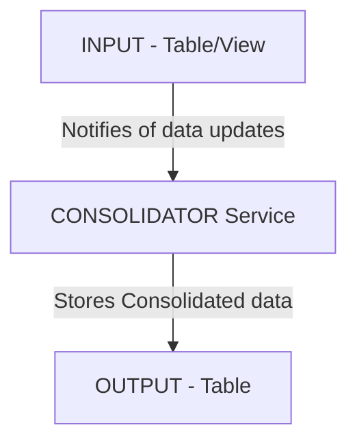

import Log from '/snippet/_LOG.md'
import CommonProcesses from '/snippet/_common-see-processes.md'

## Overview

A Consolidator aggregates data in real-time or on demand, based on a database table/view input.

Use cases include:

- Calculating and persisting real-time positions based on intra-day price changes.
- Producing snapshot reports of daily trade numbers.
- Generating snapshot numbers for charts.

Consolidators can be used in two ways:

- As a service: Outputs to a table entity, updating a target table based on table/view real-time updates.

- On demand (as a Consolidator object): Used in code for on-demand consolidations and what-if analysis; outputs are not saved in the application’s database.


## Example configuration

### Consolidator as a service
Here is an example Consolidator file that defines two Consolidators used as a service:

* CON_ORDER_FROM_TRADES.
This Consolidator builds the ORDER table records using the CONSOLIDATOR_TRADE table. It assumes the ORDER records do not exist in the system and are created automatically by the consolidator based on the ```ORDER.ORDER_ID``` and ```ORDER.ORDER_DATE``` fields (using [`groupBy`](#groupby) and [`build`](#build)). It uses max, min, sum and count functions, and the table has been marked as transient, so it can be cleared and recalculated with a consolidator [`coldStart`](#coldstart).

* CON_ORDER_SUMMARY_FROM_ORDER. This Consolidator builds the ORDER_SUMMARY table using the ORDER table and groups by the field ```ORDER.ORDER_DATE``` from the ```ORDER``` table. You can give multiple [`groupBy`](#groupby) conditions based on your requirement.
In this second Consolidator, we store all the consolidations grouped by ORDER_DATE year and ORDER_DATE year and month in database, (which are defined right at the end of the Consolidator). This avoids duplication of Consolidator code if you need to group the same consolidation based on different [`groupBy`](#groupby) conditions.

```kotlin
consolidators {

    consolidator("CON_ORDER_FROM_TRADES", CONSOLIDATOR_TRADE, ORDER) {
        config {
            tableTransient = true
        }

        select {
            ORDER {
                first { symbol } into SYMBOL // All trades for same order ID will have the same symbol, pick the first we find.
                first { side } into SIDE // All trades for same order ID will have the same side, pick the first we find.
                first { counterpartyId } into COUNTERPARTY_ID // All trades for same order ID will have the same counterpartyId, pick the first we find.
                max { price } into MAX_PRICE
                min { price } into MIN_PRICE
                avg { price } into AVG_PRICE
                sum { price * quantity } into TOTAL_NOTIONAL
                sum { quantity } into TOTAL_QUANTITY
                count() into TRADE_COUNT
            }
        }

        groupBy { Order.ByIdDate(orderId, tradeDate) } into {
            build {
                Order {
                    orderId = groupId.orderId
                    orderDate = groupId.tradeDate
                }
            }
            indexScan { ConsolidatorTrade.byOrderId(groupId.orderId) } // Need to recalculate certain functions
        }
    }

    consolidator("CON_ORDER_SUMMARY_FROM_ORDER", ORDER, ORDER_SUMMARY) {
        select {
            ORDER_SUMMARY {
                sum { totalNotional } into TOTAL_NOTIONAL
                sum { totalQuantity } into TOTAL_QUANTITY
                sum { tradeCount } into TRADE_COUNT
            }
        }

        groupBy { OrderSummary.byGroupId("${orderDate.year}") }
        groupBy { OrderSummary.byGroupId("${orderDate.year}-${orderDate.monthOfYear}") }
    }
}
```

#### Table definitions used in above examples:

```kotlin
val sideEnum = sharedField("SIDE", ENUM("BUY", "SELL"))

  table("ORDER", 1001) {
    field(name = "ORDER_ID", type = INT)
    field(name = "ORDER_DATE", type = DATE).notNull()
    field(name = "TRADE_COUNT", type = INT)
    field(name = "TOTAL_QUANTITY", type = LONG)
    field(name = "TOTAL_NOTIONAL", type = DOUBLE)
    field(name = "MAX_PRICE", type = DOUBLE)
    field(name = "MIN_PRICE", type = DOUBLE)
    field(name = "AVG_PRICE", type = DOUBLE)
    field(name = "COUNTERPARTY_ID", type = STRING)
    field(name = "SYMBOL", type = STRING)
    field(sideEnum)

    primaryKey("ID", "ORDER_DATE") // Unique identifier is composed of ID + ORDER_DATE
  }

  table("ORDER_SUMMARY", 1003) {
    field(name = "GROUP_ID", type = STRING)
    field(name = "TRADE_COUNT", type = INT)
    field(name = "TOTAL_QUANTITY", type = LONG)
    field(name = "TOTAL_NOTIONAL", type = DOUBLE)

    primaryKey("GROUP_ID")
  }

  table("CONSOLIDATOR_TRADE", 1004) {
    field(name = "TRADE_ID", type = INT)
    field(name = "ORDER_ID", type = INT).notNull()
    field(name = "TRADE_DATE", type = DATE)
    field(name = "QUANTITY", type = INT)
    field(name = "COUNTERPARTY_ID", type = STRING).notNull()
    field(name = "SYMBOL", type = STRING).notNull()
    field(sideEnum)

    primaryKey("TRADE_ID")
    indices {
      nonUnique("ORDER_ID")
    }
  }
```

#### More advanced examples

The example below has a single consolidator, called `CONSOLIDATE_POSITIONS`.

To give you some basic pointers to the content, the main code blocks in this Consolidator are:

- The [`config`](#config) block contains Consolidator level configuration
- The [`select`](#select) block to specify some calculations and assign to output fields
- The [`onCommit`](#oncommit) block to amend the output row
- The [`groupBy`](#groupby) block groups by `INSTRUMENT_ID`

```kotlin
consolidator("CONSOLIDATE_POSITIONS", TRADE_PRICE_VIEW, POSITION) {
    config {
        logLevel = DEBUG
        logFunctions = true
    }
    select {
        sum {
            when(side) {
                "BUY" -> when(tradeStatus) { // Ensure "BUY" trades are considered negative quantity in the position record.
                    TradeStatus.NEW -> quantity
                    TradeStatus.ALLOCATED -> quantity
                    TradeStatus.CANCELLED -> 0
                }
                "SELL" -> when(tradeStatus) { // Ensure "SELL" trades are considered negative quantity in the position record.
                    TradeStatus.NEW -> -quantity
                    TradeStatus.ALLOCATED -> -quantity
                    TradeStatus.CANCELLED -> 0
                }
                else -> null
            }
        } into QUANTITY
        sum {
            val quantity = when(side) {
                "BUY" -> quantity
                "SELL" -> -quantity
                else -> 0
            }
            quantity * price
        } into VALUE
    }
    onCommit {
        val quantity = output.quantity ?: 0
        val marketPrice = when { // Calculate market price based on bid or ask price depending on current position quantity.
            quantity > 0 -> input.emsBidPrice ?: 0.0
            quantity < 0 -> input.emsAskPrice ?: 0.0
            else -> 0.0
        }
        output.notional = marketPrice * quantity // Calculate notional based on current market price.
        output.pnl = output.value - output.notional
    }
    groupBy {
        instrumentId
    } into {
        lookup {
            Position.ByInstrumentId(groupId)
        }
        build {
            Position {
                instrumentId = groupId
                quantity = 0
                value = 0.0
                pnl = 0.0
                notional = 0.0
            }
        }
    }
}
```

### Consolidator on-demand

As an alternative to running a Consolidator as a service, you can create Consolidator objects as classes that can be used in code elsewhere in your application. They can be used in custom services, as well as in Request Servers and Event Handlers.

These Consolidators perform on-demand consolidations where the input can be:

- read directly from the database
- provided at runtime
- a combination of both of these

Effectively, that gives you three types of Consolidator object, which we shall introduce after the following simple example:

```kotlin
// consolidate database records:
val order: Order? = tradeConsolidator.get(Trade.ById("A"))
val orders: List<Order> = tradeConsolidator.getRange(Trade.ByOrderId("A"), 1).toList()
// consolidate runtime instances:
val order: Order? = tradeConsolidator.consolidate(trade)
val orders: List<Order> = tradeConsolidator.consolidate(trade1, trade2, trade3)
// what-if analysis, combine both database records and runtime instances:
val result = tradeConsolidator.whatIf(Trade.ByOrderId("2"), trade1, trade2)
```
#### Three types of Consolidator object
In practice, you can create three types of Consolidator object to cover different use cases:

- **input-output**
- **read input table**
- **read output table**

To showcase each of these, we shall use simple examples based on the following simplified data models:

**Trade**

| ID | InstrumentID | Quantity | Price |
|----|--------------|----------|-------|

**TradeDetails**

| ID | InstrumentID | TotalQuantity | Notional |
|----|--------------|---------------|----------|

#### Input - Output Consolidator

This type of Consolidator is not limited to tables. It can take any input and produce any output; that output can be used elsewhere in your application.

For example, your Consolidator object can read a table of trades and create the sum of all trade values.

````mermaid
graph LR
    B[Input] --> C[Consolidator on Demand]
    C --> D[Output]

````

The consolidator can receive either a Trade or a List of Trades; it returns a List of TradeDetail. The consolidation process is:

<table>
    <tr><th>Trade List (Runtime) </th><th></th><th>TradeDetail List (Runtime)</th></tr>
    <tr><td>

        | ID | InstrumentID | Quantity | Price |
        |----|--------------|----------|-------|
        | 1  | VOD          | 1        | 5     |
        | 3  | BARC         | 2        | 2     |
        | 4  | BARC         | 1        | 4     |

    </td><td>
        &rarr;
    </td><td>

        | ID | InstrumentID | totalQuantity | Notional |
        |----|--------------|---------------|----------|
        | 1  | VOD          | 1             | 5        |
        | 2  | BARC         | 3             | 8        |

    </td></tr> </table>

Here is a simple example input-output Consolidator that handles this use case:

```kotlin
val trades:List<Trade> = createTrades()
val tradeConsolidator = consolidator<Trade, TradeDetails> {
    select {
        sum { price * quantity } into TradeDetails::totalNotional
        sum { quantity } into TradeDetails::totalQuantity
    }

    groupBy { TradeDetails.byInstrumentId(currencyId) } into {
        TradeDetails {
            tradeDetailsId = groupId.tradeDetailsId
        }
    }
}
var tradeDetails:List<TradeDetails> = tradeConsolidator.consolidate(trades)
```

#### Read Input Table Consolidator

This type of Consolidator reads a table where data is changed and then creates an output; the output can be anything.

For example, the Consolidator could read updates to a table of orders and check the table of trades to find other trades that match that order (by order number or by counterparty, for example).
````mermaid
graph LR
    N[Consolidator On Demand]
    M[Input Data] -->  N
    L[Input Table - from DB] --> N
    N -->O[Output Runtime Entity]
````

The consolidation process for this is:

<table>
    <tr><th>Trade List (Runtime + DB) </th><th></th><th>TradeDetails List (Runtime)</th></tr>
    <tr><td>

        | ID | InstrumentID | Quantity | Price |
        |----|--------------|----------|-------|
        | 1  | VOD          | 1        | 5     |
        | 3  | BARC         | 2        | 2     |
        | 4  | BARC         | 1        | 4     |

        | ID | InstrumentID | Quantity | Price |
        |----|--------------|----------|-------|
        | 8  | VOD          | 5        | 2     |
        | 9  | BARC         | 5        | 3     |

    </td><td>
        &rarr;
    </td><td>

        | ID | InstrumentID | TotalQuantity | Notional |
        |----|--------------|---------------|----------|
        | 1  | VOD          | 6             | 15       |
        | 2  | BARC         | 8             | 23       |

    </td></tr> </table>

Here is a simple example read-input-table Consolidator that handles this use case:

````kotlin
val runtimeTrades:List<Trade> = createTrades()
val dbTrades:List<Trade> = createDbTrades()

val db by lazy { asyncEntityDb }

val tradeConsolidator by lazy {
    db.dualConsolidator<TRADE, POSITION_DETAILS> {
        select {
            POSITION_DETAILS {
                sum { price * quantity } into NOTIONAL
                sum { quantity } into TOTAL_QUANTITY
            }
        }

        groupBy { TradeDetails.byInstrumentId(currencyId) }
        into {
            TradeDetails {
                tradeDetailsId = groupId.tradeDetailsId
            }
        }
    }
}
db.insertAll(dbTrades)

var tradeDetails:List<TradeDetails> = tradeConsolidator.consolidate(runtimeTrades)
````

#### Read Output Table Consolidator

This type of Consolidator can read any type of input, but the output must be a table.

For example, the Consolidator could read the output from a trade table (a new trade), and compare this to an order in the order table. It can then calculate the effect of the change in terms of how much of the order is outstanding and fulfilled.

````mermaid
graph LR
M[Input Data] -->  N[Consolidator On Demand]
L[Input Data] --> N[Consolidator On Demand]
N -->O[Output Table]
````

The consolidation process for this is:

<table>
    <tr><th>Trade List (Runtime) + TradeDetails(DB) </th><th></th><th>TradeDetails List (Runtime)</th></tr>
    <tr><td>

        | ID | InstrumentID | Quantity | Price |
        |----|--------------|----------|-------|
        | 1  | VOD          | 1        | 5     |
        | 3  | BARC         | 2        | 2     |
        | 4  | BARC         | 1        | 4     |

        | ID | InstrumentID | TotalQuantity | Notional |
        |----|--------------|---------------|----------|
        | 8  | VOD          | 100           | 1000     |

    </td><td>
        &rarr;
    </td><td>

        | ID | InstrumentID | TotalQuantity | Notional |
        |----|--------------|---------------|----------|
        | 1  | VOD          | 101           | 1005     |
        | 2  | BARC         | 3             | 8        |

    </td></tr> </table>


Here is a simple example read-output-table Consolidator that handles this use case:

````kotlin
val runtimeTrades:List<Trade> = createTrades()

val db by lazy { asyncEntityDb }
val dbTradeDetails:List<TradeDetails> = createDbTradeDetails()

val tradeConsolidator by lazy {
    db.simulatingConsolidator<TRADE, TRADE_DETAILS> {
        select {
            TRADE_DETAILS {
                sum { price * quantity } into NOTIONAL
                sum { quantity } into TOTAL_QUANTITY
            }
        }

        groupBy { TradeDetails.byInstrumentId(instrumentId) } into {
            TradeDetails {
                tradeDetailsId = groupId.tradeDetailsId
            }
        }
    }
}
db.insertAll(dbTradeDetails)

var tradeDetails:List<TradeDetails> = consolidator.whatIf(runtimeTrades)

````

## Configuration options

The configuration options below generally apply to both consolidator services and on-demand consolidators. Any differences between both consolidator types will be highlighted.

### `consolidator`

`consolidator` defines a new consolidator. It takes a `name` (optional), an `input` entity (table or view) and an `output` table.

`name` is optional. Left unspecified, it is defaulted to `$inputName_TO_$outputName_CONSOLIDATOR`, where `$inputName` is the `input` table/view name and `$outputName` is the `output` table name.

In the example below:

- The first consolidator is called `TRADE_TO_POSITION_CONSOLIDATOR` as the name has not been specified.
- The second consolidator is called `POSITION_CONSOLIDATOR` as the name has been specified.

```
consolidators {
  consolidator(TRADE, POSITION) {
  // Rest of consolidator definition
  }
  consolidator("POSITION_CONSOLIDATOR", TRADE, POSITION) {
  // Rest of consolidator definition
  }
}
```

### `config`

The config block is available at both the file and Consolidator level with exactly the same properties. File-level configuration will overwrite default properties, and Consolidator properties will overwrite both.

See sample configuration below with the default values.

```
consolidators {
  config {
    logLevel = LogLevel.DEBUG,
    onNotFound = OnNotFound.BUILD
    batchingPeriod = 500
    ignoreIndexScan = false
    defaultErrorHandling = ErrorHandling.FAIL
    backPressure = 100
    logFunctions = false
    transactionType = ConsolidationTransactionType.DEFAULT
    groupName = "DEFAULT"
    tableTransient = false
    backwardsJoin = true
  }
  consolidator("POSITION_CONSOLIDATOR", TRADE, POSITION) {
    config {
      // Consolidator Config can also be overriden here.
    }
    // Rest of consolidator definition
  }
}
```

| Property             | Description                                                                                                                                                                               | Supports Values                                                                                                                                                             | Default Value          |
|----------------------|-------------------------------------------------------------------------------------------------------------------------------------------------------------------------------------------|-----------------------------------------------------------------------------------------------------------------------------------------------------------------------------|------------------------|
| logLevel             | the default log level used when logging inside the Consolidator                                                                                                                           | TRACE, DEBUG, INFO, WARN, ERROR                                                                                                                                             | DEBUG                  |
| onNotFound           | determines what to do if an output record is not found (see [build](#build))                                                                                                              | BUILD, WARN, LOG, FAIL                                                                                                                                                      | BUILD                  |
| batchingPeriod       | the time in ms accumulating updates before writing to the database                                                                                                                        | Integer values                                                                                                                                                              | 500                    |
| ignoreIndexScan      | disables index scans (see [indexScan](#indexscan))                                                                                                                                        | true, false                                                                                                                                                                 | false                  |
| defaultErrorHandling | what to do if an exception is thrown during any calculation                                                                                                                               | LOG, WARN (produces a warning log), FAIL (crashes the process)                                                                                                              | FAIL                   |
| backPressure         | number of records to be modified per database transaction during a consolidator write operation                                                                                           | Integer values                                                                                                                                                              | 100                    |
| logFunctions         | used to enable/disable logging within consolidator functions                                                                                                                              | true, false                                                                                                                                                                 | false                  |
| transactionType      | determines the consolidation approach when writing to database.                                                                                                                           | DEFAULT (currently DATABASE), DATABASE (will use database transactions to handle delta changes), LOCAL (will use in-memory copies of consolidated records to apply changes) | DEFAULT                |
| groupName            | used to group multiple consolidations targetting the same `output` table to avoid potential aggregation race conditions (see more info below)                                             | Free text.                                                                                                                                                                  | No grouping by default |
| tableTransient       | Marks the output table as transient. This means the table will be cleared on consolidator [`--coldStart`](#coldstart) and all records can be recalculated without any other implications. | true, false                                                                                                                                                                 | false                  |
| backwardsJoin        | enables backward join support for `input` views (see [backwardsJoin](/develop/server-capabilities/data-model/#backwardsjoin))                                                             | true, false                                                                                                                                                                 | true                   |

#### `groupName`

Consolidator groups are essential if you are using a non-transactional database.

`groupName` identifies a group of Consolidators.

```kotlin
groupName = "_name_"
```

If you include this statement in your `consolidator` block, then the Consolidator will belong to the named group.

In a non-transactional database, a group is designed to offer consistent consolidation in the absence of ACID guarantees at the database level. Consolidators in the same group will not interfere with each other's calculations as they update - particularly where they output to the same table.

:::note
This is limited to Consolidator updates within a group in a single process. Updates in other groups, other processes or other nodes could still interfere. You must plan this carefully.
:::

Below is an example where we have declared two `consolidator` blocks. Each has `groupName = "ORDER"`, so they are in the same group. The two `consolidator` blocks handle different types of order - but they are aggregated into the same three output tables: `TOTAL_NOTIONAL`, `TOTAL_QUANTITY` and `TRADE_COUNT`.


```kotlin
    consolidator(SWAP_ORDERS, ORDER_SUMMARY) {
        config {
            groupName = "ORDER"
        }

        select {
            ORDER_SUMMARY {
                sum { totalNotional } into TOTAL_NOTIONAL
                sum { totalQuantity } into TOTAL_QUANTITY
                sum { tradeCount } into TRADE_COUNT
            }
        }

        groupBy { OrderSummary.byGroupId("${orderDate.year}-${orderDate.monthOfYear}") }
    }
    consolidator(FX_ORDERS, ORDER_SUMMARY) {
        config {
            groupName = "ORDER"
        }

        select {
            ORDER_SUMMARY {
                sum { totalNotional } into TOTAL_NOTIONAL
                sum { totalQuantity } into TOTAL_QUANTITY
                sum { tradeCount } into TRADE_COUNT
            }
        }

        groupBy { OrderSummary.byGroupId("${orderDate.year}-${orderDate.monthOfYear}") }
    }
```

### `select`

In the select block, you can specify functions based on the entity `input` values, and a target field in the `output` table. The example below show how it is possible to aggregate all the quantity fields for then input TRADE table into the POSITION table:

```kotlin
  consolidator("POSITION_CONSOLIDATOR", TRADE, POSITION) {
    select {
        // add the output table here for a more concise syntax
        POSITION {
            sum { quantity } into QUANTITY
        }
    }
  }
```
Or a less concise syntax using `output` table references:

```kotlin
  consolidator("POSITION_CONSOLIDATOR", TRADE, POSITION) {
    select {
        sum { quantity } into Position::quantity
    }
  }
```

#### Functions

Functions are the building blocks of the `select` block.

The syntax for an input to a GPAL function is best described with an example. In the case of summing all values, the function to use would be `sum`.
A sample syntax could be `sum { feeAmount }`, where `sum` is the function and `feeAmount` is the input value provided by the input record currently being consolidated.
Within the curly brackets of the function, you can access all the fields on a row, and you can use any Kotlin operation on the row. The function will be applied over the result, unless the result is null, in which case it will be ignored.

With one exception, all functions require input. The exception is `count`, which can either have an input or no input.

| Function      | Description                                                            | Input      | Output        | Index Scan    |
|:--------------|------------------------------------------------------------------------|------------|---------------|---------------|
| sum           | sums values in the value field                                         | any number | same as input | never         |
| count         | counts all records                                                     | -          | INTEGER       | never         |
|               | counts records that have a value                                       | anything   | INTEGER       | never         |
| countDistinct | counts distinct value values                                           | anything   | INTEGER       | always        |
| countBig      | counts all records                                                     | -          | LONG          | never         |
|               | counts records that have a value                                       | any value  | LONG          | never         |
| avg           | average value                                                          | any number | DOUBLE        | always        |
| avgBig        | average value                                                          | any number | BIG_DECIMAL   | always        |
| min           | minimum value                                                          | any number | same as input | sometimes `*` |
| max           | maximum value                                                          | any number | same as input | sometimes `*` |
| stdev         | standard deviation for value                                           | any number | DOUBLE        | always        |
| stdevp        | population standard deviation for value                                | any number | DOUBLE        | always        |
| variance      | statistical variance for value                                         | any number | DOUBLE        | always        |
| variancep     | population statistical variance for value                              | any number | DOUBLE        | always        |
| stringAgg     | string concatenation                                                   | any string | STRING        | sometimes `+` |
| checksum      | calculates a hash over the input                                       | any value  | LONG          | always        |
| first         | gets first value from input table/view and sets in output table record | any value  | any value     | sometimes `+` |
| last          | gets last value from input table/view and sets in output table record  | any value  | any value     | sometimes `+` |

`*` if previous `min` or `max` value is removed<br />
`+` if previous any value is changed

Here are some simple examples of functions:

```kotlin
sum { quantity }                   // sums the QUANTITY
sum { quantity * 1000 }            // sums the total of QUANTITY multiplied by 1000
sum { quantity ?: otherQuantity }  // sum FEE_AMOUNT or OTHER_AMOUNT if FEE_AMOUNT is null
count ()                           // counts the number of records
count { fractionalQuantity }       // counts the records with a FRACTIONAL_QUANTITY field
// etc.
```

Functions can sometimes trigger an [index scan](#indexscan). This is when a Consolidator needs to re-read previously consolidated rows
in order to calculate the correct value.
- For some functions, this is never required: for example, `sum` and `count`.
- For some functions, it is required sometimes: for example, `min` and `max`.
- For some functions, it is always required: for example, `stDev`.

Function definitions can also be assigned to variables and assigned to multiple outputs, for example:
```kotlin
val feeSum = sum { feeAmount }
feeSum into TOTAL_FEES
feeSum onlyIf { feeGroup == FeeGroup.COMMISSION } into TOTAL_COMMISSION
```

#### Custom functions

Consolidators also support custom functions that allow you to specify behaviour for join, leave and noop
operations based on the consolidation [group](#groupby---into-overview).

There are two parts to defining a custom function:

- Select an input with `using` or `usingRow`
- Define the consolidation with `withOperations` or `withAggregation`

After the custom function has been defined, it supports the same type of [transformation functions](#transformations-functions) as the pre-defined functions, including `into`, `pivotBy`,
etc.

##### `using` and `usingRow`

- `using` takes an input from a row, like any other function. The return type determines the type of the function.
- `usingRow` takes the whole row as input. The type of function must be specified.

In the example below, the `sum` function is defined as a custom function. It uses `using` as custom function, `quantity` as the input, and applies three operations:

```kotlin
  consolidator("POSITION_CONSOLIDATOR", TRADE, POSITION) {
    select {
        POSITION {
            // The custom function below is equivalent to: sum { quantity } into QUANTITY
            using { quantity } withOperations {
                onJoin { previousValue + input }
                onLeave { previousValue - input }
                onNoop { previousValue + newInput - oldInput }
            } into QUANTITY
        }
    }
    // Rest of consolidator definition
  }
```

The function in the example above can also be implemented with `usingRow`, as shown below:

```kotlin
  consolidator("POSITION_CONSOLIDATOR", TRADE, POSITION) {
    select {
        POSITION {
            // The custom function below is equivalent to: sum { quantity } into QUANTITY
             usingRow(INT) withOperations {
                onJoin { previousValue + input.quantity.orZero() }
                onLeave { previousValue - input.quantity.orZero() }
                onNoop { previousValue + newInput.quantity.orZero() - oldInput.quantity.orZero() }
            } into QUANTITY
        }
    }
    // Rest of consolidator definition
  }
```

This shows the benefit of `using`, as it handles `null` values. The `orZero()` call takes any nullable number and returns the value, or `0` if it is null.

##### `withOperations` and `withAggregation`

The `withOperations` block enables you to specify the behaviour of the different consolidation operations based on [grouping logic](#groupby---into-overview)

In the previous example:

- a join is when a row is added to the consolidation group
- a leave is when a record leaves the consolidation group
- a noop is when a record is modified while staying in the same consolidation group: for example, if a price or a fee is changed

Each operation has access to the operation context as follows:

- `onJoin`
  1. `previousValue`
  2. `input`
- `onLeave`
  1. `previousValue`
  2. `input`
- `onNoop`
  1. `previousValue`
  2. `newInput`
  3. `oldInput`


`withAggregation` gives the user access to the list of records to be aggregated in this batch. You can use this function for a number of requirements:

- where the function needs to consider all values, rather than just one at time
- where you require a different function outcome, other than update value
- where no update at all is required
- where the group id should be reconsolidated

For this function:

- The `input` variable holds a `List` of aggregation events.
- The `previousValue` holds the previous value.
- the `sum` function uses `withAggregation`

`input` contains only `Join`, `Leave` and `Noop` values. (You can see how these are accessed in the example below.)

The example below uses the Kotlin function `fold` to calculate the value `acc`, which is the aggregated value for a group, such as total fees.

The function ends with an `asUpdate()` call. This effectively says, use the value you now have.

Once more, see example below equivalent to the `sum` function using `withAggregation`:

```kotlin
  consolidator("POSITION_CONSOLIDATOR", TRADE, POSITION) {
    select {
        POSITION {
            // The custom function below is equivalent to: sum { quantity } into QUANTITY
            using { quantity } withAggregation {
                input.fold(previousValue) { acc, value ->
                    when (value) {
                        is Join -> acc + value.value
                        is Leave -> acc - value.value
                        is Noop -> acc + value.new - value.old
                    }
                }.asUpdate()
            } into QUANTITY
        }
    }
    // Rest of consolidator definition
  }
```

`withAggregation` does not have to end with an `asUpdate()` call. Two other return values are also available:

- `Noop` causes the function to ignore the input for this particular field, and there is no change written to the database. For example, this is used during an iterative comparison to find a maximum value. The function compares the next value with the previous; if it is not higher, then return `Noop`.
- `IndexScan` causes the function to re-evaluate every database value for that key. For example, if the record with the maximum value has been deleted from the database, go to the database and find the new maximum value.

#### Transformations functions

The Consolidator also supports higher-level functions; this is where you can apply a transformation on the function,
before it is assigned.

##### `onlyIf`

Where this is present, the function only applies to rows that meet the condition specified, for example:

```kotlin
sum { quantity } onlyIf { direction == Direction.BUY } into TOTAL_BUY_QUANTITY
```

##### `withInitialValue`

Some functions support an initial value. Within this context, you can access the first input row, as well as the output
object, for example:

```kotlin
sum { -feeAmount } withInitialValue { output.expectedFees } into OUTSTANDING_FEES
```

##### `pivotBy`

This function can direct a function result across different columns, and change the `into` keyword. Within the `into`
tag, the `pivot` property will contain the value of the value returned in the `pivotBy { ... }` tag.

```kotlin
sum { quantity } pivotBy { direction } into {
    when (pivot) {
        Direction.BUY -> TOTAL_BUY_QUANTITY
        Direction.SELL -> TOTAL_SELL_QUANTITY
        Direction.SHORT_SELL -> TOTAL_SHORT_SELL_QUANTITY
    }
}
```

The values within this `when` statement **must** be exhaustive. If this is not ideal then we would recommend using `onlyIf`.

### `onCommit`

This block is optional. In the `onCommit` block, you can amend the output row, after all the functions have been
applied, but before it is written to the database. In the `onCommit` block, you have access to both the `input`
and the `output` objects. The `input` property can be any one of the input rows picked up during the consolidation,
so this should be handled with care.

This block can be useful to do further calculations based on the consolidated values, for example:

```kotlin
onCommit {
    val accruedInterest = if (input.isDirtyPrice) input.accruedInterest else 0.0
    val netAmount = input.notional + accruedInterest
    output.netAmount = when (input.side) {
        Side.BUY -> netAmount + output.totalTransactionCosts
        Side.SELL -> netAmount - output.totalTransactionCosts
    }
}
```

### `groupBy` - `into` overview

`groupBy` allows us to define the relevant consolidations group to aggregate our input table into our output table.

For example, one common use case would be to aggregate all `Trade` entities based on their INSTRUMENT_ID and COUNTERPARTY_ID values into the `Position` table. This would reveal how much an instrument has been traded for each specific counterparty in the database.

The syntax of `groupBy` can be significantly different between service Consolidators and on-demand Consolidators.
For service Consolidators, table syntax can add complexity, as records might need to be loaded, created or re-scanned (see [indexScan](#indexscan))

In service consolidators the `groupBy`-`into` syntax determines:
- how records are grouped `groupBy { ... } `
- how the Consolidator interacts with the database `into { ... }`
- how output records are loaded from the database `into { lookup { ... } }`
- how output records are built when no record is found in the database `into { build { ... } }`
- how to look up records after an index scan `into { indexScan { ... } }`

Syntax:
```kotlin
groupBy { /* return group id*/ } into {
    lookup { /* return unique index on output table */ }
    build { /* return new output record */ }
    indexScan { /* return index on input table */ }
}
```

For example:
```kotlin
    consolidator("POSITION_CONSOLIDATOR", TRADE, POSITION) {
        select {
            POSITION {
                sum { price * quantity } into NOTIONAL
                sum { quantity } into TOTAL_QUANTITY
            }
        }

        groupBy { Position.byInstrumentId(instrumentId) } into {
            lookup { Position.byInstrumentId(groupId.instrumentId) }
            build {
                Position {
                    instrumentId = groupId.instrumentId
                }
            }
            indexScan { Trade.byInstrumentId(groupId.instrumentId) }
        }
    }
```

In on-demand consolidators the `groupBy`-`into` syntax determines:
- how records are grouped `groupBy { ... } `
- how output records are constructed `into { ... }`

Syntax:
```kotlin
groupBy { /* return group id*/ } into { /* return new output record */ }
```

For example:
```kotlin
    db.simulatingConsolidator<TRADE, POSITION> {
        select {
            POSITION {
                sum { price * quantity } into NOTIONAL
                sum { quantity } into TOTAL_QUANTITY
            }
        }

        groupBy { Position.byInstrumentId(instrumentId) } into {
            Position {
                instrumentId = groupId.instrumentId
            }
        }
    }
```

#### `groupBy`

As explained in the previous section, the code you put in your `groupBy` block determines the `groupId`. That is important, because the `groupId` determines the level at which records are aggregated. For example, you can set up the code to group by instrument; in this case, the calculation would then aggregate per instrument.

The result of the `groupBy` block can be any kotlin type, as long as it can be used to uniquely identify a grouping. That is, as long as the result has a consistent `equals` method. This includes but is not limited to:

- single fields from the input table:
```kotlin
groupBy { allocationId }
```
- a type safe tuple of input table fields:
```kotlin
groupBy { tuple(allocationId, feeGroup) }
```
- a string concatenation of input table fields:
```kotlin
groupBy { group(allocationId, feeGroup) }
```
- unique index entries on the output table (table only):
```kotlin
groupBy { CommissionAndFeesSummary.ByAllocationId(allocationId, feeGroup) }
```

Using `tuple` and `group` in `groupBy` can later be interacted with in sub blocks such as lookup.

```kotlin
groupBy { group(orderDate.year) } into {
    lookup { OrderSummary.byGroupId(groupId) }
}
groupBy { Tuple2(orderDate.year, orderDate.monthOfYear) } into {
    lookup { OrderSummary.byGroupId("${groupId.value1}-${groupId.value2}") }
}
```

Consolidations support single or multiple groupings. Multiple groupings are useful when aggregating data by different levels: for example, where you want to calculate trade totals per currency as well as by counterparty.

For example, the consolidator below has two `groupBy` statements to ensure that it consolidates on *order year* and on *order year and month*:

```kotlin
consolidator("CON_ORDER_SUMMARY_FROM_ORDER", ORDER, ORDER_SUMMARY) {
    select {
        ORDER_SUMMARY {
            sum { totalNotional } into TOTAL_NOTIONAL
            sum { totalQuantity } into TOTAL_QUANTITY
            sum { tradeCount } into TRADE_COUNT
        }
    }

    groupBy { OrderSummary.byGroupId("${orderDate.year}") }
    groupBy { OrderSummary.byGroupId("${orderDate.year}-${orderDate.monthOfYear}") }
}
```

The `lookup` definition can avoided in a table index is used as the `groupBy` value. This allows the syntax to be shortened into the following format, which is more concise and can be easier to understand:

```kotlin
groupBy { OrderSummary.byGroupId("${orderDate.year}") }
groupBy { OrderSummary.byGroupId("${orderDate.year}-${orderDate.monthOfYear}") }
```

#### `into`

The `into` statement is different for standard and on-demand Consolidators as explained in the introduction to this section.
`into` in service consolidators may contain the `lookup`, `build` and `indexScan` configurations.
`into` in on-demand consolidations behaves as the `build` in the service consolidators.

#### `lookup`

The `lookup` block is optional when grouping by a unique index on the output table. In all other cases, the lookup
should be defined. In this block, you have access to the `groupId` property, as explained in the `groupBy` section.

Example:
```kotlin
groupBy { tradeId } into {
    lookup { Trade.ById(groupId) }
}
```

#### `build`

The `build` block is required to construct a new record in the output table (or simply a new object in on-demand consolidators), if the record in the output table could not be found.
This new entity needs all non-nullable properties without a default value to be initialised at this stage.

Example:

```kotlin
groupBy { Trade.ById(tradeId) } into {
    build {
        Trade {
            tradeId = groupId.tradeId
            feeAmount = input.feeAmount ?: 0
        }
    }
}
```

On-demand consolidators need to be able to build output objects on the fly. There is no need to interact with the
database at this point, and there is also no need to define a `build` block.

```kotlin
groupBy { orderId } into {
    Order {
        orderId = groupId
    }
}
```

#### `indexScan`

If any of the functions triggers an index scan, the Consolidator needs to know which records are affected. `indexScan` will
tell the Consolidator how to do that.

For example, if you are aggregating the total quantity value of `Trade` entities for a specific `Order` entity, your `indexScan` definition should be able to lookup all trades for that specific `Order`. See example below:

```kotlin
groupBy { Order.ById(orderId) } into {
    indexScan { Trade.ByOrderId(groupId.orderId) }
}
```

### `where`

The `where` definition will filter records prior to consolidation. There are two modes for this filter. In the default mode,
the consolidation events will be modified, depending on the predicate. In the most simple scenario, any new entities conforming to the predicate will be taken into account for the consolidation.
When an entity has been modified, it might be treated as a "join" or "leave" event depending on the predicate result.

In the example below, if a `Trade` entity `quantity` value suddenly goes above 1000, it would become eligible for consolidation and would be aggregated.
However, if the very same `Trade` entity is modified to have a `quantity` value below 1000, it would become ineligible for consolidation and the aggregation will also reflect the change accordingly:
```kotlin
where {
    quantity > 1000
}
```

Optionally, the where block takes an `ignore` parameter that will cause it to ignore certain records. Any
records matching the qualifications specified will be completely ignored.

```
where(ignore = true) {
    tradeDate < today()
}
```

### Logging

You can set the default logging level for all the Consolidators in your _application_**-consolidator.kts** file using a config statement at the beginning.
However, within any individual Consolidator, you can also set a logging level that overrides this setting.
If a Consolidator is not functioning as expected, raise its logging level to INFO, or even higher.
Let's see a very simple example. Here the default logging level has been set to INFO. However, Consolidator B has its own loglevel, `DEBUG`, which overrides the file-level setting:

```kotlin
consolidators {
  config {
    logLevel = INFO
  }
  consolidator ("A", ...) {
  ...
}
  consolidator ("B", ...) {
  config {
    logLevel = DEBUG
  }
  ...
}
}
```

#### `logJoin`, `logLeave` and `logNoop`
For debugging purposes, the `select` block also supports logging. By default, the Consolidator logs all events with default level **TRACE**, but this can be overwritten with custom messages. To do this, use the `logJoin`, `logLeave` and `logNoop` blocks:

```kotlin
select {
    // ...
    logJoin { LOG.info("row joined", input) }
    logLeave { LOG.info("row left", input) }
    logNoop { LOG.info("new row: {}, old row: {}", newInput, oldInput) }
}
```

#### Custom Log messages

<Log />

## Metrics

:::info
Ensure you have [enabled metrics](/build-deploy-operate/operate/metrics/#enabling-metrics) in your environment to view them.
:::

The consolidator exposes metrics to measure latency.

A high latency indicates that the consolidator is struggling to keep up.


| Metric                      | Explanation                          |
|:----------------------------|:-------------------------------------|
| calculation_latency         | latency for performing a calculation |
| consolidator_input_latency  | latency for processing an update     |
| consolidator_output_latency | latency for writing to database      |

## Runtime configuration

To include your `*-consolidator.kts` file definitions in a runtime process, you will need to ensure the process definition:

1. Ensure `genesis-pal-consolidator` is included in `module`
2. Ensure `global.genesis.pal.consolidator` is included in `package`
3. Ensure your consolidator.kts file(s) are defined in `script`
4. Ensure `pal` is set in `language`

If you wish to run a dedicated process for a consolidator, the following gives an example full process definition:
If you wish to run a dedicated process for a consolidator, the following gives an example full process definition:

```xml{13}
<process name="POSITION_CONSOLIDATOR">
  <groupId>POSITION</groupId>
  <description>Consolidates trades to calculate positions</description>
  <start>true</start>
  <options>-Xmx256m -DRedirectStreamsToLog=true -DXSD_VALIDATE=false -XX:MaxHeapFreeRatio=70 -XX:MinHeapFreeRatio=30 -XX:+UseG1GC -XX:+UseStringDeduplication -XX:OnOutOfMemoryError="handleOutOfMemoryError.sh %p"</options>
  <module>genesis-pal-consolidator</module>
  <package>global.genesis.pal.consolidator</package>
  <primaryOnly>true</primaryOnly>
  <script>position-consolidator.kts</script>
  <loggingLevel>DEBUG,DATADUMP_ON</loggingLevel>
  <language>pal</language>
</process>
```

:::important

In a multi-node environment, Consolidator services should be set to primary only; otherwise, the changes will be applied
multiple times potentially leading to incorrect data.

:::

### `arguments`

In addition to the tags in the example, you can also add an `<arguments></arguments>` tag. This allows you to define process arguments that should be passed to the process on start-up.

It is helpful for consolidators where you wish your consolidator process to [`coldStart`](#coldstart) each time the process restarts

For example:

```xml{13}
<process name="POSITION_CONSOLIDATOR">
  <groupId>POSITION</groupId>
  <description>Consolidates trades to calculate positions</description>
  <start>true</start>
  <options>-Xmx256m -DRedirectStreamsToLog=true -DXSD_VALIDATE=false -XX:MaxHeapFreeRatio=70 -XX:MinHeapFreeRatio=30 -XX:+UseG1GC -XX:+UseStringDeduplication -XX:OnOutOfMemoryError="handleOutOfMemoryError.sh %p"</options>
  <module>genesis-pal-consolidator</module>
  <package>global.genesis.pal.consolidator</package>
  <primaryOnly>true</primaryOnly>
  <script>position-consolidator.kts</script>
  <loggingLevel>DEBUG,DATADUMP_ON</loggingLevel>
  <language>pal</language>
  <arguments>--coldStart</arguments>
</process>
```

#### `coldStart`

A cold start will recalculate the all consolidations from scratch on consolidator restart to ensure all values are correct before starting the real-time event-driven consolidations. To make a cold start, you can run the command:

`startProcess GENESIS_CONSOLIDATOR --coldStart`

It is important to note that at the beginning of a cold start, all fields affected by the `select` configuration of the consolidation table are zeroed (or the records will be deleted, if transient) before initiating the re-consolidation of all the records in the database.

<CommonProcesses/>

## Testing


### Integration testing (legacy)

:::info
For the latest information on testing, go to our page on [Integration testing](/operations/testing/integration-testing/).
:::

The Genesis Application Platform provides the `AbstractGenesisTestSupport` abstract class that enables end-to-end testing of specific areas of your application. In this case, we want to ensure that we have a database, seeded with information, and that our Consolidator configuration is used to create our Consolidator. 

First, we need to add the required packages and genesis home. Then we need to set the "IS_SCRIPT" System Definition property to true (this is required as part of the Consolidator initialisation).

```kotlin
class ConsolidatorTest : AbstractGenesisTestSupport<GenesisSet>(
    GenesisTestConfig {
        addPackageName("global.genesis.pal.consolidator")
        genesisHome = "/GenesisHome/"
        scriptFileName = "position-consolidator.kts"
        initialDataFile = "seed-data.csv"
        parser = { it }
    }) {

    override fun systemDefinition(): Map<String, Any> = mapOf("IS_SCRIPT" to "true")
}
```

For more information about `AbstractGenesisTestSupport`, see the [Testing pages](/operations/testing/integration-testing-previous/#abstractgenesistestsupport).

Once you have set up your configuration, you can start writing tests against our Consolidators.

#### Writing tests

Let's write some tests for this Consolidator defined below, defined below

```kotlin
consolidators {
    consolidator("CON_ORDER_FROM_TRADES", CONSOLIDATOR_TRADE, ORDER) {
        config {
            tableTransient = true
        }

        select {
            ORDER {
                max { price } into MAX_PRICE
                min { price } into MIN_PRICE
                sum { price * quantity} into TOTAL_NOTIONAL
                sum { quantity } into TOTAL_QUANTITY
                count() into TRADE_COUNT
            }
        }

        groupBy { Order.ById(orderId) } into {
            val start = DateTime(2022, 1, 1, 0, 0)
            build {
                val id = groupId.orderId.toInt()
                Order {
                    orderId = groupId.orderId
                    orderDate = start.plusMonths(id % 12)
                    filledQuantity = 0
                    counterpartyId = "1"
                }
            }
        }

        onCommit {
            output.counterpartyId = "ON_COMMIT_TEST"
        }
    }
}
```

Before we write test, add the below method and variable to test class:

```kotlin
private var lastTradeId = 0

private fun trade(
    orderId: String = "1",
    price: Double,
    quantity: Long,
) = ConsolidatorTrade {
    this.tradeId = "TR_${lastTradeId++}"
    this.orderId = orderId
    this.price = price
    this.quantity = quantity
}
```

##### Consolidation test

```kotlin
    @Test
    fun `test consolidate only`() = runBlocking {

        val trade = trade(price = 10.0, quantity = 100)
        val trade2 = trade(price = 12.0, quantity = 100)
        entityDb.insert(trade)
        entityDb.insert(trade2)

        await untilAsserted {
            runBlocking {
                val record = entityDb.get(Order.ById("1"))
                assertEquals(22.0*100, record?.totalNotional)
            }
        }
    }
```

##### `onCommit` test

```kotlin
    @Test
    fun `fields modified in onCommit block are written to database`() = runBlocking {
        val trade = trade(price = 10.0, quantity = 100)
        entityDb.insert(trade)

        await untilAsserted {
            runBlocking {
                val record = entityDb.get(Order.ById("1"))
                assertEquals("ON_COMMIT_TEST", record?.counterpartyId)
            }
        }
    }
```

##### Nested consolidation test

To test this, add the Consolidator below to the Consolidator definition above:

```kotlin
    consolidator(ORDER, ORDER_SUMMARY) {
        select {
            ORDER_SUMMARY {
                sum { totalNotional } into TOTAL_NOTIONAL
                sum { totalQuantity } into TOTAL_QUANTITY
                sum { tradeCount } into TRADE_COUNT
            }
        }

        groupBy { OrderSummary.byGroupId("${orderDate.year}") }
    }
```

You will see that adding a trade would build ORDER and ORDER_SUMMARY tables.

```kotlin
@Test
fun `test nested consolidation`() = runBlocking {
        val trade = trade(price = 10.0, quantity = 100)
        val trade2 = trade(price = 12.0, quantity = 100)
        entityDb.insert(trade)
        entityDb.insert(trade2)
        await untilAsserted {
            runBlocking {
                val record = entityDb.get(OrderSummary.byGroupId("2022"))
                assertEquals(200, record?.totalQuantity)
                assertEquals(22.0 * 100, record?.totalNotional!!, 0.01)
            }
        }
    }
```
