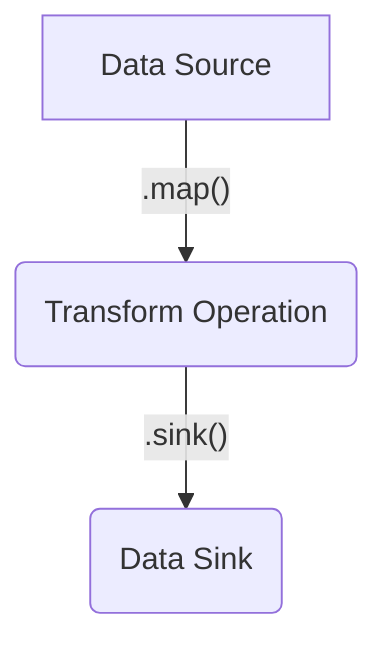

## Overview

Data Pipelines is a stream processing library for creating point-to-point data integrations and complex data processing workflows within an application. These pipelines can run as a standalone microservice or embedded within another microservice in order to feed data streams into more complex systems.

Data pipelines provides a toolbox of pre-built elements for common development tasks, such as file processing, protocol encoding and decoding, integration with messaging middleware and querying external APIs.

Many Genesis Business Components also add additional elements to allow pipelines to integrate directly into systems such as FIX Gateways, Notifications, File Management and Reconciliation, giving you a rich feature set that can be utilised with only a few lines of code.

Many application integrations follow the same logical pattern. Extract data from a source, apply some transformations on it and store it elsewhere.



Data pipelines takes care of the boilerplate of creating these integrations, so developers can focus on the business specific parts of the workflow. It is also built on a set of well defined APIs, making it very easily extensible in both Kotlin (using Kotlin Flow) and Java (using RxJava3 reactive streams).

Genesis Data Pipelines are defined in the *-pipelines.kts files.

## Core Concepts

### Batch vs. Real-time
A data pipeline can be considered 'batch' or 'real-time'.

###### Batch
A Batch pipeline consumes data using a request/response based model, utilising data sources that return a fixed-size result set at a given point in time. Examples include:
 - sending a query to a REST API
 - executing a SQL command to query a database
 - reading a file from a file store

A batch pipeline must be invoked via some kind of trigger, it does not execute continuously.

###### Real-Time
A real-time Pipeline consumes data via a 'push' model, utilising data sources that continuously deliver data based on subscriptions. Examples include:
 - reading data from a message broker (JMS, Kafka etc.)
 - monitoring a file store for any new files
 - listening for updates on a database table or view

A real-time pipeline is started when the process initialises and runs continuously.

Both batch and real-time pipelines are defined using the same syntax, but the implementation is determined by the source of data used to feed the pipeline.
 
### Source
The source is the entry point to a data pipeline. As stated above, a source can be batch or real-time, but it may also have additional properties.

##### Acknowledgable Sources
Acknowledgable Sources or Ack Sources, support an acknowledgement mechanism. The acknowledge method is called when the pipeline has finished processing an element in the stream, allowing the source to persist some stateful information for the purposes of recovery.

##### Typed Batch Sources
A typed batch source is an extension of a batch source, where the input to the execution is a well defined type. This allows the creation of dynamic batch queries in a type safe way. An example use case may be a REST API that allows querying of trade data by trade date. Defining an object that has a date field allows easy construction of the query.

### Sink
A sink is the final element of a the data pipeline, and responsible for writing the transformed data to the desired destination. A sink can either handle single elements or a stream of elements.

##### Transactional Sinks
If a sink is writing to the Genesis Application Database, it may be designated as a transactional sink by implementing a specific interface. If the sink in a pipeline is transactional, a transaction handle will be created internally within the pipeline and passed to the sink. For batch pipelines, this transaction covers the entire resulting stream. For real-time pipelines, each input element is processed in its own transaction. If the source is also an Ack Source, the same transaction handle is passed to the acknowledgement, allowing the processing of all results and the persistence of state information to occur in a single database transaction. This is very convenient for recoverability.

### Operators
An operator is a stage in the pipeline that applies some kind of transformation to elements in the stream. Each operator has an input type and an output type. In order to chain operators together, the input type of the operator to be added must match the output type of the previous operator (or source). In order to send the stream to the sink, the output type of the last operator must be compatible with the element type supported by the sink.

#### `filter`
A filter operator allows you to exclude certain elements from being sent to the sink. The input and output type remain the same with a filter operator.

```kotlin
pipeline(name = "Simple Integer Pipeline With Filtering") {
  source(
    BatchSource {
      (1..10).toList().asFlow()
    }
  )
  .filter { i ->
    i % 2 == 0
  }
  .sink { i, _ ->
    println(i)
    true
  }
}
```
In this example we have a simple pipeline that will emit the integer values 1 to 10 from the source, and the sink will print them to the console. The filter operator will only include even numbers.

#### `map`
A map operator transforms the input type to the output type.

```kotlin
pipeline(name = "Simple Integer Pipeline With Mapping") {
  source(
    BatchSource {
      (1..10).toList().asFlow()
    }
  )
  .map { i ->
    i.toString()
  }
  .sink { s, _ ->
    println(s)
    true
  }
}
```
In this example we have a simple pipeline that will emit the integer values 1 to 10 from the source, and the sink will print them to the console. The map operator will mutate the integer values into their string representation.

#### `split`
A split operator transforms an input elemnent into many output elements. For example, you can split a file object into its constituent lines.

```kotlin
pipeline(name = "Simple Integer Pipeline With Split") {
  source(
    BatchSource {
      (1..10).toList().asFlow()
    }
  )
  .split { i ->
    flow<Int> {
      for (j in 1..10) {
        emit(j * i)
      }
    }
  }
  .sink { i, _ ->
    println(i)
    true
  }
}
```
In this example we have a simple pipeline that will emit the integer values 1 to 10 from the source, and the sink will print them to the console. The split operator will emit multiple elements for each number, resulting in the multiplication table for each number being printed.

#### `transform`
A transform operator allows you to apply a transformation operation to the entire input stream, rather than just an individual element. For example, if you want to sort records before sinking them to a file, or remove elements with duplicate data, these are stream level operations rather than element level operations and require a transform operator.

```kotlin
pipeline(name = "Simple Integer Pipeline With Transform") {
  source(
    BatchSource {
      listOf(1, 1, 2, 2, 3, 3, 4, 4, 5, 5).asFlow()
    }
  )
  .transform { flow ->
    flow.toSet().asFlow()
  }
  .sink { i, _ ->
    println(i)
    true
  }
}
```
In this example we have a simple pipeline that will emit the integer values 1 to 5 with duplicates from the source, and the sink will print them to the console. The transform operator will collect all elements in the stream to a set, removing duplicates, then send all the elements downstream to the sink.

### Error handling

#### `onOperationError`
You can attach an error handling callback to any individual `map` or `split` operation in the pipeline. When you call `onOperationError` on a pipeline builder, it attaches the error handler to the previous operation in the pipleine. The error handler is a function that recieves the thrown exception, the pipeline context, and most importantly, the element that was being processed when the error was thrown. This allows for easy tracing of exactly which elements in the pipeline could not be processed. The function returns an 'action', which is how the pipeline should proceed. The available actions are:

| Action       | Description |
|--------------|-------------|
|`SKIP_ELEMENT`| Exclude the output element from being sent to the sink. For example, if processing a file that has been split into many lines, do not process that line. |
|`SKIP_STREAM` | Exclude the current processing stream from being sent to the sink. |
|`STOP_PIPELINE` | Stop the pipeline execution, which will raise an operational alert. |

Note that the semantic meaning of these actions is slightly different depending on whether the pipeline is a batch or real-time pipeline. SKIP_STREAM and STOP_PIPELINE are equivalent for a batch pipeline, and result in the current batch execution being terminated. SKIP_STREAM for a real-time pipeline results in the current input element, i.e. the stream of elements derived from the input element, to be ignored. For example, if processing a real time stream of files, and the current file has been split into many lines, SKIP_STREAM will mean the entire file is discarded from processing.
```kotlin
pipeline(name = "Simple Integer Pipeline With Error handling") {
  source(IntegerSource())
    .map { i ->
      if (i == 7) throw Exception()
      i
    }
    .onOperationError { int, context, throwable ->
      LOG.warn("Error caught while handling value $int, error was: ", throwable)
      OperationErrorAction.SKIP_ELEMENT
    }
    .sink(IntegerSink())
}
```

#### `onUncaughtError`
This error handler accepts an exception as an argument and allows you to take action when an exception that is not caught by any operation level error handlers unexpectedly terminates the pipeline. There is no action to be taken in terms of recovery at this point, as the pipeline has already terminated. This handler can be attached by calling `onUncaughtError()` on a complete pipeline (after calling `.sink()`).

```kotlin
pipeline(name = "Simple Integer Pipeline With Error handling") {
  source(IntegerSource())
    .map { i ->
      if (i == 7) throw Exception()
      i
    }
    .sink(IntegerSink())
    .onUncaughtError { throwable ->
      LOG.warn("Error uncaught:", throwable)
    }
}
```

### Completion Handling
#### `onCompletion`
This handler can be attached by calling `onCompletion()` on a complete pipeline (after calling `.sink()`), and will fire when each element has completed processing in a real-time pipeline, or when a batch has completed processing in a batch pipeline. Note that these handlers are only called when the element has finished being processed by the sink, therefore if the element is filtered using a filter operator or a map operator that returns null, the completion handlers will not fire.

```kotlin
pipeline(name = "Simple Integer Pipeline With OnCompletion") {
  source(IntegerSource())
    .map { i -> i.toString()}
    .sink(StringSink())
    .onCompletion { context ->
      LOG.info("Successfully processed input ${context.data}")
    }
}
```

### Pipeline Context
The pipeline context is an object that contains processing state that can be passed between the source, sink, error handlers and completion handlers. In a realtime pipeline, a separate context is created for each input element, and a reference to that element is stored in the context. In a batch pipeline, a context is created for each batch execution. In both cases, the context will contain the name of the pipeline executing, a transaction handle (if the sink is transactional), and a mutable map of context parameters for storing state.

## Core Components

### Source

### Filter Operator

### Map Operator

### Split Operator

### Transform Operator

### Sink

### Operation Error Handler

### 

## Creating Custom Components

### Source

### Filter Operator

### Map Operator

### Split Operator

### Transform Operator

### Sink

### Operation Error Handler

### 


