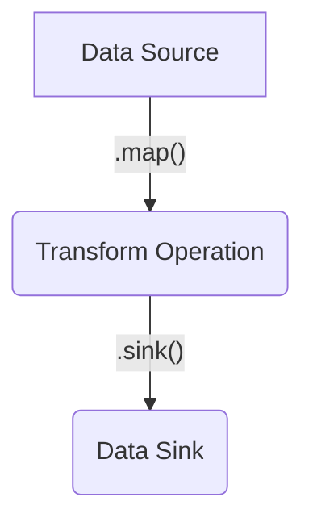

import Tabs from '@theme/Tabs';
import TabItem from '@theme/TabItem';
import CommonProcesses from '/snippet/_common-see-processes.md'

## Overview

Data Pipelines is a stream processing library for creating point-to-point data integrations and complex data processing workflows within an application. These pipelines can run as a standalone microservice or embedded within another microservice in order to feed data streams into more complex systems.

Data pipelines provides a toolbox of pre-built elements for common development tasks, such as file processing, protocol encoding and decoding, integration with messaging middleware and querying external APIs.

Many Genesis Business Components also add additional elements to allow pipelines to integrate directly into systems such as FIX Gateways, Notifications, File Management and Reconciliation, giving you a rich feature set that can be utilized with only a few lines of code.

Many application integrations follow the same logical pattern. Extract data from a source, apply some transformations on it and store it elsewhere.



Data pipelines takes care of the boilerplate of creating these integrations, so developers can focus on the business specific parts of the workflow. It is also built on a set of well defined APIs, making it very easily extensible in both Kotlin (using Kotlin Flow) and Java (using RxJava3 reactive streams).

Genesis Data Pipelines are defined in the *-pipelines.kts files.

## Core concepts

### Batch vs. real-time
A data pipeline can be considered 'batch' or 'real-time'.

###### Batch
A Batch pipeline consumes data using a request/response based model, using data sources that return a fixed-size result set at a given point in time. Examples include:
 - sending a query to a REST API
 - executing a SQL command to query a database
 - reading a file from a file store

A batch pipeline must be invoked via some kind of trigger, it does not execute continuously.

###### Real-time
A real-time pipeline consumes data via a 'push' model, using data sources that continuously deliver data based on subscriptions. Examples include:
 - reading data from a message broker (JMS, Kafka etc.)
 - monitoring a file store for any new files
 - listening for updates on a database table or view

A real-time pipeline is started when the process initializes and runs continuously.

Both batch and real-time pipelines are defined using the same syntax, but the implementation is determined by the source of data used to feed the pipeline.
 
### Source
The source is the entry point to a data pipeline. As stated above, a source can be batch or real-time, but it may also have additional properties.

##### Acknowledgeable sources
Acknowledgeable Sources or Ack Sources, support an acknowledgement mechanism. The acknowledge method is called when the pipeline has finished processing an element in the stream, allowing the source to persist some stateful information for the purposes of recovery.

##### Typed Batch sources
A typed batch source is an extension of a batch source, where the input to the execution is a well defined type. This allows the creation of dynamic batch queries in a type safe way. An example use case may be a REST API that allows querying of trade data by trade date. Defining an object that has a date field allows easy construction of the query.

### Sink
A sink is the final element of the data pipeline, and responsible for writing the transformed data to the desired destination. A sink can either handle single elements or a stream of elements.

##### Transactional sinks
If a sink is writing to the Genesis Application Database, it may be designated as a transactional sink by implementing a specific interface. If the sink in a pipeline is transactional, a transaction handle will be created internally within the pipeline and passed to the sink. For batch pipelines, this transaction covers the entire resulting stream. For real-time pipelines, each input element is processed in its own transaction. If the source is also an Ack Source, the same transaction handle is passed to the acknowledgement, allowing the processing of all results and the persistence of state information to occur in a single database transaction. This is very convenient for recoverability.

### Operators
An operator is a stage in the pipeline that applies some kind of transformation to elements in the stream. Each operator has an input type and an output type. In order to chain operators together, the input type of the operator to be added must match the output type of the previous operator (or source). In order to send the stream to the sink, the output type of the last operator must be compatible with the element type supported by the sink. Types of operators supported are [filter](./#filter), [map](./#map), [split](./#split) and [transform](./#transform).

### Pipeline context
The pipeline context is an object that contains processing state that can be passed between the source, sink, error handlers and completion handlers. In a realtime pipeline, a separate context is created for each input element, and a reference to that element is stored in the context. In a batch pipeline, a context is created for each batch execution. In both cases, the context will contain the name of the pipeline executing, a transaction handle (if the sink is transactional), and a mutable map of context parameters for storing state.

## Building a pipeline
Within the pipelines GPAL file, you will find a `pipelines` block:
```kotlin
pipelines {
    
}
```
Within this block, the pipeline function is available, which allows you to name your pipeline. This function also opens another block, which is where you can build your pipeline.
```kotlin
pipelines {
    pipeline(name = "My Pipeline") {
        // within this scope is the pipeline builder
    }
}
```

To start with, the pipeline is empty. We begin by calling the source function to start the pipeline building process.

### `source`
The source function takes an instance of an object that implements the source interface.
This can be:
- defined in-line in the script
- one of the sources provided by the core platform or any of the extension modules such as kafka-genesis
- a custom class written in your application that implements one of the Data Pipelines API source interfaces

```kotlin
// Example using a platform provided source
val camelSource = camelFileSource {
    location = "file://src/test/resources/camel-source-test?noop=true&idempotent=true"
}

pipelines {
    pipeline(name = "My Pipeline") {
        source(camelSource)
            ...
    }
}

// Example using a custom source class
pipelines {
    pipeline(name = "My Pipeline") {
        source(inject<MyCustomSource>())
            ...
    }
}

// Example using a source defined in-line
pipelines {
    pipeline(name = "My Pipeline") {
        source( Source {
            (1..10).asFlow()
        })
        ...
    }
}
```

### `filter`
A filter operator allows you to exclude certain elements from being sent to the sink. The input and output type remain the same with a filter operator.

```kotlin
pipeline(name = "Simple Integer Pipeline With Filtering") {
  source(
    BatchSource {
      (1..10).toList().asFlow()
    }
  )
  .filter { i ->
    i % 2 == 0
  }
  .sink { i, _ ->
    println(i)
    true
  }
}
```
In this example we have a simple pipeline that will emit the integer values 1 to 10 from the source, and the sink will print them to the console. The filter operator will only include even numbers.

### `map`
A map operator transforms the input type to the output type.

```kotlin
pipeline(name = "Simple Integer Pipeline With Mapping") {
  source(
    BatchSource {
      (1..10).toList().asFlow()
    }
  )
  .map { i ->
    i.toString()
  }
  .sink { s, _ ->
    println(s)
    true
  }
}
```
In this example we have a simple pipeline that will emit the integer values 1 to 10 from the source, and the sink will print them to the console. The map operator will mutate the integer values into their string representation.

### `split`
A split operator transforms an input element into many output elements. For example, you can split a file object into its constituent lines.

```kotlin
pipeline(name = "Simple Integer Pipeline With Split") {
  source(
    BatchSource {
      (1..10).toList().asFlow()
    }
  )
  .split { i ->
    flow<Int> {
      for (j in 1..10) {
        emit(j * i)
      }
    }
  }
  .sink { i, _ ->
    println(i)
    true
  }
}
```
In this example we have a simple pipeline that will emit the integer values 1 to 10 from the source, and the sink will print them to the console. The split operator will emit multiple elements for each number, resulting in the multiplication table for each number being printed.

### `transform`
A transform operator allows you to apply a transformation operation to the entire input stream, rather than just an individual element. For example, if you want to sort records before sinking them to a file, or remove elements with duplicate data, these are stream level operations rather than element level operations and require a transform operator.

```kotlin
pipeline(name = "Simple Integer Pipeline With Transform") {
  source(
    BatchSource {
      listOf(1, 1, 2, 2, 3, 3, 4, 4, 5, 5).asFlow()
    }
  )
  .transform { flow ->
    flow.toSet().asFlow()
  }
  .sink { i, _ ->
    println(i)
    true
  }
}
```
In this example, we have a simple pipeline that will emit the integer values 1 to 5 with duplicates from the source, and the sink will print them to the console. The transform operator will collect all elements in the stream to a set, removing duplicates, then send all the elements downstream to the sink.

### `sink`
To make the pipeline complete, you must add a sink using the `sink` function. The sink function takes an instance of an object that implements any of the sink interfaces.

This can be:
- defined in-line in the script
- one of the sinks provided by the core platform or any of the extension modules such as kafka-genesis
- a custom class written in your application that implements one of the Data Pipelines API sink interfaces.

Note that if your pipeline produces only single elements and not streams of elements as a result of each input, the sink must be able to handle one element at a time. All of the provided sink implementations in the platform implement both `Sink` and `StreamSink` for this reason.

```kotlin
// Example using a platform provided sink
pipelines {
  pipeline(name = "My Pipeline") {
    source(testSource)
      .map(testMapper)
      .sink(dbSink())
  }
}

// Example using a custom source class
pipelines {
  pipeline(name = "My Pipeline") {
    source(testSource)
      .sink(inject<MyCustomSink>())
    }
}

// Example using a source defined in-line
pipelines {
  pipeline(name = "My Pipeline") {
    source(testSource)
      .sink { it, context ->
        // Add your logic here 
        true
      }
  }
}
```

### `onOperationError`
You can attach an error handling callback to any individual `map` or `split` operation in the pipeline. When you call `onOperationError` on a pipeline builder, it attaches the error handler to the previous operation in the pipeline. The error handler is a function that receives the thrown exception, the pipeline context, and most importantly, the element that was being processed when the error was thrown. This allows for easy tracing of exactly which elements in the pipeline could not be processed. The function returns an 'action', which is how the pipeline should proceed. The available actions are:

| Action       | Description |
|--------------|-------------|
|`SKIP_ELEMENT`| Exclude the output element from being sent to the sink. For example, if processing a file that has been split into many lines, do not process that line. |
|`SKIP_STREAM` | Exclude the current processing stream from being sent to the sink. |
|`STOP_PIPELINE` | Stop the pipeline execution, which will raise an operational alert. |

Note that the semantic meaning of these actions is slightly different depending on whether the pipeline is a batch or real-time pipeline. SKIP_STREAM and STOP_PIPELINE are equivalent for a batch pipeline, and result in the current batch execution being terminated. SKIP_STREAM for a real-time pipeline results in the current input element, i.e. the stream of elements derived from the input element, to be ignored. For example, if processing a real time stream of files, and the current file has been split into many lines, SKIP_STREAM will mean the entire file is discarded from processing. However, any elements from that stream which have already been sent to the sink prior to this exception, will still be processed.
```kotlin
pipeline(name = "Simple Integer Pipeline With Error handling") {
  source(IntegerSource())
    .map { i ->
      if (i == 7) throw Exception()
      i
    }
    .onOperationError { int, context, throwable ->
      LOG.warn("Error caught while handling value $int, error was: ", throwable)
      OperationErrorAction.SKIP_ELEMENT
    }
    .sink(IntegerSink())
}
```

### `onUncaughtError`
This error handler accepts an exception as an argument and allows you to take action when an exception that is not caught by any operation level error handlers unexpectedly terminates the pipeline. There is no action to be taken in terms of recovery at this point, as the pipeline has already terminated. This handler can be attached by calling `onUncaughtError()` on a complete pipeline (after calling `.sink()`).

```kotlin
pipeline(name = "Simple Integer Pipeline With Error handling") {
  source(IntegerSource())
    .map { i ->
      if (i == 7) throw Exception()
      i
    }
    .sink(IntegerSink())
    .onUncaughtError { throwable ->
      LOG.warn("Error uncaught:", throwable)
    }
}
```

### `onCompletion`
This handler can be attached by calling `onCompletion()` on a complete pipeline (after calling `.sink()`), and will fire when each element has completed processing in a real-time pipeline, or when a batch has completed processing in a batch pipeline. Note that these handlers are only called when the element has finished being processed by the sink, therefore if the element is filtered using a filter operator or a map operator that returns null, the completion handlers will not fire.

```kotlin
pipeline(name = "Simple Integer Pipeline With OnCompletion") {
  source(IntegerSource())
    .map { i -> i.toString()}
    .sink(StringSink())
    .onCompletion { context ->
      LOG.info("Successfully processed input ${context.data}")
    }
}
```

## Core elements
The following core elements are part of the Core Data Pipelines library and are always available for use in your *-pipelines.kts scripts.

### Sources

#### `camelFileSource`

This is a real-time acknowledgement source that uses Camel to poll a location periodically. It returns a stream of type `PipelineFile`, which includes the file name, file path and input stream of its contents.

The next element is only emitted once acknowledgement is given that the previous one has been successfully processed.

There are two ways to create a camel source. One is by setting the location URL, the second is by using Route Builder.
 - The location URL is a simple string that defines the location. 
 - The routeHandler function exposes the full Camel Route Builder. 

The Route Builder is Apache Camel's API for defining how to read messages, and where from. Using the `routeHandler` function gives you the most flexibility and control over your routes logic, allowing for more advanced configurations, such as specifying processors and idempotency logic.
Within the routeHandler block you can access the `dataPipelineProcessor` variable, this is a custom processor that is always created that will emit the messages from the source into the pipeline. Using location is shorthand, the following examples are functionally equivalent:

Simple example with `location`:
```kotlin
camelFileSource {
  location = "file://src/test/resources/camel-source-test?noop=true"
} 
```

Equivalent example with `routeHandler`:
```kotlin
camelFileSource {
  routeHandler {
    from("file://src/test/resources/camel-source-test?noop=true")
      .process(dataPipelineProcessor)
  }
}
```

###### Reading from a local directory
```kotlin
pipeline("TEST_CAMEL_ROUTE_PIPELINE") {
  source(
    camelFileSource {
      routeHandler {
        val pathStr = "${GenesisPaths.genesisHome()}/runtime/inbound"
        val idempotentRepo = "${pathStr}/IDEMPOTENT_CONSUMER.DATA"

        from("file:${pathStr}")
          .idempotentConsumer(
            header("CamelFileName"),
            FileIdempotentRepository.fileIdempotentRepository(File(idempotentRepo), 300000, 15000000)
          )
          .process(dataPipelineProcessor)
      }
    }
  ).sink { file, context ->
    LOG.info("Received file $file")
    true
  }
}
```

###### Reading from an SFTP server

The example below defines an [SFTP component](https://camel.apache.org/components/4.8.x/sftp-component.html), and shows how you can use properties set in the allowing you to have site-specific variables for each instance.

This is particularly useful when integrating with external services where connection details are likely to vary between environments.

```kotlin
pipeline("TEST_CAMEL_ROUTE_PIPELINE") {
  source(
    camelFileSource {
      routeHandler {
          val sftpEndPointPath = systemDefinition.getItem("SFTP_SERVER_SFTP")
          val sftpUserName = systemDefinition.getItem("SFTP_SERVER_USERNAME")
          val sftpPassword = systemDefinition.getItem("SFTP_SERVER_PASSWORD")
          val sftpFileName = systemDefinition.getItem("SFTP_SERVER_FILENAME")
          val pathStr = "${GenesisPaths.genesisHome()}/runtime/inbound"
          val sftpConsumerRepo = "${pathStr}/IDEMPOTENT_CONSUMER.DATA"

          from("sftp:${sftpEndPointPath}?username=${sftpUserName}&password=${sftpPassword}&include=$${sftpFileName}" +
              "&delay=1000&sortBy=file:modified&delete=false&bridgeErrorHandler=true" +
              "&knownHostsFile=/home/myapp/.ssh/known_hosts&throwExceptionOnConnectFailed=true&stepwise=false")
              .idempotentConsumer(header("CamelFileName"),
                  FileIdempotentRepository.fileIdempotentRepository(File(sftpConsumerRepo), 300000, 15000000))
              .process(dataPipelineProcessor)
      }
    }
  ).sink(filesSink)
}
```

:::info
Additional Camel components, such as SFTP capabilities can be added by adding additional jars to your process classpath. Some of these additional camel modules can bring a large number of transitive dependencies into your application, which might cause conflicts with other libraries you are using. You may want to create a [separate module](../../../../build-deploy-operate/build/project-structure/#adding-new-modules-to-a-project) in your application in order to more effectively manage this.
:::

For further details and configuration options see, the Apache Camel [SFTP component](https://camel.apache.org/components/sftp-component.html) documentation.

#### `dbBatchQuery`

This is a real-time acknowledgement source that returns a stream of database records. Each query to the database is a ranged query constructed using a monotonically increasing numeric value, used as an offset into the table. Usually this is either a timestamp or some kind of auto-incrementing sequence on the table. As such, this source works best with tables with immutable records, such as audit tables.

The idea of this source is to use the offset to create a recoverable stream with guarantees that each record is processed at least once.

If no data is received, the source waits for a delay before attempting to poll again. This source implementation uses the PersistenceManager to persist the latest index using the provided lambda; by default the DbPersistenceManager is used to manage the state of this source. See [Using the Persistence Manager](./#using-the-persistence-manager) for more details.

The type of object that you would like this source to return must be given as part of the source definition, as shown in the example below.

When configuring the db batch poller to use as part of your pipeline, you must provide the following as part of the configuration:

- source (required): this is what the PersistenceManager will use to find the last persisted record and should be unique across all pipelines
- index (required): this is the table index used to order the records and get the value for the last persisted record for recovery - if a single field index is provided, ensure this value is either the generated `TIMESTAMP` field in the table or of type Long. Else, see below.
- buildIndex (required for multi-field index only): if you would like to use an index that contains multiple fields, you need to provide a lambda that converts from a Long value (the last persisted value) to your EntityIndex object using this value - you must ensure that the Long value which you would like to be used as the persistence index needs to be the final value inside your index object
- dbLookupDelayMs (optional): this is the delay time that the poller will wait for in milliseconds after not receiving any new data from the database - the default is 200ms, and is not required as part of the provided config

Here is a GPAL example of a Batch Poll source definition:
```kotlin
// Single Field Index Example
val batchPollSource = dbBatchQuery<TestIndexTable> {
  source = "SINGLE_INDEX_SOURCE"
  index = TestIndexTable.ByIndex
}

// Multiple Field Index Example
val batchPollMultiIndexSource = dbBatchQuery<TestMultiIndexTable> {
  source = "MULTI_INDEX_SOURCE"
  index = TestMultiIndexTable.ByNameIndex
  buildIndex { value -> TestMultiIndexTable.ByNameIndex("NAME", value) }
}

pipelines {
  pipeline("TEST_BATCH_POLL_PIPELINE") {
    source(batchPollSource)
      .sink(testSink)
  }
}
```

You also have the option of providing a batch size to the `dbBatchQuery` source.

If no `batchSize` is provided, the elements from the database poll will be returned individually and the persistence manager will use the index from each individual record to keep track of what has been processed. This means that the index of each record will be persisted after it reaches the sink. This gives an *exactly once* guarantee.

If a `batchSize` is provided, the elements from the database poll will be batched into the size you have specified in order of the index provided and returned as a list. The persistence manager will use the index from the last record of this batch. So, if the system goes down whilst in the middle of processing a batch of records, it recovers by continuing from the beginning of that batch. This gives an *at least once* guarantee. This option greatly increases processing speeds when working with large amounts of data.

```kotlin
// specify batchSize as shown below
val batchPollSource = dbBatchQuery<TestIndexTable>(batchSize = 200) {
  source = "SINGLE_INDEX_SOURCE"
  index = TestIndexTable.ByIndex
}
// this source will return batches of List<TestIndexTable>
```

#### `AbstractProgrammaticSource`

This is an abstract implementation of a real-time acknowledgement source that additionally has a send method, which can be used by any custom code to provide data to the pipeline.

This source is dependent on the calling code being a part of the same process as the pipeline using this source - ensure this is done by updating your process definition.

Here is an example of using this source to provide Trade objects:

```kotlin
object ProgrammaticTradeSource : AbstractProgrammaticSource<Trade>()
```

Here is an `eventHandler` that sends to this `ProgrammaticTradeSource`:

```kotlin
eventHandler<Trade>("TRADE_INSERT", transactional = true) {
  onCommit { event ->
    val trade = event.details
    ProgrammaticTradeSource.send(trade)
    ack()
  }
}
```

The resulting pipeline:
```kotlin
pipelines {
  pipeline("TEST_PIPELINE") {
    source(ProgrammaticTradeSource)
      .sink(testSink)
  }
}
```


#### `httpSource`

The HTTP Source is a batch executable source for querying data from remote HTTP endpoints. It uses the [Genesis HTTP Client](/develop/server-capabilities/integrations/custom-endpoints/).

When defining this source, you must specify the type of object you expect to receive from the remote endpoint.

You need to provide a request builder, which contains information about the HTTP request you would like to send. The default HttpMethod is GET.

When supplying this builder, you have access to:

- what is being provided to the execute method
- the context parameters map

```kotlin
val source = httpSource<Trade> {
  requestBuilder {
    url = "https://api.example.com/get-trade?tradeId=${contextParameters["tradeId"]}"
  }
}

pipelines {
  pipeline("TEST_PIPELINE") {
    source(source)
    .sink(testSink)
  }
}
```

Triggering the above pipeline in an `eventHandler`:

```kotlin
val pipelineManager = inject<PipelineManager>()

eventHandler<Trade>(name = "TEST_PIPELINE_START") {
  onCommit { event ->
    val details = event.details

    val pipeline = pipelineManager.getBatchPipeline("TEST_PIPELINE")
    // provide values in the context map that you have used in the request builder when setting up the pipeline
    pipeline?.execute(mapOf("tradeId" to details.tradeId))
    ack()
  }
}
```

#### `typedHttpSource`

The Typed HTTP Source is a batch executable source for querying data from remote HTTP endpoints. It uses the [Genesis HTTP Client](/develop/server-capabilities/integrations/custom-endpoints/).

When defining this source, you must specify the type of object you expect to receive from the remote endpoint, as well as the request object being sent (which should be provided in the `execute()` method when triggering this pipeline).

You need to provide a request builder, which contains information about the HTTP request you would like to send. The default HttpMethod is GET.

When supplying this builder, you have access to:

- what is being provided to the execute method
- the context parameters map
- the request object being used

```kotlin
val source = httpSource<Trade, List<Trade>> {
  requestBuilder {
    // using the request which will be provided in the execute call
    url = "https://api.example.com/all-trades?tradeId=${request.tradeId}"
  }
}

pipelines {
  pipeline("TEST_PIPELINE") {
    source(source)
    .sink(testSink)
  }
}
```

Triggering the above pipeline in an `eventHandler`:

```kotlin
val pipelineManager = inject<PipelineManager>()

eventHandler<Trade>(name = "TEST_PIPELINE_START") {
  onCommit { event ->
    val trade = event.details

    val pipeline = pipelineManager.getTypedBatchPipeline<Trade>("TEST_PIPELINE")
    // provide the request as shown below  in the context map that you have used in the request builder when setting up the pipeline
    pipeline?.execute(trade, emptyMap())
    ack()
  }
}
```

### Split operators

#### `csvDecoder` 
This is a split operator that decodes a PipelineFile object into a stream of CsvRow objects that contain:

- the line number for each CSV row
- an object of a user-defined type representing the data of each CSV line;

```kotlin
// Decoding CSV to a class
pipeline("TEST_PIPELINE_DECODER") {
  source(
    camelSource {
      location = "file://src/test/resources/camel-source-test?noop=true&idempotent=true"
    }
  )
  .split(csvDecoder<System>()) // Deserialize to System class
  .map { input: CsvRow<System> ->
    DbOperation.Insert(input.data)
  }
  .sink(txDbSink())
}
```

You also have the option of providing configuration to specify the following:
- columnSeparator (optional Char) [default: ',']: this is the character used to separate values.
- quoteChar (optional Char) [default: '"']: this is the character used for quoting values that contain quote characters or line feeds.

Example:
```kotlin
// use the csvDecoder in the same way as above
csvDecoder<System>() {
      // specify custom columnSeparator and/or quoteChar here
      columnSeparator = '|'
      quoteChar = '$'
  }
```

#### `csvRawDecoder`

This is a split operator that decodes a PipelineFile object into a stream of CsvRow objects that contain:

- the line number for each CSV row
- a map holding the data for each CSV line of type `Map<String, String>`

```kotlin
// Decoding CSV to Map<String, String>
pipeline("TEST_PIPELINE_RAW_DECODER") {
  source(
    camelSource {
      location = "file://src/test/resources/camel-source-test?noop=true&idempotent=true"
    }
  )
  .split(csvRawDecoder()) // Default to deserializing to Map<String, String>
  .map { input: CsvRow<Map<String, String>> ->
    DbOperation.Insert(
      System {
        systemKey = input.data["SYSTEM_KEY"]!!
        systemValue = input.data["SYSTEM_VALUE"]!!
      }
    )
  }
  .sink(txDbSink())
}
```

### Transform operators

#### `csvEncoder`

This is a transform operator that encodes an object of a user-defined type into a stream of CSV formatted Strings, including the header. This stream can then be used to write to a file.

```kotlin
    pipeline("TEST_CSV_ENCODER") {
        source(dbBulkQuery<Trade>())
            // encoder is expecting objects of type Trade as defined in source
            .transform(csvEncoder())
            .sink(streamSink)
    }
```

You also have the option of providing configuration to specify the following:
- `columnSeparator` (optional `Char`) [default: `,`]: this is the character used to separate values.
- `quoteChar` (optional `Char`) [default: `"`]: this is the character used for quoting values that contain quote characters or line feeds.

Example:
```kotlin
// use the csvEncoder in the same way as above
csvEncoder<Trade> {
      // specify custom columnSeparator and/or quoteChar here
      columnSeparator = '|'
      quoteChar = '$'
  }
```

### Sinks

#### `dbSink` 
This is a sink into the Genesis database, which takes a DbOperation object as input with an object extending TableEntity i.e.  `INPUT : DbOperation<out TableEntity>`.
The sink operation for each input element (real-time) or execution (batch) occurs outside of any database transaction. Use this version of the sink if you want the behaviour to be 'best effort'. 

DbOperation has 4 subtypes: Insert, Modify, Upsert and Delete.

```kotlin
// Non-transactional db sink
pipeline("TEST_DB_SINK") {
  source(dbBulkSubscribe<Trade>())
  .map {
    when (it) {
      Bulk.Prime.Completed -> null
      is Bulk.Prime.Record -> null
      is Bulk.Update.Delete -> DbOperation.Delete(it.record)
      is Bulk.Update.Insert -> DbOperation.Insert(it.record)
      is Bulk.Update.Modify -> DbOperation.Modify(it.record)
    }
  }
  .sink(dbSink())
}
```

#### `txDbSink`
This is a transactional sink into the Genesis database, which takes a DbOperation object as input with an object extending TableEntity i.e.  `INPUT : DbOperation<out TableEntity>`.
The sink operation for each input element (real-time) or execution (batch) occurs within a single database transaction. Use this version of the sink if you want the behaviour to be 'all-or-nothing'. 

DbOperation has 4 subtypes: Insert, Modify, Upsert and Delete.

```kotlin
// Transactional db sink
pipeline("TEST_DB_SINK") {
  source(dbBulkSubscribe<Trade>())
  .map {
    when (it) {
      Bulk.Prime.Completed -> null
      is Bulk.Prime.Record -> null
      is Bulk.Update.Delete -> DbOperation.Delete(it.record)
      is Bulk.Update.Insert -> DbOperation.Insert(it.record)
      is Bulk.Update.Modify -> DbOperation.Modify(it.record)
    }
  }
  .sink(txDbSink())
}
```
<!--- TODO uncomment on release of 8.7
#### `fileSink`

This sink implementation allows you to write data to files on the file system of the server hosting your application. It accepts objects of type `PipelineFile`, which includes the file name, file path and input stream of its contents.

###### Writing to a local Directory

```kotlin
pipeline("OUTBOUND_FILE_PIPELINE") {
  source(
    BatchSource {
      (1..100).asFlow()
    }
  ).map {
    NewPipelineFile(
      name = it.toString() + "txt", 
      path = "/path-to/output-directory",
      content = it.toString().byteInputStream(),
    )
  }.sink(fileSink())
}
```


#### `camelFileSink`

This sink implementation allows you to configure Camel routes using the Route Builder API, and will write file content to the server file system so that Camel can process and send the files to external locations. It accepts objects of type `PipelineFile`, which includes the file name, file path and input stream of its contents.

You can configure Camel routes by using the route builder function. You are not limited to a single route, and can create as many routes as needed.

The Route Builder is Apache Camel's API for defining how to read messages, and where from. Using the `routeHandler` function gives you flexibility and control over your routes logic, allowing for more advanced configurations, such as specifying processors and idempotency logic.

```kotlin
camelFileSink {
  routeHandler {
    from("file://src/test/resources/camel-source-test?noop=true")
      .to("file://some/other/directory")
  }
}
```

###### Writing to a local directory
```kotlin
pipeline("CAMEL_OUTBOUND_PIPELINE") {
  source(
    camelFileSource {
      location = "file://src/test/resources/camel-sink-input?noop=true&idempotent=true"
    }
  ).map {
    NewPipelineFile(
      name = it.name,
      path = "src/test/resources/camel-sink-temp",
      content = it.content
    )
  }.sink(
    camelFileSink {
      routeHandler {
        from("file://src/test/resources/camel-sink-temp?noop=true&idempotent=true")
          .to("file://src/test/resources/camel-sink-output")
      }
    }
  )
}
```

###### Writing to an SFTP server
```kotlin
val sftpUserName = systemDefinition.getItem("SFTP_SERVER_USERNAME")
val sftpPassword = systemDefinition.getItem("SFTP_SERVER_PASSWORD")

pipeline("CAMEL_SFTP_OUTBOUND_PIPELINE") {
  source(
    camelFileSource {
      location = "file://src/test/resources/camel-sink-input?noop=true&idempotent=true"
    }
  ).map {
    NewPipelineFile(
      name = it.name,
      path = "src/test/resources/camel-sink-temp",
      content = it.content
    )
  }.sink(
    camelFileSink {
      routeHandler {
        from("file://src/test/resources/camel-sink-temp?noop=true&idempotent=true")
          .to("sftp://remote-host:22/remote-path?username=${sftpUserName}&password={sftpPassword}")
      }
    }
  )
}
```
-->

### Completion handlers

#### `sendEventOnCompletion`

This completion handler will use the Genesis messaging API to send an event to an event handler.

It takes in the name of the event as well as the input object that the event will need to run.

For example, for an event that does some logic based on the Trade object:

```kotlin
eventHandler<TradeDetails>("TRADE_LOGIC", transactional = true) {
    onCommit { event ->
      val trade = event.details
      // further logic here using trade object
      ack()
    }
  }
```

The following handler can be used:

```kotlin

val insertTradeOnCompletionHandler = sendEventOnCompletion<Bulk<Bond>, TradeDetails> {
            eventName = "EVENT_TRADE_LOGIC"
            buildEvent { context: PipelineContext<Bulk<Bond>> ->
                TradeDetails(
                    // construct TradeDetails object based on provided context object
                )
            }
        }

pipeline("TEST_TRADE_PIPELINE") {
    source(dbBulkRealtimeSource)
        .map(mapper)
        .sink(logSink)
        .onCompletion(insertTradeOnCompletionHandler)
}
```

## Non-core elements
The following elements are made available when adding additional libraries available in the integrations marketplace.

### Sources

#### `kafkaSource`

This source is available through the kafka-genesis module. To use this, you must add the following dependency to your application:

```kotlin
implementation("global.genesis:kafka-genesis:${properties["genesisIntegrationVersion"]}")
```

This is a real-time acknowledgement source that creates a consumer and polls a Kafka topic. It returns a flow of ConsumerRecords and the consumer will only commit to kafka once acknowledgement has been received of the previous batch.

The types specified when instantiating the source refer to the type of the Key and Value for the record being read from the kafka topic.

When you configure the kafka source to use as part of your pipeline, you must provide the following as part of the configuration:

- bootstrapServers (required): these are the bootstrap servers for your kafka instance
- groupId (required): this is the group id you would like to specify for the consumer
- keyDeserializer (required): this is the Deserializer for the key of your consumer record - this Deserializer must be for an object that matches the key type defined in the source instantiation
- valueDeserializer (required): this is the Deserializer for the value of your consumer record - this Deserializer must be for an object that matches the value type defined in the source instantiation
- topic (required): this is the kafka topic you would like to consume from
- securityProtocol (optional): this is the security protocol you would like to use, the default is "SSL"
- maxPollRecords (optional): this is the maximum number of records returned when the consumer polls, the default is 500
- pollTimeoutMs (optional): this is the amount of time in milliseconds the consumer will wait when receiving no records before polling again, the default is 200
- additionalConfig (optional): if you wish to set additional config for your source that has not been specified above, you can do so using this map (see example below)

Here is a GPAL example of a Kafka source definition:

```kotlin
val source = kafkaSource<String, Int> {
    bootstrapServers = "localhost"
    groupId = "my-group"
    keyDeserializer = StringDeserializer()
    valueDeserializer = IntegerDeserializer()
    topic = "my-topic"
    securityProtocol = "SSL"
    additionalConfig = mapOf("auto.offset.reset" to "earliest")
}

pipelines {
    pipeline("TEST_KAFKA_PIPELINE") {
        source(source)
            .sink(testSink)
    }
}
```

#### `jmsSource`

This source is available through the jms-genesis module. To use this, you must add the following dependency to your application:

```kotlin
implementation("global.genesis:jms-genesis:${properties["genesisIntegrationVersion"]}")
```

This is a real-time acknowledgement source that creates a JMS consumer and polls a message queue. It returns a flow of Message objects. The consumer only acknowledges the message has been received once the pipeline confirms it has been processed by the sink successfully.

If the source is unable to connect to the message queue, the process running the pipeline will enter a WARNING state.
The message displayed next to this state includes a monitor name, which you can configure (as shown below); the default name generated is based on the queue name.

If you provide your own monitor name, ensure this is unique across all JMS Sources and Sinks for that process.

When you configure the JMS source to use as part of your pipeline, you must provide the following as part of the configuration:

- factory (required): this is any instance of QueueConnectionFactory e.g; MQQueueConnectionFactory (IBM MQ), ActiveMQConnectionFactory (Active MQ) etc
- queueName (required): the name of the message queue you would like to consume from
- username (required): the username used to create the queue connection
- password (required): the password used to create the queue connection
- retryDelayMs (optional): how long the source should wait before attempting to connect to the queue again after failure to do so
- pollTimeoutMs (optional): how long the consumer should wait in milliseconds before attempting to poll the message queue again after no data has been received; the default is 200
- monitorName (optional): name to be displayed when the process state is set to WARNING; the default name has the format: JMSSourceMonitor-0-`{QUEUE-NAME}`

Here is a GPAL example of a JMS source definition:

```kotlin
val source = jmsSource {
    queueName = systemDefinition.getItem("QUEUE_NAME").toString()
    factory = MQQueueConnectionFactory().apply {
        hostName = systemDefinition.getItem("HOST_NAME").toString()
        port = systemDefinition.getItem("PORT").toString().toInt()
        queueManager = systemDefinition.getItem("QUEUE_MANAGER").toString()
        transportType = systemDefinition.getItem("TRANSPORT_TYPE").toString().toInt()
        channel = systemDefinition.getItem("CHANNEL").toString()
    }
    username = systemDefinition.getItem("USER_NAME").toString()
    password = systemDefinition.getItem("PASSWORD").toString()
}

pipelines {
  pipeline("TEST_JMS_PIPELINE") {
    source(source)
      .sink(testSink)
  }
}
```

### Sinks

#### `kafkaSink`

This sink is available through the kafka-genesis module. To use this, you must add the following dependency to your application:

```kotlin
implementation("global.genesis:kafka-genesis:${properties["genesisIntegrationVersion"]}")
```

This is a sink that creates a producer and sends ProducerRecords to a kafka topic. You can either send a single ProducerRecord or a flow of ProducerRecords.

The types specified when instantiating the sink refer to the type of the Key and Value for the record being sent to the kafka topic.

When you configure the kafka sink to use as part of your pipeline, you must provide the following as part of the configuration:

- bootstrapServers (required): these are the bootstrap servers for your kafka instance
- clientId (required): this is the client id you would like to specify for the producer
- keySerializer (required): this is the Serializer for the key of your producer record - this Serializer must be for an object that matches the key type defined in the sink instantiation
- valueSerializer (required): this is the Serializer for the value of your producer record - this Serializer must be for an object that matches the value type defined in the sink instantiation
- securityProtocol (optional): this is the security protocol you would like to use, the default is "SSL"
- additionalConfig (optional): if you wish to set additional config for your sink that has not been specified above, you can do so using this map (see example below)

Here is a GPAL example of a Kafka sink definition:
```kotlin
val sink = kafkaSink<String, Int> {
    bootstrapServers = "localhost"
    clientId = "my-client"
    keySerializer = StringSerializer()
    valueSerializer = IntegerSerializer()
    securityProtocol = "SSL"
    additionalConfig = mapOf("request.timeout.ms" to "500")
}

pipelines {
    pipeline("TEST_KAFKA_PIPELINE") {
        source(testSource)
            .sink(sink)
    }
}
```

#### `jmsSink`

This sink is available through the jms-genesis module. To use this, you must add the following dependency to your application:

```kotlin
implementation("global.genesis:jms-genesis:${properties["genesisIntegrationVersion"]}")
```

This is a sink that creates a JMS producer and sends Message objects to a message queue. You can either send a single Message or a flow of Message objects.

The type specified when instantiating the sink refers to the type of element that the sink can expect to receive. As part of the configuration, you must provide a valid lambda to convert this element type to a valid Message object to send to the message queue.

If the sink is unable to connect to the message queue, the process running the pipeline will enter a WARNING state.

The message displayed next to this state includes a monitor name, which you can configure (as shown below). The default name generated is based on the queue name.

If you provide your own monitor name, ensure this is unique across all JMS Sources + Sinks for that process.

When you configure the JMS sink to use as part of your pipeline, you must provide the following as part of the configuration:

- factory (required): this is any instance of QueueConnectionFactory e.g; MQQueueConnectionFactory (IBM MQ), ActiveMQConnectionFactory (Active MQ) etc
- queueName (required): the name of the message queue you would like to publish to
- username (required): the username used to create the queue connection
- password (required): the password used to create the queue connection
- buildMessage (required): the lambda to convert from the element sent to your sink to a valid Message object using the JMS session provided by the sink
- retryDelayMs (optional): how long the sink should wait before attempting to connect to the queue again after failure to do so
- maxRetries (optional): how many times the producer should attempt to resend the message upon failure; the default is 100
- monitorName (optional): name to be displayed when process state is set to WARNING; the default name has the format: JMSSinkMonitor-0-`{QUEUE_NAME}`

Here is a GPAL example of a JMS sink definition:

```kotlin
val sink = jmsSink<MessageSent> {
    queueName = systemDefinition.getItem("QUEUE_NAME").toString()
    factory = MQQueueConnectionFactory().apply {
        hostName = systemDefinition.getItem("HOST_NAME").toString()
        port = systemDefinition.getItem("PORT").toString().toInt()
        queueManager = systemDefinition.getItem("QUEUE_MANAGER").toString()
        transportType = systemDefinition.getItem("TRANSPORT_TYPE").toString().toInt()
        channel = systemDefinition.getItem("CHANNEL").toString()
    }
    username = "admin"
    password = "AdminPassword123"
    buildMessage { element, session -> session.createTextMessage(element.text) }
}

pipelines {
    pipeline("TEST_JMS_PIPELINE") {
        source(testSource)
            .map { it }
            .sink(sink)
    }
}
```

## Runtime configuration

To include your `*-pipelines.kts` file definitions in a runtime process, you will need to ensure the process definition:

1. Ensure `genesis-pal-datapipeline` is included in `module`
1. Ensure `global.genesis.pipelines` is included in `package`
1. Ensure your *-pipelines.kts file(s) are defined in `script`
1. Ensure `pal` is set in `language`

If you wish to run a dedicated process as a data pipeline, the following gives an example full process definition:

```xml
  <process name="POSITION_DATAPIPELINE">
    <groupId>POSITION</groupId>
    <start>true</start>
    <options>-Xmx1024m -DXSD_VALIDATE=false</options>
    <module>genesis-pal-datapipeline</module>
    <package>global.genesis.pipelines</package>
    <script>position-pipelines.kts</script>
    <description>Pipelines</description>
    <language>pal</language>
  </process>
```

<CommonProcesses/>

## Creating custom elements

All of the elements within the data pipelines eco system implement a simple interface that allows new implementations to be added easily and rapidly. Most of these interfaces are functional, with only a single method, which allows them to be defined inline in the pipelines script. However, for complex pieces of business logic you may want to implement the element as a class in Java or Kotlin, for easier code management, and testing. In this section you will find examples of how to write custom components as classes, by implementing the interfaces defined in the Pipelines API.

### Map operator
Interface:
<Tabs defaultValue="kotlin" values={[{ label: 'Kotlin', value: 'kotlin', }, { label: 'Java', value: 'java', }]}>
    <TabItem value="kotlin">
      ```kotlin
      fun interface SuspendElementOperator<INPUT, OUTPUT> {
        suspend fun apply(input: INPUT): OUTPUT?
      }
      ```
    </TabItem>
    <TabItem value="java">
      ```java
      public interface ElementOperator<INPUT, OUTPUT> {
        @Nullable
        OUTPUT apply(INPUT element);
      }
      ```
    </TabItem>
</Tabs>

Example:
<Tabs defaultValue="kotlin" values={[{ label: 'Kotlin', value: 'kotlin', }, { label: 'Java', value: 'java', }]}>
    <TabItem value="kotlin">
      ```kotlin
      class MyCustomMapper : SuspendElementOperator<INPUT, OUTPUT> {
        override suspend fun apply(input: INPUT): OUTPUT? {
          // your logic here
        }
      }
      ```
    </TabItem>
    <TabItem value="java">
      ```java
      public class MyCustomMapper implements ElementOperator<INPUT, OUTPUT> {

        @Nullable
        @Override
        public OUTPUT apply(INPUT element) {
          // your logic here
        }
      }
      ```
    </TabItem>
</Tabs>


### Split operator
Interface:
<Tabs defaultValue="kotlin" values={[{ label: 'Kotlin', value: 'kotlin', }, { label: 'Java', value: 'java', }]}>
    <TabItem value="kotlin">
      ```kotlin
      fun interface SplitOperator<INPUT, OUTPUT> {
        suspend fun apply(input: INPUT): Flow<OUTPUT>
      }
      ```
    </TabItem>
    <TabItem value="java">
      ```java
      public interface RxSplitOperator<INPUT, OUTPUT> {
        @NotNull
        Flowable<OUTPUT> apply(@NotNull INPUT element); 
      }
      ```
    </TabItem>
</Tabs>

Example:
<Tabs defaultValue="kotlin" values={[{ label: 'Kotlin', value: 'kotlin', }, { label: 'Java', value: 'java', }]}>
    <TabItem value="kotlin">
      ```kotlin
      class MyCustomSplitter : SplitOperator<INPUT, OUTPUT> {
        override suspend fun apply(input: INPUT): Flow<OUTPUT> {
          // your logic here
        }
      }
      ```
    </TabItem>
    <TabItem value="java">
      ```java
      public class MyCustomMapper implements RxSplitOperator<INPUT, OUTPUT> {

        @NotNull
        @Override
        public Flowable<OUTPUT> apply(@NotNull INPUT integer) {
          // your logic here
        }

      }
      ```
    </TabItem>
</Tabs>


### Transform operator
Interface:
<Tabs defaultValue="kotlin" values={[{ label: 'Kotlin', value: 'kotlin', }, { label: 'Java', value: 'java', }]}>
    <TabItem value="kotlin">
      ```kotlin
      fun interface StreamOperator<INPUT, OUTPUT> {
        suspend fun process(inputFlow: Flow<INPUT>): Flow<OUTPUT>
      }
      ```
    </TabItem>
    <TabItem value="java">
      ```java
      public interface RxStreamOperator<INPUT, OUTPUT> {
        @NotNull
        Flowable<OUTPUT> process(@NotNull Flowable<INPUT> stream);
      }
      ```
    </TabItem>
</Tabs>

Example:
<Tabs defaultValue="kotlin" values={[{ label: 'Kotlin', value: 'kotlin', }, { label: 'Java', value: 'java', }]}>
    <TabItem value="kotlin">
      ```kotlin
      class MyCustomTransformer : StreamOperator<INPUT, OUTPUT> {
        override suspend fun process(inputFlow: Flow<INPUT>): Flow<OUTPUT> {
          // your logic here
        }
      }
      ```
    </TabItem>
    <TabItem value="java">
      ```java
      public class MyCustomTransformer implements RxStreamOperator<INPUT, OUTPUT> {

        @NotNull
        @Override
        public Flowable<OUTPUT> process(@NotNull Flowable<INPUT> flowable) {
          // your logic here
        }

      }
      ```
    </TabItem>
</Tabs>

### Filter operator
Filter operators are the exception and do not have a well defined interface, instead the filter method on the pipeline builder takes a predicate function as an argument. This predicate function takes an instance of the current pipeline output type and returns a boolean value.

### Source

<Tabs defaultValue="kotlin" values={[{ label: 'Kotlin', value: 'kotlin', }, { label: 'Java', value: 'java', }]}>
  <TabItem value="kotlin">
    <Tabs defaultValue="realtime" values={[{ label: 'Real-time', value: 'realtime', }, { label: 'Batch', value: 'batch', }, { label: 'Typed', value: 'typed', }, { label: 'Ack', value: 'ack', }]}>
      <TabItem value="realtime">
      Interface:
      ```kotlin
      fun interface Source<INPUT> : Stoppable {
        suspend fun read(): Flow<INPUT>
      }
      ```

      Example:
      ```kotlin
      class MyCustomSource : Source<INPUT> {
        override suspend fun read(): Flow<INPUT> {
          // your logic here
        }

        override fun stop() {
          // your logic here
        }
      }
      ```
      </TabItem>

      <TabItem value="batch">
      Interface:
      ```kotlin
      fun interface BatchSource<INPUT> {
        fun execute(inputs: Map<String, Any>): Flow<INPUT>
      }
      ```

      Example:
      ```kotlin
      class MyCustomBatchSource : BatchSource<INPUT> {
        override fun execute(inputs: Map<String, Any>): Flow<INPUT> {
          // your logic here
      }
      ```
      </TabItem>

      <TabItem value="typed">
      Interface:
      ```kotlin
      fun interface TypedBatchSource<REQUEST, RESPONSE> {
        fun execute(request: REQUEST, contextParameters: Map<String, Any>): Flow<RESPONSE>
      }
      ```

      Example:
      ```kotlin
      class MyCustomTypedBatchSource : TypedBatchSource<REQUEST, INPUT> {
        override fun execute(request: REQUEST, contextParameters: Map<String, Any>): Flow<INPUT> {
          // your logic here
        }
      }
      ```
      </TabItem>

      <TabItem value="ack">
      Interface: 
      ```kotlin
      interface AckSource<INPUT> : Source<INPUT> {
        suspend fun acknowledge(context: PipelineContext<INPUT>)
      }
      ```

      Example:
      ```kotlin
      class MyCustomAckSource : AckSource<INPUT> {
        override suspend fun acknowledge(context: PipelineContext<INPUT>) {
          // your logic here
        }

        override suspend fun read(): Flow<INPUT> {
          // your logic here
        }

        override fun stop() {
          // your logic here
        }
      }
      ```
      </TabItem>
    </Tabs>
  </TabItem>
  <TabItem value="java">
    <Tabs defaultValue="realtime" values={[{ label: 'Real-time', value: 'realtime', }, { label: 'Batch', value: 'batch', }, { label: 'Ack', value: 'ack', }]}>
      <TabItem value="realtime">
      Interface:
      ```java
      public interface RxSource<INPUT> extends Stoppable {
        @NotNull
        Flowable<INPUT> read();
      }
      ```

      Example:
      ```java
      public class MyCustomSource implements RxSource<INPUT> {

        @NotNull
        @Override
        public Flowable<INPUT> read() {
            // your logic here
        }

        @Override
        public void stop() {
            // your logic here
        }
      } 
      ```
      </TabItem>
      <TabItem value="batch">
      Interface: 
      ```java
      public interface RxBatchSource<T> {
        @NotNull
        public Flowable<T> execute(@NotNull Map<String, ?> inputs)
      }
      ```

      Example:
      ```java
      public class MyCustomBatchSource implements RxBatchSource<INPUT> {
          @NotNull
          @Override
          public Flowable<INPUT> execute(@NotNull Map<String, ?> inputs) {
              // your logic here
          }
      }
      ```
      </TabItem>
      <TabItem value="ack">
      Interface:
      ```java
      public interface RxAckSource<T> extends RxSource<T> {
        void acknowledge(@NotNull PipelineContext<T> context);
      }
      ```

      Example:
      ```java
      public class MyCustomAckSource implements RxAckSource<INPUT> {
        @Override
        public void stop() {
          // your logic here
        }

        @NotNull
        @Override
        public Flowable<INPUT> read() {
          // your logic here
        }

        @Override
        public void acknowledge(@NotNull PipelineContext<INPUT> item) {
          // your logic here
        }
      }
      ```
      </TabItem>
    </Tabs>
  </TabItem>
</Tabs>


##### Using the persistence manager
There is a persistence manager interface available in the genesis-pipeline-api module, which enables you to decide how to manage tracking what you have last processed.

If you use the default DbPersistenceManager implementation, you can directly inject the interface into your class.

The persistence manager should be used inside the `acknowledge` method of an AckSource in order to persist the state.

###### Database persistence manager

The DbPersistenceManager is an implementation of PersistenceManager that stores persistence records in the application database.

This class supports transactions and uses a transaction handle if provided. Otherwise, it uses the injected instance of the entity database.

The latest index returned will always be the greatest value for the given source. The user is given the option whether or not to ‘append’ the record:

- if true, create a new persistence record
- if false, overwrite the current persistence record with the new index value

This implementation writes to a table called DATA_PIPELINE_PERSISTENCE which contains the following fields:

- source: String = the source name for which we are storing the persistence information (needs to be unique per pipeline)
- index: Long = the index number which will allow us to retrieve the last persisted record

Example:
<Tabs defaultValue="kotlin" values={[{ label: 'Kotlin', value: 'kotlin', }, { label: 'Java', value: 'java', }]}>
    <TabItem value="kotlin">
        ```kotlin
        @Module
        class MyCustomAckSource @Inject constructor(
          private val persistenceManager: PersistenceManager
        ) : AckSource<Long> {
          override suspend fun acknowledge(context: PipelineContext<Long>) {
            persistenceManager.persistIndex(
              source = "My Source", 
              index = context.data, 
              append = false, 
              transactionHandle = context.entityDb)
          } 

          override suspend fun read(): Flow<Long> {
            return (1L..10L).toList().asFlow()
          }
        }
        ```
    </TabItem>
    <TabItem value="java">
        ```java
        public class MyCustomAckSource implements RxAckSource<Long> {
          private RxPersistenceManager persistenceManager;


          @Inject
            public MyCustomAckSource(RxPersistenceManager persistenceManager) {
            this.persistenceManager = persistenceManager;
          }

          @NotNull
          @Override
          public Flowable<Long> read() {
            return Flowable.fromIterable(List.of(1L, 2L, 3L, 4L));
          }

          @Override
          public void acknowledge(@NotNull PipelineContext<Long> item) {
            persistenceManager.persistIndex(
              "MyCustomSource",
              item.getData(),
              false,
              item.getRxEntityDb()
            );
          }
        }
        ```
    </TabItem>
</Tabs>

### Sink
<Tabs defaultValue="kotlin" values={[{ label: 'Kotlin', value: 'kotlin', }, { label: 'Java', value: 'java', }]}>
  <TabItem value="kotlin">
    <Tabs defaultValue="single" values={[{ label: 'Single Element', value: 'single', }, { label: 'Stream', value: 'stream', }, { label: 'Transactional', value: 'tx', }, { label: 'Transactional Stream', value: 'tx-stream', }]}>
      <TabItem value="single">
      Interface:
      ```kotlin
      fun interface SuspendSink<OUTPUT> : Stoppable {
        suspend fun sink(element: OUTPUT, context: PipelineContext<*>): Boolean
      }
      ```

      Example:
      ```kotlin
      class MyCustomSink : SuspendSink<OUTPUT> {
        override suspend fun sink(element: OUTPUT, context: PipelineContext<*>): Boolean {
          // your logic here
        }

        override fun stop() {
          // your logic here
        }
      }
      ```
      </TabItem>

      <TabItem value="stream">
      Interface:
      ```kotlin
      fun interface StreamSink<OUTPUT> : Stoppable {
        suspend fun sink(flow: Flow<OUTPUT>, context: PipelineContext<*>)
      }
      ```

      Example:
      ```kotlin
      class MyCustomStreamSink : StreamSink<OUTPUT> {
        override suspend fun sink(flow: Flow<OUTPUT>, context: PipelineContext<*>) {
          // your logic here
        }

        override fun stop() {
          // your logic here
        }
      }
      ```
      </TabItem>

      <TabItem value="tx">
      Interface:
      ```kotlin
      fun interface TransactionalSuspendSink<OUTPUT> : SuspendSink<OUTPUT>
      ```

      Example:
      ```kotlin
      class MyCustomTransactionalSink : TransactionalSuspendSink<OUTPUT> {
        override suspend fun sink(element: OUTPUT, context: PipelineContext<*>): Boolean {
          // your logic here
        }

        override fun stop() {
          // your logic here
        }
      }
      ```
      </TabItem>

      <TabItem value="tx-stream">
      Interface: 
      ```kotlin
      fun interface TransactionalStreamSink<OUTPUT> : StreamSink<OUTPUT>
      ```

      Example:
      ```kotlin
      class MyCustomTransactionalStreamSink : TransactionalStreamSink<OUTPUT> {
        override suspend fun sink(flow: Flow<OUTPUT>, context: PipelineContext<*>) {
          // your logic here
        }

        override fun stop() {
          // your logic here
        }
      }
      ```
      </TabItem>
    </Tabs>
  </TabItem>
  <TabItem value="java">
    <Tabs defaultValue="single" values={[{ label: 'Single Element', value: 'single', }, { label: 'Stream', value: 'stream', }, { label: 'Transactional', value: 'tx', }, { label: 'Transactional Stream', value: 'tx-stream', }]}>
      <TabItem value="single">
      Interface:
      ```java
      public interface Sink<OUTPUT> extends Stoppable {
        boolean sink(OUTPUT var1, @NotNull PipelineContext<?> var2);
      }
      ```

      Example:
      ```java
      public class MyCustomSink implements Sink<OUTPUT> {

        @Override
        public boolean sink(OUTPUT element, @NotNull PipelineContext<?> context) {
          // your logic here
        }

        @Override
        public void stop() {
          // your logic here
        }
      }
      ```
      </TabItem>
      <TabItem value="stream">
      Interface: 
      ```java
      public interface RxSink<OUTPUT> extends Stoppable {
        void sink(@NotNull Flowable<OUTPUT> flowable, @NotNull PipelineContext<?> context);
      }
      ```

      Example:
      ```java
      public class MyCustomStreamSink implements RxSink<OUTPUT> {

        @Override
        public void sink(@NotNull Flowable<OUTPUT> flowable, @NotNull PipelineContext<?> context) {
          //your logic here
        }

        @Override
        public void stop() {
          //your logic here
        }
      }
      ```
      </TabItem>
      <TabItem value="tx">
      Interface:
      ```java
      public interface TransactionalSink extends Sink<OUTPUT> {}
      ```

      Example:
      ```java
      public class MyCustomTransactionalSink implements TransactionalSink<OUTPUT> {

        @Override
        public boolean sink(OUTPUT element, @NotNull PipelineContext<?> context) {
          // your logic here
        }

        @Override
        public void stop() {
          // your logic here
        }
      }
      ```
      </TabItem>
      <TabItem value="tx-stream">
      Interface:
      ```java
      public interface RxTransactionalSink extends RxSink<OUTPUT> {}
      ```

      Example:
      ```java
      public class MyCustomTransactionalStreamSink implements RxTransactionalSink<OUTPUT> {

        @Override
        public void sink(@NotNull Flowable<OUTPUT> flowable, @NotNull PipelineContext<?> context) {
          //your logic here
        }

        @Override
        public void stop() {
          //your logic here
        }
      }
      ```
      </TabItem>
    </Tabs>
  </TabItem>
</Tabs>

### Operation error handler
Interface:
<Tabs defaultValue="kotlin" values={[{ label: 'Kotlin', value: 'kotlin', }, { label: 'Java', value: 'java', }]}>
    <TabItem value="kotlin">
        ```kotlin
        fun interface OnOperationErrorHandler<T> {
          fun process(element: T, context: PipelineContext<*>, throwable: Throwable): OperationErrorAction
        }
        ```
    </TabItem>
    <TabItem value="java">
        ```java
        public interface OnOperationErrorHandler<T> {
        @NotNull
          OperationErrorAction process(T element, @NotNull PipelineContext<?> context, @NotNull Throwable throwable);
        }
        ```
    </TabItem>
</Tabs>

Example:
<Tabs defaultValue="kotlin" values={[{ label: 'Kotlin', value: 'kotlin', }, { label: 'Java', value: 'java', }]}>
    <TabItem value="kotlin">
        ```kotlin
        class MyCustomOnOperationErrorHandler : OnOperationErrorHandler<T> {
          override fun process(element: T, context: PipelineContext<*>, throwable: Throwable): OperationErrorAction {
            // your logic here
            // return OperationErrorAction
          }
        }
        ```
    </TabItem>
    <TabItem value="java">
        ```java
        public class MyCustomOnOperationErrorHandler implements OnOperationErrorHandler<T> {
    
          @NotNull
          @Override
          public OperationErrorAction process(T element, @NotNull PipelineContext<?> context, @NotNull Throwable throwable) {
              // your logic here
              // return OperationErrorAction
          }
        }
        ```
    </TabItem>
</Tabs>

### Uncaught error handler
Interface:
<Tabs defaultValue="kotlin" values={[{ label: 'Kotlin', value: 'kotlin', }, { label: 'Java', value: 'java', }]}>
    <TabItem value="kotlin">
        ```kotlin
        fun interface OnUncaughtErrorHandler {
          fun process(throwable: Throwable)
        }
        ```
    </TabItem>
    <TabItem value="java">
        ```java
        public interface OnUncaughtErrorHandler {
          void process(@NotNull Throwable throwable);
        }
        ```
    </TabItem>
</Tabs>

Example:
<Tabs defaultValue="kotlin" values={[{ label: 'Kotlin', value: 'kotlin', }, { label: 'Java', value: 'java', }]}>
    <TabItem value="kotlin">
        ```kotlin
        class MyCustomOnUncaughtErrorHandler : OnUncaughtErrorHandler {
          override fun process(throwable: Throwable) {
            // your logic here
          }
        }
        ```
    </TabItem>
    <TabItem value="java">
        ```java
        public class MyCustomUncaughtErrorHandler implements OnUncaughtErrorHandler {
          @Override
          public void process(@NotNull Throwable throwable) {
            // your logic here
          }
        }
        ```
    </TabItem>
</Tabs>


