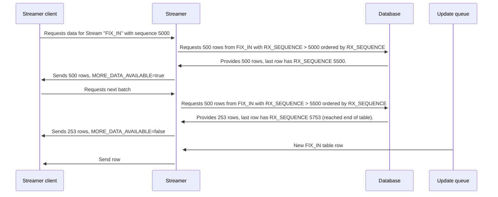

import Log from '/snippet/_LOG.md'
import CommonProcesses from '/snippet/_common-see-processes.md'
import CommonFieldOverrides from '/snippet/_common-field-overrides.md'

## Overview

**Streamers** provide reliable data streams to [streamer clients](/develop/server-capabilities/integrations/streamer-apis/streamer-client) based on a database table or view. These data streams are reliable as they are driven by an underlying unique, sequenced and monotonically increasing field found in the table or view itself.

The core streamer behaviour is the following:
- Streamer receives a **logon** message from a **streamer client** with or without a specific sequence number, for a specific streamer definition.
- The streamer will act differently depending on whether it received a sequence number or not.
    - If no sequence number has been received, the streamer will mark the streamer client connection as up to date.
    - If a sequence number has been received, the streamer will use it to read a batch of records (see [`batchSize`](#batchsize)) from the database using the defined table index. These records will be sent to the streamer client with an additional flag indicating whether there is more data available in the table or not.
        - If more data is available, the streamer client will request the next batch of data once the message is processed. This repeats the steps explained in the previous point, albeit no sequence number is needed, as the streamer knows how to read the next batch of records based on the previous batch.
        - If no more data is available, the streamer marks the streamer client connection as up to date.
    - Once the connection is marked as up to date, the streamer starts streaming real-time updates for any new **inserted** records belonging to the target table/view. **Important** only insert updates are eligible for streamers, as we assume the underlying table represents a sequence of messages or record changes that work in an "append-only" fashion.
    - The data can be transformed and filtered before being passed on to the **streamer client**.

:::warning
Streamers can only work as intended by using a numeric field in the underlying table. This field must represent a numeric sequence (perhaps defined as an auto increment field) and be both unique and monotonically increasing. This field must also be indexed.
:::

Additionally, streamers may use `xlator` plugins that enhance the available streamer configuration with new configuration blocks and data transformations. See the FIX xlator documentation [here](/develop/business-components/fix/fix-xlator/) for more information.


## Example configuration

A sample streamer configuration can be seen below:

```kotlin
streams {
    stream("FIX_IN_X", FIX_IN.BY_RX_SEQUENCE) {
        batchSize = 500

        fields {
            FIX_IN.FIX_DATA
        }

        where { fixIn ->
            fixIn.connectionName == "X"
        }
    }
}
```

And the FIX_IN table is defined as seen below:

```kotlin
    table(name = "FIX_IN", id = 7003) {
        field(name = "CONNECTION_NAME", type = STRING)
        field(name = "RX_SEQUENCE", type = LONG)
        field(name = "SENDER_ID", type = STRING)
        field(name = "TARGET_ID", type = STRING)
        field(name = "CL_ORD_ID", type = STRING)
        field(name = "ORIG_CL_ORD_ID", type = STRING)
        field(name = "INTERNAL_TARGET", type = STRING)
        field(name = "SIZE", type = INT)
        field(name = "FIX_DATA", type = STRING)
        primaryKey("RX_SEQUENCE")
        indices {
            unique("CONNECTION_NAME", "RX_SEQUENCE")
        }
    }
```

In this case we are defining a stream named "FIX_IN_X", using the `FIX_IN` table and the `BY_RX_SEQUENCE` index. The `BY_RX_SEQUENCE` index contains a single field named `RX_SEQUENCE`.

The `batchSize` configuration has been set to 500, so the streamer will only read 500 records at a time when replaying records.

The `fields` configuration has been defined to only extract the `FIX_DATA` field from the `FIX_IN` table, so no other fields will be provided to any **streamer clients** connecting to this streamer. In this case, `FIX_DATA` contains a string represenation of the whole FIX message.

The `where` configuration filters all data to ensure we only send records with `CONNECTION_NAME` equals to "X".

See sample workflow diagram below interactions between a hypothetical streamer client connecting to the streamer defined in our example:



## Configuration options

### `stream`
You can use the `stream` configuration to declare a reliable stream.

The simplest Streamer definition is:
```kotlin
streams {
    stream("ORDER_OUT", ORDER_OUT.BY_TIMESTAMP)
}
```

This example creates a stream called `ORDER_OUT`, based on the `ORDER_OUT` table (or view). The data will be streamed, ordered by timestamp.

`stream` contains additional configuration items explained below.

#### `batchSize`

`batchSize` determines how many records will be read from the database in each query when the streamer is replaying data after a successful streamer client connection.

The default value is 100.

Example usage below:
```kotlin
streams {
    stream("ORDER_OUT", ORDER_OUT.BY_TIMESTAMP){
        batchSize = 500
    }
}
```

#### `logoffTimeout`

`logoffTimeout` determines how often the streamer will review its current streamer client connections to check if they are still alive. If a connection is not alive anymore, it will be closed. The value is measured in seconds.

The default value is 5000.

Example usage below:
```kotlin
streams {
    stream("ORDER_OUT", ORDER_OUT.BY_TIMESTAMP){
        logoffTimeout = 60
    }
}
```

#### `maxLogons`

`maxLogons` determines how many streamer client connections can be established to this particular streamer. This ensures no more connections than absolutely necessary are allowed.

The default value is 1.

Example usage below:
```kotlin
streams {
    stream("ORDER_OUT", ORDER_OUT.BY_TIMESTAMP){
        maxLogons = 2
    }
}
```

#### `terminateOnError`

`terminateOnError` determines the behaviour of the streamer client when an exception is thrown. For example, in the sample code below we apply a transformation to the outgoing `GenesisSet` message that will throw an exception:

```kotlin
streams {
    stream("ORDER_OUT", ORDER_OUT.BY_TIMESTAMP) {
        toGenesisSet { ordersOut ->
            throw RuntimeException()
        }
    }
}
```

By default `terminateOnError` is set to true, which means the streamer process will crash as soon as the first record hits the `toGenesisSet` transformation.
When the stream is terminated, the process will go into a WARNING state with the terminated streamer name detailed in the message column of `mon`.
If set to `false`, the exception will be logged, but the streamer will continue process rows.


#### `where`

The `where` tag enables the stream to be filtered. It is available in two versions: one that has the streamed row as a parameter, and one that also has the logon message.

Here, we only stream orders with a quantity greater than 1,000.
```kotlin
streams {
    stream("ORDER_OUT", ORDER_OUT.BY_TIMESTAMP) {
        where { ordersOut ->
            ordersOut.quantity > 1_000
        }
    }
}
```

In this example, we only stream orders with a quantity greater than 1,000 and where the logon message has provided a secret key.
```kotlin
streams {
    stream("ORDER_OUT", ORDER_OUT.BY_TIMESTAMP) {
        where { ordersOut, logonMessage ->
            ordersOut.quantity > 1_000 && logonMessage.getString("KEY") == "SECRET"
        }
    }
}
```

#### `fields`

The `fields` tag enables you to transform the message output in a similar way to views, data server and req rep definitions. For example, here we output three fields:
```kotlin
streams {
    stream("ORDER_OUT", ORDER_OUT.BY_TIMESTAMP) {
        fields {
            ORDER_OUT.CLIENT_ID
            ORDER_OUT.QUANTITY withPrefix "ORDER"
            ORDER_OUT.CLIENT_ID withAlias "CLIENT"
        }
    }
}
```

<CommonFieldOverrides />


#### `toGenesisSet`

The `toGenesisSet` tag enables you to create a custom [`GenesisSet`](/develop/server-capabilities/communications/#genesisset) from the table/view entity before it is automatically converted and sent to the streamer client.

Example below:
```kotlin
streams {
    stream("ORDER_OUT", ORDER_OUT.BY_TIMESTAMP) {
        toGenesisSet { ordersOut ->
            genesisSet {
                "ORDER_QUANTITY" with ordersOut.quantity
                "ORDER" with ordersOut.orderId
            }
        }
    }
}
```

#### `toEntity`

The `toEntity` tag allows you to create a custom [`DbEntity`](/develop/server-capabilities/data-access-apis/#database-entities) from the table/view entity before it is automatically converted and sent to the streamer client as a `GenesisSet`.

Example below:
```kotlin
streams {
    stream("ORDER_OUT", ORDER_OUT.BY_TIMESTAMP) {
        toEntity { ordersOut ->
            Order {
                quantity = ordersOut.quantity
                orderId = ordersOut.orderId
            }
        }
    }
}
```

#### Custom Log messages

<Log />

## Metrics

:::info
Ensure you have [enabled metrics](/build-deploy-operate/operate/metrics/#enabling-metrics) in your environment to view them.
:::

The metrics for the Streamer measure how long it takes to replay a single message batch when working in recovery mode:


| Metric                    | Explanation                               |
|:--------------------------|:------------------------------------------|
| replay_processing_latency | The latency for processing a replay batch |


## Runtime configuration

To include your `*-streamer.kts` file definitions in a runtime process, you will need to ensure the process definition:

1. Ensure `genesis-pal-streamer` is included in `module`
2. Ensure `global.genesis.streamer.pal` is included in `package`
3. Ensure your streamer.kts file(s) are defined in `script`
4. Ensure `pal` is set in `language`

If you wish to run a dedicated process for a streamer, the following gives an example full process definition:

```xml{13}
<process name="POSITION_STREAMER">
  <groupId>POSITION</groupId>
  <description>Streams trades to external FIX gateway</description>
  <start>true</start>
  <options>-Xmx256m -DRedirectStreamsToLog=true -DXSD_VALIDATE=false -XX:MaxHeapFreeRatio=70 -XX:MinHeapFreeRatio=30 -XX:+UseG1GC -XX:+UseStringDeduplication -XX:OnOutOfMemoryError="handleOutOfMemoryError.sh %p"</options>
  <module>genesis-pal-streamer</module>
  <package>global.genesis.streamer.pal</package>
  <primaryOnly>true</primaryOnly>
  <script>position-streamer.kts</script>
  <loggingLevel>INFO,DATADUMP_ON</loggingLevel>
  <language>pal</language>
</process>
```

<CommonProcesses/>