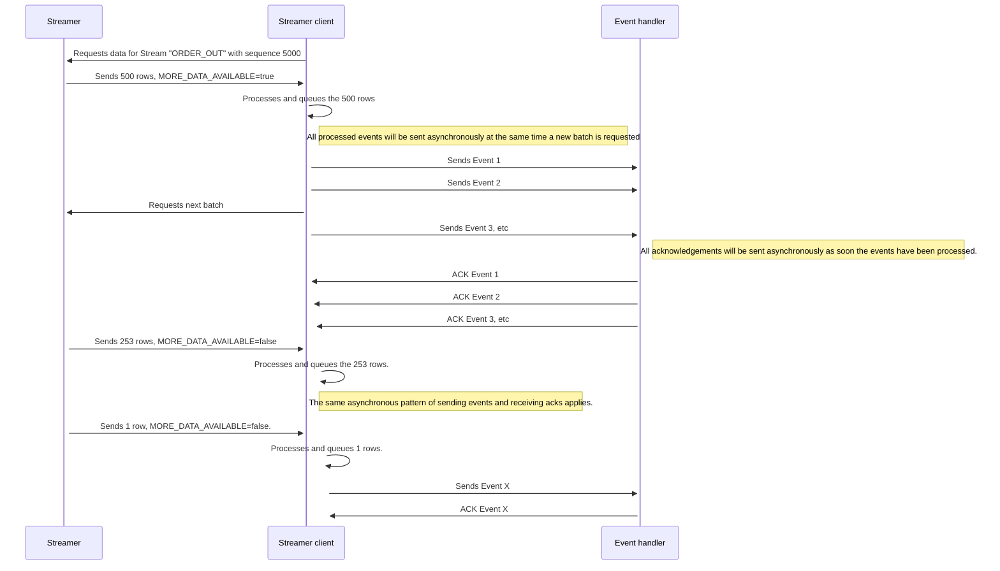

import Log from '/snippet/_LOG.md'
import CommonProcesses from '/snippet/_common-see-processes.md'
import CommonFieldOverrides from '/snippet/_common-field-overrides.md'
import CommonGpalStandards from '/snippet/_common-gpal-standards.md'

## Overview

**Streamer clients** link data streams from [streamers](/develop/server-capabilities/integrations/streamer-apis/streamer/) to a target [event handler](/develop/server-capabilities/core-business-logic-event-handler/) based on their configuration.
This linkage takes into account whether the data has been processed by the event handler in order to provide recoverability in case of failure.

The core streamer client behaviour is the following:
- Streamer client sends a **logon** message to a **streamer** with or without a specific sequence number, for a specific streamer definition.
- The streamer client will now start receiving messages from the **streamer**, either as part of a recovery message workflow, or real-time messages.
  - If the message received contains a flag named `MORE_DATA_AVAILABLE` set to true, the streamer client will send a message to the **streamer** requesting the next batch of data once it has finished processing the message.
  - The previous step will be repeated as long as the `MORE_DATA_AVAILABLE` is set to true in the incoming message from the streamer.
- Once `MORE_DATA_AVAILABLE` is received as `false`, the streamer client will stop requesting new batches of data and just process real-time messages as they come.
- These messages can be transformed and filtered before being passed on to the **event handler**.
- Streamer clients also have a backpressure mechanism to avoid overloading the event handler with too many messages.
    - For each message sent to an event handler, an internal counter is increased by one. This counter represented the currently unacknowledged messages.
    - The expectation is that each message will receive an acknowledgement from the event handler. For each acknowledgement, the internal counter is decreased by one.
    - The [`eventHandlerBuffer`](#eventhandlerbuffer) configuration item determines the maximum number of unacknowledged messages allowed on a streamer client configuration.
    - If the `eventHandlerBuffer` number is reached, the streamer client will assume the event handler is overloaded, and stop sending messages until the number is decreased. Any messages received from the streamer will be queued in the meantime.
- The streamer client data recovery mechanism is handled by an internal file cache as well as a database record stored in the `PROCESS_REF` table.
    - On a failure event, the streamer client will read from the file cache first (and table second if cache is not available) to determine what was the least recent non-acknowledged message sequence number.
    - If there are no unacknowledged messages, it will pick the latest acknowledged sequence number.
    - Then it will use this sequence number to request data from the streamer. This way it ensures any records after the last processed sequence will be streamed to the event handler.
    - More information about sequence numbers and how they are used can be found in the [streamer page](/develop/server-capabilities/integrations/streamer-apis/streamer/).

:::warning
Streamer client processes should run in `primaryOnly` mode to avoid sending a duplicated message stream to an event handler.

Streamer client processes may replay messages that have been sent to an event handler previously in event of failure. Event handler implementations must take this into account and build duplicate message protection accordingly.
:::

Additionally, streamer clients may use `xlator` plugins that enhance the available streamer configuration with new configuration blocks and data transformations. See the FIX xlator documentation [here](/develop/business-components/fix/fix-xlator/) for more information.

Genesis Streamer Clients are defined in the `*-streamer-client.kts` files or in compiled Kotlin classes extending `GPalStreamerClient`.

<CommonGpalStandards />

## Example configuration

A sample streamer client configuration can be seen below:

```kotlin
streamerClients {
    streamerClient(clientName = "ORDER_OUT") {
        eventHandlerBuffer = 500
        dataSource(processName = "POSITION_STREAMER", sourceName = "ORDER_OUT")
        onMessage {
            send(targetProcess = "POSITION_EVENT_HANDLER", messageType = "EVENT_ORDER_OUT")
        }
    }

    streamerClient(clientName = "FILTERED_QUOTE", selectOn = QUOTE.SYMBOL) {
        dataSource(processName = "POSITION_STREAMER", sourceName = "QUOTE_STREAM")

        onMessage(where = "VODL") {
            sendFormatted(targetProcess = "POSITION_EVENT_HANDLER", messageType = "EVENT_VODL_QUOTE") {
                QUOTE.SYMBOL
                QUOTE.PRICE withAlias "BID_PRICE"
            }
        }

        onMessage(where = "MSFT") {
            sendFormatted(targetProcess = "POSITION_EVENT_HANDLER", messageType = "EVENT_MSFT_QUOTE") {
                QUOTE.SYMBOL
                QUOTE.SECURITY_EXCHANGE withAlias "EXCHANGE"
                QUOTE.PRICE withAlias "BID_PRICE"
            }
        }
    }
}
```

And the QUOTE table is defined as seen below:
```kotlin
    table(name = "QUOTE", id = 7005) {
        field(name = "SYMBOL", type = STRING)
        field(name = "SECURITY_EXCHANGE", type = STRING)
        field(name = "PRICE", type = DOUBLE)
        field(Name = "QUOTE_DATETIME", type = DATETIME)
        primaryKey("SYMBOL")
    }
```

In the example we see two different streamer client definitions, one named "ORDER_OUT" and another one named "FILTERED_QUOTE".

The "ORDER_OUT" definition, is pretty simple:
- The `dataSource` configuration has two parameters `processName` and `sourceName` with the values "POSITION_EVENT_HANDLER" for the former and "EVENT_VODL_QUOTE" for the latter. These correspond to the **streamer** process name, and the **stream** name defined within the streamer we are connecting to.
- The `eventHandlerBuffer` is configured to 500, so a maximum number of 500 events can ever be in flight as explained in the [overview](#overview) section.
- The `onMessage` block defines the simplest `send` configuration to redirect the data received from the streamer to an event handler without any transformations or filtering. In this case, the `targetProcess` parameter refers to the event handler process name (POSITION_EVENT_HANDLER) and the `messageType` parameter refers to the specific event handler endpoint we should route the message to.

In the case of the "FILTERED_QUOTE" definition, we see a few more configuration settings.
- The `streamerClient` has been defined with a name, but also a `selectOn` field. This allows the streamer client to do specific logic based on one of the message fields.
- In this case the `selectOn` parameter is using the `SYMBOL` field of the `QUOTE` table, as we know the incoming message from the streamer is actually equivalent to the `QUOTE` table entity definition.
- The `dataSource` configuration is similar to "ORDER_OUT", but in this case we are targeting a different streamer definition: "QUOTE_STREAM".
- The `onMessage` blocks have a `where` parameter this time, and it is based on the `selectOn` field: "SYMBOL".
    - In this configuration, we have two `onMessage` definitions to define different behaviour depending on whether the incoming "SYMBOL" value from a "QUOTE_STREAM" record is "MSFT" or "VODL".
    - In the case of "VODL", we use the `sendFormatted` configuration to target the "POSITION_EVENT_HANDLER" process and the "EVENT_VODL_QUOTE" event handler. Then the message is formatted to only send the values for SYMBOL and PRICE field. It is important to not that the field names can also be formatted, and in this case the PRICE field name is changed to be BID_PRICE using the `withAlias` configuration.
    - In the case of "MSFT", we use `sendFormatted` to target "POSITION_EVENT_HANDLER", but this time a different event handler: "EVENT_MSFT_QUOTE". The message itself is also formatted like the previous one, but we also include the field SECURITY_EXCHANGE and rename it as EXCHANGE.

A sample workflow for the first streamer client definition can be seen below:



## Configuration options


### `streamerClient`
You can use the `streamerClient` configuration to declare a reliable stream.

The simplest Streamer-client definition is:
```kotlin
streamerClients {
    streamerClient(clientName = "ORDER_OUT") {
        dataSource(processName = "POSITION_STREAMER", sourceName = "ORDER_OUT")
        onMessage {
            send(targetProcess = "POSITION_EVENT_HANDLER", messageType = "EVENT_ORDER_OUT")
        }
    }
}
```

The `clientName` parameter is used to uniquely identify a `streamerClient` definition.

In more detail, there are three types of streamer client definitions, including the one seen above:

1. `GenesisSet` streamer client. It uses the raw [`GenesisSet`](/develop/server-capabilities/communications/#genesisset) message received from the streamer for transformation and configuration purposes.
```kotlin
// builds a GenesisSet based streamer client
streamerClient(clientName = "{name}") { ... }
```

2. Table or View entity streamer client. It uses an existing [`DbEntity`](/develop/server-capabilities/data-access-apis/#database-entities) for type safe configuration. Most useful when the streamer is streaming `DbEntity` objects.
```kotlin
// builds a type safe QUOTE streamer client
streamerClient(clientName = "{name}", source = QUOTES { ... }
```

3. And finally, selective streamer clients. These type of streamerclient definitions combine a `selectOn` parameter with different `onMessage` blocks to ensure messages are handled differently depending on the selected field value.
The example below enables you to handle VODL quotes one way and MSFT quotes in another:

```kotlin
streamerClient(clientName = "CLIENT", selectOn = QUOTE.SYMBOL) {
    onMessage(where = "VODL") { ... }
    onMessage(where = "MSFT") { ... }
}
```

In the case of `GenesisSet` streamer clients, the field selection syntax can be one of the following:

```kotlin
// use the Fields object:
streamerClient(clientName = "CLIENT", selectionField = Fields.SYMBOL) { ... }

// specify a field and type
streamerClient(clientName = "CLIENT", selectionField = "SYMBOL", type = INTEGER) { ... }

// if no type is specified it will default to STRING
streamerClient(clientName = "CLIENT", selectionField = "SYMBOL") { ... }
```

#### `dataSource`

The `dataSource` setting specifies what streamer process, and what stream within that process should be used as part of the `streamerClient` definition.

The parameters are `processName` and `sourceName` to identify the streamer process name and stream name respectively.

Example usage below:
```kotlin
streamerClients {
    streamerClient(clientName = "ORDER_OUT") {
        dataSource(processName = "POSITION_STREAMER", sourceName = "ORDER_OUT")
        onMessage(subscriptionKey = "POSITION_EVENT_HANDLER") {
            send(targetProcess = "POSITION_EVENT_HANDLER", messageType = "EVENT_ORDER_OUT")
        }
        onMessage(subscriptionKey = "POSITION_EVENT_HANDLER") {
            send(targetProcess = "POSITION_EVENT_HANDLER", messageType = "EVENT_ORDER_OUT")
        }
    }
}
```

#### `onMessage`
The `onMessage` configuration defines what the streamer client does with each streamer message. It has three operations: `where`, `send` and `sendFormatted`.

- When using non-selective [`streamerClient`](#streamerclient) definitions, `onMessage` may optionally have a `subscriptionKey` parameter to identify each `onMessage` block.
Different `onMessage` blocks may have different transformations and `where` configurations too.
In those cases, the `subscriptionKey` is important, as a single streamer client definition may connect to multiple processes or multiple event handler endpoints with different formatting logic, so `subscriptionKey` allows for an easy way to identify each `onMessage` stream.
By default, `subscriptionKey` is equal to the `streamerClient` definition `clientName` parameter.

- In the case of selective `streamerClient` definitions, a `where` parameter must be provided, and optionally a `subscriptionKey` parameter as well. `subscriptionKey` is necessary for the same reason explained in the previous point and by default it will be equal to the `where` parameter value.

Some examples for non-selective and selective `onMessage` blocks can be seen below:

```kotlin
streamerClients {
    streamerClient(clientName = "ORDER_OUT") {
        eventHandlerBuffer = 500
        dataSource(processName = "POSITION_STREAMER", sourceName = "ORDER_OUT")
        onMessage(subscriptionKey = "POSITION") {
            send(targetProcess = "POSITION_EVENT_HANDLER", messageType = "EVENT_ORDER_OUT")
        }
        onMessage(subscriptionKey = "OMS") {
            send(targetProcess = "OMS_EVENT_HANDLER", messageType = "EVENT_ORDER_OUT")
        }
    }

    streamerClient(clientName = "FILTERED_QUOTE", selectOn = QUOTE.SYMBOL) {
        dataSource(processName = "POSITION_STREAMER", sourceName = "QUOTE_STREAM")

        onMessage(where = "VODL") {
            sendFormatted(targetProcess = "POSITION_EVENT_HANDLER", messageType = "EVENT_VODL_QUOTE") {
                QUOTE.SYMBOL
                QUOTE.PRICE withAlias "BID_PRICE"
            }
        }

        onMessage(where = "MSFT", subscriptionKey = "OMS") {
            sendFormatted(targetProcess = "OMS_EVENT_HANDLER", messageType = "EVENT_MSFT_QUOTE") {
                QUOTE.SYMBOL
                QUOTE.SECURITY_EXCHANGE withAlias "EXCHANGE"
                QUOTE.PRICE withAlias "BID_PRICE"
            }
        }
    }
}
```

##### `where`

The `where` configurations ensures only certain messages are sent to the event handler based on a predicate. This operation has one parameter corresponding to the streamer client message type. This can be:
- a table or view entity
- a GenesisSet

As this operation is a predicate, it must return a Boolean value.

Example below for a `DbEntity` approach using the `QUOTE` table:

```kotlin
where { quote ->
    quote.price > 0.0
}
```

Another example this time using `GenesisSet`:

```kotlin
where { quote ->
    quote.getDouble("PRICE", 0.0) > 0.0
}
```

##### `send` and `sendFormatted`

The `send` configuration allows directs and optionally formats the outgoing message.
It requires two parameters `targetProcess` and `messageType`.

Each `onMessage` block must have at least one `send` block.

For example:
```kotlin
send(targetProcess = "POSITION_EVENT_HANDLER", messageType = "EVENT_QUOTE_INSERT")
```

This will send the full content of the streamer message on to the target.

In addition, for entity streamers, you can format the message in the same way as you would define the output of a view, data server, or request reply.

Use `sendFormatted` in this scenario:

```kotlin
sendFormatted("POSITION_EVENT_HANDLER", "EVENT_QUOTE_INSERT") {
    QUOTES.SYMBOL
    QUOTES.PRICE withAlias "BID_PRICE"
}
```

<CommonFieldOverrides />

Finally, you can craft the message from scratch.

This example uses just the streamer message as a parameter, which may be a `GenesisSet` or a `DbEntity` as explained in the [`where`](#where) section:

```kotlin
send("POSITION_EVENT_HANDLER", "EVENT_QUOTE_INSERT") { quote ->
    genesisSet {
        "SYMBOL" with quote.symbol
        "BID_PRICE" with quote.price
    }
}
```
The example below uses the streamer message as a parameter (in this case a `DbEntity` object for `QUOTE`) and an optional `GenesisSet` parameter that acts as the output object.
The `GenesisSet` object will be empty and this method is just a convenient way of writing the same code as in the previous example, without having to create a new `GenesisSet` object.

```kotlin
send("QUOTE_HANDLER", "QUOTE_EVENT") { quote, set ->
    set.setString("SYMBOL", quote.symbol)
}
```
When using this `send` example, you need to specify both parameters, (`quote ->` or `quote, set ->`). The default `it` Kotlin parameter does not work in this case.


#### `isReplayable`

`isReplayable` is a boolean flag that determines whether the stream should keep track of sequence numbers for recoverability purposes on process start (see [overview](#overview) for more information on recoverability).

Default value is `false`.

Example usage below:
```kotlin
streamerClients {
    streamerClient(clientName = "ORDER_OUT") {
        isReplayable = true
        dataSource(processName = "POSITION_STREAMER", sourceName = "ORDER_OUT")
        onMessage {
            send(targetProcess = "POSITION_EVENT_HANDLER", messageType = "EVENT_ORDER_OUT")
        }
    }
}
```

#### `eventHandlerBuffer`

`eventHandlerBuffer` is a setting to specify how many unacknowledged messages can be "in-flight" before the streamer client stops sending. If the event handler fails to respond after this number of messages is reached, the streamer client stops sending messages.

The default value is 50.

Example usage below:
```kotlin
streamerClients {
    streamerClient(clientName = "ORDER_OUT") {
        isReplayable = 50
        dataSource(processName = "POSITION_STREAMER", sourceName = "ORDER_OUT")
        onMessage {
            send(targetProcess = "POSITION_EVENT_HANDLER", messageType = "EVENT_ORDER_OUT")
        }
    }
}
```


#### `sentWarningRange`

`sentWarningRange` is a setting to specify a time range in seconds to wait before marking the streamer client as WARNING or ERROR once `eventHandlerBuffer` has been reached.

It compares the last time a message was sent to the event handler against the current time to understand the current elapsed time:
- If there are no unacknowledged messages, mark process as HEALTHY.
- If elapsed time is less than lower part of the range, mark process as HEALTHY.
- If elapsed time is between the lower part of then range and the upper part of the range, mark process as WARNING.
- If elapsed time is above the upper part of the range, mark process as ERROR.

The default value is 5 seconds for the lower part of the range, and 60 seconds for the upper part of the range.

Example usage below:
```kotlin
streamerClients {
    streamerClient(clientName = "ORDER_OUT") {
        sentWarningRange = 5L..60L
        dataSource(processName = "POSITION_STREAMER", sourceName = "ORDER_OUT")
        onMessage {
            send(targetProcess = "POSITION_EVENT_HANDLER", messageType = "EVENT_ORDER_OUT")
        }
    }
}
```

#### `receiveWarningRange`

`receiveWarningRange` is similar to the previous setting, but it applies even when `eventHandlerBuffer` max size has not been reached. This can capture odd scenarios in which only a handful of messages are never acknowledged, but otherwise the data stream seems to work as expected.

It compares the last time a message was received from the event handler against the current time to understand the current elapsed time:
- First the checks in `sentWarningRange` apply. Additionally, if the elapsed time for the last time a message was sent is less than the lower part of the `sentWarningRange` the process is always marked as healthy.
- If the previous point doesn't apply, the same logic used in `sentWarningRange` applies here:
    - If elapsed time is less than lower part of the range, mark process as HEALTHY.
    - If elapsed time is between the lower part of then range and the upper part of the range, mark process as WARNING.
    - If elapsed time is above the upper part of the range, mark process as ERROR.


The default value is 5 seconds for the lower part of the range, and 60 seconds for the upper part of the range.

Example usage below:
```kotlin
streamerClients {
    streamerClient(clientName = "ORDER_OUT") {
        receiveWarningRange = 5L..60L
        dataSource(processName = "POSITION_STREAMER", sourceName = "ORDER_OUT")
        onMessage {
            send(targetProcess = "POSITION_EVENT_HANDLER", messageType = "EVENT_ORDER_OUT")
        }
    }
}
```

#### `updateFrequency`

`updateFrequency` is the time interval in milliseconds used to perform the checks for `receiveWarningRange` and `sentWarningRange`.

The default value is 2000 milliseconds.

Example usage below:
```kotlin
streamerClients {
    streamerClient(clientName = "ORDER_OUT") {
        updateFrequency = 5L..60L
        dataSource(processName = "POSITION_STREAMER", sourceName = "ORDER_OUT")
        onMessage {
            send(targetProcess = "POSITION_EVENT_HANDLER", messageType = "EVENT_ORDER_OUT")
        }
    }
}
```

#### `cacheEntries`

:::warning
This setting must be used with extreme caution. If the default value is changed, the corresponding cache file (found inside $GENESIS_HOME/runtime/cache) for the relevant streamer client definition needs to be deleted before the streamer client process is restarted. This setting is marked as deprecated in the code to highlight the importance of this fact.
:::

`cacheEntries` sets how many entries will be allocated in the streamer client cache file.

Each streamer client subscription creates a `ChronicleMap` instance with capacity for 2000 entries by default.
This is used as the cache for events that have been received from the streamer and sent to the event handler.
The map uses the unique numeric sequence value provided by the streamer as a key, and then a status (`SENT` or `COMPLETE`) as the value.

Once an event has been sent to the event handler, we mark the sequence reference as `SENT`. When the streamer client receives a response, it is marked as `COMPLETE`.

Every two seconds, a job runs to update the PROCESS_REF database table with the data stored in the `ChronicleMap` instance (if there is any). The value stored in the database is either:

- the oldest `SENT` value (if available)
or
- if no `SENT` values are stored, the latest `COMPLETE` value

The idea is that whenever it is necessary, we can always replay events from the streamer, starting from the oldest `SENT` (there was no response for that event, and we can't guarantee it was processed successfully). If no `SENT` values are available, then it is safe to replay from the latest `COMPLETE` event. As part of this job, we also remove entries from the ChronicleMap that have been marked as `COMPLETE`.

If the `ChronicleMap` file is not present, the database value will be used.

`ChronicleMap` instances need to be pre-allocated with a fixed set of parameters. If the streamer client tries to store more than 2000 entries before the cleaning/flushing job runs (i.e. within two seconds), it exceeds the maximum capacity. This is a possibility when the stream is overloaded. In this scenario, `cacheEntries` should be changed to accommodate higher volumes.

Example usage below:
```kotlin
streamerClients {
    streamerClient(clientName = "ORDER_OUT") {
        cacheEntries = 2000
        dataSource(processName = "POSITION_STREAMER", sourceName = "ORDER_OUT")
        onMessage {
            send(targetProcess = "POSITION_EVENT_HANDLER", messageType = "EVENT_ORDER_OUT")
        }
    }
}
```

#### Custom Log messages

<Log />

## Metrics

:::info
Ensure you have [enabled metrics](/build-deploy-operate/operate/metrics/#enabling-metrics) in your environment to view them.
:::

The metrics for the Streamer client measure how long it takes for each streamer client to be processed by the target event handlers, as well as the total number of unacknowledged messages.

These metrics allow monitoring tools to understand if some specific event handlers are overwhelmed, as well as how quickly they can deal with each streamer client message.

If the unacknowledged message size stays at a high number, the possible causes are:
- The event handler is unable to keep up with the message flow.
- The event handler is not sending an acknowledgement in response to the messages for any reason.

| Metric                      | Explanation                                                                     |
|:----------------------------|:--------------------------------------------------------------------------------|
| unreplied_messages_size     | The number of outstanding messages          for each streamer client definition |
| outbound_processing_latency | The event handler processing latency for each streamer client definition        |


## Runtime configuration

To include your Streamer Client definitions in a runtime process, configure the process as follows depending on whether you use script files, compiled definitions, or both.

### Using script files

- **package**: ensure `global.genesis.streamerclient.pal` is included
- **module**: ensure `genesis-pal-streamerclient` is included
- **script**: your `*-streamer-client.kts` file(s), comma-separated if more than one
- **language**: `pal`

### Using compiled definitions only

- **package**: the package that contains your compiled definition class (e.g. `my.app`)
- **module**: your application's module (e.g. `position-app`)
- Do **not** set `script` or `language`. Dependency injection discovers compiled GPAL definitions in the scanned package and instantiates the service automatically.

### Mixing script and compiled

Use the same **package** and **module** as for compiled-only (your definition package and your app's module). Also set **script** and **language** as for script-based. Definitions from script files and from compiled classes are merged.

If you wish to run a dedicated process for a streamer client, the following gives an example using script files:

```xml{13}
<process name="POSITION_STREAMER">
  <groupId>POSITION</groupId>
  <description>Streams trades to external FIX gateway</description>
  <start>true</start>
  <options>-Xmx256m -DRedirectStreamsToLog=true -DXSD_VALIDATE=false -XX:MaxHeapFreeRatio=70 -XX:MinHeapFreeRatio=30 -XX:+UseG1GC -XX:+UseStringDeduplication -XX:OnOutOfMemoryError="handleOutOfMemoryError.sh %p"</options>
  <module>genesis-pal-streamerclient</module>
  <package>global.genesis.streamerclient.pal</package>
  <primaryOnly>true</primaryOnly>
  <script>position-streamer-client.kts</script>
  <loggingLevel>INFO,DATADUMP_ON</loggingLevel>
  <language>pal</language>
</process>
```

For compiled definitions only, use your app's module and definition package and omit `script` and `language`.

<CommonProcesses/>
