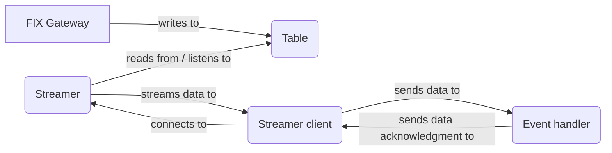
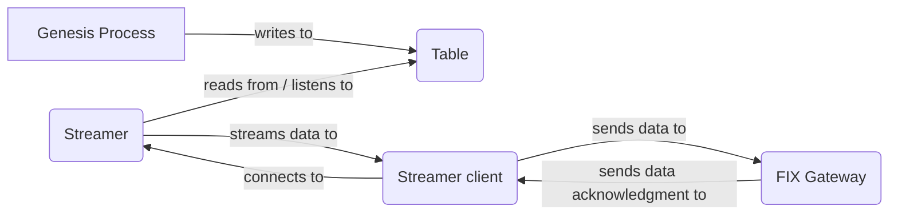

If your application needs to integrate with external systems through any sort of gateway (e.g. [FIX](/develop/business-components/fix/fix-gateway/)), you need to be able to interpret incoming messages in the format of the external system. Equally, you need to be able to reformat information from your Genesis application when you send messages out to that system.

For this, Genesis uses Streamers, Streamer Clients and gateways.

* A **Streamer** listens to a table or view, and streams data out to Streamer Clients. In many cases, you listen to a reliable, auditable table with unique time-stamped updates - an audit table. Or alternatively, a table that represents a unique and sorted sequence of messages and behaves in an **insert-only** fashion. This ensures that, in the event of failure, a Streamer is able to go back and stream from a specific timestamp.
Follow this link to learn more about [streamers](/develop/server-capabilities/integrations/streamer-apis/streamer).
* A **Streamer Client** links a stream of messages provided by a **Streamer** with an [event handler](/develop/server-capabilities/core-business-logic-event-handler/). On start up, it will request data from **streamer** processes depending on its definition. Once it receives the data from the **streamer**, it will apply any defined transformations and pass the result to a target event handler.
Streamer clients are usually configured for replayability. In that case, if the **streamer client** is killed or crashes for any reason, it will request data from the **streamer** again on the next restart, but this time using the last valid processed timestamp/sequence to avoid reprocessing previously successful messages.
Follow this link to know more about [streamer clients](/develop/server-capabilities/integrations/streamer-apis/streamer-client)
* A **Gateway** is a message routing service that connects to an external service, and exposes [event handler](/develop/server-capabilities/core-business-logic-event-handler/) endpoints. For example, a [FIX gateway](/develop/business-components/fix/fix-gateway/) uses the FIX protocol to connect to exchanges or other trading hubs.

As Streamer and Streamer Client processes can be run separately, it is possible to serve multiple clients with a single **Streamer** to perform different activities.

For example, you could have two separate Streamer Clients (A and B) listening to Streamer X:

* Streamer Client A sends data to the FIX gateway.
* Streamer Client B sends the data to a separate external application.

A sample inbound flow from a FIX Gateway could look like this:

A sample outbound flow to a FIX Gateway would look like this instead:

As you can see, both inbound and outbound flows are in fact the same, because the FIX gateway is both a process that writes to a table, and an event handler in itself.