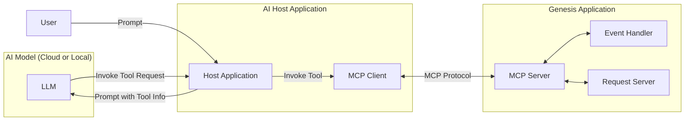

Genesis supports exposing application endpoints through **MCP (Model Context Protocol)**, enabling seamless interaction between your applications and Large Language Models (LLMs). This new capability allows any LLM (e.g., ChatGPT, Claude, Gemini) to understand and invoke functionality within your Genesis-built apps using structured interfaces.

This opens up use cases like:
- AI copilots triggering backend workflows
- LLMs querying real-time application data
- Conversational automation across multiple applications



## What is MCP?

MCP (Model Context Protocol) is a standard interface that exposes application capabilities in a format that LLMs can understand and interact with. These capabilities are described via metadata, which lets an LLM know:
- What operations are available
- What inputs are required
- What responses to expect

Because all Genesis Event Handlers and Request Servers automatically generate and publish metadata describing the request and response formats, any one of these endpoints can easily be enabled for interaction via AI through MCP.

More information on MCP can be found on the official website, [here](https://modelcontextprotocol.io/introduction).

## Getting Started

### Step 1: Enable the MCP Server Process

MCP is an experimental feature that is disabled by default for applications. Developers must opt in to enable it. To enable MCP and have the `GENESIS_MCP` process appear in your application, add the following sysdef item to your application's [`genesis-system-definition.kts` file](/develop/server-capabilities/runtime-configuration/system-definition/):

```kotlin
item(name = "GENESIS_MCP_PROCESS_START", value = "true")
```

### Step 2: Configure your application MCP server

By default, the MCP server opens an HTTP server on port 3001. This, and other settings, can be re-configured by overriding the platform-provided `genesis-mcp-server.kts` file, [instructions on how to do this can be found here](/develop/server-capabilities/runtime-configuration/site-specific/#overriding-platform-provided-files).

The full set of attributes which can be reconfigured are:

|Attribute                  |Description                |Default value|
|---------------------------|---------------------------|-------------|
|`serverName`               |The name of your MCP server, this is the name AI will call your application by|`genesis`|
|`version`                  |The version of your MCP server. You should increment this with your product where new functionality is made available to AI|`1.0.0`|
|`port`                     |The port the HTTP server will run on|`3001`|
|`toolRefreshIntervalMillis`|The amount of time the server will wait before checking the app metadata again for any new resources|`10000L`|
|`authenticationStrategy`   |See the [authentication strategy section](#authentication--security) for more details|`staticUser`|

Example configuration:

```kotlin
server {
    serverName = "genesis"
    version = "1.0.0" 
    port = 3001
    toolRefreshIntervalMillis = 10000L 

    authenticationStrategy {
        staticUser {
            userName = "admin"
            requiresApproval = true
        }
    }
}
```

### Step 3: Enable Event Handlers and Request Servers for MCP

We then need to enable individual resources for MCP, as we do not want to expose all resources by default. We can do that by creating an `<application>-mcp.kts` file in `<application>-app/src/main/genesis/scripts` where `<application>` should be substituted by your application's name.

Here is a short example file containing one [event handler](/develop/server-capabilities/core-business-logic-event-handler/) endpoint and one [request server](/develop/server-capabilities/snapshot-queries-request-server/) endpoint:

```kotlin
mcp {
    enableMcp("EVENT_INSERT_TRADE") {
        this.context = """
            Event used to enter a new trade into the system.
        """.trimIndent()
    }
    enableMcp("TRADE") {
        this.context = """
            Query providing details of the trades available in the application.
        """.trimIndent()
    }
}
```

The context is passed to the LLM as the description of the MCP tool created for the resource. Assuming matching event handler and request server names, MCP reads their metadata to infer attributes and types. Events are matched by lowercase name; request servers use the name with _query appended. The resulting endpoints for the example above are:

- `event_insert_trade`
- `trade_query`

The `context` attribute is used to provide further context to the MCP Tool, and can be as long as required. You can include specific examples and guidelines on how to use the tool, to guide the LLM. When using older, slower models it is sometimes desirable to add more context.

## Authentication / Security

Security must be a strong consideration when using MCP in your application. The `authenticationStrategy` block defines which user's details will be used to query the system and that user's permissions will be used when interacting with your application.

Here we detail the different authentication methods available:

### Static user

With the static user strategy, each message created as a result of a tool call request will be sent from a single static user account. This strategy allows you to configure whether invocations of event handlers are always subject to approval by another user (it is recommended to set this to true).

Example:
```kotlin
authenticationStrategy {
  staticUser {
    userName = "admin"
    requiresApproval = true
  }
}
```
:::warning
This configuration should be used with caution in systems with strict [`authorization setups`](/develop/server-capabilities/access-control/authorization/)
:::

### Provided user

If you use this strategy, an additional mandatory user name parameter will be added to the definition of each MCP tool. The LLM / host application / proxy process will be responsible for making sure this is populated.
Example:
```kotlin
authenticationStrategy {
  providedUserName {
    addToToolSpec = true
  }
}
```

### Session token

If you use this strategy, an additional mandatory session token parameter will be added to the definition of each MCP tool. The LLM / host application / proxy process will be responsible for making sure this is populated, requiring a login to the Genesis Application.
Example:
```kotlin
authenticationStrategy {
  sessionAuthToken {
    addToToolSpec = true
  }
}
```

## Connecting an AI agent to the MCP server

In order to connect an AI enabled application to the Genesis MCP Server, you will need access to an AI model.

Some application such as Claude Desktop automatically send requests to and from a model hosted in the cloud, however it is possible to test the MCP server entirely with a local stack.

### Using an MCP Proxy
The MCP protocol can operate via stdio (for command line based tools) and over HTTP. The Genesis MCP server opens an http port (3001).
However, most desktop tools including Claude Desktop and mcphost only support stdio.
In order to connect these tools to the Genesis HTTP MCP server, you can use an mcp-proxy process that does the conversion between the two protocols.

Proxy tools are available in various languages and build systems on github.

### Using Claude desktop
Instructions on how to enable Claude Desktop for MCP server integration can be found [here](https://modelcontextprotocol.io/quickstart/user).

### Using `mcphost`
`mcphost` is a simple command line application, written in Go, that provides the bare minimum functionality to integrate MCP servers with an AI model. It supports OpenAI/Anthropic models in the cloud, as well as models running locally through ollama.
Installation instructions for mcphost can be found [here](https://github.com/mark3labs/mcphost).

`mcphost` by default uses a json config file located at $USER_HOME/.mcp.json, and it will create this file if it does not exist.

In order to connect the host app to the MCP server, insert the following config in the json file:

```json
{
  "mcpServers": {
    "custom" : {
      "command" : "mcp-proxy",
      "args" : [
        "http://localhost:3001/sse"
      ]
    }
  }
}
```

The `args` should be configured to point to your host and port running the MCP server. Be sure to use https where the host has a valid SSL certificate.

This will invoke the proxy as a command when the host app is started. (Therefore the `mcp-proxy` command must be on the `PATH`. Note also the syntax above is for the python version, syntax may differ slightly between proxy tools in different languages)

You can then run the command to run mcphost, which will act as your expert chat app:

###### Using Ollama (No API Key Required)
`mcphost -m ollama:<your model>`

###### Using Anthropic (API Key Required)
`mcphost -m anthropic:claude-3-5-sonnet-latest --anthropic-api-key <key> --anthropic-url <url>`

###### With OpenAI (API Key Required)
`mcphost -m openai:gpt-4 --openai-api-key <key> --open-ai-url <url>`

You can get additional help with
`mcphost -h`

