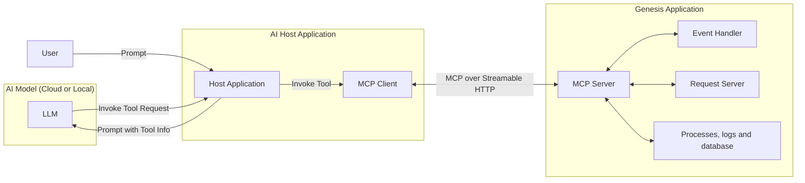

Genesis can expose your application through **MCP (Model Context Protocol)**, so that an AI client such as Claude, ChatGPT or Gemini can monitor, query and operate it.

The Genesis MCP server gives an AI client two kinds of tool:

- **Platform tools**, built in and available to every application with no extra configuration: process health, logs, tables, endpoint discovery, record lookups and changes, and maker-checker approvals.
- **Endpoint tools**: event handlers and request servers that you choose to expose with `enableMcp`.

The server identifies every caller from HTTP headers, checks their rights before each platform tool runs, can hold writes for a second user to approve, and writes an audit line for every call.


```mermaid
graph LR

  subgraph "AI Model (Cloud or Local)"
    LLM[LLM]
  end

  subgraph AI Host Application
    HostApp[Host Application]
    MCPClient[MCP Client]
  end

  subgraph Genesis Application
    MCPServer[MCP Server]
    EventHandler[Event Handler]
    RequestServer[Request Server]
    Platform[Processes, logs and database]
  end

  User -->|Prompt| HostApp
  HostApp -->|Prompt with Tool Info| LLM
  LLM -->|Invoke Tool Request| HostApp
  HostApp -->|Invoke Tool| MCPClient
  MCPClient <-->|MCP over Streamable HTTP| MCPServer
  MCPServer <--> EventHandler
  MCPServer <--> RequestServer
  MCPServer <--> Platform
```

## What is MCP?

MCP is a standard way for an application to describe its capabilities to an LLM. The description tells the LLM:
- what operations are available;
- what inputs each one needs;
- what responses to expect.

Every Genesis event handler and request server already publishes metadata describing its request and response formats. That is why any of them can be exposed over MCP without extra schema work.

For more about MCP, see the [official website](https://modelcontextprotocol.io/introduction).

## Getting started

### Step 1: Enable the MCP server process

The MCP server runs as the `GENESIS_MCP` process, which is off by default. To turn it on, add this item to your application's [`genesis-system-definition.kts` file](/develop/server-capabilities/runtime-configuration/system-definition/):

```kotlin
item(name = "GENESIS_MCP_PROCESS_START", value = "true")
```

### Step 2: Configure the MCP server

The server is configured in `genesis-mcp-server.kts`. The platform ships a default copy of this file; to configure the server, [override the platform-provided file](/develop/server-capabilities/runtime-configuration/site-specific/#overriding-platform-provided-files) with your own.

The platform's default file looks like this:

```kotlin
server {
    port = 3001

    authenticationStrategy {
        staticUser {
            userName = "admin"
            requiresApproval = true
        }
    }
}
```

:::warning
The shipped `genesis-mcp-server.kts` is for local development only. If you enable `GENESIS_MCP` and keep it:

- The server listens on all network interfaces, over plain HTTP.
- Anyone who can reach the port is treated as the user `admin`, with no authentication.
- Platform tools are on. The tools that need [authentication only](#rights-tiers), such as `process_status`, `list_tables` and `discover_endpoints`, answer every caller.
- The other platform tools are refused until `admin` holds the matching `MCP_*` rights. The platform doesn't create those rights, and `admin` gets no special bypass.
- `requiresApproval = true` holds back `call_event`, `modify_record` and your `enableMcp` event tools for approval. It doesn't hold back `process_control`, `run_remap` or `set_log_level`: those run straight away for anyone with the right.

Override this file before you enable `GENESIS_MCP` anywhere other than your own machine.
:::

Your own `genesis-mcp-server.kts` replaces the platform file completely. Any property you leave out takes its default from the [server configuration](#server-configuration) table, not from the shipped file.

Here is a configuration for a deployed application. It uses Genesis session tokens, requires an identity on every connection, and holds every write for approval:

```kotlin
server {
    serverName = "my-app"
    port = 3001

    requireAuthenticatedConnections = true
    requireApprovalForWrites = true

    approverRight = "MCP_APPROVER"
    restrictedTables = setOf("MY_SECRET_TABLE")

    authenticationStrategy {
        sessionAuthToken { }
    }
}
```

### Step 3: Grant the MCP rights

Platform tools check a Genesis right before they run (see [Authorisation](#authorisation)). Create these right codes and assign them to the users or profiles that should use MCP:

- `MCP_VIEW`
- `MCP_DB_READ`
- `MCP_OPERATE`
- `MCP_ADMIN`
- an approver code, if you set `approverRight` to something other than `MCP_ADMIN`

See [Authorization](/develop/server-capabilities/access-control/authorization/) for how to create right codes and assign them.

You can use your own right codes instead, by setting the matching `*Right` properties. Or you can set `enforcePlatformToolRights = false` to need authentication only.

### Step 4: Expose your own event handlers and request servers

Platform tools need no configuration. To expose your own endpoints as well, create an `<application>-mcp.kts` file in `<application>-app/src/main/genesis/scripts`, where `<application>` is your application's name.

This example exposes one [event handler](/develop/server-capabilities/core-business-logic-event-handler/) and one [request server](/develop/server-capabilities/snapshot-queries-request-server/):

```kotlin
mcp {
    enableMcp("EVENT_INSERT_TRADE") {
        context = """
            Event used to enter a new trade into the system.
        """.trimIndent()
    }
    enableMcp("TRADE") {
        context = """
            Query providing details of the trades available in the application.
        """.trimIndent()
    }
}
```

Each `enableMcp` block takes two properties:

| Property | Default | Description |
|---|---|---|
| `context` | `""` | The description of the tool that the LLM sees. It can be as long as you need. Include examples and guidance on when and how to use the tool; older or smaller models often need more of it |
| `requiresAuth` | `true` | When `true`, the call fails if the caller can't be identified |

MCP reads each endpoint's metadata to work out its fields and types. An event handler becomes a tool named after the event in lower case; a request server becomes `<name>_query`. The example above creates these tools:

- `event_insert_trade`
- `trade_query`

The server checks for newly started endpoints every `toolRefreshIntervalMillis`. An endpoint is listed as a tool only while its process is running.

#### How endpoint tools behave

- **Identity.** An endpoint tool runs as the caller identified from the request headers (see [Authentication](#authentication)). The endpoint's own permissions apply to that user. Endpoint tools don't check the MCP rights.
- **Request server inputs.** A request server tool takes the endpoint's own request fields, plus three optional query options: `CRITERIA_MATCH` (a Groovy filter expression), `MAX_ROWS` and `ORDER_BY`.
- **Reserved names.** The names `CRITERIA_MATCH`, `MAX_ROWS`, `ORDER_BY`, `VIEW_NUMBER` and `OFFSET`, in any case, are always read as query options. If your request server has a request field with one of these names, that field isn't passed to the endpoint, and the server logs a warning.
- **Writes.** Event tools are subject to [maker-checker approval](#maker-checker-approval). A held write reports `PENDING_APPROVAL` instead of success.
- **Audit.** Every endpoint tool call is [audit-logged](#audit-logging).

## Server configuration

All of these properties go inside the `server { }` block of `genesis-mcp-server.kts`.

| Property | Default | Description |
|---|---|---|
| `serverName` | `"genesis"` | The name of the server, as reported to AI clients |
| `version` | `"1.0.0"` | The version of the server, as reported to AI clients. Increase it when you release new functionality to AI |
| `port` | `3001` | The HTTP port. The `McpPort` system definition item overrides it, and must be between 1024 and 49151 |
| `toolRefreshIntervalMillis` | `10000` | How often, in milliseconds, the server checks for `enableMcp` endpoints that have started or stopped |
| `platformTools` | `true` | Register the [platform tools, prompts and resources](#platform-tools-prompts-and-resources). Set to `false` to expose only your `enableMcp` endpoints |
| `requireAuthenticatedConnections` | `false` | Reject any connection whose caller can't be identified, with HTTP 401, before any tool runs. See [Requiring authenticated connections](#requiring-authenticated-connections) |
| `requireApprovalForWrites` | `false` | Hold writes made over MCP for [maker-checker approval](#maker-checker-approval) instead of running them |
| `approvalMessage` | `"Submitted for approval via MCP"` | The approval message attached to every held write |
| `enforcePlatformToolRights` | `true` | Check the [tier right](#rights-tiers) before each platform tool, prompt and resource. Set to `false` to need authentication only |
| `viewRight` | `"MCP_VIEW"` | Right code for the VIEW tier. It also gates the prompts and resources |
| `dbReadRight` | `"MCP_DB_READ"` | Right code for the DB_READ tier |
| `operateRight` | `"MCP_OPERATE"` | Right code for the OPERATE tier |
| `adminRight` | `"MCP_ADMIN"` | Right code for the ADMIN tier |
| `approverRight` | `"MCP_ADMIN"` | Right code for approving and rejecting held writes |
| `restrictedTables` | empty | Extra tables that the raw-database tools must refuse. See [Restricted tables](#restricted-tables) |
| `oauthAuthorizationServer` | not set | The OAuth authorization server to advertise to clients. See [OAuth discovery](#oauth-discovery) |
| `routerHttpPort` | `9064`, or the `RouterWebPort` system definition item | The local router's HTTP port. The server uses it to fetch the OpenAPI specification for the `genesis://api/openapi-spec` resource and for `describe_endpoint`. A value set in this file wins over the system definition item |
| `tls { }` | not set | Serve MCP over HTTPS. See [TLS](#tls) |
| `authenticationStrategy { }` | none | Required. Exactly one strategy; see [Authentication](#authentication). The server won't start without one |

## Authentication

The server identifies the caller from HTTP headers on every request. Tool arguments never carry the identity.

The identified user is stamped on every event and request that MCP sends on, so each endpoint's own permissions apply to that user. Platform tools also run as that user.

Choose exactly one strategy in the `authenticationStrategy` block:

| Strategy | Reads | Use it for |
|---|---|---|
| `sessionAuthToken` | `SESSION_AUTH_TOKEN` header, or else `Authorization: Bearer <token>` | Genesis applications. Recommended |
| `oidc` | `Authorization: Bearer <JWT>` | Standalone or external deployments, where MCP checks tokens from an identity provider |
| `providedUserName` | `USER_NAME` header | Deployments behind a gateway that has already authenticated the caller |
| `staticUser` | nothing | Local development only |

### Session token

```kotlin
authenticationStrategy {
    sessionAuthToken { }
}
```

The client sends a Genesis session token, which any Genesis login produces, including SSO. The server reads it from the `SESSION_AUTH_TOKEN` header. If that header is missing, it reads it from `Authorization: Bearer <token>`.

The server checks the token the same way the router does. A token stops working once the user logs out, the session ends, or the user is locked out.

### OIDC

```kotlin
authenticationStrategy {
    oidc {
        issuer = "https://issuer.example"
        jwksUri = "https://issuer.example/.well-known/jwks.json"
        audience = "my-app"
        usernameClaim = "preferred_username"
    }
}
```

The client sends a JWT as `Authorization: Bearer <JWT>`. The server checks its signature against the key set at `jwksUri`, then its issuer and, if set, its audience. The value of the `usernameClaim` claim becomes the Genesis user name.

| Property | Default | Description |
|---|---|---|
| `issuer` | none | Required. The expected token issuer |
| `jwksUri` | none | Required. Where to fetch the signing keys. It must be `https`; only a loopback host such as `localhost` may use `http`. The server won't start otherwise |
| `audience` | not set | The expected audience. If you leave it out, the server accepts any valid token from the issuer, and logs a warning at start-up |
| `usernameClaim` | `"sub"` | The claim that holds the Genesis user name |
| `clockSkewSeconds` | `60` | How much clock difference to allow when checking expiry |
| `signatureAlgorithms` | `RS256`, `RS384`, `RS512`, `ES256`, `ES384`, `ES512`, `PS256`, `PS384`, `PS512` | The signing algorithms to accept |

Signing keys are cached for five minutes. A token signed with an unknown key makes the server fetch the keys again, at most once every 30 seconds. An invalid, expired or missing token identifies nobody.

:::warning
This strategy checks the token on its own and knows nothing about the user in Genesis. A token stays valid until it expires, even if the user is disabled or logs out. For a Genesis application, use `sessionAuthToken` instead.
:::

### Provided user

```kotlin
authenticationStrategy {
    providedUserName { }
}
```

The server takes the user name from the `USER_NAME` header, exactly as sent. It doesn't check it.

:::warning
Only use this strategy behind a gateway that authenticates the caller and removes any `USER_NAME` header the client sends. Otherwise any caller can claim to be any user.
:::

### Static user (development only)

```kotlin
authenticationStrategy {
    staticUser {
        userName = "admin"
        requiresApproval = true
    }
}
```

Every request acts as `userName`, whoever sends it. The caller isn't authenticated at all, so use this only on a local machine.

| Property | Default | Description |
|---|---|---|
| `userName` | none | Required. The user that every request acts as |
| `requiresApproval` | `true` | Hold every write for [maker-checker approval](#maker-checker-approval) |

You can't combine `staticUser` with `requireAuthenticatedConnections = true`: the server refuses to start. Because every write shares one identity, maker-checker gives no real separation of duties with this strategy.

### Requiring authenticated connections

By default, a caller with no identity can still connect. That caller can use `get_current_time` and any endpoint tool with `requiresAuth = false`. Platform tools, prompts and resources always refuse an unidentified caller.

Set `requireAuthenticatedConnections = true` to close that gap. The server then rejects any connection it can't identify with HTTP 401, before any tool runs. Use it with `sessionAuthToken` or `oidc`.

### Security set-up at start-up

When it starts, the server logs one line describing its security set-up:

```
MCP security posture: strategy=SessionAuthToken, requireAuthenticatedConnections=true, requireApprovalForWrites=true, tls=false
```

It also logs a warning for each of these:
- the `staticUser` strategy;
- the `providedUserName` strategy;
- `sessionAuthToken` or `oidc` without `requireAuthenticatedConnections`;
- `oidc` without an `audience`;
- plain HTTP with any strategy other than `staticUser`.

## Authorisation

### Rights tiers

Each platform tool belongs to a tier, and each tier needs a Genesis right. The right codes are configurable; these are the defaults:

| Tier | Right (property, default) | Tools |
|---|---|---|
| Authentication only | none | `process_status`, `process_monitors`, `system_health_check`, `list_tables`, `describe_table`, `discover_endpoints`, `describe_endpoint`, `operations_guide` |
| VIEW | `viewRight`, `MCP_VIEW` | `query_dataserver`, `call_request`, `list_logs`, `read_log`, `search_log`, `list_pending_approvals`, `describe_approval`, plus all prompts and resources |
| DB_READ | `dbReadRight`, `MCP_DB_READ` | `query_table`, `investigate_record`, `reconcile`, `analyze_exceptions`, `read_config` |
| OPERATE | `operateRight`, `MCP_OPERATE` | `process_control`, `set_log_level` |
| ADMIN | `adminRight`, `MCP_ADMIN` | `call_event`, `modify_record`, `run_remap` |
| APPROVE | `approverRight`, `MCP_ADMIN` | `approve_request`, `reject_request` |

Every platform tool call goes through the same steps:
1. Identify the caller from the headers. If there's no identity, refuse the call.
2. If `enforcePlatformToolRights = true`, check that the caller has the tier's right.
3. Run the tool as the caller.
4. Write an [audit line](#audit-logging).

A user needs each tier's right separately: holding `MCP_ADMIN` doesn't grant VIEW. With `enforcePlatformToolRights = false`, any identified caller can use every platform tool.

### Raw database access

`query_table`, `investigate_record` and `reconcile` read tables straight from the database. They skip the row, entity and field permissions that data servers and request servers apply. Treat the DB_READ right as read access to the whole database.

Grant it separately from VIEW. The VIEW tools `query_dataserver` and `call_request` go through the data server and request server, so your application's permissions still apply.

### Restricted tables

Whatever the caller's rights, `query_table`, `investigate_record`, `reconcile` and `modify_record` refuse any table that matches one of these rules (case-insensitive):
- the names `USER`, `USER_SESSION`, `USER_ATTRIBUTES` and `JWT_CONFIG`, and their `_AUDIT` tables;
- any name that contains `PASSWORD`, `SECRET`, `CREDENTIAL`, `PRIVATE_KEY` or `AUTH_TOKEN`;
- any name that contains an entry of `restrictedTables`.

## Platform tools, prompts and resources

These are registered when `platformTools = true`, the default. The server also registers `get_current_time`, which returns the current time, whatever the settings.

### Tools

| Tool | Tier | Parameters | What it does |
|---|---|---|---|
| `process_status` | Authentication only | `PROCESS_NAME` (optional) | Status, CPU, memory and port of the running processes |
| `process_monitors` | Authentication only | `PROCESS_NAME` (optional) | Health monitor data for each process |
| `system_health_check` | Authentication only | none | Overall health across all processes |
| `list_tables` | Authentication only | none | Database tables, with field counts |
| `describe_table` | Authentication only | `TABLE_NAME` | Fields and indices of one table |
| `discover_endpoints` | Authentication only | `TYPE_FILTER` (optional: `EVENT_HANDLER` or `REQUEST_SERVER`), `NAME_FILTER` (optional) | Event handlers and request servers, with the process that serves each one |
| `describe_endpoint` | Authentication only | `ENDPOINT_NAME` | An endpoint's input fields, types, required fields and allowed values |
| `operations_guide` | Authentication only | `CHANGE_TYPE` (default `all`) | Guidance on the operational steps for each kind of change |
| `query_dataserver` | VIEW | `QUERY_NAME`, `MAX_ROWS` (default 25, max 200), `CRITERIA` (optional) | A one-off snapshot of a data server query |
| `call_request` | VIEW | `REQUEST_NAME`, `CRITERIA` (optional), `REQUEST_FIELDS` (optional, JSON), `MAX_ROWS` (default 100, max 5000) | Calls a request server |
| `list_logs` | VIEW | none | Log files, with size and last-modified time |
| `read_log` | VIEW | `PROCESS_NAME`, `LINES` (default 100, max 500) | The last lines of a process's log |
| `search_log` | VIEW | `PROCESS_NAME` (or `ALL`), `PATTERN`, `MAX_MATCHES` (default 50, max 200) | Case-insensitive search of one log, or all of them |
| `list_pending_approvals` | VIEW | none | Writes waiting for approval |
| `describe_approval` | VIEW | `APPROVAL_ID` | The full held write, with secret-looking fields hidden |
| `query_table` | DB_READ | `TABLE_NAME`, `MAX_ROWS` (default 25, max 500) | Reads rows straight from a table |
| `investigate_record` | DB_READ | `TABLE_NAME`, `KEY_FIELD`, `KEY_VALUE` | Traces one record across related tables, audit tables and logs |
| `reconcile` | DB_READ | `TABLE_A`, `TABLE_B`, `KEY_FIELD`, `COMPARE_FIELDS` (optional) | Compares two tables on a key field |
| `analyze_exceptions` | DB_READ | `STATUS_FILTER` (optional) | Groups current exceptions by type |
| `read_config` | DB_READ | `FILTER` (optional) | System definition keys and values |
| `process_control` | OPERATE | `PROCESS_NAME`, `ACTION` (`start` or `stop`) | Starts or stops a process on the local instance |
| `set_log_level` | OPERATE | `PROCESS_NAME`, `LOG_LEVEL` (`TRACE`, `DEBUG`, `INFO`, `WARN` or `ERROR`), `PACKAGE_NAME` (default `ROOT`) | Changes a running process's log level without a restart |
| `call_event` | ADMIN | `EVENT_NAME` (with the `EVENT_` prefix), `DETAILS` (JSON) | Sends an event to an event handler |
| `modify_record` | ADMIN | `TABLE_NAME`, `KEY_FIELD`, `KEY_VALUE`, `CHANGES` (JSON), `EVENT_NAME` (optional) | Changes fields on one record (see below) |
| `run_remap` | ADMIN | `COMMIT` (`true` to commit; otherwise a dry run) | Runs remap on the local instance |
| `approve_request` | APPROVE | `APPROVAL_ID`, `COMMENT` (optional) | Approves a held write |
| `reject_request` | APPROVE | `APPROVAL_ID`, `COMMENT` (optional) | Rejects a held write |

Some notes on individual tools:
- **`call_request`, `query_dataserver`:** `CRITERIA` is a Groovy expression, such as `QUANTITY > 100 && SIDE == 'BUY'`, or a JSON object of field values, such as `{"SIDE": "BUY"}`. If the criteria names a field that doesn't exist, the error lists the endpoint's real fields.
- **`call_request`:** `REQUEST_NAME` is the request server's name without the `REQ_` prefix.
- **`modify_record`:** this reads the current record, applies only the fields in `CHANGES`, and sends the whole record through the table's update event. By default that's `EVENT_<TABLE>_UPDATE`, `_UPSERT` or `_MODIFY`; set `EVENT_NAME` if your event has a different name. The event's validation, auditing and approval all still apply.
- **`read_config`:** values whose key contains `PASSWORD`, `PASSWD`, `PWD`, `PASSPHRASE`, `SECRET`, `TOKEN`, `CREDENTIAL`, `PRIVATE_KEY`, `API_KEY` or `APIKEY` are shown as `***`. The `genesis://config/system-definition` resource is hidden the same way.
- **`read_log`, `search_log`:** `PROCESS_NAME` must be an upper-case process name (letters, digits and underscores only).
- **`process_control`, `run_remap`:** these act on the instance that the MCP server runs on.

### Prompts

Prompts need the VIEW right.

| Prompt | Arguments | What it gives |
|---|---|---|
| `app_overview` | none | An overview of the application: tables, endpoints, processes and capabilities |
| `debug_process` | `process_name` | Debugging context for one process: status, monitors, recent log errors and log level |
| `daily_summary` | none | A daily operations summary: system health, recent errors, data volumes and notable events |
| `watchdog` | none | A system check covering process health, log errors, monitor states and data integrity |
| `settlement_summary` | none | Pending, settled and failed transactions |
| `exception_report` | none | Data issues, processing failures and unresolved items |
| `eod_checklist` | none | An end-of-day checklist: what to run and check, and in what order |

### Resources

Resources need the VIEW right.

| Resource | Contents |
|---|---|
| `genesis://config/system-definition` | The system definition, with secret-looking values hidden |
| `genesis://config/processes` | The process configuration |
| `genesis://config/router` | The router configuration |
| `genesis://api/openapi-spec` | The application's OpenAPI specification, fetched from the router on `routerHttpPort` |

## Maker-checker approval

Maker-checker means one user (the maker) asks for a change, and a different user (the checker) approves it before it takes effect. MCP uses the platform's [pending approval workflow](/develop/server-capabilities/core-business-logic-event-handler/#pending-approval-workflow) for this.

### Which writes are held

A write made over MCP is held for approval when either of these is true:
- `requireApprovalForWrites = true`;
- the strategy is `staticUser` with `requiresApproval = true`, which is its default.

This covers `call_event`, `modify_record` and your `enableMcp` event tools. It doesn't cover `process_control`, `run_remap` or `set_log_level`, or any read.

A held write is stored in the `APPROVAL` table with `approvalMessage` as its message, and isn't applied. Instead of a normal result, the tool returns:

```json
{
  "status": "PENDING_APPROVAL",
  "applied": false,
  "event": "EVENT_INSERT_TRADE",
  "message": "Submitted for maker-checker approval - this change is NOT yet applied. ..."
}
```

Events whose names start with `EVENT_PENDING_APPROVAL_` are never held, so a checker can always act on a request.

### Approving or rejecting a held write

A checker, connected over MCP as a different user, works through these tools:
1. `list_pending_approvals` lists the pending writes: who asked, which event, the message and when. The tool reads at most 2,000 approval records; when it reaches that limit, it sets `truncated` to `true`.
2. `describe_approval` shows the full held write, with secret-looking fields hidden.
3. `approve_request` or `reject_request` acts on it, with an optional `COMMENT`. These send `EVENT_PENDING_APPROVAL_ACCEPT` or `EVENT_PENDING_APPROVAL_REJECT` as the checker.

Checkers can also use any other front end built on the pending approval workflow.

### Separation of duties

- The platform never lets a user approve or reject their own request.
- `approverRight` is `MCP_ADMIN` by default, the same as `adminRight`. So anyone who can make a write over MCP can also approve other users' writes. Set `approverRight` to a different right code if makers shouldn't also be checkers.
- With `staticUser`, every write comes from the same user, so there is no real separation of duties. The server logs a warning about this at start-up.

## Audit logging

The server writes one audit line, at INFO level, for each tool call, each prompt or resource read, and each rejected connection. The lines go to a logger named `global.genesis.mcp.audit`, so you can route them separately in the process's logging configuration.

```
MCP tool call - user=<user>, tool=<tool>, outcome=<outcome>, durationMs=<ms>, args=<arguments>
MCP access - user=<user>, target=<prompt or resource>, outcome=<outcome>
MCP connection - outcome=rejected, detail=<reason>
```

- **`user`** is `anonymous` when the caller couldn't be identified.
- **`outcome`** is one of `success`, `error`, `denied: unauthenticated`, `denied: missing <right> right` or `denied: restricted table <table>`.
- **`args`** lists the tool's arguments, shortened. Any argument whose name or value looks like a secret is shown as `***`.
- **Endpoint tools** are logged with the endpoint's name (for example, `EVENT_INSERT_TRADE`) as `tool`, without arguments, and with `durationMs=-1`.

Line breaks are removed from user names and arguments, so a caller can't forge an extra audit line.

## OAuth discovery and TLS

### OAuth discovery

Some MCP clients can log in by themselves: they read where to log in from the server, then run a browser login. The server supports this with OAuth Protected Resource Metadata ([RFC 9728](https://datatracker.ietf.org/doc/html/rfc9728)).

Discovery is on when `oauthAuthorizationServer` is set, or when the strategy is `oidc`. The server then advertises `oauthAuthorizationServer` if it's set, or else the `oidc` issuer. It:
- serves the metadata at `/.well-known/oauth-protected-resource/mcp`;
- adds `WWW-Authenticate: Bearer resource_metadata="<metadata URL>"` to every 401 response.

The server only sends a 401 when `requireAuthenticatedConnections = true`, so set that too.

Genesis isn't an OAuth authorization server itself. With `sessionAuthToken`, point `oauthAuthorizationServer` at an authorization server that runs the Genesis login and gives the client a Genesis session token.

When the server sits behind a proxy, it builds the URLs it advertises from the `X-Forwarded-Proto` and `X-Forwarded-Host` headers, if present.

### TLS

By default the server uses plain HTTP. For production, either end TLS at the router or gateway in front of the MCP server, or have the server use HTTPS itself:

```kotlin
server {
    tls {
        keyStorePath = "/path/to/keystore.p12"
        keyStorePassword = "..."
        keyStoreType = "PKCS12"
    }
    // ...
}
```

`keyStorePath` and `keyStorePassword` are required. `keyStoreType` defaults to `"PKCS12"`.

## Connecting an AI client

The server uses the MCP Streamable HTTP transport, at a single endpoint:

```
http://<host>:<port>/mcp
```

Use `https` if you have [set up TLS](#tls). Any client that supports Streamable HTTP can connect to it directly.

Unless you use `staticUser`, the client must send the caller's credentials as an HTTP header on every request. With `sessionAuthToken`, that is `SESSION_AUTH_TOKEN: <token>` or `Authorization: Bearer <token>`.

You need access to an AI model as well. Some clients, such as Claude Desktop and Claude Code, use a model in the cloud. You can also run the whole stack locally.

### Using Claude Code

```shell
claude mcp add --transport http genesis http://localhost:3001/mcp \
  --header "SESSION_AUTH_TOKEN: <token>"
```

### Using Claude Desktop

See the [MCP quickstart for users](https://modelcontextprotocol.io/quickstart/user) for how to add a server to Claude Desktop.

### Using `mcphost`

`mcphost` is a small command-line application that connects MCP servers to an AI model. It supports OpenAI and Anthropic models in the cloud, and local models through Ollama. See the [mcphost repository](https://github.com/mark3labs/mcphost) for installation instructions.

By default, `mcphost` reads its configuration from `$HOME/.mcp.json`, and creates the file if it doesn't exist. Add the Genesis server as a remote server:

```json
{
  "mcpServers": {
    "genesis": {
      "type": "remote",
      "url": "http://localhost:3001/mcp",
      "headers": ["SESSION_AUTH_TOKEN: <token>"]
    }
  }
}
```

Then start `mcphost` with the model you want. For example, with a local Ollama model, which needs no API key:

```shell
mcphost -m ollama:<your model>
```

Cloud models, such as `anthropic:<model>` or `openai:<model>`, need an API key. Run `mcphost -h` for the options.
