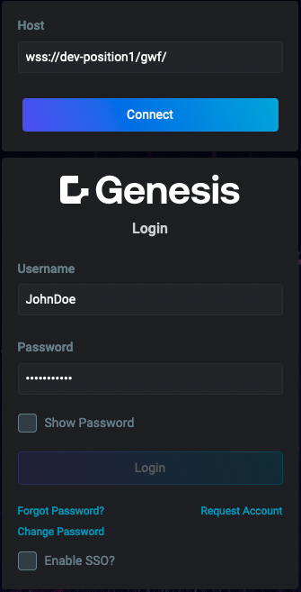
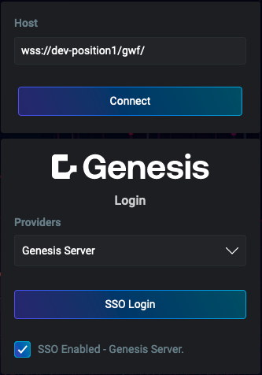
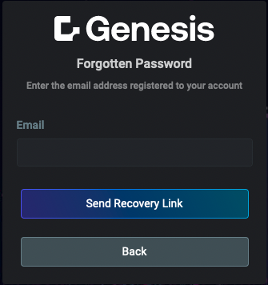
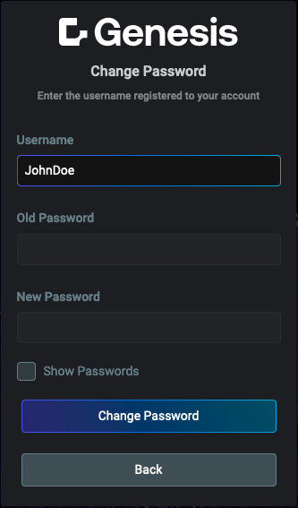
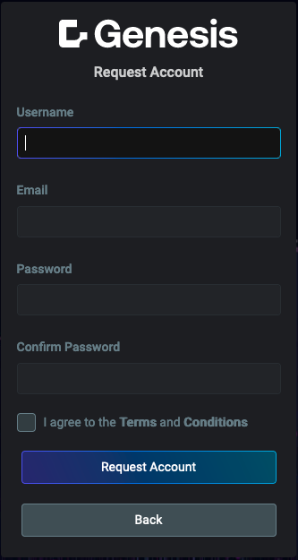

import Tabs from '@theme/Tabs';
import TabItem from '@theme/TabItem';

# Foundation Login

The **Foundation Login** provides a comprehensive suite of identity management functions, including authentication (with support for Single Sign-On) and password reset capabilities. Its features are highly customizable, allowing you to enable or disable specific functionalities as needed. Additionally, various elements of the login screen, such as the logo, can be tailored to align with your branding.

The login mechanism leverages the [Credential Management API](https://developer.mozilla.org/en-US/docs/Web/API/Credential_Management_API) for secure credential handling. When the API is unavailable, it seamlessly falls back to using cookies to ensure broad compatibility.

Below are examples showcasing the key screens and functionalities of the **Foundation Login**. These include the main login interface, authentication via Single Sign-On (SSO), and essential user management features such as password recovery, account creation requests, and password changes.

|Main login screen|Authentication via SSO|Forgotten password|Change password|Request account|
|-------------------|------------------|-------------------|------------------|------------------|
|||||

:::info
See complete set of API documentation [here](./docs/api/index.md)
:::

## Authentication methods

Authentication is primarily configured on the back end. It's essential to familiarize yourself with the [authentication](/develop/server-capabilities/access-control/authentication/) section of the back-end configuration to ensure proper integration.

### Username and password

The default authentication method involves the user providing their username and password. Even when Single Sign-On (SSO) is enabled, users will still have the option to sign in using their standard credentials.

:::info
To streamline development, setting the `DEFAULT_USER` and `DEFAULT_PASSWORD` environment variables will pre-populate the login form with these credentials. This can save developers from entering the credentials repeatedly during testing. However, if the browser has previously saved login credentials, it may autofill the form, making this step unnecessary.
:::

### Single Sign-On (SSO)

The **Foundation Login** supports Single Sign-On (SSO) integration, allowing users to authenticate using a unified set of credentials, which may also include credentials from the Genesis Application Platform. Genesis supports SSO with both JWT and SAML.

While setting up SSO is primarily a back-end task, some front-end [SSO configuration](docs/api/foundation-login.loginconfig.sso.md) is required.

:::info
The standard SSO process involves redirecting users to the authentication provider's flow from the current page. However, many authentication providers block their system when running inside an iframe to prevent [clickjacking attacks](https://owasp.org/www-community/attacks/Clickjacking). To mitigate this, if the `Login` micro front-end detects it's running within an iframe, it opens the authentication flow in a separate popup window instead.
:::

## Integration

The **Foundation Login** is designed to integrate seamlessly into various application environments, offering flexibility in both basic and advanced use cases. Depending on your platform (Genesis, React, Angular), the integration process may vary slightly. Below, you will find guidance for both basic and advanced usage scenarios, helping you set up the login functionality in your application with ease.

### Basic usage

This section outlines the steps required to quickly integrate the **Foundation Login** into your application. The basic setup guide covers the essential configuration for setting up the login form, as well as establishing necessary routes and authentication options.

<Tabs defaultValue="genesis" values={[{ label: 'Genesis', value: 'genesis', }, { label: 'React', value: 'react', }, { label: 'Angular', value: 'angular', }]}>

<TabItem value="genesis">

This example focuses on the setup necessary for enabling Login functionality in your `Genesis` application. While it's not a complete routes configuration, it includes all the required elements related to the login setup.

Place the following code in the `routes/config.ts` file of your application:

```typescript
// Import required dependencies from the foundation-login package
import { Login } from '@genesislcap/foundation-login';
// Import required dependencies from the foundation-comms package
// You could also import analytics events and set them up in the NavigationContributor
import { Auth, Session } from '@genesislcap/foundation-comms';

type RouterSettings = {
  public?: boolean;
  autoAuth?: boolean;
}

// Define your router config
export class MainRouterConfig extends RouterConfiguration<RouterSettings> {
  // Ensure you inject in required dependencies
  constructor(
    @Auth private auth: Auth,
    @Session private session: Session
  ) {
    super();
  }

  // Add Login as a route
  public configure() {
    ...
    this.routes.map(
      { path: '', redirect: 'login' },
      {
        path: 'login',
        element: Login,
        title: 'Login',
        name: 'login',
        layout: loginLayout,
        settings: { public: true },
        childRouters: true,
      },
      ... // Other routes config here
    );

    const session = this.session;
    const auth = this.auth;

    // Example of a FallbackRouteDefinition
    this.routes.fallback(() =>
      auth.isLoggedIn ? { redirect: 'not-found' } : { redirect: 'login' }
    );

     // Example of a NavigationContributor
    this.contributors.push({
      navigate: async (phase) => {
        const settings = phase.route.settings;

        // Could add in processes such as analytics here

        // If public route don't block
        if (settings && settings.public) {
          return;
        }

        // If logged in don't block
        if (auth.isLoggedIn) {
          return;
        }

        // If autoAuth and session is valid try to connect+auto-login
        if (settings && settings.autoAuth && (await auth.reAuthFromSession())) {
          return;
        }

        // Otherwise route them to login
        phase.cancel(() => {
          session.captureReturnUrl();
          Route.name.replace(phase.router, 'login');
        });
      },
    });
  }

  ... // Other configuration/methods
}
```
</TabItem>
<TabItem value="react">

This example focuses on the setup necessary for enabling Login functionality in your `React` application. While it's not a complete routes configuration, it includes all the required elements related to the login setup.

Place the following code in the file where you want to define login component, so it can later be imported into your main application file:

:::info
To see the full login configuration for React, visit the [howto-ui-integrations-react](https://github.com/genesiscommunitysuccess/howto-ui-integrations-react).
:::


```typescript
import {configure, define} from '@genesislcap/foundation-login';
import { AUTH_PATH } from '../config';
import { DI } from '@microsoft/fast-foundation';
import { history } from '../utils/history';

/**
 * Configure the micro frontend
 */
export const configureFoundationLogin = () => {
  configure(DI.getOrCreateDOMContainer(), {
    autoConnect: true,
    autoAuth: true,
    hostPath: AUTH_PATH,
    redirectHandler: () => {
      history.push('/order-mgmt');
    },
  });

  return define({
    name: `client-app-login`,
  });
};
```
</TabItem>
<TabItem value="angular">

This example focuses on the setup necessary for enabling Login functionality in your `Angular` application. While it's not a complete routes configuration, it includes all the required elements related to the login setup.

Place the following code in the file where you want to define login component, so it can later be imported into your main application file:

:::info
To see the full login configuration for Angular, visit the [howto-ui-integrations-angular](https://github.com/genesiscommunitysuccess/howto-ui-integrations-angular).
:::

```typescript
import {configure, define} from '@genesislcap/foundation-login';
import type { Router } from '@angular/router';
import { getUser } from '@genesislcap/foundation-user';
import { css, DI } from '@genesislcap/web-core';
import { AUTH_PATH } from '../app.config';
import logo from '../../assets/logo.svg';

/**
 * Configure the micro frontend
 */
export const configureFoundationLogin = ({
  router,
}: {
  router: Router;
}) => {
  configure(DI.getOrCreateDOMContainer(), {
    autoAuth: true,
    autoConnect: true,
    redirectHandler: () => {
      router.navigate([getUser().lastPath() ?? 'order-mgmt'])
    },
    logo: css `
      content: url("${logo}");
    `,
  });

  return define({
    name: `client-app-login`,
  });
}
```
</TabItem>
</Tabs>

### Advanced usage

For more complex scenarios, the advanced usage section explores how to customize the **Foundation Login** to meet specific needs. This includes advanced configuration options and extending its functionality for more intricate workflows, such as integrating Single Sign-On (SSO) or adding custom form fields.

The following example using the `Genesis` framework. The most important aspect of this example is the [`configure`](./docs/api/foundation-login.configure.md#example) function, which enables the application of advanced configurations. Notably, this function works the same way for React and Angular frameworks, ensuring consistency across implementations.

```typescript
name: 'login',
path: 'login',
title: 'Login',
element: async () => {
  const { configure, define, defaultLoginConfig } = await import('@genesislcap/foundation-login');
  configure(this.container, {
    autoConnect: true,
    autoAuth: true,
    sso: {
      toggled: true,
      identityProvidersPath: 'sso/list',
    },
    omitRoutes: ['request-account'],
    fields: {
      ...defaultLoginConfig.fields,
      organisation: {
        label: 'CompID',
      },
    },
    hostPath: 'login',
    defaultRedirectUrl: 'dashboard',
    logo: loginLogo,
    background: loginBG,
  });
  // You can import and return `Login` directly here or re-define it completely via `define`.
  return define({
    name: `nexus-login`,
  });
},
layout: loginLayout,
settings: { public: true },
childRouters: true,
```

## Configuration

The configuration section provides detailed information on how to configure and customize the **Foundation Login**. This section covers the management of public and private routes, as well as the available settings to tailor the authentication process and adjust the login interface to meet the specific requirements of your application.

### Public and private routes

You may need to configure a **NavigationContributor** in your application's router configuration class to manage **public** and **autoAuth** route settings:

- `public`: Indicates that a route is accessible without requiring user authentication.
- `autoAuth`: Automatically logs in users with an active authenticated session when they navigate away from a page and return later.

```ts
{
    path: 'info',
    element: Info,
    title: 'Info',
    name: 'info',
    settings: { public: true },
},
{
    path: 'admin',
    element: Admin,
    title: 'Admin',
    name: 'admin',
    settings: { autoAuth: true },
}
```

:::warning
By default, a route that isn’t explicitly marked as `public` is considered non-public. However, non-public routes do not automatically block non-authenticated users from accessing them. This behavior must be implemented in a `NavigationContributor`. For more details, see the [example](./docs/api/foundation-login.login.md#example).
:::

### Customization options

The **Foundation Login** offers extensive customization options to tailor its behavior and appearance to specific application requirements. This can be achieved by using the exported [`configure`](docs/api/foundation-login.configure.md) function. Through this function, you can modify default settings, such as enabling automatic connection, omitting certain routes, or customizing form fields.

Below is a table with the available configuration properties:

<table>
  <thead>
    <tr>
      <th>Attribute</th>
      <th>Type</th>
      <th>Use</th>
      <th>Example</th>
    </tr>
  </thead>
  <tbody>
  <tr>
  <td>[autoAuth](./docs/api/foundation-login.loginconfig.autoauth.md)</td>
  <td><code>boolean</code></td>
  <td>Determines whether login occurs automatically or requires the user to click a login button after a connection is established.</td>
  <td>
    ```typescript
    autoAuth: true
    ```
  </td>
</tr>

<tr>
  <td>[autoConnect](./docs/api/foundation-login.loginconfig.autoconnect.md)</td>
  <td><code>boolean</code></td>
  <td>Configures automatic connection or requires the user to click a connect button.</td>
  <td>
    ```typescript
    autoConnect: true
    ```
  </td>
</tr>

<tr>
  <td>[background](./docs/api/foundation-login.loginconfig.background.md)</td>
  <td><code>ElementStyles</code></td>
  <td>Styles for the background of the login screen.</td>
  <td>
```typescript
background: css`
  :host {
    background-image: url(${customBGImport});
  }
`,
```
  </td>
</tr>

<tr>
  <td>[defaultRedirectUrl](./docs/api/foundation-login.loginconfig.defaultredirecturl.md)</td>
  <td><code>string</code></td>
  <td>Specifies the default URL to redirect the user to after a successful login.</td>
  <td>
    ```typescript
    defaultRedirectUrl: 'dashboard'
    ```
  </td>
</tr>

<tr>
  <td>[fields](./docs/api/foundation-login.loginconfig.fields.md)</td>
  <td><code>FieldConfigMap</code></td>
  <td>Configuration map for each of the primary form fields.</td>
  <td>
    ```typescript
    fields: { 
      ...defaultLoginConfig.fields, 
      organisation: { 
        label: 'CompID' 
      } 
    }
    ```
  </td>
</tr>

<tr>
  <td>[hostPath](./docs/api/foundation-login.loginconfig.hostpath.md)</td>
  <td><code>string</code></td>
  <td>The `path` of the microfrontend as defined in the parent/host route.</td>
  <td>
    ```typescript
    hostPath: 'login'
    ```
  </td>
</tr>

<tr>
  <td>[localizationResources](./docs/api/foundation-login.loginconfig.localizationresources.md)</td>
  <td><code>I18nextConfig['resources']</code></td>
  <td>_(Optional)_ [Internationalization](../020_internationalization/index.mdx) (i18n) resources for localization.</td>
  <td>
```typescript
localizationResources: {
  en: {
    translation: {
      key: 'Hello World'
    }
  },
  es: {
    translation: {
      key: 'Hola Mundo'
    }
  }
}
```
  </td>
</tr>

<tr>
  <td>[logo](./docs/api/foundation-login.loginconfig.logo.md)</td>
  <td><code>ElementStyles | null</code></td>
  <td>Customizable styles for the logo. Providing `null` will hide the logo.</td>
  <td>
```typescript
logo: css`
  content: url(${customLogoImport});
`,
```
  </td>
</tr>

<tr>
  <td>[logoAltText](./docs/api/foundation-login.loginconfig.logoalttext.md)</td>
  <td><code>string</code></td>
  <td>Alt text for the logo, used for accessibility.</td>
  <td>
    ```typescript
    logoAltText: 'Company Logo'
    ```
  </td>
</tr>

<tr>
  <td>[messageDelays](./docs/api/foundation-login.loginconfig.messagedelays.md)</td>
  <td><code>MessageDelays</code></td>
  <td>_(Optional)_ Configures delays for various message-related actions.</td>
  <td>
```typescript
messageDelays: {
  forgotPassword: 1000,
  resetPassword: 2000,
  base: 500
}
```
  </td>
</tr>

<tr>
  <td>[omitRedirectUrls](./docs/api/foundation-login.loginconfig.omitredirecturls.md)</td>
  <td><code>string[]</code></td>
  <td>Specifies return URLs to omit, which may have been captured by the session service.</td>
  <td>
```typescript
omitRedirectUrls: ['/not-found'],
```
  </td>
</tr>

<tr>
  <td>[omitRoutes](./docs/api/foundation-login.loginconfig.omitroutes.md)</td>
  <td><code>`Exclude<Routes, 'login' | 'not-found'>[]`</code></td>
  <td>Omits specific internal routes, except for `login` and `not-found`.</td>
  <td>
```typescript
omitRoutes: ['request-account'],
```
  </td>
</tr>

<tr>
  <td>[redirectHandler](./docs/api/foundation-login.loginconfig.redirecthandler.md)</td>
  <td><code>(url: string) => void</code></td>
  <td>_(Optional)_ Allows an external app's router to navigate after successful login.</td>
  <td>
```typescript
redirectHandler: (url) => navigateToFn('/order-mgmt')
```
  </td>
</tr>

<tr>
  <td>[showConnectionIndicator](./docs/api/foundation-login.loginconfig.showconnectionindicator.md)</td>
  <td><code>boolean</code></td>
  <td>Toggles the display of the connection status indicator.</td>
  <td>
    ```typescript
    showConnectionIndicator: true
    ```
  </td>
</tr>

<tr>
  <td>[sso](./docs/api/foundation-login.loginconfig.sso.md)</td>
  <td><code>SSOConfig | null</code></td>
  <td>Configures Single Sign-On (SSO) settings.</td>
  <td>
```typescript
sso: {
  toggled: true,
  identityProvidersPath: 'sso/list',
},
 ```
  </td>
</tr>

<tr>
  <td>[submitButtonAppearance](./docs/api/foundation-login.loginconfig.submitbuttonappearance.md)</td>
  <td><code>string</code></td>
  <td>_(Optional)_ Customizes the appearance of submit buttons in the login form.</td>
  <td>
    ```typescript
    submitButtonAppearance: 'primary'
    ```
  </td>
</tr>

<tr>
  <td>[versionInformation](./docs/api/foundation-login.loginconfig.versioninformation.md)</td>
  <td><code>string</code></td>
  <td>_(Optional)_ Displays version information for the login microfrontend.</td>
  <td>
    ```typescript
    versionInformation: 'Version 1.2.3'
    ```
  </td>
</tr>
  </tbody>
</table>