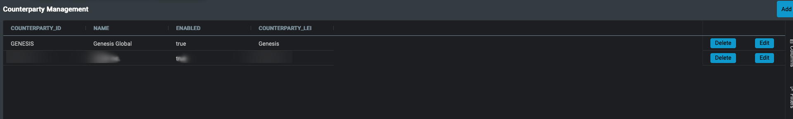
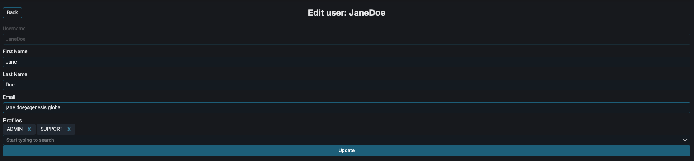
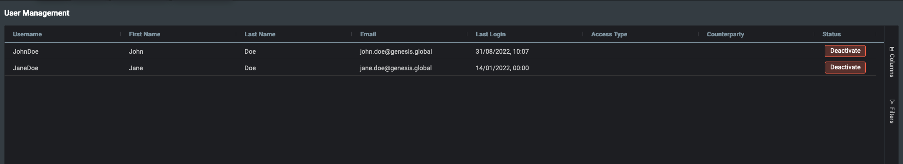
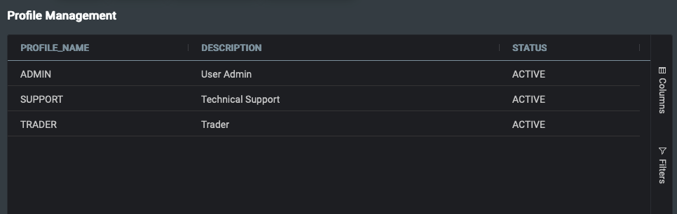

# Entity Management

## API Documentation

For more detailed information on API and configurations, please refer to the [API documentation](./docs/api/index.md).

### Introduction

The Entity Management micro front-end is used to connect to a resource on the back end and manage it from the front end. Handlers can be set up for create, update, and delete events; after adding an event, a button is displayed, so that the user can perform the action. There is a list of pre-defined events and resources to manage, but you can also manage custom resources that have been created on the back end.

:::tip
The buttons are accessed conditionally, based on the specified events. For example, if the current user is only able to edit the entities, then you should only set the edit event on the entity-manager - you need to set the events so that they are conditional on user authorisations.
:::

Two core components are used to manage the entities - the grid and the form.

The grid contains an entity on each row and data in each column. Here is an example showing a grid used to manage counterparties:



The other component is the form. This is used to update an existing entity or to create a new one. Here is an example:



### Set-up

To enable this micro-front-end in your application, follow the steps below.

1. Add `@genesislcap/foundation-entity-management` as a dependency in your **package.json** file. Whenever you change the dependencies of your project, run the `$ npm run bootstrap` command again. For more information, see the [package.json basics](../../../../../web/basics/package-json-basics/) page.

```javascript
{
  ...
  "dependencies": {
    "@genesislcap/foundation-entity-management": "latest"
  },
  ...
}
```

2. Import and declare the class in the page of the class where you wish to use the Entity Manager. Then add the entity management into the template html where required:

```javascript
// Import
import { EntityManagement, } from '@genesislcap/foundation-entity-management';

// Declare class
EntityManagement;

// Example html with the entity management used in two different tabs to manage two
// different resources - one managing the counterpartys, and one managing the users.
export const AdminTemplate: ViewTemplate = html`
  <zero-tabs>
    <zero-tab-panel slot="tabpanel">
      <zero-notification-listener>
        <entity-management
          resourceName="ALL_COUNTERPARTYS"
          title="Counterparty Management"
          updateEvent="EVENT_COUNTERPARTY_MODIFY"
          deleteEvent="EVENT_COUNTERPARTY_DELETE"
          createEvent="EVENT_COUNTERPARTY_INSERT"
        ></entity-management>
      </zero-notification-listener>
    </zero-tab-panel>
    <zero-tab-panel slot="tabpanel">
      <zero-notification-listener>
        <entity-management
          resourceName="ALL_USERS"
          title="User Management"
          updateEvent="EVENT_AMEND_USER"
          deleteEvent="EVENT_DELETE_USER"
          createEvent="EVENT_INSERT_USER"
        ></entity-management>
      </zero-notification-listener>
    </zero-tab-panel>
  </zero-tabs>
`;
```

### Config

The functionality of the Entity Manager is customised through the properties you set on it in the HTML. This section covers the main properties that you need to customise. For a full list of properties, [see here](./docs/api/foundation-entity-management.entitymanagement.md#properties).

#### Title

`title` customises the title of the entity list so that the user can see what resource they are managing.

#### Resource

`resourceName` refers to the name of a resource on the server. This could be:

- a `query` in a Data Server
- a `ReqRep` definition in a Request Server
- an `eventHandler`in the Event Handler.

 In the [above example](#set-up), we use `ALL_COUNTERPARTYS`, which is a `query` in a Data Server; by convention, these queries all start with `ALL_`.

#### Events

`createEvent`, `updateEvent`, `deleteEvent` are set to be the events on the back end that handle the specific actions, such as deleting counterparty data. For the create and update functionality, these also define the resource in which the form is populated when the user is creating or updating an entity. After adding an event, a button is displayed so that the user can perform the selected action.

#### Datasource configuration

Set this object to configure how the Entity Manager interacts with the resource. [See here](./docs/api/foundation-entity-management.datasourceconfiguration/#example).

#### Persist column state
`persist-column-state-key` is a string value. It is used to control how the column states are persisted through actions such as page changes or refreshes. If no `persist-column-state-key` property is set, then the behaviour will be to _not_ persist the column state, and  the grid will revert back to its default state every time the user navigates away from it.

:::warning
The string defines the key in which the serialised state of the columns is stored in an object in [session storage](https://developer.mozilla.org/en-US/docs/Web/API/Window/sessionStorage). Therefore, if you are setting multiple Entity Managers in your application, you must use unique keys to persist the state - otherwise, you will get undefined behaviour.
:::

## User Management

The User Management micro front-end is used to manage the users on the front end. Two core components are used to manage the entities:
- the grid
- the form

The grid contains an entity on each row and data in each column.

:::info
User Management is a concrete use case of the [Entity Management](#entity-management) micro front-end, which is provided as part of `foundation-ui`.
:::

Here is an example grid view for managing users:



### Set-up

To enable this micro-front-end in your application, follow the steps below:

1. Add `@genesislcap/foundation-entity-management` as a dependency in your **package.json** file. Whenever you change the dependencies of your project, run the `$ npm run bootstrap` command again. You can find more information in the [package.json basics](../../../../../web/basics/package-json-basics/) page.

```javascript
{
  ...
  "dependencies": {
    "@genesislcap/foundation-entity-management": "latest"
  },
  ...
}
```

2. Import and declare the class in the page of the class where you wish to use the user manager. Then add User Management to the template html where required:

```javascript
// Import
import { Users, } from '@genesislcap/foundation-entity-management';

// Declare class
Users;

// Example html with the user management
// You can customise this with additional fields, see futher in this documentation
export const AdminTemplate: ViewTemplate = html`
  <zero-tabs>
    <zero-tab-panel slot="tabpanel">
      <zero-notification-listener>
        <user-management></user-management>
      </zero-notification-listener>
    </zero-tab-panel>
  </zero-tabs>
`;
```

### Config

You can customise the functionality of User Management through the properties you set in the html. This section covers the main properties that you can customise. For a full list of properties, [see here](./docs/api/foundation-entity-management.users.md).

#### Columns

The primary way to configure the User Management functionality is via the columns that are displayed on the grid.
```javascript
// Default usage, will contain the "default" columns:
//    username, first name, last name, email, last login
// as well as the additional entity and status columns
<user-management></user-management>
```
The default columns are contained in the [UserColumnConfig](./docs/api/foundation-entity-management.userscolumnconfig.md) variable. The `Entity` and `Status` columns are always added to the grid.

To configure the columns yourself, set the `columns` attribute when you define the User Management in the HTML. You can mix in your custom column config with the default user columns config, using the javascript `spread` operator.
```javascript
// Custom usage, will contain the "default" columns:
//    username, first name, last name, email, last login
// the custom "userColumns"
// as well as the additional entity and status columns
<user-management :columns=${() => [...UsersColumnConfig, ...userColumns]}>
</user-management>
```
To see a more verbose version of this example, [see the second example here](./docs/api/foundation-entity-management.users.md).

#### Permissions

In contrast to Entity Management, we have a different way of displaying buttons and performing actions here. In this case, they are displayed if the user has the appropriate permissions from the server.

- `INSERT_USER` - the user can add new users
- `DELETE_USER` - the user can delete users
- `AMEND_USER` - the user can update existing users

#### Persist column state
`persist-column-state-key` is a string value, which is used to control how the column states are persisted through actions such as page changes or refreshes. When using this micro front-end, it is set to `entity_profiles_management`.

:::info
For more info on `persist-column-state-key` see [the section in the entity management.](#persist-column-state)
:::

## Profile Management

The Profile Management micro front-end is used to manage the profiles on the front end. Two core components are used to manage the profiles - the grid and the form.

:::info
Profile Management is a concrete use case of the [Entity Management](#entity-management) micro front-end, which is provided as part of `foundation-ui`.
:::

Example grid view when managing profiles.



### Set-up

To enable this micro front-end in your application, follow the steps below.

1. Add `@genesislcap/foundation-entity-management` as a dependency in your **package.json** file. Whenever you change the dependencies of your project, ensure you run the bootstrap command again. You can find more information in the [package.json basics](../../../../web/basics/package-json-basics/) page.

```javascript
{
  ...
  "dependencies": {
    "@genesislcap/foundation-entity-management": "latest"
  },
  ...
}
```

2. Import and declare the class in the page of the class where you wish to use the Profile Manager. Then add the profile management into the template HTML where required:
```javascript
// Import
import { Profiles } from '@genesislcap/foundation-entity-management';

// Declare class
Profiles;

// Example HTML with the profile management
export const AdminTemplate: ViewTemplate = html`
  <zero-tabs>
    <zero-tab-panel slot="tabpanel">
      <zero-notification-listener>
        <profile-management></profile-management>
      </zero-notification-listener>
    </zero-tab-panel>
  </zero-tabs>
`;
```

### Config

The functionality of the profile manager is customised through the properties you set in the HTML. This section covers the main properties that you will want to customise. For a full list of properties, [see here](./docs/api/foundation-entity-management.profiles.md).

#### Permissions

In contrast to Entity Management, we have a different way of displaying buttons and performing actions here. In this case, they are displayed if the user has the appropriate permissions from the server.

- `INSERT_PROFILE` - the user can add new profiles
- `DELETE_PROFILE` - the user can delete profiles
- `AMEND_PROFILE` - the user can update existing profiles

#### Persist column state
`persist-column-state-key` is a string value that is used to control how the column states are persisted through actions such as page changes or refreshes. If no `persist-column-state-key` property is set, then the behaviour will be to _not_ persist the column state, and the grid will revert back to its default state every time the user navigates away from it.

:::info
For more information on `persist-column-state-key` see [the section in the Entity Management](#persist-column-state) page.
:::

## Installation

To enable this module in your application, follow the steps below.

1. Add `@genesislcap/foundation-entity-management` as a dependency in your `package.json` file. Whenever you change the dependencies of your project, ensure you run the `$ npm run bootstrap` command again. You can find more information in the [package.json basics](../../../../../web/basics/package-json-basics/) page.

```json
{
  ...
  "dependencies": {
    ...
    "@genesislcap/foundation-entity-management": "latest"
    ...
  },
  ...
}
```

## [API Docs](./docs/api/index.md)

## License

Note: this project provides front-end dependencies and uses licensed components listed in the next section; thus, licenses for those components are required during development. Contact [Genesis Global](https://genesis.global/contact-us/) for more details.

### Licensed components
Genesis low-code platform
