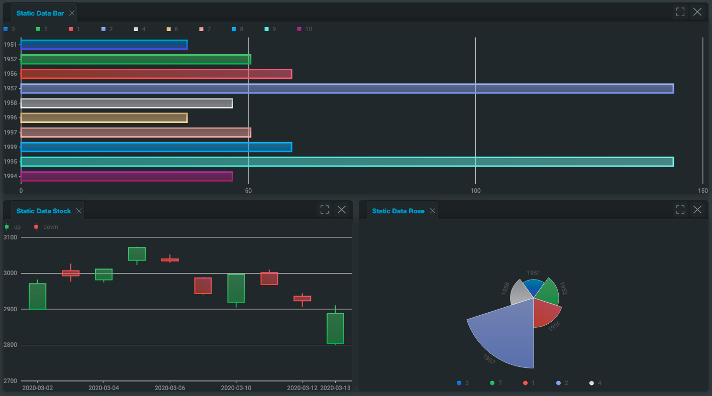

# Genesis Foundation UI App Layout

[](https://lerna.js.org/)
[](https://www.typescriptlang.org/)

## Declarative HTML API

The following example shows the usage of the declarative API with `zero-charts` and the output that it produces.
```html
<foundation-layout ${ref('analyticsLayout')}>
  <foundation-layout-region type="horizontal">
    <foundation-layout-item title="Static Data Bar" registration="bar" closable>
      <foundation-g2plot-chart
        type="bar"
        :config=${(x) => x.barConfig}
        :data=${(x) => x.barData}
      ></foundation-g2plot-chart>
    </foundation-layout-item>
    <foundation-layout-region type="vertical">
      <foundation-layout-item title="Static Data Stock" registration="stock" closable>
        <foundation-g2plot-chart
          type="stock"
          :config=${(x) => x.stockConfiguration}
          :data=${(x) => x.stockData}
        ></foundation-g2plot-chart>
      </foundation-layout-item>
      <foundation-layout-item title="Static Data Rose" registration="rose" closable>
        <foundation-g2plot-chart
          type="rose"
          :config=${(x) => x.roseConfig}
          :data=${(x) => x.roseData}
          :legendParser=${(x) => x.roseLegendParser()}
        ></foundation-g2plot-chart>
      </foundation-layout-item>
    </foundation-layout-region>
  </foundation-layout-region>
</foundation-layout>
```



1. Register the layout with the design system. This is probably in a file called **components.ts**, located where you call `.register()` on the design system.

```javascript
FoundationDesignSystem: registerFoundationDesignSystem().register(
	// ...Other registrations
	// add foundationLayoutComponents here
	foundationLayoutComponents,
)
```

- This registers the three custom elements for use in your application. The components will use the prefix of the design system as their prefix. For example, the root component will be `<foundation-layout>` in the `Foundation` design system, and `<zero-layout>` in the `Zero (alpha)` design system.

:::info
For the rest of this document, the components will be referred to with the `foundation-` prefix.
:::

### Custom styling

The required class, template, and base styles are exported as part of the package, allowing a client to customise the styling of the layout system via design system extensions.

:::tip
All the customisable styles of the layout system are contained within the styles for [`<foundation-layout>`](./docs/api/foundation-layout.foundationlayout.md). So if you want to customise the styles in addition to setting the css variables, you only need to set the styles here.
:::

### [Top Level Component `<foundation-layout>`](./docs/api/foundation-layout.foundationlayout.md)

Top level web component, which is used to initialise a custom layout

- **reload-buffer** : numerical attribute that controls the buffer between how long the layout is reloaded. The default
is 500ms. In this case, the layout is only reloaded if the child elements of the layout region are manipulated
once every 500ms. This is to stop the layout being reloaded over and over for every single item during initialisation.
The higher the value is, the more performant the component is - but the first load will appear to take longer.
- **auto-save-key** : optional string which if set, will enable autosaving the layout under this key in local
storage. See [here](#autosaving-layout) for more.

:::tip
This only applies for usage with the declarative HTML API. When the layout first loads after this amount of time,
it emits an [event](#events).
:::

### [Layout Regions](./docs/api/foundation-layout.foundationlayoutregion.md)

If you don't specify the `type` of the layout region, it defaults to `type="horizontal"`;

- **type**: `vertical`, `horizontal`, `tabs` (default `horizontal`).
- **size**: optional string parameter defining size, [see here](#sizing).

#### `<foundation-layout-region type="vertical">`

Indicates to the layout system that all immediate children are (by default) to be split equally within the available space of this
component using n-1 column split(s). Can be nested within other horizontal and vertical regions.

#### `<foundation-layout-region type="horizontal">`

Indicates to the layout system that all immediate children are (by default) to be split equally among the available space of this
component using n-1 row split(s). Can be nested within other horizontal and vertical regions.

#### `<foundation-layout-region type="tabs">`

Indicates to the layout system that all immediate children are to be added as tabs in the available space of this component,
with a tab for each child. The tabs are ordered according to which child the layout item is (e.g. the second `<foundation-layout-item>`
 of the tab split is the second tab). The first child will be the one that is open by default. Can be nested within horizontal
 and vertical regions, but cannot have more layout sections inside it.

### [Layout Item `<foundation-layout-item>`](./docs/api/foundation-layout.foundationlayoutitem.md)

Wrapper component that lives inside a layout section and wraps the client content. All content must be inside a layout item;
otherwise, a runtime error will be thrown when the layout attempts to render itself on screen.

- **title**: string defining the title of the pane that contains the content. Defaults to `Item x`, where `x` is the pane number.
- **closable**: boolean defining whether this element is closable - Default false.
- **size**: optional string parameter defining size, [see here](#sizing).
- **registration**: optional string, which manually sets the registered name for the pane - [see here](#dynamic-registration-and-adding-items). By default, each item that doesn't have the `registration` attribute set will be a string registered sequentially starting at `"1"`.

### Sizing

The layout sections and layout item all have an _optional_ attribute:

- **size**: string defining the size. For rows, it specifies height. For columns, it specifies width. Has format `<number><size-unit>`.
	Currently only supports units `fr` and `%`. Space is first proportionally allocated to items with sizeUnit `%`. If there is any space
	left over (less than 100% allocated), then the remainder is allocated to the items with unit `fr` according to the fractional size.
	If more than 100% is allocated, then an extra 50% is allocated to items with unit `fr` and is allocated to each item according to its
	fractional size. All item sizes are then adjusted to bring the total back to 100%.

:::info
The size defines the size of the component _compared_ to the siblings _within_ the context of the component's parent.
:::

## JavaScript API

The JavaScript API is [accessed through the methods on the root layout object](./docs/api/foundation-layout.foundationlayout.md) and allows for saving/loading the layout state, and dynamically adding items to the layout at runtime.

### Dynamic registration and adding items

To have a pane displayed on the layout system, it must be *registered* with the layout system. When using the [declarative API](#declarative-html-api), the layout system takes care of this for you, but as you start to add items dynamically and then serialise the layout, you need to consider which panes are registered. See [this contained example](#contained-example), which allows the user to add pre-determined items to the layout dynamically.

:::tip
If you are only using the declarative API, and not using any dynamic integrations with JavaScript, then you shouldn't need to set the registration names of any items, as all the same items will be registered when you load a previously saved layout. If you are dynamically adding items as well, it is highly recommended to set the registration names of items manually. This makes it easier to figure out what is and is not registered.
* When using the declarative API, use the `registration` attribute on the `<foundation-layout-item>` component.
* When using the JavaScript API, set the `registration` optional parameter on the [registered element config](./docs/api/foundation-layout.registeredelementconfig.md).
:::

#### [Register Item](./docs/api/foundation-layout.foundationlayout.registeritem.md)

This API enables you to register an item at runtime, but it will not be displayed in the layout. This could be used to register components in anticipation of displaying them when loading a serialised layout - [see this example](#loading-serialised-layouts).

#### [Add Item](./docs/api/foundation-layout.foundationlayout.additem.md)

Add an item or items that have previously been registered with the layout.

#### [Remove Items](./docs/api/foundation-layout.foundationlayout.removeitems.md)

Dynamically remove items from the layout. See linked API for side effects and options.

#### [Layout Required Registrations](./docs/api/foundation-layout.foundationlayout.layoutrequiredregistrations.md)

Static function to read a layout config. It returns a list of all the required registrations required to load it in the layout system. [See this example](#loading-serialised-layouts).

#### [Get Current Registrations](./docs/api/foundation-layout.foundationlayout.registereditems.md)

Returns a list of all the items currently registered with the layout system.

:::tip
Use this function over `.layoutRequiredRegistrations(layout: SerialisedLayout)` to get the *current* registrations, because that will miss any items that are currently registered with the layout system, but which are not shown on the layout.
:::

### Serialising layout

The JavaScript API can be used to save and load layout states manually. This only describes the state of the dynamic layout itself. It is the responsibility of each component within the layout to serialise its own state, if required.
To enable autosaving the layout, see [here](#autosaving-layout).

#### [Get Layout](./docs/api/foundation-layout.foundationlayout.getlayout.md)

Get an object describing the current layout so that it can be restored at a later date. This does not save any data internally to the layout. It is up to the client to store this state where appropriate for later recall (browser local storage, persistence layer, etc.). Use the [autosaving layout](#autosaving-layout) feature to get the layout to do this for you with local storage.

You can store state for an instance of an item, and that will be saved inline. See [managing state](#managing-the-state).

#### [Load Layout](./docs/api/foundation-layout.foundationlayout.loadlayout.md)

Loads a serialised layout. All items that are described in the config to load must already be registered with the layout system - using either the declarative or JavaScript API. If there are items missing (could be due either to missing items or to a mismatch of registered names) then a `LayoutUsageError` will be thrown containing the names of the missing items. Alternatively, you can request placeholder items to be added.

## Events

### [Emitted Events](./docs/api/foundation-layout.layoutemitevents.md)

Certain actions that are performed by the user interacting with the layout emit events. See the API document (in the link above) for the events and when they're emitted. Interacting with these events allows your client code to  interact dynamically with the layout, such as enabling/disabling buttons to add items to the layout when they're removed/added.

### [Received Events](./docs/api/foundation-layout.layoutreceiveevents.md)

Certain events are listened to by the container for each component, enabling the component to interact with the layout. For example, a component could emit an event to change the title of the containing window:

```typescript
this.$emit(eventType, eventDetail)
```
Each event requires a certain detail to process the event - see [the map of events to their required details](./docs/api/foundation-layout.layoutreceiveeventsdetail.md).

## Customising header buttons

You can add custom buttons on layout items, and then control their behaviour. See [the custom button API](./docs/api/foundation-layout.custombutton.md) for the full definition. Setting this is optional. If you do define it, you must define it as an array, which enables you to add multiple custom buttons.

* The `svg` parameter controls the icon that is displayed for your button. The format must be a base64 image definition. See the format (as explained in the linked api document above), and then replace the text around the `<< >>` part with a base64 encoded definition of the svg you wish to use.
* The `onClick` parameter will register a callback with the button. When the user clicks the button, your callback will be called. The callback receives a reference to the clicked button element, and to the element that is contained in the layout item associated with the clicked button.

Different layout instances can have their own custom buttons, or they can share definitions. You are not able to have fine-grained control over each layout item, though; so if a layout has a custom button, then every item that it contains will have the button.

### Applying the custom button

To ensure that every item gets the button as expected, you need to ensure that you apply the custom button definitions as early as possible. If you are using the html API then you'll probably want to apply the definitions in the template.

```html
<foundation-layout :customButtons=${() => buttonDefinition}>
  ...
</foundation-layout>
```

If you are only using the javascript API then you should just apply the property as soon as you can.
```typescript
layout.customButtons = buttonDefinition;
```

### Renaming example

See this example of [creating a custom button](#custom-item-renaming-header-button), which enables the user to rename an item.

## Autosaving layout

You can set the layout to autosave in local storage as the user interacts with it. To do this, set the `auto-save-key` attribute to a unique string on the root element; the layout will be saved in this key. The layout will be saved for later recall in local storage whenever the user performs the following actions:

- adding an item
- removing an item
- resizing items using the divider
- dragging items around the layout

When you have enabled autosave, you are still able to use the manual [serialising commands](#serialising-layout).

### Reloading the layout

The function [tryLoadLayoutFromLocalStorage()](./docs/api/foundation-layout.foundationlayout.tryloadlayoutfromlocalstorage.md) is used to rehydrate the layout from local storage, when `auto-save-key` is enabled.
If you are using the declarative API, then this function is called for you automatically.

If you are manually registering items (too) using the JavaScript API, you must [call this function manually](#contained-example) immediately after you have finished registering all the items.

### Layout placeholder

If the layout is auto-loaded with items that are missing from the registration, then a placeholder item is displayed instead. Additionally, the close option is added to the pane. This accounts for you removing an item from a layout that a user has autosaved in their config.

You can change the text of the placeholder using the observable binding `:missingItemPlaceholder`. This is a function that takes a string (the missing registration name) and returns the string to use as the placeholder. A default is set, but you can override it. See the override implementation [in this example](#contained-example).

### Invalidating the cache

As explained in the previous section, a placeholder item is added if an item is no longer registered for the auto-loaded layout. This accounts for removing an item. However, there is the reverse issue if you are only using the declarative API; if you add a new item and the user already has an autosaved layout, then that will be loaded - which effectively hides the new item you've added.

In this case, you must invalidate the autosaved layout cache. The cleanest and easiest implementation is to add a hash onto the end of your `auto-save-key`, which will start a new autosave for this table (and reload the default, containing your new layout item).

## Contained elements

This section concerns the behaviour of elements inside the layout. If you are using simple elements or Genesis-supplied elements, this is less of a concern; but if you are building complex custom components yourself, you need this information.

### Element lifecycle (gating)

Some actions that the user can perform with items in the layout will run the component lifecycle functions (`connectedCallback` and `disconnectedCallback`) when you don't want them to run:
- when an item is dragged around the layout
- potentially, when another item is removed from the layout
- potentially, when new items are added to the layout
- when an item is maximised or minimised

For example, if you have a component with a loaded resource on the layout (such as a grid with a `grid-pro-genesis-datasource`) and you add a new item to the layout with the JavaScript API, then the component with the loaded resource will have to reload too. It is important that any such element accounts for this, including such requirements as caching data, or resizing correctly.

In the `@genesislcap/foundation-utils` package, there is a mix-in class `LifecycleMixin` which exposes two protected members:

-  `shouldRunConnect`
-  `shouldRunDisconnect`

These can be used to gate specific functionality.

For example, if there are parts of `disconnectedCallback` that you don't want to run when the item is being dragged around the layout, you can gate it behind a `(!this.shouldRunDisconnect) return;` early return. See [this example](#resource-intensive-component-resetting-in-layout) and [this example](#consuming-lifecycle-value-multiple-times).

:::warning
At the very least, you must run `super` calls to the lifecycle methods, or else your custom element will not work correctly.
:::

### Resource-intensive components
You do not need to de-register a component that is registered in the layout while it is not in use.  However, if you have a component that is extremely resource-intensive, then you can use this lifecycle control method to ensure that it only consumes resources when it is in use.

- When the element is part of the layout registry, then `shouldRunConnect` will be false and you can use this to ensure that your component isn't doing unnecessary work while part of the cache.

- Once the component is actually initialised in the layout on the DOM, then `shouldRunConnect` will be true, and you can then perform all the required initialisation.

### Managing the state

Items inside the layout can save and restore the state using various methods, but it can become difficult to manage the state if you're adding the same item to the layout multiple times (multiple instances of the same web component).

You can implement the [LayoutComponentWithState](./docs/api/foundation-layout.layoutcomponentwithstate.md) interface, which enables you to save and load the state *per instance* of your components. See the linked interface and the associated functions API documentation for examples and explanations of usage.

Usage of this interface is optional; if you do not need to manage the state for your components in this way, then simply do not implement the interface.

:::warning
The layout system only interacts with the immediately contained items - so if you have components that contain other components, each top-level component must interact with the contained components to manage their states.
:::

:::danger
Each layout item can contain multiple components, and most of the time there are no extra considerations when doing this. However, the state of each component in an instance is saved in order of the components on the DOM, so if the serialised state is manually changed to have the items out of order with their state, then the incorrect states will be passed into each item. This should not occur during defined behaviour, but is possible if the end-user is able to change the state passed into `loadLayout()` manually.
:::

### Element cloning

To enable you to add multiple items from the same `registration`, the layout system clones elements to add to the layout.
This is the case both when items are added with `.addItem()`, and when they are added using the declarative API. Under the hood, this uses the Node [cloneNode](https://developer.mozilla.org/en-US/docs/Web/API/Node/cloneNode) api.
There are certain limitations to this function, especially when using custom elements with the shadow DOM. [See troubleshooting example](/develop/client-capabilities/layout-management/foundation-layout/#binding-events-inline-in-the-declarative-api).

:::tip
As a general rule, if you need to have elements with FAST bindings inside the layout, wrap them in custom elements.
:::

If you are writing your own custom element that needs to work inside the layout, follow these steps.

1. In the `@genesislcap/foundation-utils` package, there is a mix-in class `LifecycleMixin`, which overrides the `cloneNode` API.

```typescript
// Make a call to `deepClone` and manually clone children
override cloneNode(deep?: boolean): Node {
	const thisClone = this.deepClone();
	if (deep) {
		Array.from(this.childNodes).forEach((child) => {
			thisClone.appendChild(child.cloneNode(true));
		});
	}
	return thisClone;
}

// Create a new element of the same name and copy over attributes
deepClone(): Node {
	const copy = document.createElement(this.tagName.toLowerCase());
	this.getAttributeNames().forEach((at) => copy.setAttribute(at, this.getAttribute(at)));
	return copy;
}
```

2. You can then extend the cloning functionality for your specific requirements. For example, our charts component needs to copy over `config` and `data` parameters.

```typescript
export class G2PlotChart extends LifecycleMixin(FoundationElement) {
	...
  override deepClone(): Node {
    const copy = super.deepClone() as G2PlotChart;
    copy.config = structuredClone(this.config);
    copy.data = structuredClone(this.data);
    return copy;
  }
	...
}
```
Some items you'll probably want to copy over are `eventListeners` and other non-attribute configuration elements on your custom element.

## Examples

### Simple example

Simple example with a vertical split and two items that will take up equal space.

```html
<foundation-layout>
  <foundation-layout-region type="horizontal">
    <foundation-layout-item title="Component 1">
      <!-- Content -->
    </foundation-layout-item>
    <foundation-layout-item title="Component 2">
      <!-- Content -->
    </foundation-layout-item>
  </foundation-layout-region>
</foundation-layout>
```

Will be rendered as:

```
+-----------------------------------------------------+
|                                                     |
|              Component 1 Contents                   |
|                                                     |
+-----------------------------------------------------+
|                                                     |
|              Component 2 Contents                   |
|                                                     |
+-----------------------------------------------------+
```

### Nested example

A slightly more complicated example:

```html
<foundation-layout>
  <foundation-layout-region type="vertical">
    <foundation-layout-item title="Component 1" size="25%" closable>
      <!-- Content -->
    </foundation-layout-item>

    <foundation-layout-region type="horizontal">
      <foundation-layout-item title="Component 2">
        <!-- Content -->
      </foundation-layout-item>
      <foundation-layout-item title="Component 3">
        <!-- Content -->
      </foundation-layout-item>
    </foundation-layout-region>
  </foundation-layout-region>

</foundation-layout>
```

Would render the following:

```
+-------------+---------------------------------------+
|             |                                       |
|             |        Component 2 Contents           |
|  Component  |                                       |
|      1      +---------------------------------------+
|  Contents   |                                       |
|             |        Component 3 Contents           |
|             |                                       |
+-------------+---------------------------------------+
```

Component 1 has a Close button. By default, Component 1 would be 50% width and 2 and 3 would take up the other 50% width, but here we set `25%`
as the width of Component 1 layout item (width because it is the size in the context of a vertical split).

### Multi-nested example

If instead we had:

```html
<foundation-layout>
  <foundation-layout-region type="vertical">
    <foundation-layout-item title="Component 1" size="25%" closable>
      <!-- Content -->
    </foundation-layout-item>

    <foundation-layout-region type="horizontal">
      <foundation-layout-region type="vertical">
        <foundation-layout-item title="Component 2">
          <!-- Content -->
        </foundation-layout-item>
        <foundation-layout-item title="Component 3">
          <!-- Content -->
        </foundation-layout-item>
        <foundation-layout-item title="Component 4">
          <!-- Content -->
        </foundation-layout-item>
      </foundation-layout-region>

      <foundation-layout-region type="tabs">
        <foundation-layout-item title="Component 5">
          <!-- Content -->
        </foundation-layout-item>
        <foundation-layout-item title="Component 6">
          <!-- Content -->
        </foundation-layout-item>
      </foundation-layout-region>
    </foundation-layout-region>
  </foundation-layout-region>

</foundation-layout>
```

This would render the following:

```
+-------------+------------+-------------+------------+
|             |            |             |            |
|             |   Comp 2   |    Comp 3   |   Comp 4   |
|  Component  |            |             |            |
|      1      +------------+-------------+------------+
|  Contents   |_5_|_6_|                               |
|             |        Component 5 Contents           |
|             |                                       |
+-------------+---------------------------------------+
```
Component 1 has a **Close** button. Component 1 takes up 25% of the initial width. Components 2,3,4 take up a third of the _remaining_ width between them
(default behaviour) and 5 and 6 are tabbed.

### `repeat` directive

You can use [FAST template directives](https://www.fast.design/docs/fast-element/using-directives) such as `repeat`

```javascript
interface Position {
	symbol: string;
}

class Commodities extends FASTElement {
	positions: Position[] // Not @observable - see following section

	...
}

const template = html<Commodities>`
<foundation-layout>
	<foundation-layout-region type="horizontal">
		${when(x => x.positions, html<Position>`
			<foundation-layout-item title="${x => x.symbol}">
				<chart symbol="${x => x.symbol}"></chart>
			</foundation-layout-item>`)}
	</foundation-layout-region>
</foundation-layout>`;
```

For an example where the `Commodities` object has three positions, you will see the following output:
```
+-----------------------------------------------------+
|              Component 1 Contents                   |
+-----------------------------------------------------+
|              Component 2 Contents                   |
+-----------------------------------------------------+
|              Component 3 Contents                   |
+-----------------------------------------------------+
```


:::note
`<chart>` is just an example component; it doesn't exist within `foundation-ui`.
:::

### `when` directive

Using the `when` directive:

```javascript
@customElement({
	name: 'my-element',
	template,
})
class Analytics extends FASTElement {
	showIndexFunds = true; // not @observable
}

var template = html<Analytics>`
	<button class="toggle">Toggle Index</button>
	<foundation-layout>
		<foundation-layout-region>
			<foundation-layout-item>
				<chart type="stocks"></chart>
			</foundation-layout-item>

			${when(x => x.showIndexFunds, html`
				<foundation-layout-item>
					<chart type="index-funds"></chart>
				</foundation-layout-item>
			`)}

		</foundation-layout-region>
	</foundation-layout>
`;
```

You would see both items rendered like this:
```
+---------------------------------------------+
|              Stocks Chart                   |
+---------------------------------------------+
|              Index  Chart                   |
+---------------------------------------------+
```

If you had `showIndexFunds = false;` then only the `Stocks Chart` would be rendered.

:::danger
Directives are for initialising the layout only and should *not* be used with changing `@observable` attributes, which would cause the
layout to reinitialise incorrectly - this will duplicate the panels. For example, you can use the `when` directive to conditionally render a pane during initialisation, but not to toggle whether to show/hide the pane afterwards.
See [this example](#observables-with-directives).
:::

### Multiple instances

Consider the following example:
```html
<div class="container" style="display: grid; grid-template-columns: 1fr; grid-auto-rows: minmax(46vh, auto)">
	<div style="display: block; position: relative;">
		<foundation-layout>
			<foundation-layout-region>
				<foundation-layout-item><h1>Item 1</h1></foundation-layout-item>
				<foundation-layout-item><h1>Item 2</h1></foundation-layout-item>
			</foundation-layout-region>
		</foundation-layout>
	</div>
	<div style="display: block; position: relative;">
		<foundation-layout>
			<foundation-layout-region type="vertical">
				<foundation-layout-item><h1>Item 3</h1></foundation-layout-item>
				<foundation-layout-item><h1>Item 4</h1></foundation-layout-item>
			</foundation-layout-region>
		</foundation-layout>
	</div>
</div>
```

This describes the following layout:
```
+---------------------------------------------+
|                   Item 1                    |
+---------------------------------------------+
|                   Item 2                    |
+---------------------------------------------+

+----------------------+----------------------+
|                      |                      |
|       Item 3         |        Item 4        |
|                      |                      |
+----------------------+----------------------+
```
Here a grid region has been used to style two completely separate instances of the dynamic layout. Even though we have named each
`<h1>` sequentially, the two layouts are completely separate and the default titles of each tab (Item 1 and Item 2 for both layouts),
will reflect this. You can configure each layout separately, and you cannot drag layout items from one layout into the other one.

:::info
This is just an example; you could have more than two layouts on a page or style them with a different method to the grid.
:::

### Adding items dynamically

This is an example of using the JavaScript API to add items to the layout at runtime. Before reading this example, you should familiarise yourself with the [API Section](/develop/client-capabilities/layout-management/foundation-layout/#javascript-api).

Say you want the user to be able to choose between three different types of item that can be put onto the layout - a profile-management table, a pie chart, and a column chart.

```typescript
// Can either create an element and initialise it completely using JavaScript
const profileManagement = document.createElement('profile-management');
// Or could grab a reference to one you create via FAST markup
const pieChart = document.getElementById('pie-chart');
// In idiomatic FAST we can have a reference using `ref` directive
// const colChart = this.columnChart;
```

We can then register these elements with the layout system. Registering it with the layout system removes it from its original location.
```typescript
// Using a duplicate registration name is a runtime error
this.layout.registerItem('profile', [profileManagement]);
this.layout.registerItem('pie', [pieChart]);
this.layout.registerItem('colChart', [this.columnChart]);
```

Finally, use the `addItem` API to add a pane onto the layout using a previously registered item.
```typescript
this.layout.addItem({
	registration: 'profile',
	name: 'Profile Management',
	closable: true,
})
```
Using `addItem` with a `registration` that has not been set is a runtime error. Remember `addItem` has an optional second parameter for setting the placement of the new pane.

:::tip
Items registered using the declarative API use the same pool of registration names, so you can also use `addItem` to add them to the layout too.
:::

#### Contained example

This is a complete example of the above, omitting imports.

```typescript
// template
export const template = html<ContainedExample>`
  <div style="display: grid; grid-template-columns: 1fr; grid-auto-rows: minmax(7vh, auto)">
    <div style="display: block; position: relative;">
      <foundation-button @click=${(x) => x.addItem('1')}>Test 1</foundation-button>
      <foundation-button @click=${(x) => x.addItem('2')}>Test 2</foundation-button>
      <foundation-button @click=${(x) => x.addItem('3')}>Test 3</foundation-button>
    </div>
    <div style="display: block; position: relative; grid-row-start: 2; grid-row-end: 12;">
      <foundation-layout
        auto-save-key="layout-preview-contained-example"
        :missingItemPlaceholder=${(x) => x.missingItemOverride()}
        ${ref('containedExampleLayout')}
      ></foundation-layout>
    </div>
  </div>
`;

// class
@customElement({
  name: 'contained-example',
  template,
})
export class ContainedExample extends FASTElement {
  containedExampleLayout: FoundationLayout;
  private _addedPaneCount = 0;

  connectedCallback(): void {
    super.connectedCallback();

    const h1 = document.createElement('h1');
    h1.innerHTML = 'Example 1';
    const p1 = document.createElement('p');
    p1.innerHTML = 'Ex 1';

    const h2 = document.createElement('h2');
    h2.innerHTML = 'Example 2';
    const p2 = document.createElement('p');
    p2.innerHTML = 'Ex 2';

    const h3 = document.createElement('h3');
    h3.innerHTML = 'Example 3';
    const p3 = document.createElement('p');
    p3.innerHTML = 'Ex 3';

    this.containedExampleLayout.registerItem('1', [h1, p1]);
    this.containedExampleLayout.registerItem('2', [h2, p2]);
    this.containedExampleLayout.registerItem('3', [h3, p3]);
    this.containedExampleLayout.tryLoadLayoutFromLocalStorage();
  }

  addItem(registration: string) {
    this.containedExampleLayout.addItem({
      registration,
      title: `${registration} (${(this._addedPaneCount += 1)})`,
      closable: true,
    });
  }

  missingItemOverride = () => (missingItem: string) => `Missing Item: ${missingItem}`;
}
```

### Loading serialised layouts

This is an elaborate example of using the JavaScript API with consideration of the registered names. Before reading this example, you should familiarise yourself with the [API Section](/develop/client-capabilities/layout-management/foundation-layout/#javascript-api):

```html
<foundation-layout>
  <foundation-layout-region type="horizontal">
    <foundation-layout-item title="Trades" registration="trades">
      <!-- Content -->
    </foundation-layout-item>
    <foundation-layout-item title="Users" registration="users">
      <!-- Content -->
    </foundation-layout-item>
  </foundation-layout-region>
</foundation-layout>
```

We can use `layoutRequiredRegistrations()` on the config returned from `getLayout()` to see the registered names that are required to load the layout.

```javascript
const layout = document.querySelector('foundation-layout'); // as FoundatonLayout in TypeScript;
const layoutConfig = layout.getLayout();
console.log(FoundatonLayout.layoutRequiredRegistrations(layoutConfig))
```
This will log `['trades','users']` because these are the two registered panes. You can then load any layout that only contains either/both of these items.

Consider the situation where we dynamically add an item to the right-hand side of the layout.
```javascript
const newItem = document.createElement('p'); //simple example
newItem.innerText = 'Test';

layout.registerItem(test, [newItem]);
const layoutConfigTwo = layout.getLayout()
console.log(FoundationLayout.layoutRequiredRegistrations(layoutConfigTwo));
```
Now we get `[ "test", "trades", "users"]` as the output, because to load `layoutConfigTwo` we now need all three of those registered panes.

Consider now where the user refreshes the page to go back to the original state of the layout with just the two elements added, but then tries to load:

`layoutConfigTwo`:
```javascript
// User has refreshed page

console.log(layout.registeredItems());
// Ouputs ['trades','users']

layout.loadLayout(layoutConfigTwo);
// Uncaught Error: Trying to load layout with extra components. The component(s) not currently loaded are "test"
```
Notice the error message says that the `test` component is missing. This is because it was required as part of the layout when we used `getLayout()`, but it hasn't been added as part of the layout now. If we added the item using `registerItem()` we could subsequently run `layout.loadLayout(layoutConfigTwo);` to  load the layout successfully.

:::warning
Just because an item is not displayed on the layout does not mean it is not registered. `.getLayout()` gets only the current layout config, so you cannot use it to see every single item that is currently registered (unless every item is added). This is why you should use `.registeredItems()` to get the currently registered items.
:::

#### Proactively registering items

Here is a simple approach to ensure that all items are registered when you load a layout; loop through all the items that you could possibly load and register them.

```javascript
const allItems = [
	{registration: 'trades', elements: [...], },
	{registration: 'users', elements: [...], },
	{registration: 'profiles', elements: [...], },
	{registration: 'notifications', elements: [...], },
];

allItems.forEach(({registration, elements}) => {
	layout.registerItem(registration, elements);
})
```
Now all those items will be registered with the layout for potential use when calling `loadLayout()`, or added using `addItem()`.

#### Reactively registering items

Alternatively, you could query the current layout and the layout you want to load to see if there are any missing registered items; you can then register the missing ones. Using our previous examples:

```javascript
const currentRegistrations = FoundatonLayout.registeredItems();
// ['trades','users']
const requiredRegistrations = FoundatonLayout.layoutRequiredRegistrations(layoutConfigTwo);
// ['test','trades','users']

// We can see 'test' is missing and therefore we should register it
layout.registerItem(test, [element]);
```

:::info
Only items _missing_ from the `requiredRegistrations` are an issue. If there are items in the `currentRegistrations` that are not in `requiredRegistrations`, this is *not* an issue - because these will simply be unused registrations.
:::

:::warning
If you are calling `registerItem` manually and are using the autosave feature, [see here](#reloading-the-layout).
:::

### Custom item renaming header button

Here is an example of creating a custom button for the layout. When the button is clicked, it prompts the user for a name, and will rename the item in the layout.

```typescript
export const layoutCustomButtons: CustomButton[] = [
  {
    svg: LAYOUT_ICONS.renameSVG,
    onClick: (button: HTMLElement, elem: HTMLElement) => {
      const title = prompt('New name?');
      const event: LayoutReceiveEventsDetail['changeTitle'] = {
        title,
        mode: 'replace',
      };
      elem.dispatchEvent(
        new CustomEvent(LayoutReceiveEvents.changeTitle, { detail: event, bubbles: true }),
      );
    },
  },
];
```

You can import `LAYOUT_ICONS`, `CustomButton`, `LayoutReceiveEvents`, and `LayoutReceiveEventsDetail` from the foundation-layout package, to get strong typing.

:::warning
You'll probably want to improve this callback function to handle cases where the user doesn't enter a prompt value.
:::

## Incorrect examples

The following section contains examples of incorrect usage, which are useful for troubleshooting.

### Non-layout child

The following example is invalid:

```html
<foundation-layout>
  <foundation-layout-region type="horizontal">
    <h1>My splits</h1>
    <foundation-layout-item title="Component 1">
      <!-- Content -->
    </foundation-layout-item>
    <foundation-layout-item title="Component 2">
      <!-- Content -->
    </foundation-layout-item>
  </foundation-layout-region>
</foundation-layout>
```
This is because there is a child of one of the layout regions which isn't another layout region or layout item (the `<h1>`). This will throw a runtime error.

### Layout region in tabs

The following example is invalid:

```html
<foundation-layout>
	<foundation-layout-region type="tabs">

		<foundation-layout-region type="vertical">
			<foundation-layout-item title="Component 1">
				<!-- Content -->
			</foundation-layout-item>
			<foundation-layout-item title="Component 2">
				<!-- Content -->
			</foundation-layout-item>
		</foundation-layout-region>

		<foundation-layout-item title="Component 3">
			<!-- Content -->
		</foundation-layout-item>

	</foundation-layout-region>
</foundation-layout>
```
This is because you cannot have more layout regions nested inside a tab region. You will get undefined behaviour.


### Multiple items in root

The following example is invalid:

```html
<foundation-layout>
		<foundation-layout-item title="Component 1">
			<!-- Content -->
		</foundation-layout-item>
		<foundation-layout-item title="Component 2">
			<!-- Content -->
		</foundation-layout-item>
		<foundation-layout-item title="Component 3">
			<!-- Content -->
		</foundation-layout-item>
</foundation-layout>
```
This is because you cannot have multiple layout elements as the immediate child of the layout root. You will get a runtime error.

### Multiple nested layouts

The following example is invalid:

```html
<foundation-layout>
		<foundation-layout-item title="Component 1">
      <another-component></another-component>
		</foundation-layout-item>
		<foundation-layout-item title="Component 2">
			<!-- Content -->
		</foundation-layout-item>
</foundation-layout>
```
Where the markup of `another-component` is something like:
```html
<!--other markup-->
<foundation-layout>
		<foundation-layout-item title="Component 1">
			<!-- Content -->
		</foundation-layout-item>
		<foundation-layout-item title="Component 2">
			<!-- Content -->
		</foundation-layout-item>
		<foundation-layout-item title="Component 3">
			<!-- Content -->
		</foundation-layout-item>
</foundation-layout>
<!--other markup-->
```

This is because you cannot have an instance of the layout nested inside of another layout instance. You could try adding multiple items at once using `.addItem([elem1,..,elemN])` instead.

### Nested item

The following example is invalid:

```html
<foundation-layout>
		<foundation-layout-item title="Component 1">
			<foundation-layout-item title="Component 2">
				<!-- Content -->
			</foundation-layout-item>
			<foundation-layout-item title="Component 3">
				<!-- Content -->
			</foundation-layout-item>
		</foundation-layout-item>
</foundation-layout>
```
This is because you cannot have `<foundation-layout-item>` inside other `<foundation-layout-item>`. You will get a runtime error.

### Observables with directives

The following is invalid:

```javascript
@customElement({
	name: 'my-element',
	template,
})
class Analytics extends FASTElement {
	@observable showIndexFunds = true;

	toggleShowIndexFunds() {
		this.showIndexFunds = !this.showIndexFunds;
	}
}

var template = html<Analytics>`
	<button
		class="toggle"
		@click=${x => x.toggleShowIndexFunds()}
	>Toggle Index</button>
	<foundation-layout>
		<foundation-layout-region>
			<foundation-layout-item>
				<chart type="stocks"></chart>
			</foundation-layout-item>

			${when(x => x.showIndexFunds, html`
				<foundation-layout-item>
					<chart type="index-funds"></chart>
				</foundation-layout-item>
			`)}

		</foundation-layout-region>
	</foundation-layout>
`;
```

Initially, you will see both items correctly rendered like this:
```
+---------------------------------------------+
|              Stocks Chart                   |
+---------------------------------------------+
|              Index  Chart                   |
+---------------------------------------------+
```
But as the user clicks the toggle button, the `Index Chart` will not be taken away and added back in.
Instead, it will be added as a duplicate every time the observable is set true. Additionally, the contents
of the panel will be wiped as duplicates are added.

To work around this, you would use FAST directives inside custom web components inside the layout.

### Binding events inline in the declarative API
The following example is invalid:

```html
<foundation-layout>
		<foundation-layout-item>
			<input type="checkbox" @change=${(x,c) => x.doSomething()} />
		</foundation-layout-item>
</foundation-layout>
```

Because of a limitation in the [cloneNode() API](https://developer.mozilla.org/en-US/docs/Web/API/Node/cloneNode), event listeners are *not* copied.
This process is part of the process of adding an item to the layout, using both the declarative HTML and JavaScript APIs. So while you will see
a checkbox on the screen as part of the layout, the event listener will *not* fire when you `change` the checkbox. This applies to all items and events.

The idiomatic FAST way of implementing this event binding is to create a custom element and attach the event internally.

```typescript
// template
export const exampleComponentTemplate = html<ExampleComponent>`
  <template>
    <input type="checkbox" ${ref('checkbox')} @change=${(x, c) => x.doSomething()} />
  </template>
`;

// model
@customElement({
  name: 'example-component',
  template: exampleComponentTemplate,
})
export class ExampleComponent extends FASTElement {
  checkbox: Checkbox;
	doSomething() { } // do something important
}
```

You can then use the custom component in the layout:

```html
<foundation-layout>
		<foundation-layout-item>
			<example-component><example-component/>
		</foundation-layout-item>
</foundation-layout>
```

See [here](#custom-components-to-handle-bindings-and-event-listeners) for a thorough technical explanation.

### New layout item not displaying
Say you have the following layout, [the simple example](/develop/client-capabilities/layout-management/foundation-layout/#simple-example), with autosave enabled.
```html
<foundation-layout auto-save-key="simple-example">
  <foundation-layout-region type="horizontal">
    <foundation-layout-item title="Component 1">
      <!-- Content -->
    </foundation-layout-item>
    <foundation-layout-item title="Component 2">
      <!-- Content -->
    </foundation-layout-item>
  </foundation-layout-region>
</foundation-layout>
```

The user of your layout will move things around and this will cache the layout. Say you then update the layout to add an item.
```html
<foundation-layout auto-save-key="simple-example">
  <foundation-layout-region type="horizontal">
    <foundation-layout-item title="Component 1">
      <!-- Content -->
    </foundation-layout-item>
    <foundation-layout-item title="Component 2">
      <!-- Content -->
    </foundation-layout-item>
    <foundation-layout-item title="Component 3">
      <!-- Content -->
    </foundation-layout-item>
  </foundation-layout-region>
</foundation-layout>
```

You and the user will still only see the first two items. This is because the cached layout is being loaded, which does not contain the
new item. To fix this, you must [invalidate the cache](/develop/client-capabilities/layout-management/foundation-layout/#invalidating-the-cache).

### Resource-intensive component resetting in layout

Say you have a component which has to initialise a resource-heavy or long-awaited asynchronous task, such as the following:
```typescript
@customElement({
  name: 'mock-connected',
})
export class MockConnected extends FASTElement {
  @observable resource = '';

  async connectedCallback(): Promise<void> {
    super.connectedCallback();
    // Simulate doing some work with an external service
  }

  async disconnectedCallback(): Promise<void> {
    super.disconnectedCallback();
    // Simulate cleaning an external service
  }
}
```

As explained in the [lifecycle info section](/develop/client-capabilities/layout-management/foundation-layout/#element-lifecycle-gating), this component may have its `disconnectedCallback` and `connectedCallback` lifecycle at unnecessary times, effectively wasting time re-initialising a potentially heavy resource.

Use `LifecycleMixin` to access properties on the class, which can be used to run lifecycle functionality more thoughtfully. In the following example, the resource-intensive tasks are called conditionally - only when needed.

```typescript
@customElement({
  name: 'mock-connected',
})
export class MockConnected extends LifecycleMixin(FASTElement) {
  @observable resource = '';

  async connectedCallback(): Promise<void> {
    super.connectedCallback();
    const shouldRunConnect = this.shouldRunConnect;
    DOM.queueUpdate(async () => {
      if (!shouldRunConnect) return;
      await this.init();
    });
  }

  async disconnectedCallback(): Promise<void> {
    super.disconnectedCallback();
    const shouldRunDisconnect = this.shouldRunDisconnect;
    DOM.queueUpdate(async () => {
      if (!shouldRunDisconnect) return;
      await this.deInit();
    });
  }

  // Simulate doing work with an external service
  async init(): Promise<void> { }

  // Simulate cleaning an external service
  async deInit(): Promise<void> { }
}
```

The above is quite a comprehensive example, but it doesn't necessarily have to be so complicated. You might just want to exit early from the connected callback without using the `DOM.queueUpdate` functionality. However, it is useful for handling the `async` setup process properly.

:::warning
It is important to capture the parameter in the example above (e.g. `const shouldRunDisconnect = shouldRunDisconnect`) so that the information is cached at the time of the lifecycle change, for use when the `DOM.queueUpdate` work is performed. This is not required if you run your lifecycle methods synchronously; however, if you follow the pattern above, you need to schedule the `async` functionality to run after the layout considers the relevant lifecycle-gating functionality (such as dragging) to be complete.
:::

### Consuming lifecycle value multiple times

Consider the following example, where multiple bits of functionality are being gated with `shouldRunConnect`:
```typescript
@customElement({
  name: 'mock-connected',
})
export class MockConnected extends LifecycleMixin(FASTElement) {
  @observable resource = '';

  async connectedCallback(): Promise<void> {
    super.connectedCallback();
    console.log("shouldRunConnect: " + this.shouldRunConnect)
    if (this.shouldRunConnect) {
      await this.init();
    }
    await otherSetup(this.shouldRunConnect);
  }

  // Simulate doing work with an external service
  async init(): Promise<void> { }
  async otherSetup(connectToResource: boolean): Promise<void> {}
  // Similar setup in disconnectedCallback...
}
```

In this example, when you have this item inside the layout, the functionality will not correctly be gated when you add or remove other items as intended.

This is because `shouldRunConnect` (and `shouldRunDisconnect`) perform a check to see whether the layout has performed an event that should gate functionality; reading the value multiple times will incorrectly signal that there hasn't been another lifecycle event upon subsequent reads during the same cycle. The mental model you can use here is thinking of consuming the check when you read the variable.

Therefore, if you want to use the value multiple times in the `connectedCallback` and `disconnectedCallback` functions, you should cache the variable.

** You should only read the variables `this.shouldRunConnect` and `this.shouldRunDisconnect` once per `shouldRunConnect` and `shouldRunDisconnect` cycle respectively. **

```typescript
  async connectedCallback(): Promise<void> {
    super.connectedCallback();
    if (this.shouldRunConnect) {
      console.log("shouldRunConnect: " + this.shouldRunConnect)
      await this.init();
      await otherSetup(true);
    } else {
      await otherSetup(false);
    }
  }
  // or....
  async connectedCallback(): Promise<void> {
    super.connectedCallback();
    const runFullConnect = this.shouldRunConnect;
    console.log("shouldRunConnect: " + runFullConnect)
    if (runFullConnect) {
      await this.init();
    }
    await otherSetup(runFullConnect);
  }
```

:::danger
The same limitation applies if you're checking the variable multiple times because you have a hierarchy of extending classes. Again, you should cache the variable for checking in this case.
:::

## Supplementary information

### Custom components to handle bindings and event listeners
As shown in [this example](/develop/client-capabilities/layout-management/foundation-layout/#binding-events-inline-in-the-declarative-api), you need to wrap html that uses fast bindings and event listeners into their own custom
components. This section is a technical explanation for why this is necessary. It is required that we make use of `cloneNode` to allow the layout to add multiple instances
of a registered component.

Consider the following, which is the order of events for loading the layout when using html that includes bindings.

1. As the DOM is parsed, the elements inside the layout are created. At this point, the bindings are attached and the event listeners are created, and the `connectedCallback` lifecycle method executes.
2. Once all the elements contained in the layout have been created, the layout itself initialises\*.
3. As part of the initialisation process, it moves the element from the DOM and puts it internally into a document fragment as part of the layout registration cache.
4. We then load golden layout with the layout config and the registered items, where the registered items create a clone of the items in the document fragment.

The issue occurs during step four - the clone from `cloneNode` doesn't have the event listeners, so the new copy (which is the one you see on the layout) has no event listeners. Compare this with the similar but different process if you've wrapped up the html into its own custom component.

1. As the DOM is parsed, the elements inside the layout are created. At this point, the bindings are attached and the event listeners are created, and the `connectedCallback` lifecycle method executes.
2. Once all the elements contained in the layout have been created, the layout itself initialises\*.
3. As part of the initialisation process, it moves the element from the DOM and puts it internally into a document fragment as part of the layout registration cache. This is just a tag, such as `<filtered-chart></filtered-chart>`, not a definition that includes bindings or event listeners.
4. We then load golden layout with the layout config and the registered items, where the registered items create a clone of the items in the document fragment.
5. When that clone is put on the DOM, it is a custom element. And so it calls the lifecycle method again `connectedCallback` as well as other initialisation methods that include attaching the event listener to the component as required.

>>\* It initialises after the timeout specified by the `reload-buffer` attribute if using the declarative HTML API, or if steps `3` and `4` occur during calls to `registerItem` and `addItem` respectively.

## Installation

To enable this module in your application, follow the steps below.

1. Add `@genesislcap/foundation-layout` as a dependency in your `package.json` file. Whenever you change the dependencies of your project, ensure you run the `$ npm run bootstrap` command again. You can find more information in the [package.json basics](/build-deploy-operate/build/bdo-build-overview/#packagejson) page.

```json
{
  ...
  "dependencies": {
    ...
    "@genesislcap/foundation-layout": "latest"
    ...
  },
  ...
}
```

## [API Docs](./docs/api/index.md)


