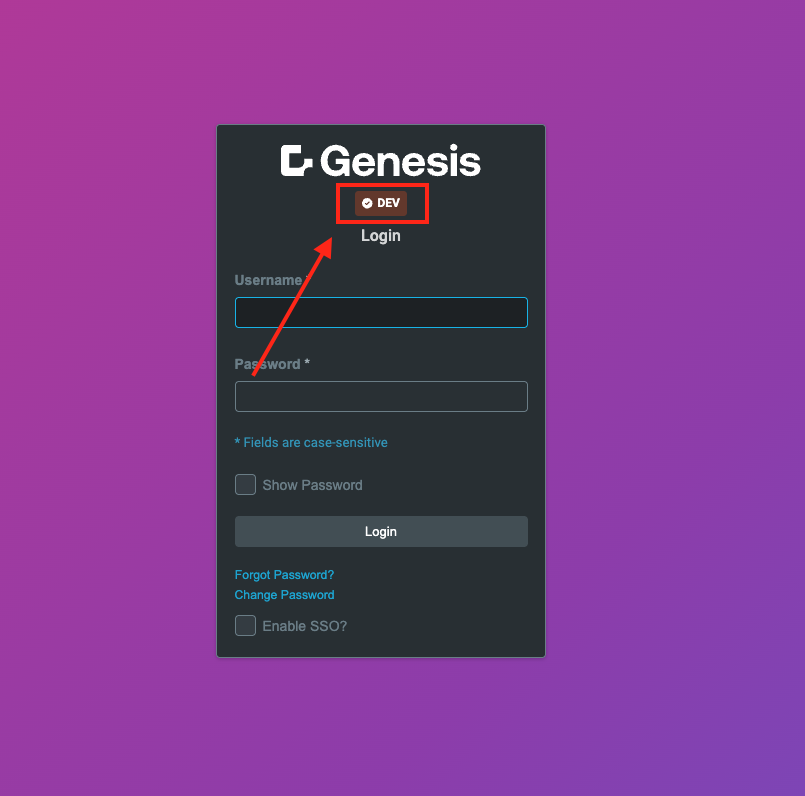
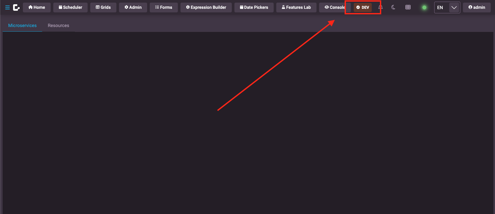

The Environment Indicator component provides a visual way to display the current environment (e.g., DEV, PROD, TEST) in your application. It can be configured to show different colors, icons, and labels based on the environment level.

## Overview

The `rapid-environment-indicator` component displays an environment badge with customizable styling and behavior. It supports:

- Environment-specific colors and icons
- Configurable labels and sizes
- Integration with dependency injection for global configuration
- Automatic environment detection from build variables

## Basic Usage

### Simple Environment Indicator

```html
<rapid-environment-indicator></rapid-environment-indicator>
```

### With Custom Attributes

```html
<rapid-environment-indicator
  level="dev"
  label="DEVELOPMENT"
  background-color="#ff6b35"
  text-color="#ffffff"
  show-icon="true"
  icon="code"
  size="lg"
></rapid-environment-indicator>
```

## Configuration Options

### Attributes

| Attribute | Type | Default | Description |
|-----------|------|---------|-------------|
| `level` | string | - | The environment level to display |
| `label` | string | - | The label to display |
| `show-icon` | boolean | false | Whether to show an icon next to the environment text |
| `size` | 'sm' \| 'lg' | 'sm' | The size of the indicator |
| `background-color` | string | - | The background color of the indicator |
| `text-color` | string | '#ffffff' | The text color of the indicator |
| `icon` | string | 'check-circle' | The icon to display |
| `icon-size` | 'xs' \| 'sm' \| 'md' \| 'lg' \| 'xl' | 'sm' | The size of the icon |
| `use-default-config` | boolean | false | Whether to use the default config |

### Environment Configuration Interface

```typescript
interface EnvironmentConfig {
  level: string;
  showIcon?: boolean;
  icon?: string;
  iconSize?: 'xs' | 'sm' | 'md' | 'lg' | 'xl';
  backgroundColor?: string;
  textColor?: string;
  size?: 'sm' | 'lg';
  label?: string;
}
```

## Global Configuration

You can configure environment indicators globally using dependency injection. This allows you to set up environment configurations once and use them throughout your application.

### Setting Up Global Configuration

```typescript
import { configureEnvironmentIndicator } from '@genesislcap/foundation-ui';

// Configure environment indicator with custom configs
await configureEnvironmentIndicator({
  currentLevel: 'dev',
  configs: [
    {
      level: 'dev',
      label: 'DEVELOPMENT',
      backgroundColor: '#ff6b35',
      textColor: '#ffffff',
      showIcon: true,
      icon: 'code',
      size: 'sm'
    },
    {
      level: 'test',
      label: 'TESTING',
      backgroundColor: '#ffc107',
      textColor: '#000000',
      showIcon: true,
      icon: 'flask',
      size: 'sm'
    },
    {
      level: 'prod',
      label: 'PRODUCTION',
      backgroundColor: '#28a745',
      textColor: '#ffffff',
      showIcon: true,
      icon: 'check-circle',
      size: 'sm'
    }
  ]
});
```

### Default Configurations

The component comes with default configurations for common environments:

```typescript
const DEFAULT_ENVIRONMENT_CONFIGS = [
  {
    level: 'default',
    showIcon: false,
    iconSize: 'sm',
    backgroundColor: '#2222ff',
    textColor: '#ffffff',
    label: 'DEFAULT'
  },
  {
    level: 'dev',
    showIcon: false,
    icon: 'code',
    backgroundColor: '#ff6b35',
    label: 'DEV'
  },
  {
    level: 'prod',
    showIcon: false,
    icon: 'check-circle',
    backgroundColor: '#28a745',
    label: 'PROD'
  }
];
```

## Environment Level Detection

The component determines the current environment level using the following priority order:

1. **Attribute level**: If the `level` attribute is set on the component
2. **DI Configuration**: If configured via dependency injection
3. **Build Variable**: If `ENVIRONMENT_LEVEL` is set in your build configuration
4. **Default**: Falls back to 'default' if `use-default-config` is true

### Using Build Variables

You can set the environment level using build variables in your `.env` file:

```env
GENX_ENVIRONMENT_LEVEL="dev"
```

And declare it in your `globals.d.ts`:

```typescript
declare global {
  const ENVIRONMENT_LEVEL: string;
}

export {};
```

## Examples

### Basic Environment Indicator

```html
<!-- Uses global configuration or defaults -->
<rapid-environment-indicator></rapid-environment-indicator>
```

### Custom Styled Indicator

```html
<rapid-environment-indicator
  level="staging"
  label="STAGING"
  background-color="#9c27b0"
  text-color="#ffffff"
  show-icon="true"
  icon="rocket"
  size="lg"
></rapid-environment-indicator>
```

### Small Indicator with Icon

```html
<rapid-environment-indicator
  level="dev"
  label="DEV"
  background-color="#ff6b35"
  show-icon="true"
  icon="code"
  size="sm"
></rapid-environment-indicator>
```

### Large Production Indicator

```html
<rapid-environment-indicator
  level="prod"
  label="PRODUCTION"
  background-color="#28a745"
  text-color="#ffffff"
  show-icon="true"
  icon="shield-alt"
  size="lg"
></rapid-environment-indicator>
```

## Integration with Header and Login Components

The environment indicator can be integrated with the [Foundation Header](../header) and [Foundation Login](../login) components to provide consistent environment indication across your application.

### Demo Screenshots

The environment indicator appears as a small badge that clearly shows the current environment:

**Login Screen with Environment Indicator:**


**Header with Environment Indicator:**


### Header Integration

```html
<foundation-header show-environment-indicator="true">
  <!-- Header content -->
</foundation-header>
```

### Login Integration

```html
<foundation-login show-environment-indicator="true">
  <!-- Login content -->
</foundation-login>
```

## Styling

The environment indicator uses CSS custom properties from the design system for consistent styling. The component automatically adapts to the current design system's spacing and sizing.

### Default Styles

The component uses these design system properties:

```css
.environment-indicator {
  font-size: 12px;
  display: inline-flex;
  align-items: center;
  gap: calc(var(--design-unit) * 1.4px);
  border-radius: calc(var(--design-unit) * 1px);
  height: calc(var(--design-unit) * 6px);
  padding: calc(var(--design-unit) * 0.5px) calc(var(--design-unit) * 2px);
  line-height: 1;
  font-weight: 600;
  text-transform: uppercase;
}
```

### Large Size Variant

For the large size variant (`size="lg"`):

```css
.environment-indicator.lg {
  border-radius: calc(var(--design-unit) * 4px);
  padding: calc(var(--design-unit) * 1px) calc(var(--design-unit) * 3.5px);
  font-size: calc(var(--design-unit) * 4px);
}
```

### Icon Sizing

Icons automatically scale with the component size:

```css
.environment-indicator .icon {
  font-size: calc(var(--design-unit) * 3px);
}

.environment-indicator.lg .icon {
  font-size: calc(var(--design-unit) * 3.5px);
}
```

The component automatically uses the design system's `--design-unit` property for consistent spacing and sizing across your application.

### CSS Parts

The environment indicator exposes a CSS part that allows you to style the component from outside:

```css
rapid-environment-indicator::part(environment-indicator) {
  /* Custom styles for the environment indicator */
  border: 2px solid #ccc;
  box-shadow: 0 2px 4px rgba(0, 0, 0, 0.1);
}
```

This allows you to customize the appearance of the environment indicator while maintaining the component's internal structure and functionality. 
