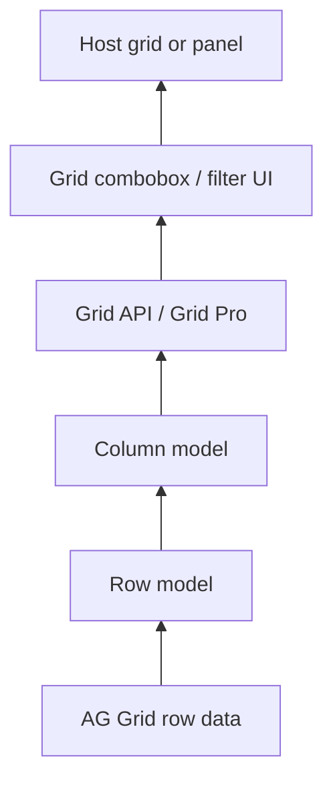

import Tabs from '@theme/Tabs';
import TabItem from '@theme/TabItem';

A **memory leak** is when the application keeps data in memory after it is no longer needed. In the browser UI, that usually means something still holds a reference to objects, DOM nodes, or subscriptions after a component is removed or a screen is closed—via closures, DOM references, or failing to clean up event listeners and subscriptions.

Leaks **degrade performance** over time and can **crash the tab** once the heap is exhausted. They are easy to miss in single-page apps: route changes and conditional templates can **detach** components from the DOM while JavaScript still retains them, so heap usage grows over a long session.

For large datasets and subscription tuning, see [UI Performance](../).

## Find leaks with Chrome DevTools (Memory)

Use the **Memory** tab and heap snapshots when you suspect a component or screen is not cleaning up:

1. Run the **garbage collector** before each snapshot so you are not comparing unreachable objects that GC would have freed anyway.
2. Take a **baseline snapshot**, perform the action under test (open a grid, add/remove a panel, run several mount/unmount cycles), then run GC again and take a **second snapshot**.
3. Open **Comparison** view (not Summary) and sort by **Size Delta** or **# Delta**—not only “New”—to see what genuinely grew between snapshots.
4. Investigate **detached** nodes: HTML elements that are no longer in the document tree but are still retained in memory. A rising count of detached nodes after repeated open/close cycles is a strong leak signal.

In real investigations, memory has **roughly doubled** after opening and closing a few layout panels, with tens of thousands of retained objects tied to grid row data—often visible as detached table or menu nodes in the comparison view.

In layout-heavy applications (for example [layout management](/develop/client-capabilities/layout-management/) or dockable workspaces that **connect and disconnect** panels on add, remove, or move), small leaks per action accumulate quickly: each layout change can replay the full connect/disconnect cycle and multiply retained graphs.

## Trace what is still retained

When Comparison view shows growth, follow the **retention path** from the largest `# Delta` entries downward. A typical chain in grid-heavy UIs looks like this:



The same chain may exist **once per row or panel instance** (for example one open counterparty or filter popover), so a small leak in a shared child component becomes a very large heap when multiplied. Adding, removing, or moving items in the layout shell can trigger that leak on **every** user action.

## Isolate components before blaming the app

When memory grows in a full application, narrow the cause:

- Reproduce the suspect UI in a **minimal shell** (design system provider only, similar to a layout preview or isolated dev page) and repeat add/remove cycles. If memory stays flat, the leak is likely wiring in the host app; if it grows, focus on the component.
- Compare components: one control may show no growth over many cycles while another shows a clear ramp (for example detached menu items after repeated use in a grid filter).
- Automate regression checks with [Playwright](/develop/client-capabilities/testing/) by mounting and unmounting a component over several cycles (for example five add/remove loops) and asserting heap or detached-node growth stays bounded. A minimal Vite-style testbed with only a design-system provider reduces noise compared with a full showcase app. Document agent or CI steps in your repo if you run component-level leak tests at scale across Foundation UI.

## Common leak patterns and fixes

The same rules apply in **React** and **FAST / [GenesisElement](/develop/client-capabilities/custom-components/)** apps: every long-lived registration needs teardown when the UI goes away.

| Framework | Mount | Unmount / cleanup |
| --------- | ----- | ----------------- |
| FAST / web components | `connectedCallback` | `disconnectedCallback` |
| React | render / `useEffect` body | `useEffect` **return** function (or cleanup in layout effects) |

Genesis **web components** (including Grid Pro wrappers) still run `connectedCallback` / `disconnectedCallback` when React mounts and unmounts them—leaks can live inside the component *or* in React effects that outlive the component.

<Tabs defaultValue="genesis" values={[{ label: 'FAST / GenesisElement', value: 'genesis' }, { label: 'React', value: 'react' }]}>

<TabItem value="genesis">

**Observable subscriptions** — Subscribing via `Observable.getNotifier(this)` without unsubscribing keeps the component alive.

```typescript
import { GenesisElement, Observable } from '@genesislcap/web-core';

export class LeakyComponent extends GenesisElement {
  count = 0;
  private notifier = Observable.getNotifier(this);

  connectedCallback() {
    super.connectedCallback();
    this.notifier.subscribe(this, 'count', this.onCountChanged);
  }

  disconnectedCallback() {
    this.notifier.unsubscribe(this, 'count', this.onCountChanged);
    super.disconnectedCallback();
  }

  onCountChanged() {
    console.log('Count changed');
  }
}
```

**Window listeners** — Use a stable handler reference and remove it on disconnect.

```typescript
import { GenesisElement } from '@genesislcap/web-core';

export class ResizeListener extends GenesisElement {
  connectedCallback() {
    super.connectedCallback();
    window.addEventListener('resize', this.onResize);
  }

  disconnectedCallback() {
    window.removeEventListener('resize', this.onResize);
    super.disconnectedCallback();
  }

  onResize = () => {
    console.log('Window resized');
  };
}
```

**Bound listeners** — Inline `bind(this)` in `addEventListener` / `removeEventListener` creates different function objects. Prefer one stored bound reference, FAST `@click` bindings, or an arrow function field.

```typescript
// Leak: removeEventListener does not match addEventListener
this.shadowRoot?.addEventListener('click', this.onClick.bind(this));
this.shadowRoot?.removeEventListener('click', this.onClick.bind(this)); // wrong reference
```

**Module registries** — Delete from layout or plugin `Set` / `Map` registries in `disconnectedCallback`.

**Grid API closures** — Remove helpers registered from `onGridReady` from any long-lived `Set` in `disconnectedCallback`; clear grid row/options data when closing composite controls.

</TabItem>

<TabItem value="react">

**Subscriptions and streams** — Return a cleanup function from `useEffect`. Missing cleanup is the most common React leak (dataserver streams, RxJS, `addEventListener`, `setInterval`, third-party widgets).

```tsx
import { useEffect } from 'react';

export function TradesPanel({ connect }: { connect: Connect }) {
  useEffect(() => {
    const sub = connect.stream('ALL_TRADES', {}).subscribe(/* ... */);
    return () => sub.unsubscribe();
  }, [connect]);

  return <rapid-grid-pro>{/* ... */}</rapid-grid-pro>;
}
```

**Window and document listeners** — Same `window` lifetime issue as web components; stable handler + cleanup.

```tsx
useEffect(() => {
  const onResize = () => { /* ... */ };
  window.addEventListener('resize', onResize);
  return () => window.removeEventListener('resize', onResize);
}, []);
```

**Refs and grid APIs** — Storing `gridApi` on a ref or in module scope without clearing on unmount retains row data. Clear in cleanup and avoid registering `onGridReady` callbacks into global registries unless you remove them when the component unmounts.

```tsx
useEffect(() => {
  return () => {
    gridApiRef.current?.destroy?.();
    gridApiRef.current = undefined;
  };
}, []);
```

**Module registries and context** — Unregister from singleton registries, event buses, or non-React stores in `useEffect` cleanup the same way you would in `disconnectedCallback`.

When wrapping Genesis web components, prefer **React wrappers** from `@genesislcap/*/react` where available so props and lifecycle stay idiomatic; still verify the underlying custom element tears down subscriptions when removed from the DOM.

</TabItem>

</Tabs>

## Conditional rendering and visibility

<Tabs defaultValue="genesis" values={[{ label: 'FAST / GenesisElement', value: 'genesis' }, { label: 'React', value: 'react' }]}>

<TabItem value="genesis">

FAST **`when`** bindings remove content from the DOM and run connect/disconnect lifecycle; release resources in `disconnectedCallback`. FAST may reuse internal instances, but disconnect still fires—defensive cleanup remains good practice.

Hiding UI with **CSS only** does **not** remove nodes from the DOM or run disconnect; memory held by those components remains allocated.

</TabItem>

<TabItem value="react">

**Conditional render** (`{isOpen && <MyGrid />}`) unmounts the subtree and runs React cleanup plus web component `disconnectedCallback` on Genesis elements—equivalent to removing a FAST `when` branch.

**CSS visibility** (`display: none`, hidden tabs that keep children mounted) leaves components and their subscriptions alive. Prefer unmounting or explicit cleanup when panels are “closed” in layout or tab UIs.

Route changes unmount route-level components but retain memory if effects, refs, or global registries still hold references—mirror the same checks you use for FAST layout churn.

</TabItem>

</Tabs>

## Application-level fixes

When the retention chain runs through [Grid Pro](/develop/client-capabilities/grids/grid-pro/) inside composite controls (FAST or React):

- **Clear options and grid data** when closing a combobox or popover (for example set options to an empty array and release row data) so AG Grid row models are not left referenced.
- **Fix or replace** design-system components that leak under isolated testing (for example menu items left as detached nodes after filter or window moves); do not rely on plain HTML workarounds in every app without upstream fixes.

## Prevention in review and tooling

Fully deterministic static analysis for every leak pattern is hard in JavaScript, but you can:

- Add **PR review checks** (human or AI-assisted) for missing unsubscribes, `window` listeners, and `bind` in add/remove pairs on web components, and missing **`useEffect` cleanup** in React.
- Run batch or scripted analysis over Foundation UI sources for recurring anti-patterns, similar in spirit to existing security lint workflows.

If a design-system component is confirmed to leak under isolated testing, prefer fixing the component—or a vetted workaround—rather than accumulating detached nodes across every screen that uses it.
