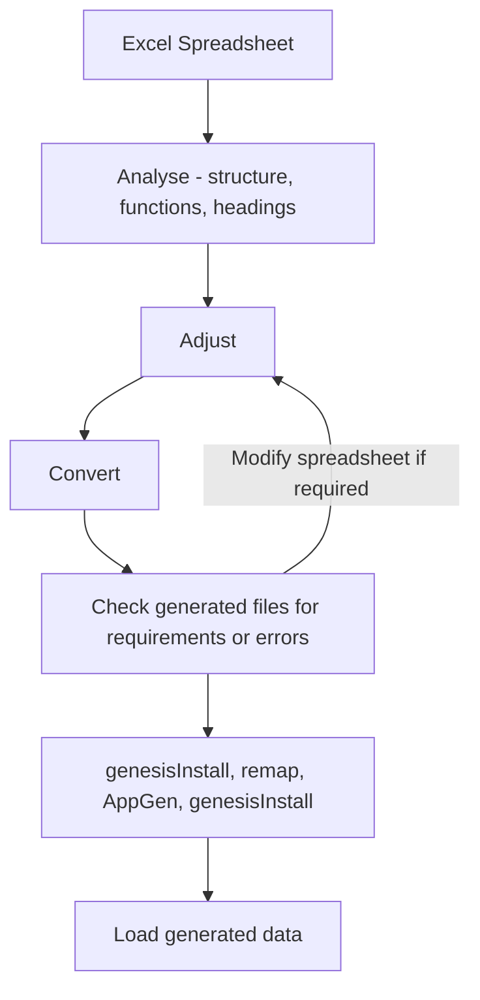

## Introduction 


All across the financial sector, you can find operational functions sitting in Excel workbooks. And this sometimes includes functions that are mission-critical.

The Genesis low-code platform gives you a way of turning these into applications that can be audited and maintained in a standard and controlled manner. Along the way, you can build in better workflow and usability without heavy IT development effort.

Take a look at this quick exercise. We start with an Excel workbook. We finish with a simple but effective server that you can add a front end to. The steps to producing this are:

1. Do some up-front checks and edits to head off any obvious issues.
2. Run the convertor. This creates your data model in Genesis format and creates data files in CSV format.
3. Check the fields, tables and views in the data model. Make any necessary adjustments in the spreadsheet and re-run the convertor. (Repeat this step if necessary.)
4. Run a quick sequence of Genesis scripts. This produces the files that contain the business logic and exposes the endpoints.
5. Load the csv data files to the database.

That’s it. If you follow those steps, you'll have a working server, ready to be connected to a front end.


If you already have a Genesis platform, you can [download the workbook](/file/Excel_Export_Demo.xlsx) and try this for yourself.

## Analyse, adjust and run

We are going to start with a workbook that has ten different worksheets.


### Analyse the workbook

When you analyse the workbook, there are some clear things to look out for.

### Structure

The content of each sheet in our source workbook is essentially a simple grid.

By default, the conversion process will convert each separate worksheet into a table. That works well for the workbook we have here.

### Functions

The conversion script will turn the Excel functions in the workbook into Kotlin code for use by your application. The most [common Excel functions](/03_server-modules/10_integration/09_excel-to-genesis/02_excel-functions.md) are all covered.


### Column headings

Column names will be turned into field names by the conversion process, which also analyses the content and allocates a field type for each one.

Long column headings do not make good field names. So, look at the headings in each sheet and replace the long ones with shorter text that makes better field names. It is quicker to do this at the start than to wait until after the conversion.

For example, it would help to change **Base Adjusted Collateral Value held by Cpty** to **Cpty_Base_Adj_Collat_Val**:


### Convert the workbook

Once you have adjusted the column headings, you can run the conversion process in your terminal:

```bash
ExcelToGenesis -f euc\\ demo\\ cash\\ mgmt.xlsx -n cash -t 10000
```

:::info
The above command assumes you have already set up the genesis platform on your machine and have the `ExcelToGenesis` CLI tool available.
:::

The process is quick. It creates a number of tables. Each table has a numeric ID, starting with the number 10000 that you supplied in the command. The dictionary files produced all include the product name **Cash**, which you supplied with the command.


## Check the files and load the data

Now you have run the conversion script, let's look at the files that have been created.

First, it creates a folder called **`/home/core/run/cash.cfg`**. Then it writes the dictionary files for the fields, tables and views that make up your data model.


Following that, it creates a separate folder for the data. In this, it writes separate csv files for each worksheet.


In the end, you have 10 files of data: one for each worksheet.

### The Fields file

Inside the file `cash-fields-dictionary.kts`, you can see all the fields that have been defined. Here is the beginning of the file:

```kotlin
fields {
    field(name = "ACCOUNT", type = STRING)
    field(name = "ACCOUNT_CODE", type = STRING)
    field(name = "ACCOUNT_CURRENCY", type = STRING)
    field(name = "ACCOUNT_NAME", type = STRING)
    field(name = "ACCOUNT_NUMBER", type = STRING)
    field(name = "ACCOUNT_NUMBER_PREFERRED_PER_FORMATTED", type = STRING)
    field(name = "ACCT_CODE", type = STRING)
    field(name = "ACTION", type = STRING)
}
  
```
You can see the whole file [here](/server-modules/integration/excel-to-genesis/Files/guide-5).
#### Field types
The fields are automatically sampled by the command to allocate a type. If it is not sure, it allocates the field as STRONG. Most of these will be correct, but you will need to handle exceptions.
#### Long names and illegal characters
Note that our example contains some long field names. Ideally, these should be shortened before the conversion process, but these long field names still work.
Illegal characters in field names have been automatically converted. You can see here that the **%** sign has twice been changed to PERCENT in this field name.
```kotlin
field(name = "DEPOSIT_AMOUNT_ON_MAY_IN_PERCENT_HAIR_CUT_AND_MAX_PERCENT_ON_FUNDS", type = DOUBLE)
  ```
And yes, it would have been a very good idea to have made the source column heading shorter before we converted the workbook!
### The tables file
Inside the file `cash-tables-dictionary.kts`, each table created has a name and numeric ID. Each field in a table has a comment showing the column it came from, as well as relevant notes on the function (e.g aggregation). For example:
```kotlin
tables {
  table (name = "CASH_MGMT_DASHBOARD", id = 10000) {
    // Source: Cash Mgmt Dashboard
    ACCT_CODE                                                            // A
    ACCOUNT_NAME                                                         // C
    ACCOUNT_NUMBER                                                       // D
    ACCOUNT_CURRENCY                                                     // E
    AVAILABLE_BALANCE_DATE                                               // H
    PREVIOUS_CLOSE_BALANCE                                               // I
    EXPECTED_MARGIN_INFLOWS                                              // L (aggregation SUMIF(MarginAcccounts,A2,MarginInflows))
    EXPECTED_MARGIN_OUTFLOWS                                             // M (aggregation SUMIF(MarginAcccounts,A2,MarginOutFlows))
    NET_AVAILABLE_BALANCE                                                // N (aggregation MIN(F2,J2)+M2)
    TBILLS_HOLDINGS                                                      // O (aggregation SUMIF(TBillHoldings,A2,TBillSum))
    CURRENT_FUNDING_POSN                                                 // P unable to parse: IFERROR(VLOOKUP(A2,GLFHoldingsRange,3,FALSE),0); see log for details
    FUND_HOLDINGS_LEVEL                                                  // R (aggregation SUMIF(FundAcctRande,A2,FundValues))
    PERCENT_OF_FUNDS_ALL                                                 // S (aggregation R2/Q2)
    SUGGESTED_ACTION                                                     // T (aggregation IF(K22>10%,IF(J22>F22+M22,"SWEEP","CheckReconciliation"),IF(AND(N22>0,S22<=8%),"SWEEP",IF(AND(N22<0,#REF!> 0),"Redeem","Not Able to recommend"))))
    DEPOSIT_AMOUNT_ON_MAY_IN_PERCENT_HAIR_CUT_AND_MAX_PERCENT_ON_FUNDS   // U (aggregation IF(N2>=0,MIN(N2*0.8, Q2*0.08-R2),IF(T2="Redeem",-MIN(-N2,#REF!))))
    MAX_DEPOSIT_AMOUNT_BASED_ON_PERCENT_LIMIT                            // V (aggregation Q2*0.08-R2)
    POTENTIAL_ADDITIONAL_TBILLS_DEPOSIT                                  // W (aggregation MIN(O2, V2-U2))
    EXPECTED_BALANCE_AFTER_REDEMPTION_PER_DEPOSIT_CASH_ONLY_NO_TBILLS    // X (aggregation F3-U3)
    EXPECTED_CASH_BALANCE_PERCENT                                        // Y (aggregation X2/Q2)
    primaryKey {
      ACCT_CODE
    }
  
```
You can see the whole table's file [here](/server-modules/integration/excel-to-genesis/Files/guide-12). Table IDs are sequential from the first one created, starting with the `-t` number supplied when you ran the script.
#### Unable to parse
If the conversion process was not able to parse a field, this is clearly marked by the comment. For example:
```kotlin
   CURRENT_FUNDING_POSN                                                 // P unable to parse: IFERROR(VLOOKUP(A2,GLFHoldingsRange,3,FALSE),0); see log for details
 ```
You will have to deal with this, perhaps by creating a consolidator.
#### Primary key
The first column in each worksheet is always used as the primary key for the table.
The process is able to handle concatenations in Excel. For example, in the Cash Mvmnt Orders sheet, column A contains a combination of columns B and C:


Consequently, the conversion has used both these fields to create the primary key:
```kotlin
}
  table (name = "CASH_MVMNT_ORDERS", id = 10002) {
    // Source: Cash Mvmnt Orders
    SECURITY               // B
    ACCOUNT                // C
    BROKER                 // D
    ORDERG_PRICE           // G
    UPDATE_CASH            // H
    CUSTODY_CASH_ACCOUNT   // J
    TA_ACCOUTNS            // K
    TA_REGISTRATION_NAME   // L
    primaryKey {
      ACCOUNT
      SECURITY
    }
```
### The view file
Inside the file `cash-view-dictionary.kts`, you can see that the script has been able to find where tables need joins. Exceptions are highlighted.
In the example here, the first worksheet has been converted. This has created a view with two joins successfully. But it has not been possible to create a third join:

```kotlin
views {
  view ("CASH_MGMT_DASHBOARD_VIEW", CASH_MGMT_DASHBOARD) {
    joins {
      joining(MAPPING) {
        on(CASH_MGMT_DASHBOARD.ACCT_CODE to MAPPING.BLOOMBERG_REFERENCE_NO)
      }
      joining(CUSTODY_POSITIONS) {
        on(CASH_MGMT_DASHBOARD.ACCOUNT_NUMBER to CUSTODY_POSITIONS.ACCOUNT_NUMBER_PREFERRED_PER_FORMATTED)
      }
      joining(FUND_ADMIN_BALANCES) {
        // unable to join using: "${"      "}${ACCT_CODE}"
        on(CASH_MGMT_DASHBOARD.ACCT_CODE to FUND_ADMIN_BALANCES.BALANCE_DATE)
      }
      joining(FUND_NAV) {
        on(CASH_MGMT_DASHBOARD.ACCT_CODE to FUND_NAV.BALANCE_DATE)
      }
    }
  }
}
```
You can see the complete view file [here](/server-modules/integration/excel-to-genesis/Files/guide-13).

#### Derived fields
The conversion has created derived fields - simple calculations based on other fields in the view.

```kotlin
derivedField("FINAL_QUANTITY", DOUBLE) {
        // F: I2
        withInput(CASH_MVMNT_ORDERS.ACCOUNT, CASH_MGMT_DASHBOARD.POTENTIAL_ADDITIONAL_TBILLS_DEPOSIT) { ACCOUNT, CASH_MGMT_DASHBOARD_POTENTIAL_ADDITIONAL_TBILLS_DEPOSIT -> 
          if(ACCOUNT == null) return@withInput null
          if(CASH_MGMT_DASHBOARD_POTENTIAL_ADDITIONAL_TBILLS_DEPOSIT == null) return@withInput null
          val SUGGESTED_QUANTITY = (CASH_MGMT_DASHBOARD_POTENTIAL_ADDITIONAL_TBILLS_DEPOSIT / 10000.0) * 10000.0
          SUGGESTED_QUANTITY
        }
```

### The data files
There is one data file for each of the sheets in the workbook.
For example, here is a look at the top of the first sheet in the workbook:


And here are the first ten rows of the data file:
```
"ACCT_CODE","ACCOUNT_NAME","ACCOUNT_NUMBER","ACCOUNT_CURRENCY","AVAILABLE_BALANCE_DATE","PREVIOUS_CLOSE_BALANCE","EXPECTED_MARGIN_INFLOWS","EXPECTED_MARGIN_OUTFLOWS","NET_AVAILABLE_BALANCE","TBILLS_HOLDINGS","CURRENT_FUNDING_POSN","FUND_HOLDINGS_LEVEL","PERCENT_OF_FUNDS_ALL","SUGGESTED_ACTION","DEPOSIT_AMOUNT_ON_MAY_IN_PERCENT_HAIR_CUT_AND_MAX_PERCENT_ON_FUNDS","MAX_DEPOSIT_AMOUNT_BASED_ON_PERCENT_LIMIT","POTENTIAL_ADDITIONAL_TBILLS_DEPOSIT","EXPECTED_BALANCE_AFTER_REDEMPTION_PER_DEPOSIT_CASH_ONLY_NO_TBILLS","EXPECTED_CASH_BALANCE_PERCENT"
"22HS002","HARRISON GEM DEBT TOTAL RET","400515-73293786","USD","2018-06-06T00:00",,"6324131.264","-710000.0","1.5792632929E8","0.0","0.0","0.0","0.0","DEPOSIT","1.26341063432E8","1.3646971152574575E8","0.0",,"0.0"
"24HS015","HARRISON GEM BOND","400515-73293684","USD","2018-06-06T00:00",,"940000.0","-1524265.8","1.4552071188E8","4.490730003118515E7","0.0","0.0","0.0","DEPOSIT","1.1641656950400001E8","3.827067500084964E8","4.490730003118515E7","3.0628408176E7","0.0079230701035628"
"21HS001","HARRISON GEM LOC DBT OLAY","400515-73294157","USD","2018-06-06T00:00",,"5870000.0","-3560000.0","1.5986032965E8","1.1378883589836652E9","0.0","1.860230439E7","0.006464116805936957","DEPOSIT","1.2788826372000001E8","2.662978900060171E8","1.3840962628601706E8","3.553206592999999E7","0.012347041512300127"
"31HS091","HARRISON GLOBAL HIGH YIELD BOND US FIXE","400515-73423766","USD","2018-06-06T00:00","2.818183719E7","0.0","-885648.28","9234858.05","0.0","0.0","2.256239879E7","0.023281613162053506","DEPOSIT","7387886.440000001","7.33792984052206E7","0.0","2732619.8899999987","0.0028197267404966907"
"21HS118","HARRISON GEM LOCAL CCY RATES","400515-74216790","USD","2018-06-06T00:00","8.7873232E7","0.0","-220000.0","6811542.99","1.9983200001186796E7","0.0","0.0","0.0","DEPOSIT","5449234.392000001","2.228452513942915E7","1.6835290747429147E7","1582308.5979999993","0.007029476743250574"
"30HS123","HARRISON-GB CORP BD (US SL)-AMEU","400515-74429794","USD","2018-06-06T00:00","3223323.0","0.0","0.0","7307726.11","0.0","0.0","85660.62000000011","6.451190070137826E-5","DEPOSIT","5846180.888","1.3136917620546082E8","0.0","1461545.4519999996","0.0011007050272339245"
"30HS056","HARRISON HIGH INCOME-EMD","400515-73294790","USD","2018-06-06T00:00","1.468687899E7","0.0","-320000.0","1.477901352E7","0.0","0.0","0.0","0.0","DEPOSIT","1.1823210816E7","4.3218194548963524E7","0.0","3275802.704","0.007503887450193767"
"21HS184","HARRISON GEM LOC DEBT EX-ASIA","400515-76690541","USD","2018-06-06T00:00","1.007845887E7","0.0","0.0","1.008958349E7","0.0","0.0","0.0","0.0","DEPOSIT","1023728.0723177514","1266863.4894932173","0.0","9065855.41768225","0.7084580886529274"
"37HS191","HARRISON GLB CORP FX T BD 2020","400515-77050130","USD","2018-06-06T00:00","62024.18","0.0","0.0","-176715.13","0.0","0.0","0.0","0.0","DEPOSIT","false","2.9759165768984433E7","0.0","-176715.13","-5.878793110603057E-4"
```

## Load the data and generate the application

After you have checked the files generated and addressed any issues in the fields, tables and views, you can run the sequence of commands to load the data and generate an application.

1. Run `genesisInstall` to check all the config files and prepare the application for the current environment.
2. Run `remap --commit` to set any changes to the database (modifications to fields, tables and views).
3. Run `SendIt -a` to load the data from all the generated data files into the database.
4. Run `AppGen` to generate Event Handlers, Request Servers and Data Servers for all the tables. For example:

```bash
    AppGen -n cash -p 10000
```

This creates an application called **Cash** with:

* the kts files for the  [Event Handler](/server-modules/integration/excel-to-genesis/Files/guide-5), [Request Server](/server-modules/integration/excel-to-genesis/Files/guide-6) and [Data Server](/server-modules/integration/excel-to-genesis/Files/guide-7)
* the [service definitions](/server-modules/integration/excel-to-genesis/Files/guide-10)
* the [process definitions](/server-modules/integration/excel-to-genesis/Files/guide-9)


Run `genesisInstall` again to install these changes.

You now have a basic server that you can access from a web front end. The Event Handler, the Request Server and the Data Server provide only the simplest functions, but the data is exposed so that a front end can be created and connected. The Event Handler, for example, provides very simple insert, modify and delete events.

Of course, this is really just a beginning - you can go into the code and introduce all kinds of sophistication.
