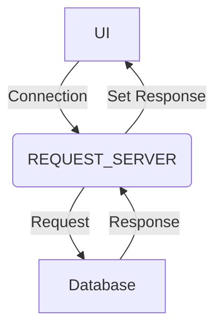

Request Servers, (otherwise known as request/replies and often shortened to reqrep) retrieve a snapshot of data from a table or a view on demand and serve it up to the requesting client. They are predominantly used for serving the UI.

Request Servers will reply with a single response. Once the response is received, the transaction is over (unlike a [Data Server](/server-modules/data-server/basics), which stays connected to the client and pushes updates).


## Introduction
Request Servers have other features distinct from a Data Server, such as allowing one-to-many joins, and even completely custom request servers for serving up non-linear data (e.g. sets of disjointed data to serve up to a report).

```kotlin
  requestReply("TRADE", TRADE_VIEW) {
    permissioning {
      permissionCodes = listOf("TRADER", "SUPPORT")
      auth(mapName = "ENTITY_VISIBILITY") {
        TRADE_VIEW.COUNTERPARTY_ID
      }
    }
  }
```

Request Servers are conventionally configured in the file _application-name_**-reqrep.kts**. This file should be in the _application-name_-script-config module.

So, if your application is called **positions**, the file would be named **positions-reqrep.kts**.

You should also check the Request Server component in your application's system-processes and service-definition files, as described in the [Configuring runtime](/server-modules/request-server/configuring-runtime) page.

