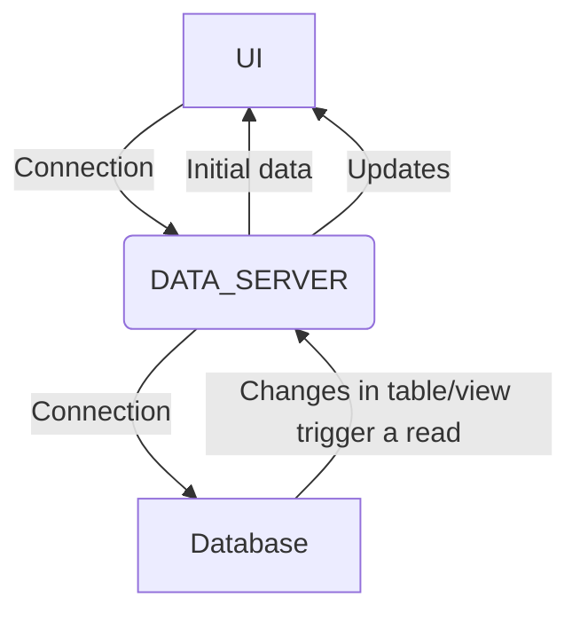

Data Servers monitor specific tables or views in the database. When a change in data occurs, the Data Server sends the updates to all its subscribers.

The Data Server configuration is refreshingly light, because all the hard work is done by the table or views.

A Data Server file consists of a number of queries that handle each event in the required way. You can define any number of queries. A query can be on an individual table or view. All the details of the table or view are inherited from the definition, so you don’t need to supply any further details.

## Streaming
When the front end of your application first requests data from a query in your Data Server, the query initially sends all the data in the table or view. This is typically what happens when the user logs in. This establishes a subscription between the front end and the query. Whenever a value in the underlying table or view changes, that change is automatically sent to the user. In this way, the user’s data is maintained up to date in real time, without the unnecessary burden of sending the whole data set each time there is a change. The subscription closes when the user logs out.

Data Servers are conventionally defined in the file _application-name_**-dataserver.kts**.

So, if your application is called **positions**, then the file would conventionally be named **positions-dataserver.kts**.

Note, you also need to declare your Data Server within the [runtime configuration](/server/data-server/configuring-runtime/).

All queries created in the Data Server are exposed as HTTP/HTTPs [REST endpoints](/server/integration/rest-endpoints/introduction/) automatically by the Genesis Platform. You can use any http client, such as postman, to access these custom endpoints.

