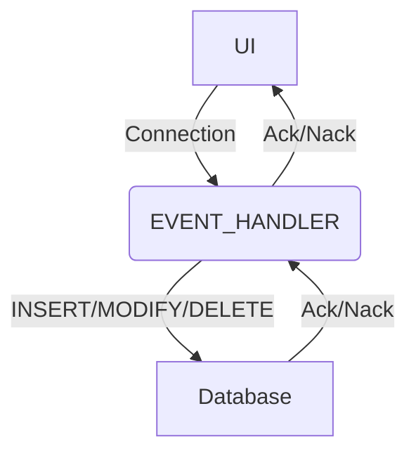

The Genesis low-code platform has a real-time event-driven architecture.

Applications built on the system must respond immediately to different types of input: inputs from users, messages from other systems, market-data updates and internally calculated analytic signals.  These inputs are events.

All the business logic for applications built on the platform is structured around these events. When an event occurs, the business logic immediately fires into action.

As a rough guide, many of the tables you have created need **Insert**, **Modify** and **Delete** events, so that you can specify the processing that these events require. 

The vast majority of applications include business workflow.

That could be a simple linear workflow, such as a deal being enriched and approved, or a margin call payment – or it could be a more complex set of steps.

Most applications built on the platform include the typical financial product **business entities**, such as orders, trades, bids, allocations and positions. These business entities have a lifecycle where they go through various **states**. The transition from one state to another is an event that needs to be handled. The paths through those states are workflows, and to assist the workflows, we use state machines.

Event Handlers are conventionally defined in the file **{app-name}-eventhandler.kts**. 

So, if your application is called **positions**, then the file would conventionally be named **positions-eventhandler.kts**.

You can write custom Event Handlers using our [APIs](/database/api-reference/event-handler-api/). These can be implemented using Kotlin or Java.

:::note

We recommend using **Kotlin** to implement Event Handlers.

- **Java** Event Handlers are implemented using [**RxJava3**](#rx3) [**Sync**](#sync) Event Handlers only. 
- Async Event Handlers cannot be used, as there is no implementation for Kotlin coroutines in Java.

:::

