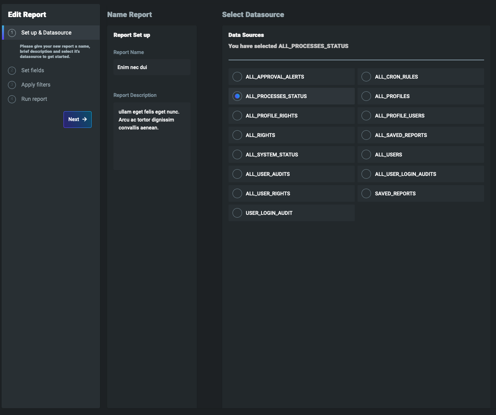
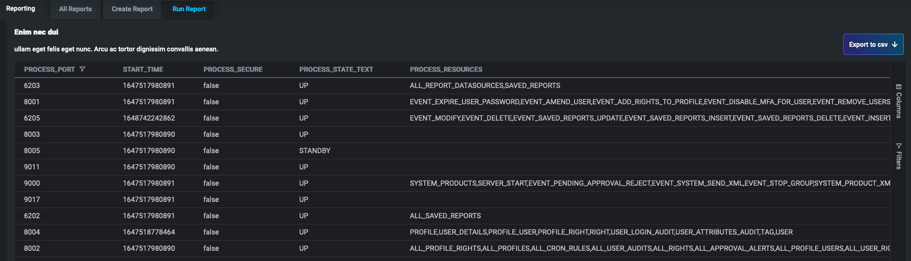
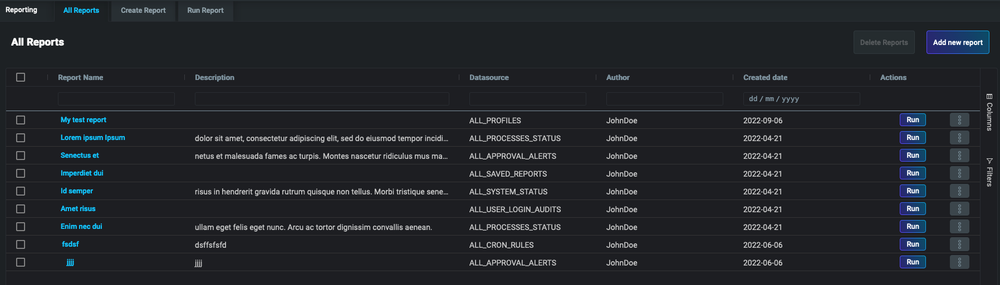

# Micro Frontend Reporting

The Reporting micro-frontend enables your users to create report specifications, run them, or save them for later use.

From the GUI, users can:

- select columns from existing data sources
- save the report with a name and retrieve it for future use
- apply ad hoc filtering to a report
- export the report results to .csv  format

The micro-frontend has a GUI which walks the user through generating a report.


Once the report is created it can be viewed in the GUI, and also exported to a `.csv` file.


All of the generated reports are stored for retrieval later. The report configuration is saved and the report updated when the user runs the report again.


## Set-up

### Server configuration

To enable the Report micro-front-end, you need to configure the Reporting module on the server.
- Configure [backend server](https://docs.genesis.global/secure/server/integration/server-reporting/)

### Front-end configuration

To enable this micro-front-end in your application, follow the steps below.

- Add `@genesislcap/foundation-reporting` as a dependency in your *package.json* file. Whenever you change the dependencies of your project, ensure you run the `$ npm run bootstrap` command again. There is more information on this in the [package.json basics](https://docs.genesis.global/secure/web/basics/package-json-basics/) page.

```javascript
{
  ...
  "dependencies": {
    "@genesislcap/foundation-reporting": "latest"
  },
  ...
}
```

- Import the module and configure the route in your routes **config.ts** file.

**Synchronous example**

```javascript {9}
// Import
import {Reporting} from '@genesislcap/foundation-reporting';

// Routes configure
public configure() {
  ...
  this.routes.map(
    ...
    {path: 'reporting', element: Reporting, title: 'Reporting', name: 'reporting'},
    ...
  );
}
```

**Asynchronous example**

```javascript {9}
// Import
import {Reporting} from '@genesislcap/foundation-reporting';

// Routes async configure
public async configure() {
  ...
  this.routes.map(
    ...
    {path: 'reporting', element: (await import('@genesislcap/foundation-reporting')).Reporting, title: 'Reporting', name: 'reporting'},
    ...
  );
}
```

:::info
If there are no reports in the database, you will see an error on the web page saying there are no reports to load  - this is expected behaviour.
:::
