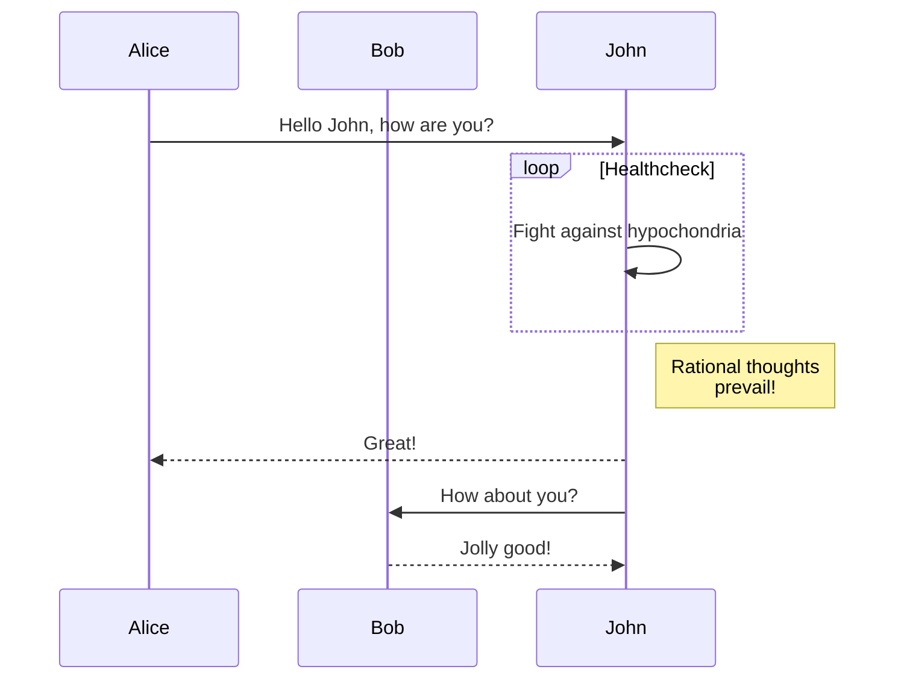

Application developers can build their own components and leverage the power of `FASTElement` and reusable design tokens. Start by reading [the official documentation of FASTElement](https://www.fast.design/docs/fast-element/getting-started/) and [the FAST Frame Design System](https://www.fast.design/docs/design-systems/fast-frame/) which Genesis Foundation UI is based on. Then continue reading specific tokens sections: [`color-tokens`](/front-end-reference/design-systems/colour-tokens/), [`typography-tokens`](/front-end-reference/design-systems/typography-tokens/), [`sizing-tokens`](/front-end-reference/design-systems/sizing-tokens/), and [`misc-tokens`](/front-end-reference/design-systems/misc-tokens/).

## GenesisElement 

Outline the abstraction layers back to HTMLElement?

