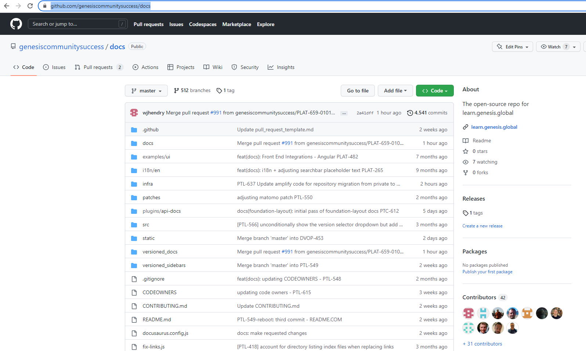
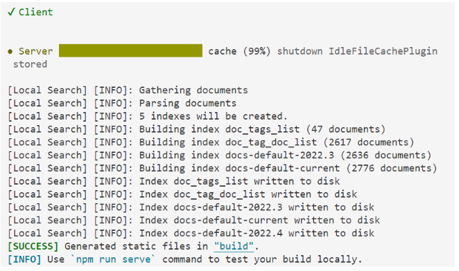

# Genesis docs contribution guide for internal contributors

Documentation is written using [Markdown format](markdown-syntax.md).

---

The Genesis platform team has opened the docs repository and encourages everyone to be part of maintaining it.

**Note** To be able to contribute to the documentation, please make sure you have access to the [docs repository](https://github.com/genesiscommunitysuccess/docs)

## Guidance
Below you ll find the steps to contribute to the documentation. please remember to follow the [guidelines](./Type-of-contribution.md)

### 1. Access the docs repository
To access the docs repository, follow [this link](https://github.com/genesiscommunitysuccess/docs). Then clone it locally.

### 2. Create a new branch off master

- Create a new branch off master; use the following format: **EDIT-ddmmyy**
- If someone is already using this branch, please add A,B, etc at the end until you find an unused branch. Example:
   
    **EDIT-010323A**, **EDIT-010323B**, **EDIT-010323C**, ...

### 3. Make your changes

Now that you have your branch locally, you can make your changes. **Remember** to change all versions of the docs; the text you want to change probably appears in older versions as well.

**Tip**: you can easily search all the errors across all versions using the search tool in your preferred code editor.

### 4. Build, run and check

Once your changes are done, it is extremely important to build your local website to ensure that your changes have not introduced any errors. 

### 5. Create your pull request

After all changes have been done and you have checked a local build, it is time to create your [pull request](https://github.com/genesiscommunitysuccess/docs/compare). We have a simple template to create a pull request.

**Note**: You don`t need a Jira number. But make sure you can answer those main questions:
- Have you changed all relevant versions?
- Have you made sure the links are safe?

---

After you have followed these instructions, your request will be reviewed by the community team. Once your changes are accepted, approved and merged, you will be able to see the changes within a 1 hour. Thank you very much for your contribution. We appreciate it.
