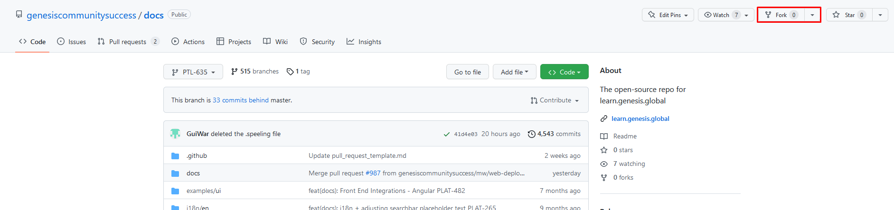
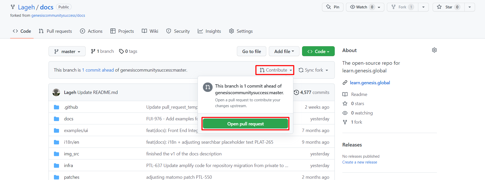

# Genesis docs contribution guide for external contributors

The Geneis documentation is written using [Markdown format](markdown-syntax.md).

---

Thank you for your interest in contributing to the Genesis documentation. The Genesis platform team now provides open access to the docs repository, and we encourage everyone to be part of it.

Once you are an external contributor, you don`t have access to create new branches directly from the master branch. You just need to follow the steps below to add your contribuitons to the [official website](https://learn.genesis.global).

## 1. Create a fork
Create a fork out of the master branch and follow the steps to complete the fork.

## 2. Access the docs repository
After step 1 you should have the Docs repo into your github. Now it is time to clone it locally.

## 3. Make your changes

Now you can make your changes. **Remember** to change all versions of the docs; the text you want to change probably appears in older versions as well.

**Tip**: you can easily search all the errors across all versions using the search tool in your preferred code editor.

## 4. Build, run and check

Once your changes are done, it is extremely important to build a local website to ensure that your changes did not introduce any errors. [Check this link](./README.md) in case you don`t know how to build your website locally.

## 5. Create your pull request

After all changes have been done and you have checked your local build, it is time to create your pull request. Follow these steps:

1. Click on contribute.
2. Open a pull request.
3. Name your pull request according to the following format: **EDIT-ddmmyy**
   

   

**Note**: Your pull request presents a template. You can skip the a Jira number question, since you do not have one. But make sure you can answer the main questions:
- Have you changed all relevant versions?
- Have you made sure the links are safe?

---

After you have followed these instructions, your request will be reviewed by the community team. Once your changes have been  accepted, approved and merged, you will be able to see the changes online within one hour. Thank you very much for your contribution. We appreciate it.
