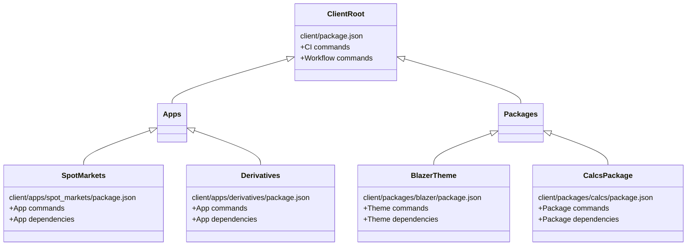

The `package.json` file is auto-generated for you by the CLI, based on your answers to the prompts.

At the top you'll find the `name` and `description` of your application.

Following this, there are three key sections you need to be aware of:

- config
- scripts
- dependencies

## Config

When running the app on your local machine, you can adjust a few settings under the `config` section, including which host to connect to and what port to run the dev server on.
```
"config": {
    "API_HOST": "wss://dev-position2/gwf/",
    "DEFAULT_USER": "JaneDee",
    "DEFAULT_PASSWORD": "beONneON*74",
    "PORT": 6060
  },
```

## Scripts

The next section is `scripts`.
Some have been auto-generated for you; feel free to add your own scripts, as needed.

These are the commands that you invoke with `$ npm run` - when you execute that command from your command line, `node` will look at the scripts listed here to know what to run.
For example, `$ npm run clean:dist` will run `node ../.build/clean.js dist`.

```javascript
  "scripts": {
    "build": "npm run build:webpack",
    "build:with-host": "cross-env API_HOST=$npm_package_config_API_HOST npm run build:webpack",
    "build:webpack": "cross-env NODE_ENV=production AUTO_CONNECT=true webpack",
    "clean": "npm run clean:dist",
    "clean:dist": "node ../.build/clean.js dist",
    "copy-files": "copyfiles -u 1 src/**/*.{css,scss,ttf} ./dist/esm",
    "dev": "npm run dev:webpack",
    "dev:webpack": "cross-env API_HOST=$npm_package_config_API_HOST AUTO_CONNECT=true DEFAULT_USER=$npm_package_config_DEFAULT_USER DEFAULT_PASSWORD=$npm_package_config_DEFAULT_PASSWORD NODE_ENV=development webpack serve --open",
    "serve": "serve dist -p $npm_package_config_PORT",
    "test": "echo \"Error: no test specified\""
  },
```

:::info
Your settings from the `config` block will be passed to different scripts as environment variables, using [cross-env](https://www.npmjs.com/package/cross-env). For example, if you wanted to add a new config for a `DEFAULT_VIEW`:
- add the config to the config block as `"DEFAULT_VIEW": "reporting"`
- in the npm script that requires the variable, add `DEFAULT_VIEW=$npm_package_config_DEFAULT_VIEW`.
:::

## Dependencies

Last but not least, the `dependencies` section contains a list of your app's dependencies and their versions.

:::info
This includes **@genesislcap** dependencies. This is where you can change the dependency versions to upgrade to a newer version of the platform.
:::

```javascript
  "dependencies": {
    "@genesislcap/foundation-comms": "1.0.0",
    "@genesislcap/foundation-entity-management": "1.0.0",
    "@genesislcap/foundation-login": "1.0.0",
    "@genesislcap/foundation-utils": "1.0.0",
    "@genesislcap/foundation-zero": "1.0.0",
    "@genesislcap/foundation-ui": "1.0.0",
    "@microsoft/fast-components": "^2.16.6",
    "@microsoft/fast-element": "^1.6.2",
    "@microsoft/fast-foundation": "^2.27.1",
    "@microsoft/fast-router": "^0.2.11",
    "@microsoft/fast-web-utilities": "^5.0.1",
    "rxjs": "^7.4.0",
    "tslib": "^2.3.1"
  }
```

:::tip
You can use the `lerna add` command (instead of `npm install`) if you need to add more dependencies, because the app is a [lerna-managed](https://lerna.js.org/) monorepo.
:::

:::warning
Do **not** use `npm install` to install packages as advised in [the lerna documentation](https://lerna.js.org/docs/faq#how-do-i-add-a-package-to-my-lerna-repository).
It might work initially, but over time it can cause errors in the dependency tree and stop your application from building.

If you do run into issues after running `npm install`, you should be able to recover by running `$ npm run clean:all && npm run bootstrap`. This will clear all dependency packages and download/link them again.
:::

The `devDependencies` section is for dependencies that are only to used in development - think of tools such as linters. These additional dependencies will not be added to the final production bundle and therefore will not increase the download size of the application to the user's browser.

```javascript
  "devDependencies": {
    "@babel/core": "^7.12.9",
    "@typescript-eslint/eslint-plugin": "^5.2.0",
    "camel-case": "^4.1.2",
    "typescript": "^4.5.5",
  }
```

### Adding dependencies

`lerna` manages the dependencies across the different packages in the monorepo and will attempt to simplify the downloaded packages by only downloading a package version one time; it downloads the package version to the `node_modules` of the project root and then symlinks it across to the other `node_modules` directories in your other lerna modules. It also allows you to link local modules without having to publish them to `npm` first.

You can add dependencies straight into the `package.json` of one of your modules and then run the `$ npm run bootstrap` command from the `package.json` in your web root. `lerna` ensures the modules are downloaded and linked together.

:::tip
It is good practice to clean the `node_modules` out before running a bootstrap, using `$ npm run clean:all`.
You can run both commands in one, using `$ npm run clean:all && npm run bootstrap`.
:::

## Which `package.json`?

When first starting to work with the `lerna`-managed monorepo, there can be some confusion about which `package.json` to make changes to (usually, there are multiple ones spread across the project). There will be a `package.json` for each of your modules and also one at the root of the `lerna` project (the client root, in the `/client` directory in the apps created from the seed projects).

-  **Adding a dependency**. As stated in the [adding dependencies](#adding-dependencies) section, you should navigate to the `package.json` that is in the directory of the module that you want to add the dependency to. For example, if you want to add the dependency `@genesislcap/foundation-login` to your web app, you probably want to add the dependency to the `client/web/package.json` file. Alternatively, if you want to add the `@genesislcap/foundation-comms` dependency to a separate module that you are building in the same repository, add it to the `package.json` of that module.

-  **Adding a module command**. If you want to add a command that is specific to a module, such as a command to extract the API from a tsdoc comment, then edit the `package.json` specific to that package.

-  **Adding a CI/workflow command**. If you want to add a command to be run as part of CI or a workflow, such as during a git command, edit the file in your client root. For example, if you want to set up linting checks, add the linting command to the `client/package.json` file.

:::tip
A good rule of thumb for knowing which `package.json` to update is to think of the `package.json` files and modules as a hierarchical tree. You need to make the change to the file that is or isn't an ancestor of the places where the change is needed.

**In general, you only need to add changes to the top level `package.json` if the change is required across all modules. Otherwise, the change should be specific to the module(s) required.**
:::

### Example project

The following example shows a project that has two apps (a spot trading app and a derivatives trading app).

There are also two custom packages, one that is a theme that takes `@genesislcap/foundation-ui` and customises it, and one that is used for common calculations that are required across both the apps.



Some examples of changes for the project:
* Set up linting in `client/package.json`, because you want to run linting checks across all parts of the code.
* The "Blazer" theme requires `@genesislcap/foundation-ui` as a dependency so that it can import the web components and export them with customised css/themeing. For this, add a `dependency` to `client/packages/blazer/package.json`.
* The "Blazer" theme needs to be used in both apps to keep a consistent look and feel, and the calculations package is required in both apps too. Add these dependencies in the `package.json` of each of the modules, and then `lerna` will ensure they're linked together. This means you can see the local changes without having to publish the theme or calculation package to `npm`.

:::info
If you need an external dependency to both apps such as [@microsoft/api-documenter](https://www.npmjs.com/package/@microsoft/api-documenter), then lerna will only download it once in the common `node_modules` and then symlink it to where it is required.
:::
