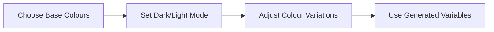

Genesis design systems implement an adaptive colour system that provides some unique advantages:
* ensure text meets [WCAG](https://www.w3.org/WAI/standards-guidelines/wcag/) contrast requirements
* easily swap from light mode to dark, or anywhere in-between
* cset up colour theming through palette tinting
* create a perceptually uniform UI across background colours

## Workflow

In practice, typical adaptive colour workflow looks like this:



You don't have to follow the steps in this exact order e.g. you could set set dark/light mode first if you prefer.

:::tip
To help you visualise how modifying tokens impacts the component look and feel, we have created a [live configuration preview](../../../../web/design-systems/preview/).
:::

### Choose base colours

You can set values for accent and neutral colours:

```ts
const accentColorValue = '#0EAFE2';
const neutralColorValue = '#808080';
```

Behind the scenes accent and neutral colour palettes will be generated from the base colours provided:

<color-palette type="accent"></color-palette>

<color-palette type="neutral"></color-palette>

### Choose mode

Choose dark (default) or light mode:

```ts
export const baseLayerLuminanceValue = StandardLuminance.DarkMode;
```

```ts
export const baseLayerLuminanceValue = StandardLuminance.LightMode;
```

:::tip
`StandardLuminance.DarkMode` and `StandardLuminance.LightMode` correspond to values of `0.23` and `1` respectively. You can set `baseLayerLuminanceValue` to a custom value between `0` for black or `1` for white.
:::

### Adjust variations

Colour variations (e.g. accent colour used on hover) are derived from the base colours using multipliers called _deltas_. You can modify a specific colour variant by adjusting its delta:

```ts
export const accentFillHoverDeltaValue = 4;
```

### Use semantic colour variables in your code

After you have configured your colours, you have a number of variables available, which can be used in your code to ensure visual consistency across the design system.

Variable names are not tied to specific colours, as they are context-dependent and can vary between light and dark modes - they follow the semantic naming conventions described below.

#### CSS Custom Property

```css
background: var(--accent-fill-rest);
```

:::caution
You should consider the CSS custom properties emitted by design tokens to be immutable. Avoid changing their values in CSS, as that can lead to rendering and accessibility issues. If you need to change any values, update the base colour and delta configuration as described above.
:::

#### Token

```ts
import {css} from '@genesislcap/foundation-ui';
import {accentFillRest} from '@genesislcap/alpha-design-system';

const styles = css`
  :host {
    background: ${accentFillRest};
}`;
```

## Available variables

### Foreground

Foreground variables are intended for text, icons, or other lightweight decorations where you need or want to meet contrast requirements.

#### Neutral foreground

The most common variable, used for plain text or icons.

| Token | CSS Custom Property | Preview |
| --- | --- | --- |
| `neutralForegroundRest` | ` --neutral-foreground-rest` | <color-token tokenName="neutralForegroundRest"></color-token>  |
| `neutralForegroundHint` | ` --neutral-foreground-hint` | <color-token tokenName="neutralForegroundHint"></color-token> |

#### Accent foreground

This is commonly used for link text or icon. It is also used for smaller elements that might not show up well using `accentFill`: for instance, if your accent color is dark purple and you support a dark mode interface.

| Token | CSS Custom Property | Preview |
| --- | --- | --- |
| `accentForegroundRest` | `--accent-foreground-rest` | <color-token tokenName="accentForegroundRest"></color-token>  |
| `accentForegroundHover` | `--accent-foreground-hover` | <color-token tokenName="accentForegroundHover"></color-token> |
| `accentForegroundActive` | `--accent-foreground-active` | <color-token tokenName="accentForegroundActive"></color-token>  |
| `accentForegroundFocus` | `--accent-foreground-focus` | <color-token tokenName="accentForegroundFocus"></color-token> |

#### Foreground On Accent

This is either black or white based on the contrast requirements. It returns white if possible, as a common treatment for an accent button is white text over the accent color.

| Token | CSS Custom Property | Preview |
| --- | --- | --- |
| `foregroundOnAccentRest` | ` --foreground-on-accent-rest` | <color-token tokenName="foregroundOnAccentRest"></color-token>  |
| `foregroundOnAccentHover` | ` --foreground-on-accent-hover` | <color-token tokenName="foregroundOnAccentHover"></color-token> |
| `foregroundOnAccentActive` | `--foreground-on-accent-active` | <color-token tokenName="foregroundOnAccentActive"></color-token>  |
| `foregroundOnAccentFocus` | `--foreground-on-accent-focus` | <color-token tokenName="foregroundOnAccentFocus"></color-token> |

#### Foreground on accent large

| Token | CSS Custom Property | Preview |
| --- | --- | --- |
| `foregroundOnAccentRestLarge` | ` --foreground-on-accent-rest-large` | <color-token tokenName="foregroundOnAccentRestLarge"></color-token>  |
| `foregroundOnAccentHoverLarge` | ` --foreground-on-accent-hover-large` | <color-token tokenName="foregroundOnAccentHoverLarge"></color-token> |
| `foregroundOnAccentActiveLarge` | `--foreground-on-accent-active-large` | <color-token tokenName="foregroundOnAccentActiveLarge"></color-token>  |
| `foregroundOnAccentFocusLarge` | `--foreground-on-accent-focus-large` | <color-token tokenName="foregroundOnAccentFocusLarge"></color-token> |


### Fill

Fill variables are intended to fill a larger area, commonly a component background.

#### Fill colour

| Token | CSS Custom Property | Preview |
| --- | --- | --- |
| `fillColor` | `--fill-color` | <color-token tokenName="fillColor"></color-token>  |

#### Accent fill

The closest colors from the supplied palette that can be used for component states. For instance, colors needed to support white text and a 14px font (requires 4.5:1 contrast).

| Token | CSS Custom Property | Preview |
| --- | --- | --- |
| `accentFillRest` | `--accent-fill-rest` | <color-token tokenName="accentFillRest"></color-token>  |
| `accentFillHover` | `--accent-fill-hover` | <color-token tokenName="accentFillHover"></color-token> |
| `accentFillActive` | `--accent-fill-active` | <color-token tokenName="accentFillActive"></color-token>  |
| `accentFillFocus` | `--accent-fill-focus` | <color-token tokenName="accentFillFocus"></color-token> |

#### Neutral fill

This is the most basic fill used for buttons or other components.

| Token | CSS Custom Property | Preview |
| --- | --- | --- |
| `neutralFillRest` | `--neutral-fill-rest` | <color-token tokenName="neutralFillRest"></color-token>  |
| `neutralFillHover` | `--neutral-fill-hover` | <color-token tokenName="neutralFillHover"></color-token> |
| `neutralFillActive` | `--neutral-fill-active` | <color-token tokenName="neutralFillActive"></color-token>  |
| `neutralFillFocus` | `--neutral-fill-focus` | <color-token tokenName="neutralFillFocus"></color-token> |

#### Neutral fill input

This is another basic fill, applied to input elements to allow easy differentiation from other components, such as buttons.

| Token | CSS Custom Property | Preview |
| --- | --- | --- |
| `neutralFillInputRest` | `--neutral-fill-input-rest` | <color-token tokenName="neutralFillInputRest"></color-token>  |
| `neutralFillInputHover` | `--neutral-fill-input-hover` | <color-token tokenName="neutralFillInputHover"></color-token> |
| `neutralFillInputActive` | `--neutral-fill-input-active` | <color-token tokenName="neutralFillInputActive"></color-token>  |
| `neutralFillInputFocus` | `--neutral-fill-input-focus` | <color-token tokenName="neutralFillInputFocus"></color-token> |

#### Neutral fill stealth

This is more subtle than `neutralFill` where the resting state is transparent. It is often used for low-priority features to draw less attention.

| Token | CSS Custom Property | Preview |
| --- | --- | --- |
| `neutralFillStealthRest` | `--neutral-fill-stealth-rest` | <color-token tokenName="neutralFillStealthRest"></color-token>  |
| `neutralFillStealthHover` | `--neutral-fill-stealth-hover` | <color-token tokenName="neutralFillStealthHover"></color-token> |
| `neutralFillStealthActive` | `--neutral-fill-stealth-active` | <color-token tokenName="neutralFillStealthActive"></color-token>  |
| `neutralFillStealthFocus` | `--neutral-fill-stealth-focus` | <color-token tokenName="neutralFillStealthFocus"></color-token> |

#### Neutral fill strong

| Token | CSS Custom Property | Preview |
| --- | --- | --- |
| `neutralFillStrongRest` | `--neutral-fill-strong-rest` | <color-token tokenName="neutralFillStrongRest"></color-token>  |
| `neutralFillStrongHover` | `--neutral-fill-strong-hover` | <color-token tokenName="neutralFillStrongHover"></color-token> |
| `neutralFillStrongActive` | `--neutral-fill-strong-active` | <color-token tokenName="neutralFillStrongActive"></color-token>  |
| `neutralFillStrongFocus` | `--neutral-fill-strong-focus` | <color-token tokenName="neutralFillStrongFocus"></color-token> |


### Stroke

Stroke variables are intended for lines, either outline or divider.

#### Focus stroke

| Token | CSS Custom Property | Preview |
| --- | --- | --- |
| `focusStrokeOuter` | `--focus-stroke-outer` | <color-token tokenName="focusStrokeOuter"></color-token>  |
| `focusStrokeInner` | `--focus-stroke-inner` | <color-token tokenName="focusStrokeInner"></color-token> |

#### Neutral stroke

Used for strong outline, either alone or with a fill.

| Token | CSS Custom Property | Preview |
| --- | --- | --- |
| `neutralStrokeRest` | `--neutral-stroke-rest` | <color-token tokenName="neutralStrokeRest"></color-token>  |
| `neutralStrokeHover` | `--neutral-stroke-hover` | <color-token tokenName="neutralStrokeHover"></color-token> |
| `neutralStrokeActive` | `--neutral-stroke-active` | <color-token tokenName="neutralStrokeActive"></color-token>  |
| `neutralStrokeFocus` | `--neutral-stroke-focus` | <color-token tokenName="neutralStrokeFocus"></color-token> |

#### Neutral stroke divider

| Token | CSS Custom Property | Preview |
| --- | --- | --- |
| `neutralStrokeDividerRest` | `--neutral-stroke-divider-rest` | <color-token tokenName="neutralStrokeDividerRest"></color-token>  |


### Layer

The layer variables are used for different sections of an app or site. They are designed to be able to stack, but that is not a requirement. When stacked in sequence, the layers will lighten on top of each other.

The key feature of layering is to support the primary container color for light or dark mode. This produces absolute colours, based on the `baseLayerLuminance` value, which sets the luminance for layer one.

The difference between each layer is defined with `neutralFillLayerRestDelta`.

#### Neutral layers

Absolute layer colors derived from and starting at `baseLayerLuminance`. Layer one is lightest and the values darken as the layer number increases.

| Token | CSS Custom Property | Preview |
| --- | --- | --- |
| `neutralLayer1` | `--neutral-layer-1` | <color-token tokenName="neutralLayer1"></color-token>  |
| `neutralLayer2` | `--neutral-layer-2` | <color-token tokenName="neutralLayer2"></color-token> |
| `neutralLayer3` | `--neutral-layer-3` | <color-token tokenName="neutralLayer3"></color-token>  |
| `neutralLayer4` | `--neutral-layer-4` | <color-token tokenName="neutralLayer4"></color-token> |

#### neutralLayerCardContainer

A special layer to support experiences primarily built with cards, especially in light mode, so cards can be white and the container color can be one layer darker.

| Token | CSS Custom Property | Preview |
| --- | --- | --- |
| `neutralLayerCardContainer` | `--neutral-layer-card-container` | <color-token tokenName="neutralLayerCardContainer"></color-token>  |

#### Neutral fill layer

This the only layer recipe that's relative to the container color instead of absolute. The most common example of this is a Card, which will be one layer color lighter than its container.

| Token | CSS Custom Property | Preview |
| --- | --- | --- |
| `neutralFillLayerRest` | `--neutral-fill-layer-rest` | <color-token tokenName="neutralFillLayerRest"></color-token>  |

#### neutralLayerFloating

A special layer for floating layers, like flyouts or menus. It will be lighter than any other layers if possible, but will also be white in default light mode, as will neutral layer one.

| Token | CSS Custom Property | Preview |
| --- | --- | --- |
| `neutralLayerFloating` | `--neutral-layer-floating` | <color-token tokenName="neutralLayerFloating"></color-token>  |
